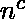
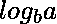
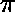

# 主定理中的正则性条件。

> 原文:[https://www . geesforgeks . org/正则-条件-主-定理/](https://www.geeksforgeeks.org/regularity-condition-master-theorem/)

[主定理](https://www.geeksforgeeks.org/analysis-algorithm-set-4-master-method-solving-recurrences/)是求递推关系解的直接方法，前提是它是以下类型:

```
T(n) = aT(n/b) + f(n) where a >= 1 and b > 1

```

该定理由以下三种情况组成:
**1** 。如果 f(n) =  ( )其中 c < 则 T(n) =  (n )

**2** 。如果 f(n) =  ( )其中 c = 则 T(n) =  (  Log n)

**3** 。如果 f(n) =  ( )其中 c > ，那么 T(n) =  (f(n))

想象以树的形式出现的循环 **aT(n/b) + f(n)** 。
**案例 1** 涵盖了子节点比父节点做更多工作的情况。
例如，等式 **T(n)=2T(n/2)+1** 属于情况 1 的范畴，我们可以从它下面的树中清楚地看到，在每个级别，子节点执行的工作是父节点的两倍。

```
                                     T(n)          ------(1)
                                    /    \
                                 T(n/2)  T(n/2)    ------(2)
                                  /   \   /   \    

```

**案例 2** 涵盖了子节点和父节点做等量工作的情况。

例如，等式 **T(n)=2T(n/2)+n** 属于情况 2 的范畴，我们可以从它下面的树中清楚地看到，在每个级别，子节点执行的工作与父节点一样多。

```
                                     T(n)          ------(n)
                                    /    \
                                 T(n/2)  T(n/2)    ------(n)
                                  /   \   /   \    

```

**案例 3** 涵盖了父节点比子节点做更多工作的场景。
**T(n)=T(n/2)+n** 是案例 3 的一个例子，其中父母比孩子做更多的工作。

```
                                     T(n)          ------(n)
                                       |
                                     T(n/2)        ------(n/2)
                                       |

```

在案例 1 和案例 2 中，案例条件本身确保孩子所做的工作多于或等于父母所做的工作，但案例 3 并非如此。
在案例 3 中，我们应用了一个**调节条件**来确保父母做的至少和孩子一样多。

案例 3 的监管条件是

```
af(n/b)<=cf(n).
```

这表示 f(n)(在根中完成的功的量)需要至少与在较低层次中完成的功的总和一样大。

公式**T(n)= T(n/2)+n(sin(n–/2)+2)**是一个监管条件产生巨大差异的例子。这个等式不能满足情况 1 和情况 2。在情况 3 中，对于大的 n 值，它永远不能满足监管条件。因此，这个方程超出了主定理的范围。

本文由**vinet Joshi**供稿。如果你喜欢 GeeksforGeeks 并想投稿，你也可以使用[contribute.geeksforgeeks.org](http://www.contribute.geeksforgeeks.org)写一篇文章或者把你的文章邮寄到 contribute@geeksforgeeks.org。看到你的文章出现在极客博客主页上，帮助其他极客。

如果你发现任何不正确的地方，或者你想分享更多关于上面讨论的话题的信息，请写评论。