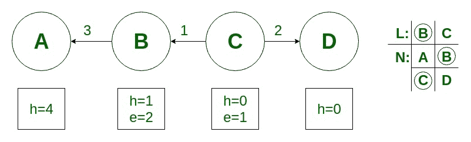
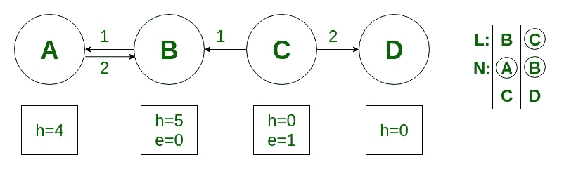
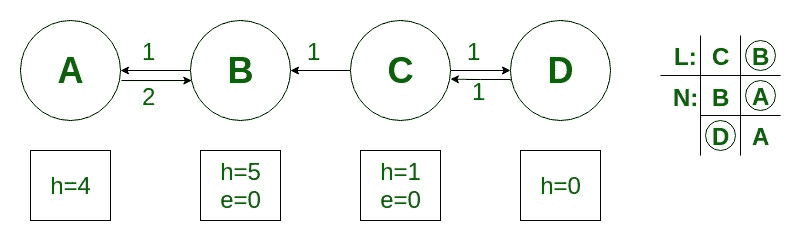

# 重新标记到前端算法

> 原文:[https://www.geeksforgeeks.org/relabel-to-front-algorithm/](https://www.geeksforgeeks.org/relabel-to-front-algorithm/)

重新标记到前端算法用于寻找网络中的最大流量。重新标记到前端算法比通用的[推-重新标记](https://www.geeksforgeeks.org/push-relabel-algorithm-set-1-introduction-and-illustration/)方法更有效。在推-重标记方法中，我们可以以任何顺序应用推和重标记的基本操作。重新标记到前端算法仔细选择顺序并有效管理网络数据结构。

首先，我们需要了解基本操作，即**推**和**重贴** :
网络中的每个顶点都有 **2 个变量**与之关联，分别是**高度变量(h)** 和**过流(e)** 。

1.  **推:**如果一个顶点有多余的流，并且有一个相邻的高度较低的节点(在剩余图中)，那么我们就把流从顶点推送到高度较低的节点。
2.  **重新标记:**如果一个顶点有多余的流，并且没有更低高度的相邻节点可用，那么我们使用重新标记操作来增加顶点的高度，以便它可以执行推送操作。

重新标记到前端算法维护网络中的顶点列表。它从列表的开头开始，反复选择一个溢出的顶点 u，并对其执行放电操作。
放电操作正在执行推送和重新标记操作，直到顶点 u 没有正的多余流量(e)
如果一个顶点被重新标记，它将被移动到列表的前面，算法将再次扫描。

**算法:**

*   将**预流**和**高度**初始化为与通用**推重新标记**算法相同的值。
*   初始化列表 **L** ，该列表包含除**源**和**汇**之外的所有顶点。
*   将每个顶点 **u** 的当前指针初始化到 u 的邻居列表 **N** 中的第一个顶点。邻居列表 **N** 包含那些有剩余边的顶点。
*   而算法到达列表的末尾 **L** 。
    *   从列表 **L** 中选择顶点 **u** 并执行放电操作。
    *   如果 **u** 被放电重新标记，则将 **u** 移到列表的前面。
    *   如果 **u** 被移动到列表的前面，则下一次迭代中的顶点是在列表中其新位置的 **u** 之后的顶点。

**例:**
考虑给定的流量网络。右边显示的是初始列表 L=(B，C)，其中初始 u=B。

预流初始化操作后。列表 L 中的每个顶点下是其邻居列表 N，当前邻居被圈起来。

顶点 B 经历排放操作，因为它具有过量流量 3 (e=3)。顶点 B 没有高度较低的节点，因此它执行重新标记操作(h=1)，并将流 1 推送到顶点 c。

顶点 B 仍然有多余的流 2(e=2)，因此它执行重新标记操作(h=5)并将流 2 推到顶点 a。由于顶点 B 被重新标记，它仍然在列表的前面。现在顶点 C 经历放电操作，因为它有多余的流量 1(e=1)。

顶点 C 执行重新标记操作(h=1)并将流 1 推送到节点 D。由于顶点 C 执行了重新标记操作，它被移动到列表的前面。

顶点 B 现在在 L 中跟随顶点 C，但是 B 没有多余的流。重贴标签至前端已到达列表 L 的末尾并终止。没有溢出的顶点，因此预流是最大流量。这里最大流量是 1。

**时间复杂度:**运行于 **O(V 3 )** 网络时间 **G = (V，E)** 。因此，它比在**0(V2E)**时间运行的通用**推-重标记**算法更有效。

**参考文献:** [克利福德·斯坦、托马斯·h·科曼、查尔斯·e·雷瑟森、罗纳德·L·李维斯特《算法导论》第三版](http://www.euroinformatica.ro/documentation/programming/!!!Algorithms_CORMEN!!!/DDU0165.html)