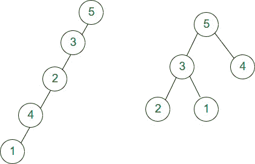
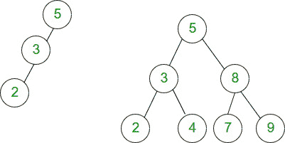

# 二叉树节点数与高度的关系

> 原文:[https://www . geesforgeks . org/relationship-number-nodes-height-二叉树/](https://www.geeksforgeeks.org/relationship-number-nodes-height-binary-tree/)

先决条件–[二叉树数据结构](https://www.geeksforgeeks.org/binary-tree-data-structure/)
在本文中，我们将讨论二叉树的节点数和高度之间的关系的各种情况。在理解本文之前，您应该对二叉树及其属性有一个基本的了解。
二叉树的**高度**是从根**节点到树中任意叶**节点的最长路径。例如，图 1(b)所示的二叉树的高度是 2，因为从根节点到节点 2 的最长路径是 2。此外，图 1(a)所示的二叉树的高度是 4。

**二叉树–**
在二叉树中，一个节点最多可以有两个子节点。

**根据节点数计算最小和最大高度–**
如果二叉树中有 n 个节点，则二叉树的**最大高度**为 **n-1** ，**最小高度**为**楼层(log2n)** 。

例如，图 1(a)所示的具有 5 个节点的左偏斜二叉树的高度为 5-1 = 4，图 1(b)所示的具有 5 个节点的二叉树的高度为 floor(log25) = 2。

**从高度计算最小和最大节点数–**
如果二叉树的高度为**h**，则**节点的最小数量为 h+1** (如果是左斜和右斜二叉树)。

例如，高度为 2 的图 2(a)所示的二叉树有 3 个节点。
如果二叉树有高度 h，最大节点数将是所有级别都完全满的时候。节点总数将是 2^0 + 2^1 + …。2^h = 2^(h+1)-1.
例如，高度为 2 的图 2(b)所示的二叉树具有 2^(2+1)-1 = 7 个节点。

**二叉查找树–**
在二叉查找树，节点的左子节点的值小于父节点，右子节点的值大于父节点。

**根据节点数计算最小和最大高度–**
如果二叉查找树有 n 个节点，二叉查找树的最大高度为 n-1，最小高度为 ceil(log2n)。

**从高度计算最小和最大节点数–**
如果二叉查找树有**高度 h** ，则**节点的最小数量为 h+1** (如果是左偏右偏的二叉查找树)。
如果二叉查找树有**高度 h** ，最大节点数将是所有关卡都满的时候。节点总数将是 2^0 + 2^1 + …。2^h = 2^(h+1)-1.

BST 中的所有规则都和二叉树中的一样，可以用同样的方式可视化。

**Que-1。**树的高度就是树中最长的根到叶路径的长度。高度为 5 的二叉树的最大和最小节点数分别为:
(A) 63 和 6
(B)64 和 5
(C)32 和 6
(D)31 和 5

**解:**根据讨论的公式，
最大节点数= 2^(h+1)-1 = 2^6-1 =63。
最小节点数= h+1 = 5+1 = 6。

**Que-2。**对于有 50 个节点的二叉树，以下哪种高度是不可能的？
(甲)4
(乙)5
(丙)6
(丁)无

**解:**根据讨论的公式，
50 节点最小高度=楼层(log250) = 5。因此，高度 4 是不可能的。