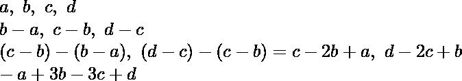
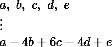

# 重复移除最后一个元素并从下一个相邻元素中减去每个元素后剩余的数组元素

> 原文:[https://www . geeksforgeeks . org/重复移除最后一个元素并从下一个相邻元素中减去每个元素后的剩余数组元素/](https://www.geeksforgeeks.org/remaining-array-element-after-repeated-removal-of-last-element-and-subtraction-of-each-element-from-next-adjacent-element/)

给定一个由 **N** 个整数组成的[数组](https://www.geeksforgeeks.org/introduction-to-arrays/) **arr[]** ，任务是在从其下一个相邻元素中减去每个元素并重复移除最后一个数组元素后，找到剩余的数组元素。

**示例:**

> **输入:** arr[] = {3，4，2，1}
> **输出:** 4
> **解释:**
> 操作 1:数组 arr[]修改为{ 4–3，2–4，1–2 } = { 1，-2，-1}。
> 操作 2:数组 arr[]修改为{-2–1，-1 + 2} = {-3，1}。
> 操作 3:数组 arr[]修改为{1 + 3} = {4}。
> 因此，最后剩余的数组元素是 4。
> 
> **输入:** arr[] = {1，8，4}
> **输出:** -11
> **解释:**
> 操作 1:数组 arr[]修改为{ 1–8，4–8 } = { 7，-4}。
> 操作 2:数组 arr[]修改为{-4–7 } = {-11 }。
> 因此，最后剩余的数组元素是-11。

**天真方法:**最简单的方法是[遍历数组](https://www.geeksforgeeks.org/c-program-to-traverse-an-array/)直到其大小减少到 1，并对数组执行给定的操作。完成遍历后，打印剩余的元素。
***时间复杂度:**O(N<sup>2</sup>)*
***辅助空间:** O(1)*

**高效方法:**上述方法可以基于以下观察进行优化:

*   假设给定的数组是 **arr[] = {a，b，c，d}** 。然后，执行以下操作:

> 

*   现在，假设数组 **arr[] = {a，b，c，d，e}** 。然后，执行以下操作:

> 

*   从以上两个观察，可以得出结论:答案是(x–y)<sup>(N–1)</sup>和每个数组元素 arr[i] 的展开式中的项的系数的乘积之和**。**
*   因此，思路是将每个数组元素更新为**(arr[I]*<sup>(N–1)</sup>C<sub>(I-1)</sub>*(-1)<sup>I</sup>)**后，[求数组](https://www.geeksforgeeks.org/program-find-sum-elements-given-array/) **arr[]** 之和。

按照以下步骤解决问题:

*   [遍历数组](https://www.geeksforgeeks.org/c-program-to-traverse-an-array/)**arr【】**并使用[帕斯卡三角形](https://www.geeksforgeeks.org/find-the-nth-row-in-pascals-triangle/)计算**<sup>N</sup>C<sub>r</sub>**后，更新**arr【I】**为**arr【I】= arr【I】*<sup>(N–1)</sup>C<sub>(I–1)</sub>*(-1)<sup>I</sup>**。
*   [打印数组](https://www.geeksforgeeks.org/program-find-sum-elements-given-array/)和**arr【】**。

下面是上述方法的实现:

## C++

```
// C++ program for the above approach
#include "bits/stdc++.h"
using namespace std;

// Function to find the last remaining
// array element after performing
// the given operations repeatedly
int lastElement(const int arr[], int n)
{
    // Stores the resultant sum
    int sum = 0;

    int multiplier = n % 2 == 0 ? -1 : 1;

    // Traverse the array
    for (int i = 0; i < n; i++) {

        // Increment sum by arr[i]
        // * coefficient of i-th term
        // in (x - y) ^ (N - 1)
        sum += arr[i] * multiplier;

        // Update multiplier
        multiplier
            = multiplier * (n - 1 - i)
              / (i + 1) * (-1);
    }

    // Return the resultant sum
    return sum;
}

// Driver Code
int main()
{
    int arr[] = { 3, 4, 2, 1 };
    int N = sizeof(arr) / sizeof(arr[0]);
    cout << lastElement(arr, N);

    return 0;
}
```

## Java 语言(一种计算机语言，尤用于创建网站)

```
/*package whatever //do not write package name here */

import java.io.*;

class GFG {

    // Function to find the last remaining
    // array element after performing
    // the given operations repeatedly
    public static int lastElement(int arr[], int n)
    {
        // Stores the resultant sum
        int sum = 0;

        int multiplier = n % 2 == 0 ? -1 : 1;

        // Traverse the array
        for (int i = 0; i < n; i++) {

            // Increment sum by arr[i]
            // * coefficient of i-th term
            // in (x - y) ^ (N - 1)
            sum += arr[i] * multiplier;

            // Update multiplier
            multiplier
                = multiplier * (n - 1 - i) / (i + 1) * (-1);
        }

        // Return the resultant sum
        return sum;
    }

    // Driver Code
    public static void main(String[] args)
    {
        int arr[] = { 3, 4, 2, 1 };
        int N = 4;
        System.out.println(lastElement(arr, N));
    }
}

// This code is contributed by aditya7409.
```

## 蟒蛇 3

```
# Python 3 program for the above approach

# Function to find the last remaining
# array element after performing
# the given operations repeatedly
def lastElement(arr, n):

    # Stores the resultant sum
    sum = 0
    if n % 2 == 0:
        multiplier = -1
    else:
        multiplier = 1

    # Traverse the array
    for i in range(n):

        # Increment sum by arr[i]
        # * coefficient of i-th term
        # in (x - y) ^ (N - 1)
        sum += arr[i] * multiplier

        # Update multiplier
        multiplier = multiplier * (n - 1 - i) / (i + 1) * (-1)

    # Return the resultant sum
    return sum

# Driver Code
if __name__ == '__main__':
    arr = [3, 4, 2, 1]
    N = len(arr)
    print(int(lastElement(arr, N)))

    # This code is contributed by SURENDRA_GANGWAR.
```

## C#

```
// C# program for the above approach
using System;
class GFG
{

  // Function to find the last remaining
  // array element after performing
  // the given operations repeatedly
  public static int lastElement(int[] arr, int n)
  {

    // Stores the resultant sum
    int sum = 0;

    int multiplier = n % 2 == 0 ? -1 : 1;

    // Traverse the array
    for (int i = 0; i < n; i++) {

      // Increment sum by arr[i]
      // * coefficient of i-th term
      // in (x - y) ^ (N - 1)
      sum += arr[i] * multiplier;

      // Update multiplier
      multiplier
        = multiplier * (n - 1 - i) / (i + 1) * (-1);
    }

    // Return the resultant sum
    return sum;
  }

  // Driver code
  static void Main()
  {
    int[] arr = { 3, 4, 2, 1 };
    int N = 4;
    Console.WriteLine(lastElement(arr, N));
  }
}

// This code is contributed by susmitakundugoaldanga.
```

## java 描述语言

```
<script>
// JavaScript program for the above approach

// Function to find the last remaining
// array element after performing
// the given operations repeatedly
function lastElement(arr, n)
{

    // Stores the resultant sum
    let sum = 0;
    let multiplier = n % 2 == 0 ? -1 : 1;

    // Traverse the array
    for (let i = 0; i < n; i++)
    {

        // Increment sum by arr[i]
        // * coefficient of i-th term
        // in (x - y) ^ (N - 1)
        sum += arr[i] * multiplier;

        // Update multiplier
        multiplier
            = multiplier * (n - 1 - i)
            / (i + 1) * (-1);
    }

    // Return the resultant sum
    return sum;
}

// Driver Code
    let arr = [ 3, 4, 2, 1 ];
    let N = arr.length;
    document.write(lastElement(arr, N));

// This code is contributed by Surbhi Tyagi.
</script>
```

**Output:** 

```
4
```

***时间复杂度:**O(N)*
T5**辅助空间:** O(1)