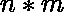

# 从矩阵中移除所有零行和零列

> 原文:[https://www . geesforgeks . org/remove-all-zero-row-and-all-zero-columns-from-matrix/](https://www.geeksforgeeks.org/remove-all-zero-rows-and-all-zero-columns-from-a-matrix/)

给定大小为 **N * M** 的[矩阵](https://www.geeksforgeeks.org/matrix/)**arr【】【】【】**，任务是在从仅包含 **0** s 的矩阵中移除所有行和列后打印矩阵。

**示例:**

> **输入:** arr[][] ={ { 1，1，0，1}，{ 0，0，0，0 }，{ 1，1，0，1 }，{ 0，1，0，1 } }
> **输出:**
> 111
> 111
> 011
> **解释:**
> 最初矩阵如下:
> arr[][] = { { 1，1，0，1 }，
> 1 } }
> 删除第二行将矩阵修改为:
> arr[][] = { { 1，1，0，1 }，
> { 1，1，0，1 }，
> { 0，1，0，1 } }
> 删除第三列将矩阵修改为:
> arr[][] = { { 1，1，1 }，{ 1 }，
> { 1，1 }，
> { 0，1，1 } }
> 
> **输入:** arr={{0，1}，{0，1}}
> **输出:**
> 1
> 1

**方法:**思路是统计矩阵所有行和列中 **0** 的个数，检查是否有任何行或列仅由 **0** 组成。如果发现是真的，则删除矩阵的那些行或列。按照以下步骤解决问题:

*   [遍历矩阵](https://www.geeksforgeeks.org/row-wise-vs-column-wise-traversal-matrix/)并按行和列计数 **1** 。
*   现在，再次遍历循环并检查以下内容:
    *   如果发现任何一行的 **1** s 的计数为 **0** ，则跳过该行。
    *   如果发现任何列的 **1** s 的计数大于 **0** ，则打印该元素。

## C++

```
// C++ program for the above approach   
#include <bits/stdc++.h>   
using namespace std;   

// Function to remove the rows or columns from   
// the matrix which contains all 0s elements   
void removeZeroRowCol(vector<vector<int> >& arr)   
{   

    // Stores count of rows   
    int n = arr.size();   

    // col[i]: Stores count of 0s   
    // in current column   
    int col[n + 1] = { 0 };   

    // row[i]: Stores count of 0s   
    // in current row   
    int row[n + 1] = { 0 };   

    // Traverse the matrix   
    for (int i = 0; i < n; ++i) {   

        // Stores count of 0s   
        // in current row   
        int count = 0;   

        for (int j = 0; j < n; ++j) {   

            // Update col[j]   
            col[j] += (arr[i][j] == 1);   

            // Update count   
            count += (arr[i][j] == 1);   
        }   

        // Update row[i]   
        row[i] = count;   
    }   

    // Traverse the matrix   
    for (int i = 0; i < n; ++i) {   

        // If all elements of   
        // current row is 0   
        if (row[i] == 0) {   
            continue;   
        }   
        for (int j = 0; j < n; ++j) {   

            // If all elements of   
            // current column is 0   
            if (col[j] != 0)   
                cout << arr[i][j];   
        }   
        cout << "\n";   
    }   
}   

// Driver Code   
int main()   
{   
    vector<vector<int> > arr = { { 1, 1, 0, 1 },   
                                 { 0, 0, 0, 0 },   
                                 { 1, 1, 0, 1 },   
                                 { 0, 1, 0, 1 } };   

    // Function Call   
    removeZeroRowCol(arr);   
    return 0;   
}
```

## Java 语言(一种计算机语言，尤用于创建网站)

```
// Java program for the above approach   
class GFG{

// Function to remove the rows or columns from   
// the matrix which contains all 0s elements   
static void removeZeroRowCol(int arr[][])   
{   

    // Stores count of rows   
    int n = arr.length;   

    // col[i]: Stores count of 0s   
    // in current column   
    int col[] = new int[n + 1];   

    // row[i]: Stores count of 0s   
    // in current row   
    int row[] = new int[n + 1];   

    // Traverse the matrix   
    for(int i = 0; i < n; ++i)
    {   

        // Stores count of 0s   
        // in current row   
        int count = 0;   

        for(int j = 0; j < n; ++j)
        {
            if (arr[i][j] == 1)

                // Update col[j]   
                col[j] += 1;   
            else
                col[j] += 0;

            if (arr[i][j] == 1)

                // Update count       
                count += 1;   
            else
                count += 0;
        }   

        // Update row[i]   
        row[i] = count;   
    }   

    // Traverse the matrix   
    for(int i = 0; i < n; ++i)
    {   

        // If all elements of   
        // current row is 0   
        if (row[i] == 0)
        {   
            continue;   
        }   
        for(int j = 0; j < n; ++j)
        {   

            // If all elements of   
            // current column is 0   
            if (col[j] != 0)   
                System.out.print(arr[i][j]);   
        }   
        System.out.println();   
    }   
}   

// Driver Code   
public static void main (String[] args)   
{   
    int arr[][] = { { 1, 1, 0, 1 },   
                    { 0, 0, 0, 0 },   
                    { 1, 1, 0, 1 },   
                    { 0, 1, 0, 1 } };   

    // Function Call   
    removeZeroRowCol(arr);   
}
}

// This code is contributed by AnkThon
```

## 蟒蛇 3

```
# Python3 program for the above approach    

# Function to remove the rows or columns from    
# the matrix which contains all 0s elements    
def removeZeroRowCol(arr) :    

    # Stores count of rows    
    n = len(arr)    

    # col[i]: Stores count of 0s    
    # in current column    
    col = [0] * (n + 1)    

    # row[i]: Stores count of 0s    
    # in current row    
    row = [0] * (n + 1)    

    # Traverse the matrix    
    for i in range(n) :   

        # Stores count of 0s    
        # in current row    
        count = 0   

        for j in range(n) :   

            # Update col[j]    
            col[j] += (arr[i][j] == 1)   

            # Update count    
            count += (arr[i][j] == 1)   

        # Update row[i]    
        row[i] = count   

    # Traverse the matrix    
    for i in range(n) :   

        # If all elements of    
        # current row is 0    
        if (row[i] == 0) :   
            continue   

        for j in range(n) :   

            # If all elements of    
            # current column is 0    
            if (col[j] != 0) :   
                print(arr[i][j], end = "")    

        print()   

arr = [ [ 1, 1, 0, 1 ],    
         [ 0, 0, 0, 0 ],    
         [ 1, 1, 0, 1 ],    
         [ 0, 1, 0, 1 ] ]   

# Function Call    
removeZeroRowCol(arr)

# This code is contributed by divyeshrabadiya07
```

## C#

```
// C# program for the above approach   
using System;

class GFG{

// Function to remove the rows or columns from   
// the matrix which contains all 0s elements   
static void removeZeroRowCol(int[,] arr)   
{   

    // Stores count of rows   
    int n = arr.GetLength(0);   

    // col[i]: Stores count of 0s   
    // in current column   
    int[] col = new int[n + 1];   

    // row[i]: Stores count of 0s   
    // in current row   
    int[] row = new int[n + 1];   

    // Traverse the matrix   
    for(int i = 0; i < n ; ++i)
    {   

        // Stores count of 0s   
        // in current row   
        int count = 0;   

        for(int j = 0; j < n ; ++j)
        {
            if (arr[i, j] == 1)

                // Update col[j]   
                col[j] += 1;   
            else
                col[j] += 0;

            if (arr[i, j] == 1)

                // Update count       
                count += 1;   
            else
                count += 0;
        }   

        // Update row[i]   
        row[i] = count;   
    }   

    // Traverse the matrix   
    for(int i = 0; i < n; ++i)
    {   

        // If all elements of   
        // current row is 0   
        if (row[i] == 0)
        {   
            continue;   
        }   
        for(int j = 0; j < n; ++j)
        {   

            // If all elements of   
            // current column is 0   
            if (col[j] != 0)   
                Console.Write(arr[i, j]);   
        }   
        Console.WriteLine();   
    }   
}   

// Driver Code   
public static void Main (String[] args)   
{   
    int[,] arr = { { 1, 1, 0, 1 },   
                   { 0, 0, 0, 0 },   
                   { 1, 1, 0, 1 },   
                   { 0, 1, 0, 1 } };   

    // Function Call   
    removeZeroRowCol(arr);   
}
}

// This code is contributed by susmitakundugoaldanga
```

## java 描述语言

```
<script>
// Javascript program to implement
// the above approach

// Function to remove the rows or columns from  
// the matrix which contains all 0s elements  
function removeZeroRowCol(arr)  
{  

    // Stores count of rows  
    let n = arr.length;  

    // col[i]: Stores count of 0s  
    // in current column  
    let col = Array.from({length: n+1}, (_, i) => 0);

    // row[i]: Stores count of 0s  
    // in current row  
    let row = Array.from({length: n+1}, (_, i) => 0);

    // Traverse the matrix  
    for(let i = 0; i < n; ++i)
    {  

        // Stores count of 0s  
        // in current row  
        let count = 0;  

        for(let j = 0; j < n; ++j)
        {
            if (arr[i][j] == 1)

                // Update col[j]  
                col[j] += 1;  
            else
                col[j] += 0;

            if (arr[i][j] == 1)

                // Update count      
                count += 1;  
            else
                count += 0;
        }  

        // Update row[i]  
        row[i] = count;  
    }  

    // Traverse the matrix  
    for(let i = 0; i < n; ++i)
    {  

        // If all elements of  
        // current row is 0  
        if (row[i] == 0)
        {  
            continue;  
        }  
        for(let j = 0; j < n; ++j)
        {  

            // If all elements of  
            // current column is 0  
            if (col[j] != 0)  
                document.write(arr[i][j]);  
        }  
        document.write("<br/>");  
    }  
}  

// Driver Code

    let arr = [[ 1, 1, 0, 1 ],  
                    [ 0, 0, 0, 0 ],  
                    [ 1, 1, 0, 1 ],  
                    [ 0, 1, 0, 1 ]];  

    // Function Call  
    removeZeroRowCol(arr);

 // This code is contributed by souravghosh0416.
</script>
```

**输出:**

```
111
111
011
```

**时间复杂度:** O(  )
**空间复杂度:** O( )