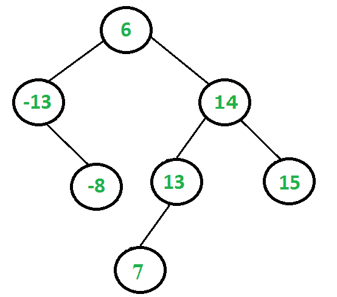
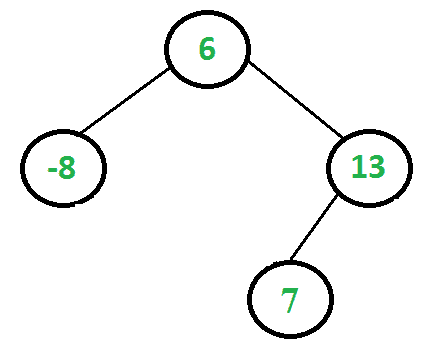

# 移除给定范围外的 BST 键

> 原文:[https://www . geesforgeks . org/remove-BST-keys-超出给定范围/](https://www.geeksforgeeks.org/remove-bst-keys-outside-the-given-range/)

给定二叉查找树(BST)和范围[最小，最大]，移除给定范围之外的所有键。修改后的树也应该是 BST。例如，考虑以下 BST 和范围[-10，13]。



给定的树应更改为以下内容。请注意，范围[-10，13]之外的所有键都将被移除，并且修改后的树是 BST。



每个节点都有两种可能的情况。
**1)** 节点的键在给定范围之外。此案例有两个子案例。
……。 **a)** 节点的键小于最小值。
……。 **b)** 节点的键大于最大值。
**2)** 节点的键在范围内。
对于案例 2，我们不需要做任何事情。在案例 1 中，我们需要移除该节点，并更改以该节点为根的子树的根。

这个想法是以后订单的方式修复树。当我们访问一个节点时，我们确保它的左右子树已经固定。在案例 1.a)中，我们只需移除根，并将右边的子树作为新根返回。在案例 1.b)中，我们移除了根，并将左边的子树作为新根返回。

下面是上述方法的实现。

## C++

```
// A C++ program to remove BST keys outside the given range
#include<bits/stdc++.h>

using namespace std;

// A BST node has key, and left and right pointers
struct node
{
    int key;
    struct node *left;
    struct node *right;
};

// Removes all nodes having value outside the given range and returns the root
// of modified tree
node* removeOutsideRange(node *root, int min, int max)
{
   // Base Case
   if (root == NULL)
      return NULL;

   // First fix the left and right subtrees of root
   root->left =  removeOutsideRange(root->left, min, max);
   root->right =  removeOutsideRange(root->right, min, max);

   // Now fix the root.  There are 2 possible cases for root
   // 1.a) Root's key is smaller than min value (root is not in range)
   if (root->key < min)
   {
       node *rChild = root->right;
       delete root;
       return rChild;
   }
   // 1.b) Root's key is greater than max value (root is not in range)
   if (root->key > max)
   {
       node *lChild = root->left;
       delete root;
       return lChild;
   }
   // 2\. Root is in range
   return root;
}

// A utility function to create a new BST node with key as given num
node* newNode(int num)
{
    node* temp = new node;
    temp->key = num;
    temp->left = temp->right = NULL;
    return temp;
}

// A utility function to insert a given key to BST
node* insert(node* root, int key)
{
    if (root == NULL)
       return newNode(key);
    if (root->key > key)
       root->left = insert(root->left, key);
    else
       root->right = insert(root->right, key);
    return root;
}

// Utility function to traverse the binary tree after conversion
void inorderTraversal(node* root)
{
    if (root)
    {
        inorderTraversal( root->left );
        cout << root->key << " ";
        inorderTraversal( root->right );
    }
}

// Driver program to test above functions
int main()
{
    node* root = NULL;
    root = insert(root, 6);
    root = insert(root, -13);
    root = insert(root, 14);
    root = insert(root, -8);
    root = insert(root, 15);
    root = insert(root, 13);
    root = insert(root, 7);

    cout << "Inorder traversal of the given tree is: ";
    inorderTraversal(root);

    root = removeOutsideRange(root, -10, 13);

    cout << "\nInorder traversal of the modified tree is: ";
    inorderTraversal(root);

    return 0;
}
```

## Java 语言(一种计算机语言，尤用于创建网站)

```
// A Java program to remove BST
// keys outside the given range
import java.math.BigDecimal;
import java.util.ArrayList;
import java.util.Arrays;
import java.util.List;
import java.util.Scanner;

class Node
{
    int key;
    Node left;
    Node right;
}

class GFG
{
    // Removes all nodes having value
    // outside the given range and
    // returns the root of modified tree
    private static Node removeOutsideRange(Node root,
                                           int min, int max)
    {
        // BASE CASE
        if(root == null)
        {
            return null;
        }

        // FIRST FIX THE LEFT AND
        // RIGHT SUBTREE OF ROOT
        root.left = removeOutsideRange(root.left,
                                       min, max);
        root.right = removeOutsideRange(root.right,
                                        min, max);

        // NOW FIX THE ROOT. THERE ARE
        // TWO POSSIBLE CASES FOR THE ROOT
        // 1\. a) Root's key is smaller than
        // min value(root is not in range)
        if(root.key < min)
        {
            Node rchild = root.right;
            root = null;
            return rchild;
        }

        // 1\. b) Root's key is greater than
        // max value (Root is not in range)
        if(root.key > max)
        {
            Node lchild = root.left;
            root = null;
            return lchild;
        }

        // 2\. Root in range
        return root;
    }

    public static Node newNode(int num)
    {
        Node temp = new Node();
        temp.key = num;
        temp.left = null;
        temp.right = null;
        return temp;
    }

    public static Node insert(Node root,
                              int key)
    {
        if(root == null)
        {
            return newNode(key);
        }
        if(root.key > key)
        {
            root.left = insert(root.left, key);
        }
        else
        {
            root.right = insert(root.right, key);
        }
        return root;
    }

    private static void inorderTraversal(Node root)
    {
        if(root != null)
        {
            inorderTraversal(root.left);
            System.out.print(root.key + " ");
            inorderTraversal(root.right);
        }
    }

    // Driver code
    public static void main(String[] args)
    {
        Node root = null;
        root = insert(root, 6);
        root = insert(root, -13);
        root = insert(root, 14);
        root = insert(root, -8);
        root = insert(root, 15);
        root = insert(root, 13);
        root = insert(root, 7);

        System.out.print("Inorder Traversal of " +
                           "the given tree is: ");
        inorderTraversal(root);

        root = removeOutsideRange(root, -10, 13);

        System.out.print("\nInorder traversal of " +
                           "the modified tree: ");
        inorderTraversal(root);
    }
}

// This code is contributed
// by Divya
```

## 蟒蛇 3

```
# Python3 program to remove BST keys
# outside the given range

# A BST node has key, and left and right 
# pointers. A utility function to create
# a new BST node with key as given num
class newNode:

    # Constructor to create a new node
    def __init__(self, data):
        self.key = data
        self.left = None
        self.right = None

# Removes all nodes having value outside
# the given range and returns the root
# of modified tree
def removeOutsideRange(root, Min, Max):

    # Base Case
    if root == None:
        return None

    # First fix the left and right
    # subtrees of root
    root.left = removeOutsideRange(root.left,
                                   Min, Max)
    root.right = removeOutsideRange(root.right,
                                    Min, Max)

    # Now fix the root. There are 2
    # possible cases for root
    # 1.a) Root's key is smaller than
    #      min value (root is not in range)
    if root.key < Min:
        rChild = root.right
        return rChild

    # 1.b) Root's key is greater than max
    #      value (root is not in range)
    if root.key > Max:
        lChild = root.left
        return lChild

    # 2\. Root is in range
    return root

# A utility function to insert a given
# key to BST
def insert(root, key):
    if root == None:
        return newNode(key)
    if root.key > key:
        root.left = insert(root.left, key)
    else:
        root.right = insert(root.right, key)
    return root

# Utility function to traverse the binary
# tree after conversion
def inorderTraversal(root):
    if root:
        inorderTraversal( root.left)
        print(root.key, end = " ")
        inorderTraversal( root.right)

# Driver Code
if __name__ == '__main__':
    root = None
    root = insert(root, 6)
    root = insert(root, -13)
    root = insert(root, 14)
    root = insert(root, -8)
    root = insert(root, 15)
    root = insert(root, 13)
    root = insert(root, 7)

    print("Inorder traversal of the given tree is:",
                                          end = " ")
    inorderTraversal(root)

    root = removeOutsideRange(root, -10, 13)
    print()
    print("Inorder traversal of the modified tree is:",
                                             end = " ")
    inorderTraversal(root)

# This code is contributed by PranchalK
```

## C#

```
// A C# program to remove BST
// keys outside the given range
using System;

public class Node
{
    public int key;
    public Node left;
    public Node right;
}

public class GFG
{
    // Removes all nodes having value
    // outside the given range and
    // returns the root of modified tree
    private static Node removeOutsideRange(Node root,
                                        int min, int max)
    {
        // BASE CASE
        if(root == null)
        {
            return null;
        }

        // FIRST FIX THE LEFT AND
        // RIGHT SUBTREE OF ROOT
        root.left = removeOutsideRange(root.left,
                                    min, max);
        root.right = removeOutsideRange(root.right,
                                        min, max);

        // NOW FIX THE ROOT. THERE ARE
        // TWO POSSIBLE CASES FOR THE ROOT
        // 1\. a) Root's key is smaller than
        // min value(root is not in range)
        if(root.key < min)
        {
            Node rchild = root.right;
            root = null;
            return rchild;
        }

        // 1\. b) Root's key is greater than
        // max value (Root is not in range)
        if(root.key > max)
        {
            Node lchild = root.left;
            root = null;
            return lchild;
        }

        // 2\. Root in range
        return root;
    }

    public static Node newNode(int num)
    {
        Node temp = new Node();
        temp.key = num;
        temp.left = null;
        temp.right = null;
        return temp;
    }

    public static Node insert(Node root,
                            int key)
    {
        if(root == null)
        {
            return newNode(key);
        }
        if(root.key > key)
        {
            root.left = insert(root.left, key);
        }
        else
        {
            root.right = insert(root.right, key);
        }
        return root;
    }

    private static void inorderTraversal(Node root)
    {
        if(root != null)
        {
            inorderTraversal(root.left);
            Console.Write(root.key + " ");
            inorderTraversal(root.right);
        }
    }

    // Driver code
    public static void Main(String[] args)
    {
        Node root = null;
        root = insert(root, 6);
        root = insert(root, -13);
        root = insert(root, 14);
        root = insert(root, -8);
        root = insert(root, 15);
        root = insert(root, 13);
        root = insert(root, 7);

        Console.Write("Inorder Traversal of " +
                        "the given tree is: ");
        inorderTraversal(root);

        root = removeOutsideRange(root, -10, 13);

        Console.Write("\nInorder traversal of " +
                        "the modified tree: ");
        inorderTraversal(root);
    }
}

// This code has been contributed
// by PrinciRaj1992
```

## java 描述语言

```
<script>

// A JavaScript program to remove BST
// keys outside the given range

class Node {
    constructor() {
        this.key = 0;
        this.left = null;
        this.right = null;
    }
}
// Removes all nodes having value
    // outside the given range and
    // returns the root of modified tree
     function removeOutsideRange(root , min , max) {
        // BASE CASE
        if (root == null) {
            return null;
        }

        // FIRST FIX THE LEFT AND
        // RIGHT SUBTREE OF ROOT
        root.left =
        removeOutsideRange(root.left, min, max);
        root.right =
        removeOutsideRange(root.right, min, max);

        // NOW FIX THE ROOT. THERE ARE
        // TWO POSSIBLE CASES FOR THE ROOT
        // 1\. a) Root's key is smaller than
        // min value(root is not in range)
        if (root.key < min) {
    var rchild = root.right;
            root = null;
            return rchild;
        }

        // 1\. b) Root's key is greater than
        // max value (Root is not in range)
        if (root.key > max) {
    var lchild = root.left;
            root = null;
            return lchild;
        }

        // 2\. Root in range
        return root;
    }

    function newNode(num) {
var temp = new Node();
        temp.key = num;
        temp.left = null;
        temp.right = null;
        return temp;
    }

    function insert(root , key) {
        if (root == null) {
            return newNode(key);
        }
        if (root.key > key) {
            root.left = insert(root.left, key);
        } else {
            root.right = insert(root.right, key);
        }
        return root;
    }

     function inorderTraversal(root) {
        if (root != null) {
            inorderTraversal(root.left);
            document.write(root.key + " ");
            inorderTraversal(root.right);
        }
    }

    // Driver code

var root = null;
        root = insert(root, 6);
        root = insert(root, -13);
        root = insert(root, 14);
        root = insert(root, -8);
        root = insert(root, 15);
        root = insert(root, 13);
        root = insert(root, 7);

        document.write("Inorder Traversal of " +
        "the given tree is: ");
        inorderTraversal(root);

        root = removeOutsideRange(root, -10, 13);

        document.write("<br/>Inorder traversal of " +
        "the modified tree: ");
        inorderTraversal(root);

// This code is contributed by todaysgaurav

</script>
```

**输出:**

```
Inorder traversal of the given tree is: -13 -8 6 7 13 14 15
Inorder traversal of the modified tree is: -8 6 7 13
```

**时间复杂度:** O(n)，其中 n 是给定 BST 中的节点数。

如果你发现任何不正确的地方，或者你想分享更多关于上面讨论的话题的信息，请写评论。