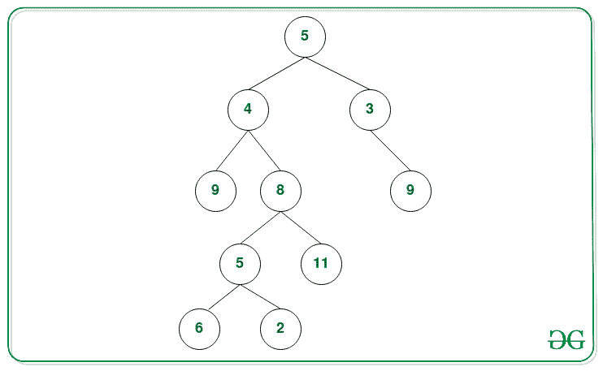
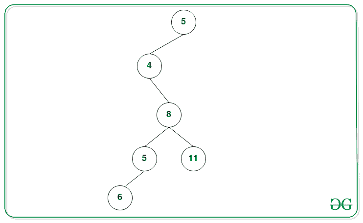
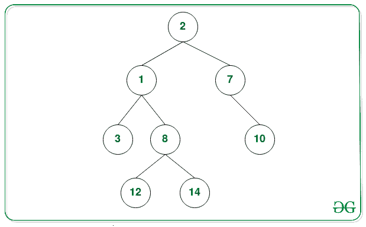

# 从二叉树中移除节点，使得所有剩余根到叶路径的总和至少为 K

> 原文:[https://www . geesforgeks . org/remove-nodes-from-二叉树-这样所有剩余根到叶路径的总和至少为-k/](https://www.geeksforgeeks.org/remove-nodes-from-binary-tree-such-that-sum-of-all-remaining-root-to-leaf-paths-is-atleast-k/)

给定一个[二叉树](https://www.geeksforgeeks.org/binary-tree-data-structure/)和一个整数 **K** ，任务是从给定的**树**中删除节点，使得所有剩余[根到叶路径](https://www.geeksforgeeks.org/given-a-binary-tree-print-all-root-to-leaf-paths/)的所有节点之和至少为**K**。

**示例:**

> **输入:** K = 27
> 
> [](https://media.geeksforgeeks.org/wp-content/uploads/20201009123818/BT1.png)
> 
> **输出:** 5 4 8 5 6 11
> **说明:**
> 下面是和小于 27 的路径:
> 
> *   5 -> 3 -> 9:路径和= 5 + 3 + 9 = 17。
> *   5 -> 4 -> 9:路径和= 5 + 4 + 9 = 18。
> *   5 -> 4 -> 8 -> 5 -> 2:路径和= 5 + 4 + 8 + 5 + 2 = 24。
> 
> 下面是删除所需节点后的树，这样所有路径的总和至少为 27:
> 
> [](https://media.geeksforgeeks.org/wp-content/uploads/20201009124230/BT2.png)
> 
> **输入:** K = 10
> 
> [](https://media.geeksforgeeks.org/wp-content/uploads/20201013173752/ImprovedTree.png)
> 
> **输出:** 2 1 8 12 14 7 10

**方法:**思想是使用[递归](https://www.geeksforgeeks.org/recursion/)并执行[后序遍历](https://www.geeksforgeeks.org/iterative-postorder-traversal/)并删除那些路径和的加法小于 **K** 的节点。以下是步骤:

*   对给定的**树**执行**后顺序遍历**，在此遍历过程中，将所有节点的总和从根节点传递到每个节点。
*   在遍历过程中，如果我们到达叶节点，那么检查直到该节点的所有节点的总和**是否小于 K？**。如果发现为真，则通过从该节点返回**空**节点来移除该节点。
*   对更新树中遇到的每个叶节点重复上述步骤。
*   完成上述步骤后，打印修改后的树的[前序遍历](https://www.geeksforgeeks.org/morris-traversal-for-preorder/)。

下面是上述方法的实现:

## C++

```
// C++ program for the above approach
#include <bits/stdc++.h>
using namespace std;

// Tree Node Class
struct Node
{
    int data;
    Node *left;
    Node *right;

    Node(int x)
    {
        data = x;
        left = right = NULL;
    }
};

// Utility function that deletes nodes
// from the Tree such that every root
// to leaf path sum is at least K
Node *removePathLessThanK(Node *node, int K,
                          int sum)
{

    // Base Case
    if (node == NULL)
    {
        return NULL;
    }

    // Recurse to the left
    if (node->left != NULL)
    {
        node->left = removePathLessThanK(
                     node->left, K,
                     sum + node->left->data);
    }

    // Recurse to the right
    if (node->right != NULL)
    {
        node->right = removePathLessThanK(
                      node->right, K,
                      sum + node->right->data);
    }

    // Check path sum at leaf node
    // is lesser than K, return NULL
    if (node->left == NULL &&
        node->right == NULL && sum < K)
    {
        node = NULL;
        return node;
    }

    // Otherwise return the
    // current node as it is
    return node;
}

// Function to print the preorder
// traversal of the Tree
void viewTree(Node *node)
{

    // If node is not NULL
    if (node != NULL)
    {

        // Print the node
        cout << node->data << " ";

        // Left and Right Traversal
        viewTree(node->left);
        viewTree(node->right);
    }
}

// Function that deletes the nodes
// from the Tree such that every root
// to leaf path sum is at least K
void removePathLessThanKUtil(Node *node, int K,
                             int sum)
{

    // Function Call to delete Nodes
    Node *result = removePathLessThanK(node, K, sum);

    // Preorder Traversal of the
    // modified Tree
    viewTree(result);
}

// Driver Code
int main()
{

    // Given sum K
    int K = 27;

    // Given Binary Tree
    Node *root = NULL;
    root = new Node(5);
    root->right = new Node(3);
    root->left = new Node(4);
    root->left->left = new Node(9);
    root->right->right = new Node(9);
    root->left->right = new Node(8);
    root->left->right->right = new Node(11);
    root->left->right->left = new Node(5);
    root->left->right->left->left = new Node(6);
    root->left->right->left->right = new Node(2);
    root->right->right->right = new Node(4);

    // Function Call
    removePathLessThanKUtil(root, K, root->data);
}

// This code is contributed by mohit kumar 29
```

## Java 语言(一种计算机语言，尤用于创建网站)

```
// Java program for the above approach

import java.io.*;
import java.util.*;

// Tree Node Class
class Node {
    int data;
    Node left;
    Node right;
}

class path {

    // Function to insert node in the
    // given Binary Tree
    public Node insert(int val)
    {
        Node n = new Node();
        n.data = val;
        n.left = null;
        n.right = null;
        return n;
    }

    // Utility function that deletes nodes
    // from the Tree such that every root
    // to leaf path sum is at least K
    public Node removePathLessThanK(
        Node node, int K, int sum)
    {
        // Base Case
        if (node == null) {
            return null;
        }

        // Recurse to the left
        if (node.left != null) {
            node.left
                = removePathLessThanK(
                    node.left, K,
                    sum + node.left.data);
        }

        // Recurse to the right
        if (node.right != null) {
            node.right
                = removePathLessThanK(
                    node.right, K,
                    sum + node.right.data);
        }

        // Check path sum at leaf node
        // is lesser than K, return NULL
        if (node.left == null
            && node.right == null
            && sum < K) {
            node = null;
            return node;
        }

        // Otherwise return the
        // current node as it is
        return node;
    }

    // Function to print the preorder
    // traversal of the Tree
    public void viewTree(Node node)
    {
        // If node is not NULL
        if (node != null) {

            // Print the node
            System.out.print(node.data + " ");

            // Left and Right Traversal
            viewTree(node.left);
            viewTree(node.right);
        }
    }

    // Function that deletes the nodes
    // from the Tree such that every root
    // to leaf path sum is at least K
    public void removePathLessThanKUtil(
        Node node, int K, int sum)
    {
        // Function Call to delete Nodes
        Node result = removePathLessThanK(
            node, K, sum);

        // Preorder Traversal of the
        // modified Tree
        viewTree(result);
    }
}

// Driver Code
class GFG {

    // Driver Code
    public static void main(String[] args)
    {
        // Given sum K
        int K = 27;

        // Object of class path
        path b = new path();

        // Given Binary Tree
        Node root = null;
        root = b.insert(5);
        root.right = b.insert(3);
        root.left = b.insert(4);
        root.left.left = b.insert(9);
        root.right.right = b.insert(9);
        root.left.right = b.insert(8);
        root.left.right.right = b.insert(11);
        root.left.right.left = b.insert(5);
        root.left.right.left.left = b.insert(6);
        root.left.right.left.right = b.insert(2);
        root.right.right.right = b.insert(4);

        // Function Call
        b.removePathLessThanKUtil(
            root, K, root.data);
    }
}
```

## 蟒蛇 3

```
# Python3 program for the above approach

# Tree Node Class
class newNode:

    def __init__(self, x):

        self.data = x
        self.left = None
        self.right = None

# Utility function that deletes nodes
# from the Tree such that every root
# to leaf path sum is at least K
def removePathLessThanK(node, K, sum):

    # Base Case
    if (node == None):
        return None

    # Recurse to the left
    if (node.left != None):
        node.left = removePathLessThanK(
                    node.left, K,
                    sum + node.left.data)

    # Recurse to the right
    if (node.right != None):
        node.right = removePathLessThanK(
                     node.right, K,
                     sum + node.right.data)

    # Check path sum at leaf node
    # is lesser than K, return None
    if (node.left == None and
       node.right == None and sum < K):
        node = None
        return node

    # Otherwise return the
    # current node as it is
    return node

# Function to print the preorder
# traversal of the Tree
def viewTree(node):

    # If node is not None
    if (node != None):

        # Print the node
        print(node.data, end = " ")

        # Left and Right Traversal
        viewTree(node.left)
        viewTree(node.right)

# Function that deletes the nodes
# from the Tree such that every root
# to leaf path sum is at least K
def removePathLessThanKUtil(node, K, sum):

    # Function Call to delete Nodes
    result = removePathLessThanK(node, K, sum)

    # Preorder Traversal of the
    # modified Tree
    viewTree(result)

# Driver Code
if __name__ == '__main__':

    # Given sum K
    K = 27

    # Given Binary Tree
    root = None
    root = newNode(5)
    root.right = newNode(3)
    root.left = newNode(4)
    root.left.left = newNode(9)
    root.right.right = newNode(9)
    root.left.right = newNode(8)
    root.left.right.right = newNode(11)
    root.left.right.left = newNode(5)
    root.left.right.left.left = newNode(6)
    root.left.right.left.right = newNode(2)
    root.right.right.right = newNode(4)

    # Function Call
    removePathLessThanKUtil(root, K, root.data)

# This code is contributed by SURENDRA_GANGWAR
```

## C#

```
// C# program for the above approach
using System;

// Tree Node Class
public class Node
{
    public int data;
    public Node left;
    public Node right;
}

class path{

// Function to insert node in the
// given Binary Tree
public Node insert(int val)
{
    Node n = new Node();
    n.data = val;
    n.left = null;
    n.right = null;
    return n;
}

// Utility function that deletes nodes
// from the Tree such that every root
// to leaf path sum is at least K
public Node removePathLessThanK(Node node,
                                int K, int sum)
{

    // Base Case
    if (node == null)
    {
        return null;
    }

    // Recurse to the left
    if (node.left != null)
    {
        node.left = removePathLessThanK(
                    node.left, K,
                    sum + node.left.data);
    }

    // Recurse to the right
    if (node.right != null)
    {
        node.right = removePathLessThanK(
                     node.right, K,
                     sum + node.right.data);
    }

    // Check path sum at leaf node
    // is lesser than K, return NULL
    if (node.left == null &&
       node.right == null && sum < K)
    {
        node = null;
        return node;
    }

    // Otherwise return the
    // current node as it is
    return node;
}

// Function to print the preorder
// traversal of the Tree
public void viewTree(Node node)
{

    // If node is not NULL
    if (node != null)
    {

        // Print the node
        Console.Write(node.data + " ");

        // Left and Right Traversal
        viewTree(node.left);
        viewTree(node.right);
    }
}

// Function that deletes the nodes
// from the Tree such that every root
// to leaf path sum is at least K
public void removePathLessThanKUtil(Node node,
                                    int K, int sum)
{

    // Function Call to delete Nodes
    Node result = removePathLessThanK(
        node, K, sum);

    // Preorder Traversal of the
    // modified Tree
    viewTree(result);
}
}

// Driver Code
class GFG{

// Driver Code
public static void Main(String[] args)
{

    // Given sum K
    int K = 27;

    // Object of class path
    path b = new path();

    // Given Binary Tree
    Node root = null;
    root = b.insert(5);
    root.right = b.insert(3);
    root.left = b.insert(4);
    root.left.left = b.insert(9);
    root.right.right = b.insert(9);
    root.left.right = b.insert(8);
    root.left.right.right = b.insert(11);
    root.left.right.left = b.insert(5);
    root.left.right.left.left = b.insert(6);
    root.left.right.left.right = b.insert(2);
    root.right.right.right = b.insert(4);

    // Function Call
    b.removePathLessThanKUtil(
        root, K, root.data);
}
}

// This code is contributed by Princi Singh
```

## java 描述语言

```
<script>

// Javascript program for the above approach

// Tree Node Class
class Node
{
    constructor(val)
    {
        this.left = null;
        this.right = null;
        this.data = val;
    }
}

// Function to insert node in the
// given Binary Tree
function insert(val)
{
    let n = new Node(val);
    return n;
}

// Utility function that deletes nodes
// from the Tree such that every root
// to leaf path sum is at least K
function removePathLessThanK(node, K, sum)
{

    // Base Case
    if (node == null)
    {
        return null;
    }

    // Recurse to the left
    if (node.left != null)
    {
        node.left = removePathLessThanK(
                    node.left, K,
                    sum + node.left.data);
    }

    // Recurse to the right
    if (node.right != null)
    {
        node.right = removePathLessThanK(
                     node.right, K,
                     sum + node.right.data);
    }

    // Check path sum at leaf node
    // is lesser than K, return NULL
    if (node.left == null &&
        node.right == null &&
        sum < K)
    {
        node = null;
        return node;
    }

    // Otherwise return the
    // current node as it is
    return node;
}

// Function to print the preorder
// traversal of the Tree
function viewTree(node)
{

    // If node is not NULL
    if (node != null)
    {

        // Print the node
        document.write(node.data + " ");

        // Left and Right Traversal
        viewTree(node.left);
        viewTree(node.right);
    }
}

// Function that deletes the nodes
// from the Tree such that every root
// to leaf path sum is at least K
function removePathLessThanKUtil(node, K, sum)
{

    // Function Call to delete Nodes
    let result = removePathLessThanK(node, K, sum);

    // Preorder Traversal of the
    // modified Tree
    viewTree(result);
}

// Driver code

// Given sum K
let K = 27;

// Given Binary Tree
let root = null;
root = insert(5);
root.right = insert(3);
root.left = insert(4);
root.left.left = insert(9);
root.right.right = insert(9);
root.left.right = insert(8);
root.left.right.right = insert(11);
root.left.right.left = insert(5);
root.left.right.left.left = insert(6);
root.left.right.left.right = insert(2);
root.right.right.right = insert(4);

// Function Call
removePathLessThanKUtil(root, K, root.data);

// This code is contributed by suresh07

</script>
```

**Output:** 

```
5 4 8 5 6 11
```

***时间复杂度:** O(N)，其中 N 是给定树中的节点数。*
***辅助空间:** O(N)*