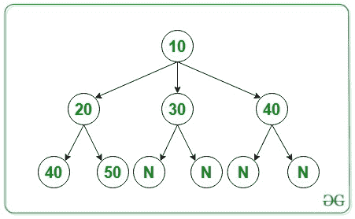
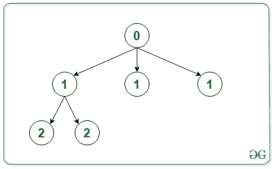
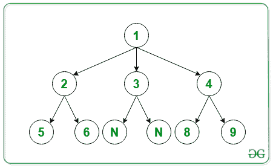
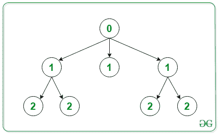

# 用 N 元类属树中的深度替换每个节点

> 原文:[https://www . geeksforgeeks . org/将每个节点替换为深度通用树/](https://www.geeksforgeeks.org/replace-every-node-with-depth-in-n-ary-generic-tree/)

给定一个[数组](https://www.geeksforgeeks.org/introduction-to-arrays/) **arr[]** 代表一个[通用(N 元)树](https://www.geeksforgeeks.org/generic-treesn-array-trees/)。任务是用节点的深度(级别)替换节点数据。假设根级别为 0。

> **数组表示**:N 元树在数组**arr【】**中使用层级顺序遍历进行序列化，如下所述:
> 
> *   输入作为 N 元树的[级顺序遍历给出。](https://www.geeksforgeeks.org/insertion-in-n-ary-tree-in-given-order-and-level-order-traversal/)
> *   arr[]数组的第一个元素是根节点。
> *   然后，后面跟一个数字 N，表示前一个节点的子节点数。值零表示空节点。

**例:**

> **输入:** arr[] = { 10，3，20，30，40，2，40，50，0，0，0，0 }
> 下面是上述数组级顺序遍历的 N 元树:
> 
> 
> 
> **输出:**
> 以下是上述输出的表示:
> 
> 
> 
> **输入:** arr[] = {1，3，2，3，4，2，5，6，0，0，2，8，9}
> 下面是上述数组级顺序遍历的 N 元树:
> 
> 
> 
> **输出:**
> 以下是上述输出的表示:
> 
> 

**进场:**

*   从根开始遍历树。
*   同时将节点的行程深度作为参数。
*   跟踪深度，根为 0，子级为(1 +当前级别)。

以下是上述方法的实现:

## 卡片打印处理机（Card Print Processor 的缩写）

```
// C++ program to implement node with
// it's depth value
#include <bits/stdc++.h>
using namespace std;

// Treenode class using template
template <typename T>
class TreeNode {
public:
    // To store node value
    T data;

    // Pointer to TreeNode to store
    // the child node
    vector<TreeNode<T>*> children;

    // Constructor to assign data
    // to node
    TreeNode(T data)
    {
        this->data = data;
    }

    // Destructors to delete a node
    ~TreeNode()
    {
        for (int i = 0;
             i < children.size(); i++) {
            delete children[i];
        }
    }
};

// Function to take input level wise
// i.e., in level order traversal
TreeNode<int>* takeInputLevelWise(int arr[])
{
    int idx = 1;

    // Input root
    int rootData = arr[0];

    // Initialize tree with a root node
    TreeNode<int>* root
        = new TreeNode<int>(rootData);

    // Initialise queue for appending
    // node as a child of parent in
    // N-ary tree
    queue<TreeNode<int>*> pendingNodes;

    // Push the root node in queue
    pendingNodes.push(root);

    // While queue is not empty append
    // child to the root
    while (pendingNodes.size() != 0) {

        // Take the first node
        TreeNode<int>* front
            = pendingNodes.front();
        pendingNodes.pop();

        // Input number of child
        int numChild = arr[idx];
        idx++;

        for (int i = 0; i < numChild; i++) {

            int childData = arr[idx];
            idx++;

            // Make child Node
            TreeNode<int>* child
                = new TreeNode<int>(childData);

            // Append child node to
            // it's parent
            front->children.push_back(child);
            pendingNodes.push(child);
        }
    }
    return root;
}

// Function to print each node data
// in level order
void printLevelATNewLine(TreeNode<int>* root)
{
    queue<TreeNode<int>*> q;
    q.push(root);
    q.push(NULL);
    while (!q.empty()) {

        TreeNode<int>* first = q.front();
        q.pop();

        if (first == NULL) {
            if (q.empty()) {
                break;
            }
            cout << endl;
            q.push(NULL);
            continue;
        }

        cout << first->data << " ";

        for (int i = 0;
             i < first->children.size(); i++) {
            q.push(first->children[i]);
        }
    }
}

// Helper function to replace the
// node data with their level value
void helper(TreeNode<int>* root,
            int depth)
{

    // Replace the node data with
    // it's depth
    root->data = depth;
    for (int i = 0;
         i < root->children.size(); i++) {

        helper(root->children[i], depth + 1);
    }
}

// Function to replace with depth
void replaceWithDepthValue(TreeNode<int>* root)
{
    helper(root, 0);
}

// Driver Code
int main()
{

    // Given level order traversal in
    // the array arr[]
    int arr[] = { 10, 3, 20, 30, 40, 2,
                  40, 50, 0, 0, 0, 0 };

    // Initialise Tree
    TreeNode<int>* root;
    root = takeInputLevelWise(arr);

    // Function call to replace with
    // depth value
    replaceWithDepthValue(root);

    // Function call to print
    // in level order
    printLevelATNewLine(root);
    return 0;
}
```

## Java 语言(一种计算机语言，尤用于创建网站)

```
// Java program to replace node with
// it's depth value

// Importing classes and interface
import java.util.ArrayList;
import java.util.LinkedList;
import java.util.Queue;

class GFG {
    // TreeNode class
    static class TreeNode<T> {
        // To store node value
        T data;

        // List of TreeNode to store
        // the child nodes
        ArrayList<TreeNode<T> > children;

        // Constructor to assign data to node
        TreeNode(T data)
        {
            this.data = data;
            children = new ArrayList<TreeNode<T> >();
        }
    }

    // Function to take input level wise
    // i.e., in level order traversal
    static TreeNode<Integer> takeInputLevelWise(int arr[])
    {
        int idx = 1;

        // Input root
        int rootData = arr[0];

        // Initialize tree with a root node
        TreeNode<Integer> root
            = new TreeNode<Integer>(rootData);

        // Initialize queue for appending
        // node as a child of parent in
        // N-ary tree
        Queue<TreeNode<Integer> > pendingNodes
            = new LinkedList<TreeNode<Integer> >();

        // Push the root node in queue
        pendingNodes.add(root);

        // While queue is not empty append
        // child to the node
        while (pendingNodes.size() != 0) {

            // Take the first node
            TreeNode<Integer> front = pendingNodes.peek();
            pendingNodes.poll();

            // Input number of its child
            int numChild = arr[idx];
            idx++;

            for (int i = 0; i < numChild; i++) {
                int childData = arr[idx];
                idx++;

                // Make child Node
                TreeNode<Integer> child
                    = new TreeNode<Integer>(childData);

                // Append child node to
                // it's parent
                front.children.add(child);
                pendingNodes.add(child);
            }
        }
        return root;
    }

    // Function to print each node data
    // in level order
    static void printLevelATNewLine(TreeNode<Integer> root)
    {
        Queue<TreeNode<Integer> > q
            = new LinkedList<TreeNode<Integer> >();
        q.add(root);
        q.add(null);
        while (!q.isEmpty()) {
            TreeNode<Integer> first = q.peek();
            q.poll();

            if (first == null) {
                // If there is no more nodes
                if (q.isEmpty()) {
                    break;
                }
                // All the nodes of current level are
                // visited
                System.out.println();
                q.add(null);
                continue;
            }

            System.out.print(first.data + " ");

            // Append current node's child to queue
            for (int i = 0; i < first.children.size();
                 i++) {
                q.add(first.children.get(i));
            }
        }
    }

    // Helper function to replace the
    // node data with their level value
    static void helper(TreeNode<Integer> root, int depth)
    {
        // Replace the node data with
        // it's depth
        root.data = depth;
        for (int i = 0; i < root.children.size(); i++) {
            helper(root.children.get(i), depth + 1);
        }
    }

    // Function to replace with depth
    static void
    replaceWithDepthValue(TreeNode<Integer> root)
    {
        helper(root, 0);
    }

    // Driver Code
    public static void main(String[] args)
    {
        // Given level order traversal in
        // the array arr[]
        int arr[]
            = { 10, 3, 20, 30, 40, 2, 40, 50, 0, 0, 0, 0 };

        // Initialise Tree
        TreeNode<Integer> root;
        root = takeInputLevelWise(arr);

        // Function call to replace with
        // depth value
        replaceWithDepthValue(root);

        // Function call to print
        // in level order
        printLevelATNewLine(root);
    }
}

// This code is contributed by jainlovely450
```

**Output**

```
0 
1 1 1 
2 2 
```

***时间复杂度:** O(N)，其中 N 为树中节点数。*
***辅助空间:** O(N)，其中 N 为树中节点数。*

**另一种方法:**我们还可以在创建树时用节点的深度来替换节点的值。我们正在遍历数组级别，这意味着队列中当前存在的节点具有相同的深度。当我们将其子节点追加到队列中时，它们将出现在下一个级别。我们可以将一个变量初始化为当前深度等于 1，当我们创建子节点时，我们可以将其值赋给当前深度级别。遍历当前级别中的所有节点后，我们将当前深度级别增加 1。

## C++

```
// C++ program to implement node with
// it's depth value
#include <bits/stdc++.h>
using namespace std;

// Treenode class using template
template <typename T> class TreeNode {
public:
    // To store node value
    T data;

    // Pointer to TreeNode to store
    // the child node
    vector<TreeNode<T>*> children;

    // Constructor to assign data
    // to node
    TreeNode(T data) { this->data = data; }

    // Destructors to delete a node
    ~TreeNode()
    {
        for (int i = 0; i < children.size(); i++) {
            delete children[i];
        }
    }
};

// Function to take input level wise
// i.e., in level order traversal
TreeNode<int>* takeInputLevelWise(int arr[])
{
    int idx = 1;
    int depthLevel = 1;

    // Initialize tree with a root node
    // with depth 0
    TreeNode<int>* root = new TreeNode<int>(0);

    // Initialise queue for appending
    // node as a child of parent in
    // N-ary tree
    queue<TreeNode<int>*> pendingNodes;

    // Push the root node in queue
    pendingNodes.push(root);

    // While queue is not empty append
    // child to the node
    while (pendingNodes.size() != 0) {
        // Number of nodes present in the current level
        int size = pendingNodes.size();

        while (size > 0) {
            // Take the first node
            TreeNode<int>* front = pendingNodes.front();
            pendingNodes.pop();

            // Input number of its child
            int numChild = arr[idx];
            idx++;

            for (int i = 0; i < numChild; i++) {
                idx++;
                // Make child Node and assign its data
                // value equal to depthLevel
                TreeNode<int>* child
                    = new TreeNode<int>(depthLevel);

                // Append child node to
                // it's parent
                front->children.push_back(child);
                pendingNodes.push(child);
            }
            size--;
        }
        // Increment depth level
        depthLevel++;
    }
    return root;
}

// Function to print each node data
// in level order
void printLevelATNewLine(TreeNode<int>* root)
{
    queue<TreeNode<int>*> q;
    q.push(root);
    q.push(NULL);
    while (!q.empty()) {
        TreeNode<int>* first = q.front();
        q.pop();

        if (first == NULL) {
            // If there is no more nodes to visit
            if (q.empty()) {
                break;
            }
            // All the nodes of current level are visited
            cout << endl;
            q.push(NULL);
            continue;
        }

        cout << first->data << " ";
        // Append current node's child to queue
        for (int i = 0; i < first->children.size(); i++) {
            q.push(first->children[i]);
        }
    }
}

// Driver Code
int main()
{
    // Given level order traversal in
    // the array arr[]
    int arr[]
        = { 10, 3, 20, 30, 40, 2, 40, 50, 0, 0, 0, 0 };

    // Initialise Tree
    TreeNode<int>* root;
    root = takeInputLevelWise(arr);

    // Function call to print
    // in level order
    printLevelATNewLine(root);
    return 0;
}

// This code is contributed by jainlovely450
```

## Java 语言(一种计算机语言，尤用于创建网站)

```
// Java program to implement node with
// it's depth value

// Importing classes and interface
import java.util.ArrayList;
import java.util.LinkedList;
import java.util.Queue;

public class GFG {

    // TreeNode class
    static class TreeNode<T> {
        // To store node value
        T data;

        // List of TreeNode to store
        // the child nodes
        ArrayList<TreeNode<T> > children;

        // Constructor to assign data to node
        TreeNode(T data)
        {
            this.data = data;
            children = new ArrayList<TreeNode<T> >();
        }
    }

    // Function to take input level wise
    // i.e., in level order traversal and
    // assign value of node equal to its depth
    static TreeNode<Integer> takeInputLevelWise(int arr[])
    {
        int idx = 1;
        int depthLevel = 1;

      // Initialize tree with a root node
        // with depth 0
        TreeNode<Integer> root = new TreeNode<Integer>(0);

        // Initialize queue for appending
        // node as a child of parent in
        // N-ary tree
        Queue<TreeNode<Integer> > pendingNodes
            = new LinkedList<TreeNode<Integer> >();

        // Push the root node in queue
        pendingNodes.add(root);

        // While queue is not empty append
        // child to the node
        while (!pendingNodes.isEmpty()) {
            // Number of nodes present in the current level
            int size = pendingNodes.size();

            while (size > 0) {
                TreeNode<Integer> front
                    = pendingNodes.peek();
                pendingNodes.poll();

                // Input number of child
                int numChild = arr[idx];
                idx++;
                for (int i = 0; i < numChild; i++) {
                    idx++;

                    // Make child Node and assign its data
                    // value equal to depthLevel
                    TreeNode<Integer> child
                        = new TreeNode<Integer>(depthLevel);

                    // Append child node to
                    // it's parent
                    front.children.add(child);
                    pendingNodes.add(child);
                }
                size--;
            }
            // Increment depth level
            depthLevel++;
        }
        return root;
    }

    // Function to print each node data
    // in level order
    static void printLevelATNewLine(TreeNode<Integer> root)
    {
        Queue<TreeNode<Integer> > q
            = new LinkedList<TreeNode<Integer> >();
        q.add(root);
        q.add(null);
        while (!q.isEmpty()) {
            TreeNode<Integer> first = q.peek();
            q.poll();
            if (first == null) {
                // If there is no more nodes to visit
                if (q.isEmpty()) {
                    break;
                }
                // All the nodes of current level are
                // visited
                System.out.println();
                q.add(null);
                continue;
            }

            System.out.print(first.data + " ");

            // Append current node's child to queue
            for (int i = 0; i < first.children.size();
                 i++) {
                q.add(first.children.get(i));
            }
        }
    }

    // Driver Code
    public static void main(String[] args)
    {

        // Given level order traversal in
        // the array arr[]
        int arr[]
            = { 10, 3, 20, 30, 40, 2, 40, 50, 0, 0, 0, 0 };

        // Initialize Tree
        TreeNode<Integer> root;
        root = takeInputLevelWise(arr);

        // Function call to print
        // in level order
        printLevelATNewLine(root);
    }
}

// This code is contributed by jainlovely450
```

**Output**

```
0 
1 1 1 
2 2 
```