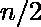
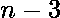
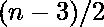

# 将一个数表示为素数的最大可能数之和

> 原文:[https://www . geesforgeks . org/representative-a-number-as-sum-max-of-prime-numbers/](https://www.geeksforgeeks.org/represent-a-number-as-a-sum-of-maximum-possible-number-of-prime-numbers/)

给定一个正整数。任务是将它表示为最大可能素数的和。(N > 1)
**例** :

```
Input : N = 5 
Output : 2 3 

Input : N = 6
Output : 2 2 2
```

起初，这个问题似乎涉及到使用哥德巴赫猜想。但这里的关键观察是最大化使用的术语数量，你应该使用尽可能少的数字。这导致了以下想法:

*   如果 N 为偶数，可以表示为两个的和。
*   否则，必须是偶数，因此 N 可以表示为 1 ^ 3 和^ 2 的和。

这是和为 n 的素数的最大数目
下面是上述方法的实现:

## C++

```
// CPP program to represent a number as a
// sum of maximum possible number of
// Prime Numbers
#include <bits/stdc++.h>
using namespace std;

// Function to represent a number as a
// sum of the maximum possible number
// of Prime Numbers
void printAsMaximalPrimeSum(int n)
{
    // If n is odd, print one 3
    if (n % 2 == 1) {
        cout << "3 ";
        n -= 3;
    }

    // Now n is even, print 2 n/2 times
    while (n) {
        cout << "2 ";
        n -= 2;
    }
}

// Driver Code
int main()
{
    int n = 5;
    printAsMaximalPrimeSum(n);
}
```

## Java 语言(一种计算机语言，尤用于创建网站)

```
// Java program to represent a number as a
// sum of maximum possible number of
// Prime Numbers

import java.io.*;

class GFG {

// Function to represent a number as a
// sum of the maximum possible number
// of Prime Numbers
static void printAsMaximalPrimeSum(int n)
{
    // If n is odd, print one 3
    if (n % 2 == 1) {
        System.out.print( "3 ");
        n -= 3;
    }

    // Now n is even, print 2 n/2 times
    while (n>0) {
        System.out.print( "2 ");
        n -= 2;
    }
}

       // Driver Code
    public static void main (String[] args) {
    int n = 5;
    printAsMaximalPrimeSum(n);
    }
}

// This Code is contributed by inder_verma..
```

## 蟒蛇 3

```
# Python3 program to represent a number as a
# sum of maximum possible number of
# Prime Numbers

# Function to represent a number as a
# sum of the maximum possible number
# of Prime Numbers
def printAsMaximalPrimeSum( n):

    # If n is odd, print one 3
    if ( n % 2 == 1): 
        print("3 ",end="")
        n -= 3

    # Now n is even, print 2 n/2 times
    while ( n>0): 
        print("2 ",end="")
        n -= 2

# Driver Code

n = 5
printAsMaximalPrimeSum( n)

# This code is contributed by ihritik
```

## C#

```
// C# program to represent a number as a
// sum of maximum possible number of
// Prime Numbers

using System;
class GFG
{
    // Function to represent a number as a
    // sum of the maximum possible number
    // of Prime Numbers
    static void printAsMaximalPrimeSum(int n)
    {
        // If n is odd, print one 3
        if (n % 2 == 1) {
            Console.Write("3 ");
            n -= 3;
        }

        // Now n is even, print 2 n/2 times
        while (n>0) {
            Console.Write("2 ");
            n -= 2;
        }
    }

    // Driver Code
    public static void Main()
    {
        int n = 5;
        printAsMaximalPrimeSum(n);
    }

}

// This code is contributed by ihritik
```

## 服务器端编程语言（Professional Hypertext Preprocessor 的缩写）

```
<?php
// PHP program to represent a number as a
// sum of maximum possible number of
// Prime Numbers

// Function to represent a number as a
// sum of the maximum possible number
// of Prime Numbers
function printAsMaximalPrimeSum($n)
{
    // If n is odd, print one 3
    if ($n % 2 == 1) {
        echo "3 ";
        $n -= 3;
    }

    // Now n is even, print 2 n/2 times
    while ($n>0) {
        echo "2 ";
        $n -= 2;
    }
}

// Driver Code

$n = 5;
printAsMaximalPrimeSum($n);

// This code is contributed by ihritik
?>
```

## java 描述语言

```
<script>

// Javascript program to represent a number as a
// sum of maximum possible number of
// Prime Number

// Function to represent a number as a
// sum of the maximum possible number
// of Prime Numbers
function printAsMaximalPrimeSum(n)
{
    // If n is odd, print one 3
    if (n % 2 == 1) {
        document.write( "3 ");
        n -= 3;
    }

    // Now n is even, print 2 n/2 times
    while (n>0) {
        document.write( "2 ");
        n -= 2;
    }
}

// driver program

    let n = 5;
    printAsMaximalPrimeSum(n);

</script>
```

**Output:** 

```
3 2
```

**时间复杂度:** O(N)