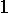

# 用最好的直线表示给定的一组点

> 原文:[https://www . geesforgeks . org/represent-给定-设定点-最佳-直线/](https://www.geeksforgeeks.org/represent-given-set-points-best-possible-straight-line/)

求 m 和 c 的值，使得直线 y = mx + c，最好地代表给定点组的方程(x 、y )、(x 、y )、(x 、y )、……。，(x ，y ，给定 n > =2。

示例:

```
Input : n = 5
        x = 1, x = 2, x = 3, 
x = 4, x = 5
y = 14, y = 27, y = 40, 
y = 55, y = 68   
Output : m = 13.6
c = 0 
If we take any pair of number ( x, y ) 
from the given data, these value of m and c
should make it best fit into the equation 
for a straight line, y = mx + c. Take x = 1 
and y = 14, then using values
of m and c from the output, and putting it 
in the following equation,
y = mx + c,
L.H.S.: y = 14, R.H.S: mx + c = 13.6 x 1 + 0 = 13.6
So, they are approximately equal.
Now, take x = 3 and y = 40,
L.H.S.: y = 40, R.H.S: mx + c = 13.6 x 3 + 0 = 40.8
So, they are also approximately equal, and so on
for all other values.
Input : n = 6
x = 1, x = 2, x = 3, 
x = 4, x = 5, x = 6
y = 1200, y = 900, y = 600, 
y = 200, y = 110, y = 50
Output : m = -243.42
c = 1361.97
```

**接近**

为了最佳拟合直线方程中的一组点，我们需要找到两个变量 m 和 c 的值。现在，由于有两个未知变量，并且取决于 n 的值，两种情况是可能的–

**情况 1–当 n = 2 时:**会有两个方程和两个未知变量要找，所以，会有唯一的解。
**情况 2–当 n > 2 :** 在这种情况下，可能存在也可能不存在满足所有 n 个方程的 m 和 c 的值，但是我们可以找到 m 和 c 的最佳可能值，它可以在给定点拟合一条直线。

所以，如果我们有 n 对不同的 x 和 y，那么，我们可以从它们形成 n 个直线方程，如下所示

```
f = mx + c,
f = mx + c,
f = mx + c,
......................................,
......................................,
f = mx + c,
where, f, is the value 
obtained by putting x in equation 
mx + c. 
```

那么，由于理想情况下 f 应该与 y 相同，但是我们仍然可以在所有情况下找到最接近 y 的 f ，如果我们取一个新的量，U =？(y–f)，对于从 1 到 n 的所有 I 值，使该数量最小。

**注:**(y–f)用来代替(y–f，因为我们要考虑 f 或 y 更大的两种情况，我们希望它们的差最小，所以如果我们不把这个术语平方，那么 f 
更大的情况和 y 更大的情况会在一定程度上互相抵消，这不是我们想要的。所以，我们需要把这个术语平方。

现在，要使 U 最小，它必须满足以下两个方程

```
 = 0 and  
 = 0\. 
```

在求解上述两个方程时，我们得到两个方程，如下所示:

```
?y = nc + m?x, and
?xy = c?x + m?x, which can be rearranged as - 
m = (n * ?xy - ?x?y) / (n * ?x - (?x)), and
c = (?y - m?x) / n, 
```

这就是这两种情况下 m 和 c 的值，我们可以用最好的直线来表示给定的一组点。

以下代码实现了上面给出的算法–

## C++

```
// C++ Program to find m and c for a straight line given,
// x and y
#include <cmath>
#include <iostream>
using namespace std;

// function to calculate m and c that best fit points
// represented by x[] and y[]
void bestApproximate(int x[], int y[], int n)
{
    float m, c, sum_x = 0, sum_y = 0, sum_xy = 0, sum_x2 = 0;
    for (int i = 0; i < n; i++) {
        sum_x += x[i];
        sum_y += y[i];
        sum_xy += x[i] * y[i];
        sum_x2 += pow(x[i], 2);
    }

    m = (n * sum_xy - sum_x * sum_y) / (n * sum_x2 - pow(sum_x, 2));
    c = (sum_y - m * sum_x) / n;

    cout << "m =" << m;
    cout << "\nc =" << c;
}

// Driver main function
int main()
{
    int x[] = { 1, 2, 3, 4, 5 };
    int y[] = { 14, 27, 40, 55, 68 };
    int n = sizeof(x) / sizeof(x[0]);
    bestApproximate(x, y, n);
    return 0;
}
```

## C

```
// C Program to find m and c for a straight line given,
// x and y
#include <stdio.h>

// function to calculate m and c that best fit points
// represented by x[] and y[]
void bestApproximate(int x[], int y[], int n)
{
    int i, j;
    float m, c, sum_x = 0, sum_y = 0, sum_xy = 0, sum_x2 = 0;
    for (i = 0; i < n; i++) {
        sum_x += x[i];
        sum_y += y[i];
        sum_xy += x[i] * y[i];
        sum_x2 += (x[i] * x[i]);
    }

    m = (n * sum_xy - sum_x * sum_y) / (n * sum_x2 - (sum_x * sum_x));
    c = (sum_y - m * sum_x) / n;

    printf("m =% f", m);
    printf("\nc =% f", c);
}

// Driver main function
int main()
{
    int x[] = { 1, 2, 3, 4, 5 };
    int y[] = { 14, 27, 40, 55, 68 };
    int n = sizeof(x) / sizeof(x[0]);
    bestApproximate(x, y, n);
    return 0;
}
```

## Java 语言(一种计算机语言，尤用于创建网站)

```
// Java Program to find m and c for a straight line given,
// x and y
import java.io.*;
import static java.lang.Math.pow;

public class A {
    // function to calculate m and c that best fit points
    // represented by x[] and y[]
    static void bestApproximate(int x[], int y[])
    {
        int n = x.length;
        double m, c, sum_x = 0, sum_y = 0,
                     sum_xy = 0, sum_x2 = 0;
        for (int i = 0; i < n; i++) {
            sum_x += x[i];
            sum_y += y[i];
            sum_xy += x[i] * y[i];
            sum_x2 += pow(x[i], 2);
        }

        m = (n * sum_xy - sum_x * sum_y) / (n * sum_x2 - pow(sum_x, 2));
        c = (sum_y - m * sum_x) / n;

        System.out.println("m = " + m);
        System.out.println("c = " + c);
    }

    // Driver main function
    public static void main(String args[])
    {
        int x[] = { 1, 2, 3, 4, 5 };
        int y[] = { 14, 27, 40, 55, 68 };
        bestApproximate(x, y);
    }
}
```

## 蟒蛇 3

```
# python Program to find m and c for
# a straight line given, x and y

# function to calculate m and c that
# best fit points represented by x[]
# and y[]
def bestApproximate(x, y, n):

    sum_x = 0
    sum_y = 0
    sum_xy = 0
    sum_x2 = 0

    for i in range (0, n):
        sum_x += x[i]
        sum_y += y[i]
        sum_xy += x[i] * y[i]
        sum_x2 += pow(x[i], 2)

    m = (float)((n * sum_xy - sum_x * sum_y)
            / (n * sum_x2 - pow(sum_x, 2)));

    c = (float)(sum_y - m * sum_x) / n;

    print("m = ", m);
    print("c = ", c);

# Driver main function
x = [1, 2, 3, 4, 5 ]
y = [ 14, 27, 40, 55, 68]
n = len(x)

bestApproximate(x, y, n)

# This code is contributed by Sam007.
```

## C#

```
// C# Program to find m and c for a
// straight line given, x and y
using System;

class GFG {

    // function to calculate m and c that
    // best fit points represented by x[] and y[]
    static void bestApproximate(int[] x, int[] y)
    {
        int n = x.Length;
        double m, c, sum_x = 0, sum_y = 0,
                     sum_xy = 0, sum_x2 = 0;

        for (int i = 0; i < n; i++) {
            sum_x += x[i];
            sum_y += y[i];
            sum_xy += x[i] * y[i];
            sum_x2 += Math.Pow(x[i], 2);
        }

        m = (n * sum_xy - sum_x * sum_y) / (n * sum_x2 - Math.Pow(sum_x, 2));

        c = (sum_y - m * sum_x) / n;

        Console.WriteLine("m = " + m);
        Console.WriteLine("c = " + c);
    }

    // Driver main function
    public static void Main()
    {
        int[] x = { 1, 2, 3, 4, 5 };
        int[] y = { 14, 27, 40, 55, 68 };

        // Function calling
        bestApproximate(x, y);
    }
}

// This code is contributed by Sam007
```

## 服务器端编程语言（Professional Hypertext Preprocessor 的缩写）

```
<?php
// PHP Program to find m and c
// for a straight line given,
// x and y

// function to calculate m and
// c that best fit points
// represented by x[] and y[]
function bestApproximate($x, $y, $n)
{
    $i; $j;
    $m; $c;
    $sum_x = 0;
    $sum_y = 0;
    $sum_xy = 0;
    $sum_x2 = 0;
    for ($i = 0; $i < $n; $i++)
    {
        $sum_x += $x[$i];
        $sum_y += $y[$i];
        $sum_xy += $x[$i] * $y[$i];
        $sum_x2 += ($x[$i] * $x[$i]);
    }

    $m = ($n * $sum_xy - $sum_x * $sum_y) /
         ($n * $sum_x2 - ($sum_x * $sum_x));
    $c = ($sum_y - $m * $sum_x) / $n;

    echo "m =", $m;
    echo "\nc =", $c;
}

    // Driver Code
    $x =array(1, 2, 3, 4, 5);
    $y =array (14, 27, 40, 55, 68);
    $n = sizeof($x);
    bestApproximate($x, $y, $n);

// This code is contributed by ajit
?>
```

## java 描述语言

```
<script>

// Javascript Program to find m and c
// for a straight line given, x and y

// function to calculate m and c that
// best fit points represented by x[] and y[]
function bestApproximate(x, y, n)
{
    let m, c, sum_x = 0, sum_y = 0,
             sum_xy = 0, sum_x2 = 0;
    for(let i = 0; i < n; i++)
    {
        sum_x += x[i];
        sum_y += y[i];
        sum_xy += x[i] * y[i];
        sum_x2 += Math.pow(x[i], 2);
    }

    m = (n * sum_xy - sum_x * sum_y) /
        (n * sum_x2 - Math.pow(sum_x, 2));
    c = (sum_y - m * sum_x) / n;

    document.write("m =" + m);
    document.write("<br>c =" + c);
}

// Driver code
let x = [ 1, 2, 3, 4, 5 ];
let y = [ 14, 27, 40, 55, 68 ];
let n = x.length;

bestApproximate(x, y, n);

// This code is contributed by subham348

</script>
```

输出:

```
m=13.6
c=0.0
```

**以上代码分析-**
辅助空间:O(1)
时间复杂度:O(n)。我们有一个循环，它迭代 n 次，每次它执行恒定数量的计算。

**参考-**
1-高等工程数学。

本文由**姆里根德拉·辛格**供稿。如果你喜欢 GeeksforGeeks 并想投稿，你也可以使用[contribute.geeksforgeeks.org](http://www.contribute.geeksforgeeks.org)写一篇文章或者把你的文章邮寄到 contribute@geeksforgeeks.org。看到你的文章出现在极客博客主页上，帮助其他极客。
如果你发现任何不正确的地方，或者你想分享更多关于上面讨论的话题的信息，请写评论。