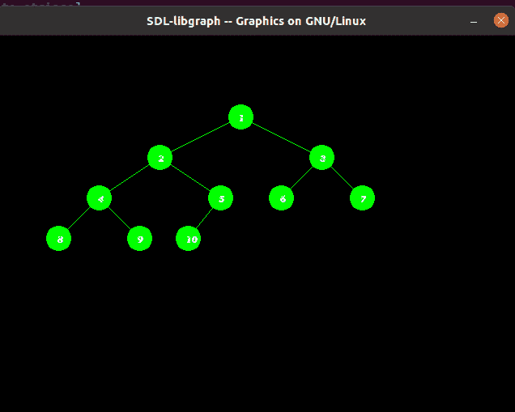

# 用 C/C++中的图形表示树

> 原文:[https://www . geeksforgeeks . org/present-tree-using-graphics-in-c/](https://www.geeksforgeeks.org/represent-tree-using-graphics-in-c-c/)

**先决条件:**[graphics.h](https://www.geeksforgeeks.org/add-graphics-h-c-library-gcc-compiler-linux/)[如何包含 graphics . h？](https://www.geeksforgeeks.org/how-to-create-a-heart-using-c-graphics/)

C/C++中有 [graphics.h](https://www.geeksforgeeks.org/include-graphics-h-codeblocks/) 头文件，用来创建线、圆等对象。
给定一个 **N** 整数的[数组](https://www.geeksforgeeks.org/introduction-to-arrays/)T5【arr】，任务是编写 [C++程序](https://www.geeksforgeeks.org/c-plus-plus/)使用 graphics.h 创建[树](https://www.geeksforgeeks.org/binary-tree-data-structure/)

**方法:**要运行程序，我们需要包含以下头文件:

```
#include 
```

我们将借助以下功能创建一个树:

1.  [**【setcolor(color)**](https://www.geeksforgeeks.org/setcolor-function-c/)**:**此功能出现在 graphic.h 头文件中，用于将当前绘图颜色设置为新颜色。
2.  [**【漫填(图案、颜色)**](https://www.geeksforgeeks.org/setfillstyle-floodfill-c/) **:** 功能用于填充封闭区域。当前填充图案和填充颜色用于填充该区域。
3.  [**【圆(x，y，半径)**](https://www.geeksforgeeks.org/draw-circle-c-graphics/) **:** 头文件 graphics.h 包含 circle()函数，绘制一个圆心在(x，y)且半径给定的圆。
4.  [**【outextxy()】**](https://www.geeksforgeeks.org/outtextxy-function-c/)**:**头文件 graphics.h 包含 outextxy()函数，该函数在屏幕上的指定点(x，y)显示文本或字符串。

下面是在 C++中使用图形绘制树的实现:

## C++

```
// C++ program to draw the tree
// in graphics.h
#include <graphics.h>
#include <iostream>
#include <math.h>
#include <sstream>
using namespace std;

// Function that prints Tree using
// functions graphic.h header file
void printTree(int x, int y, int* array,
               int index,
               int total_elements)
{

    // Base Case
    if (index >= total_elements)
        return NULL;

    // Convert int value into string
    ostringstream str1;
    str1 << array[index];

    string str2 = str1.str();
    char* str = &str2[0u];

    // Set color of the boundary of
    // circle as green
    setcolor(GREEN);

    // Draw the circle of radius 15
    // that represent node of Tree
    circle(x, y, 15);
    floodfill(x, y, GREEN);

    // Print the values of the node
    // in the circle
    outtextxy(x - 2, y - 3, str);

    // Set the color of the line
    // from parent to child as green
    setcolor(GREEN);

    // Evaluating left and right child
    int left = 2 * index + 1;
    int right = 2 * index + 2;

    // Recursively draw the left subtree
    // and the right subtree
    printTree(x - y / (index + 1), y + 50,
              array, left, total_elements);

    printTree(x + y / (index + 1), y + 50,
              array, right, total_elements);

    // Draw the line (or link) when the
    // node is not the leaf node
    if (left < total_elements) {
        line(x, y, x - y / (index + 1), y + 50);
    }

    if (right < total_elements) {
        line(x, y, x + y / (index + 1), y + 50);
    }

    return NULL;
}

// Driver Code
int main()
{
    // Initialize graphic driver
    int gd = DETECT, gm;
    initgraph(&gd, &gm, "None");

    // Consider the tree as represented
    /*
             1
          /     \
         2       3
       /  \     / \
      4   5    6   7
     / \  /
     8  9 10
    */

    // Given array arr[]
    int array[] = { 1, 2, 3, 4, 5,
                    6, 7, 8, 9, 10 };

    // Function Call
    printTree(300, 100, array, 0, 10);
    getch();

    // closegraph function closes the
    // graphics mode and deallocates
    // all memory allocated by
    // graphics system
    closegraph();
}
```

**输出:**

[](https://media.geeksforgeeks.org/wp-content/uploads/20200813213431/Screenshotfrom20200813213026.png)