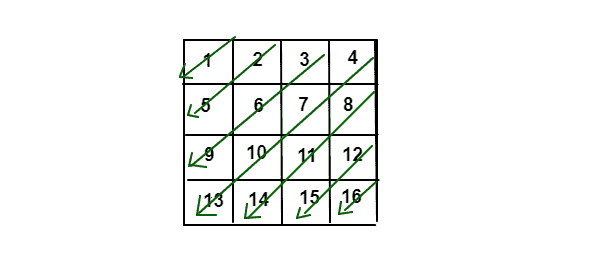

# 返回给定 N*N 方阵的反对角线数组

> 原文:[https://www . geeksforgeeks . org/return-a-array-of-of-anti-对角线-给定-nn-square-matrix/](https://www.geeksforgeeks.org/return-an-array-of-anti-diagonals-of-given-nn-square-matrix/)

给定一个大小为 N*N 的方阵，返回其反对角线的数组。为了更好地理解，让我们看看下面给出的图片:

**示例:**

```
Input :
```



```
Output :
 1
 2  5
 3  6  9
 4  7  10  13
 8  11 14
 12 15
 16
```

**方法 1:**
为了解决上面提到的问题，我们有两个主要的观察结果。

*   第一种是，某些对角线从每列的第零行开始，当起始列> = 0 或起始行< n 时结束
*   而第二个观察结果是，其余对角线从每行的结束列开始，并在任意一行的开始< N or start column > = 0 时结束。

下面是上述方法的实现:

## C++

```
// C++ implementation to  return
// an array of its anti-diagonals
// when an N*N square matrix is given

#include <iostream>
using namespace std;

// function to print the diagonals
void diagonal(int A[3][3])
{

    int N = 3;

    // For each column start row is 0
    for (int col = 0; col < N; col++) {

        int startcol = col, startrow = 0;

        while (startcol >= 0 && startrow < N) {
            cout << A[startrow][startcol] << " ";

            startcol--;

            startrow++;
        }
        cout << "\n";
    }

    // For each row start column is N-1
    for (int row = 1; row < N; row++) {
        int startrow = row, startcol = N - 1;

        while (startrow < N && startcol >= 0) {
            cout << A[startrow][startcol] << " ";

            startcol--;

            startrow++;
        }
        cout << "\n";
    }
}

// Driver code
int main()
{

    // matrix iniliasation
    int A[3][3] = { { 1, 2, 3 }, { 4, 5, 6 }, { 7, 8, 9 } };

    diagonal(A);

    return 0;
}
```

## Java 语言(一种计算机语言，尤用于创建网站)

```
// Java implementation to  return
// an array of its anti-diagonals
// when an N*N square matrix is given

class Matrix {

    // function to print the diagonals
    void diagonal(int A[][])
    {

        int N = 3;

        // For each column start row is 0
        for (int col = 0; col < N; col++) {

            int startcol = col, startrow = 0;

            while (startcol >= 0 && startrow < N) {

                System.out.print(A[startrow][startcol]
                                 + " ");

                startcol--;

                startrow++;
            }
            System.out.println();
        }

        // For each row start column is N-1
        for (int row = 1; row < N; row++) {
            int startrow = row, startcol = N - 1;

            while (startrow < N && startcol >= 0) {
                System.out.print(A[startrow][startcol]
                                 + " ");

                startcol--;

                startrow++;
            }
            System.out.println();
        }
    }

    // Driver code
    public static void main(String args[])
    {

        // matrix initialisation
        int A[][]
            = { { 1, 2, 3 }, { 4, 5, 6 }, { 7, 8, 9 } };

        Matrix m = new Matrix();

        m.diagonal(A);
    }
}
```

## 蟒蛇 3

```
# Python3 implementation to return
# an array of its anti-diagonals
# when an N*N square matrix is given

# function to print the diagonals

def diagonal(A):

    N = 3

    # For each column start row is 0
    for col in range(N):

        startcol = col
        startrow = 0

        while(startcol >= 0 and
              startrow < N):
            print(A[startrow][startcol], end = " ")

            startcol -= 1
            startrow += 1

        print()

    # For each row start column is N-1
    for row in range(1, N):
        startrow = row
        startcol = N - 1

        while(startrow < N and
              startcol >= 0):
            print(A[startrow][startcol],
                  end=" ")

            startcol -= 1
            startrow += 1

        print()

# Driver code
if __name__ == "__main__":

    # matrix iniliasation
    A = [[1, 2, 3],
         [4, 5, 6],
         [7, 8, 9]]

    diagonal(A)

# This code is contributed by AnkitRai01
```

## C#

```
// C# implementation to return
// an array of its anti-diagonals
// when an N*N square matrix is given
using System;

class GFG {

    // Function to print the diagonals
    static void diagonal(int[, ] A)
    {
        int N = 3;

        // For each column start row is 0
        for (int col = 0; col < N; col++) {
            int startcol = col, startrow = 0;

            while (startcol >= 0 && startrow < N) {
                Console.Write(A[startrow, startcol] + " ");
                startcol--;
                startrow++;
            }
            Console.WriteLine();
        }

        // For each row start column is N-1
        for (int row = 1; row < N; row++) {
            int startrow = row, startcol = N - 1;

            while (startrow < N && startcol >= 0) {
                Console.Write(A[startrow, startcol] + " ");
                startcol--;
                startrow++;
            }
            Console.WriteLine();
        }
    }

    // Driver code
    public static void Main(string[] args)
    {

        // Matrix initialisation
        int[, ] A
            = { { 1, 2, 3 }, { 4, 5, 6 }, { 7, 8, 9 } };

        diagonal(A);
    }
}

// This code is contributed by AnkitRai01
```

## java 描述语言

```
<script>

// Javascript implementation to  return
// an array of its anti-diagonals
// when an N*N square matrix is given

// Function to print the diagonals
function diagonal(A)
{
    let N = 3;

    // For each column start row is 0
    for(let col = 0; col < N; col++)
    {
        let startcol = col, startrow = 0;

        while (startcol >= 0 && startrow < N)
        {
            document.write(A[startrow][startcol] + " ");

            startcol--;
            startrow++;
        }
        document.write("</br>");
    }

    // For each row start column is N-1
    for(let row = 1; row < N; row++)
    {
        let startrow = row, startcol = N - 1;

        while (startrow < N && startcol >= 0)
        {
            document.write(A[startrow][startcol] + " ");

            startcol--;
            startrow++;
        }
        document.write("</br>");
    }
}

// Driver code

// matrix iniliasation
let A = [ [ 1, 2, 3 ], [ 4, 5, 6 ], [ 7, 8, 9 ] ];

diagonal(A);

// This code is contributed by suresh07

</script>
```

**Output:** 

```
1 
2 4 
3 5 7 
6 8 
9
```

**时间复杂度:**上述解的时间复杂度为 O(N*N)。

**方法 2:简单明了(时间复杂度相同)**

在这种方法中，我们将利用矩阵中任何元素的指数之和。让任何元素的索引由 I(行)和 j(列)表示。

如果我们找到 N*N 矩阵中任何元素的指数之和，我们将观察到任何元素的指数之和位于 0(当 i = j = 0)和 2 * N–2(当 i = j = N-1)之间。

因此，我们将遵循以下步骤:

*   声明一个大小为 2 * N–1 的向量向量，用于保存从 sum = 0 到 sum = 2 * N–2 的唯一和。
*   现在，我们将循环遍历向量，并将相似和的元素推回到向量向量中的同一行。

下面是上述方法的实现:

## C++

```
// C++ program for the above approach
#include <iostream>
#include <vector>
using namespace std;

// Function to print diagonals
void diagonal(vector<vector<int> >& A)
{

    int n = A.size();
    int N = 2 * n - 1;

    vector<vector<int> > result(N);

    // Push each element in the result vector
    for (int i = 0; i < n; i++)
        for (int j = 0; j < n; j++)
            result[i + j].push_back(A[i][j]);

    // Print the diagonals
    for (int i = 0; i < result.size(); i++)
    {
        cout << endl;
        for (int j = 0; j < result[i].size(); j++)
            cout << result[i][j] << " ";
    }
}

// Driver Code
int main()
{

    vector<vector<int> > A = { { 1, 2, 3, 4 },
                               { 5, 6, 7, 8 },
                               { 9, 10, 11, 12 },
                               { 13, 14, 15, 16 } };

    // Function Call
    diagonal(A);

    return 0;
}
```

## Java 语言(一种计算机语言，尤用于创建网站)

```
// Java program for the above approach
import java.util.*;
import java.lang.*;

class GFG{

// Function to print diagonals
static void diagonal(int[][] A)
{
    int n = A.length;
    int N = 2 * n - 1;

    ArrayList<ArrayList<Integer>> result = new ArrayList<>();

    for(int i = 0; i < N; i++)
        result.add(new ArrayList<>());

    // Push each element in the result vector
    for(int i = 0; i < n; i++)
        for(int j = 0; j < n; j++)
            result.get(i + j).add(A[i][j]);

    // Print the diagonals
    for(int i = 0; i < result.size(); i++)
    {
        System.out.println();
        for(int j = 0; j < result.get(i).size(); j++)
            System.out.print(result.get(i).get(j) + " ");
    }
}

// Driver code
public static void main(String[] args)
{
    int[][] A = { { 1, 2, 3, 4 },
                  { 5, 6, 7, 8 },
                  { 9, 10, 11, 12 },
                  { 13, 14, 15, 16 } };

    // Function Call
    diagonal(A);
}
}

// This code is contributed by offbeat
```

## 蟒蛇 3

```
# Python3 program for the above approach

# Function to print diagonals
def diagonal(A) :

    n = len(A)
    N = 2 * n - 1

    result = []

    for i in range(N) :
        result.append([])

    # Push each element in the result vector
    for i in range(n) :
        for j in range(n) :
            result[i + j].append(A[i][j])

    # Print the diagonals
    for i in range(len(result)) :

        for j in range(len(result[i])) :
            print(result[i][j] , end = " ")

        print()

A = [ [ 1, 2, 3, 4 ],
        [ 5, 6, 7, 8 ],
        [ 9, 10, 11, 12 ],
        [ 13, 14, 15, 16 ] ]

# Function Call
diagonal(A)

# This code is contributed by divyesh072019
```

## C#

```
// C# program for the above approach
using System;
using System.Collections.Generic;
class GFG {

    // Function to print diagonals
    static void diagonal(List<List<int>> A)
    {

        int n = A.Count;
        int N = 2 * n - 1;

        List<List<int>> result = new List<List<int>>();

        for (int i = 0; i < N; i++)
        {
            result.Add(new List<int>());
        }

        // Push each element in the result vector
        for (int i = 0; i < n; i++)
            for (int j = 0; j < n; j++)
                result[i + j].Add(A[i][j]);

        // Print the diagonals
        for (int i = 0; i < result.Count; i++)
        {
            for (int j = 0; j < result[i].Count; j++)
                Console.Write(result[i][j] + " ");
            Console.WriteLine();
        }
    }

  static void Main() {
    List<List<int>> A = new List<List<int>>();
    A.Add(new List<int> {1, 2, 3, 4});
    A.Add(new List<int> {5, 6, 7, 8});
    A.Add(new List<int> {9, 10, 11, 12});
    A.Add(new List<int> {13, 14, 15, 16});

    // Function Call
    diagonal(A);
  }
}
```

## java 描述语言

```
<script>
    // Javascript program for the above approach

    // Function to print diagonals
    function diagonal(A)
    {

        let n = A.length;
        let N = 2 * n - 1;

        let result = [];
        for (let i = 0; i < N; i++)
        {
            result.push([]);
        }

        // Push each element in the result vector
        for (let i = 0; i < n; i++)
            for (let j = 0; j < n; j++)
                result[i + j].push(A[i][j]);

        // Print the diagonals
        for (let i = 0; i < result.length; i++)
        {
            for (let j = 0; j < result[i].length; j++)
                document.write(result[i][j] + " ");
            document.write("</br>");
        }
    }

    let A = [[1, 2, 3, 4],
              [5, 6, 7, 8],
              [9, 10, 11, 12],
              [13, 14, 15, 16]];

      // Function Call
    diagonal(A);

// This code is contributed by mukesh07.
</script>
```

**输出:**

```
1  
2 5  
3 6 9  
4 7 10 13  
8 11 14  
12 15  
16
```