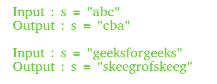

# 在 Java 中反转一个字符串

> 原文:[https://www.geeksforgeeks.org/reverse-a-string-in-java/](https://www.geeksforgeeks.org/reverse-a-string-in-java/)

本文通过示例讨论了在 Java 中反转字符串的不同方法。
示例:



先决条件:[String vs StringBuilder vs StringBuffer 在 Java 中](https://www.geeksforgeeks.org/g-fact-27-string-vs-stringbuilder-vs-stringbuffer/)
**以下是一些关于 String 和 StringBuilder 类的有趣事实:**
1。字符串对象是不可变的。
2。Java 中的 String 类没有 reverse()方法，但是 StringBuilder 类内置了 reverse()方法。
3。StringBuilder 类没有 toCharArray()方法，而 String 类有 toCharArray()方法。

```
1\. The idea is to traverse the length of the string 
2\. Extract each character while traversing 
3\. Add each character in front of the existing string
```

## Java 语言(一种计算机语言，尤用于创建网站)

```
// java program to reverse a word

import java.io.*;
import java.util.Scanner;

class GFG {
    public static void main (String[] args) {

        String str= "Geeks", nstr="";
        char ch;

      System.out.print("Original word: ");
      System.out.println("Geeks"); //Example word

      for (int i=0; i<str.length(); i++)
      {
        ch= str.charAt(i); //extracts each character
        nstr= ch+nstr; //adds each character in front of the existing string
      }
      System.out.println("Reversed word: "+ nstr);
    }
}

//Contributed by Tiyasa
```

*   **将字符串转换为字节:** getBytes()方法用于将输入字符串转换为字节[]。
    **法:**

```
1\. Create a temporary byte[]  of length equal 
   to the length of the input string.
2\. Store the bytes (which we get by using 
   getBytes() method) in reverse order into 
   the temporary byte[] .
3\. Create a new String abject using byte[] to
   store result.
```

## Java 语言(一种计算机语言，尤用于创建网站)

```
// Java program to ReverseString using ByteArray.
import java.lang.*;
import java.io.*;
import java.util.*;

// Class of ReverseString
class ReverseString {
    public static void main(String[] args)
    {
        String input = "GeeksforGeeks";

        // getBytes() method to convert string
        // into bytes[].
        byte[] strAsByteArray = input.getBytes();

        byte[] result = new byte[strAsByteArray.length];

        // Store result in reverse order into the
        // result byte[]
        for (int i = 0; i < strAsByteArray.length; i++)
            result[i] = strAsByteArray[strAsByteArray.length - i - 1];

        System.out.println(new String(result));
    }
}
```

**输出:**

```
skeeGrofskeeG
```

*   **使用 StringBuilder 类的内置 reverse()方法:** String 类没有 reverse()方法，我们需要将输入字符串转换为 StringBuilder，这是通过使用 StringBuilder 的 append 方法实现的。然后，通过从第一个索引到最后一个索引的扫描，打印出反转字符串的字符。

## Java 语言(一种计算机语言，尤用于创建网站)

```
// Java program to ReverseString using StringBuilder
import java.lang.*;
import java.io.*;
import java.util.*;

// Class of ReverseString
class ReverseString {
    public static void main(String[] args)
    {
        String input = "Geeks for Geeks";

        StringBuilder input1 = new StringBuilder();

        // append a string into StringBuilder input1
        input1.append(input);

        // reverse StringBuilder input1
        input1.reverse();

        // print reversed String
        System.out.println(input1);
    }
}
```

**输出:**

```
skeeG rof skeeG
```

*   **将字符串转换为字符数组:**用户输入要反转的字符串。
    T3【方法:

```
1\. First, convert String to character array
   by using the built in Java String class 
   method toCharArray().
2\. Then, scan the string from end  to start, 
   and print the character one by one.
```

## Java 语言(一种计算机语言，尤用于创建网站)

```
// Java program to Reverse a String  by
// converting string to characters  one
// by one
import java.lang.*;
import java.io.*;
import java.util.*;

// Class of ReverseString
class ReverseString {
    public static void main(String[] args)
    {
        String input = "GeeksForGeeks";

        // convert String to character array
        // by using toCharArray
        char[] try1 = input.toCharArray();

        for (int i = try1.length - 1; i >= 0; i--)
            System.out.print(try1[i]);
    }
}
```

**输出:**

```
skeeGrofskeeG
```

*   **使用 toCharArray()将输入字符串转换为字符数组:**使用字符串类的 toCharArray()–内置方法将输入字符串转换为字符数组。然后，从两侧扫描字符数组，即从开始索引(左)和最后索引(右)同时扫描。

```
1\. Set the left index equal to 0 and right 
   index equal to the length of the string -1.
2\. Swap the characters of the start index 
   scanning with the last index scanning 
   one by one. After that, increase the left 
   index by 1 (left++) and decrease the right 
   by 1 i.e., (right--) to move on to the next 
   characters in the character array .
3\. Continue till left is less than or equal to
   the right.
```

## Java 语言(一种计算机语言，尤用于创建网站)

```
// Java program to Reverse a String using swapping
// of variables
import java.lang.*;
import java.io.*;
import java.util.*;

// Class of ReverseString
class ReverseString {
    public static void main(String[] args)
    {
        String input = "Geeks For Geeks";
        char[] temparray = input.toCharArray();
        int left, right = 0;
        right = temparray.length - 1;

        for (left = 0; left < right; left++, right--) {
            // Swap values of left and right
            char temp = temparray[left];
            temparray[left] = temparray[right];
            temparray[right] = temp;
        }

        for (char c : temparray)
            System.out.print(c);
        System.out.println();
    }
}
```

**输出:**

```
skeeG roF skeeG
```

*   **使用 ArrayList 对象:**使用 toCharArray()内置方法将输入字符串转换为字符数组。然后，将数组的字符添加到 ArrayList 对象中。Java 还为 Collections 类内置了反向()方法。由于 Collections 类 reverse()方法接受一个列表对象，为了反转列表，我们将传递 ArrayList 对象，它是一种字符列表类型。

```
1\. We copy String contents to an object 
   of ArrayList.
1\. We create a ListIterator object by using 
   the listIterator() method on the ArrayList 
   object.
2\. ListIterator object is used to iterate over 
   the list.
3\. ListIterator object helps us to iterate 
   over the reversed list and print it one 
   by one to the output screen.
```

## Java 语言(一种计算机语言，尤用于创建网站)

```
// Java program to Reverse a String using ListIterator
import java.lang.*;
import java.io.*;
import java.util.*;

// Class of ReverseString
class ReverseString {
    public static void main(String[] args)
    {
        String input = "Geeks For Geeks";
        char[] hello = input.toCharArray();
        List<Character> trial1 = new ArrayList<>();

        for (char c : hello)
            trial1.add(c);

        Collections.reverse(trial1);
        ListIterator li = trial1.listIterator();
        while (li.hasNext())
            System.out.print(li.next());
    }
}
```

**输出:**

```
skeeG roF skeeG
```

*   **使用 StringBuffer:** String 类没有 reverse()方法，我们需要将输入字符串转换为 StringBuffer，这是通过使用 StringBuffer 的 reverse 方法实现的。

## Java 语言(一种计算机语言，尤用于创建网站)

```
// Java program to demonstrate conversion from
// String to StringBuffer and reverse of string
import java.lang.*;
import java.io.*;
import java.util.*;

public class Test {
    public static void main(String[] args)
    {
        String str = "Geeks";

        // conversion from String object to StringBuffer
        StringBuffer sbr = new StringBuffer(str);
        // To reverse the string
        sbr.reverse();
        System.out.println(sbr);
    }
}
```

**输出:**

```
skeeG
```

**相关文章:**
[C/c++](https://www.geeksforgeeks.org/quickly-reverse-string-c/)
中反转字符串的不同方法本文由**Somesh Awasthi 先生**供稿。如果你喜欢 GeeksforGeeks 并想投稿，你也可以用[write.geeksforgeeks.org](https://write.geeksforgeeks.org)写一篇文章或者把你的文章邮寄到 review-team@geeksforgeeks.org。看到你的文章出现在极客博客主页上，帮助其他极客。
如果发现有不正确的地方，或者想分享更多关于上述话题的信息，请写评论。