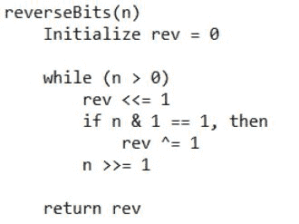

# 反转给定数字的实际位数

> 原文:[https://www . geesforgeks . org/reverse-actual-bits-给定-number/](https://www.geeksforgeeks.org/reverse-actual-bits-given-number/)

给定一个非负整数 **n** 。问题是反转 **n** 的位，打印反转位后得到的数字。请注意，数字的实际二进制表示被考虑用于反转位，不考虑前导 0。
**例:**

```
Input : 11
Output : 13
(11)10 = (1011)2.
After reversing the bits we get:
(1101)2 = (13)10.

Input : 10
Output : 5
(10)10 = (1010)2.
After reversing the bits we get:
(0101)2 = (101)2
        = (5)10.
```

在这种方法中， **n** 的二进制表示中的一个接一个的位是借助于按位右移操作获得的，并且它们是借助于按位左移操作在 **rev** 中累积的。
**算法:**



## C++

```
// C++ implementation to reverse bits of a number
#include <bits/stdc++.h>

using namespace std;

// function to reverse bits of a number
unsigned int reverseBits(unsigned int n)
{
    unsigned int rev = 0;

    // traversing bits of 'n' from the right
    while (n > 0)
    {
        // bitwise left shift
        // 'rev' by 1
        rev <<= 1;

        // if current bit is '1'
        if (n & 1 == 1)
            rev ^= 1;

        // bitwise right shift
        // 'n' by 1
        n >>= 1;

    }

    // required number
    return rev;
}

// Driver program to test above
int main()
{
    unsigned int n = 11;
    cout << reverseBits(n);
    return 0;
}
```

## Java 语言(一种计算机语言，尤用于创建网站)

```
// Java implementation to
// reverse bits of a number
class GFG
{
    // function to reverse bits of a number
    public static int reverseBits(int n)
    {
        int rev = 0;

        // traversing bits of 'n'
        // from the right
        while (n > 0)
        {
            // bitwise left shift
            // 'rev' by 1
            rev <<= 1;

            // if current bit is '1'
            if ((int)(n & 1) == 1)
                rev ^= 1;

            // bitwise right shift
            //'n' by 1
            n >>= 1;
        }
        // required number
        return rev;
    }

    // Driver code
    public static void main(String[] args)
    {
        int n = 11;
        System.out.println(reverseBits(n));
    }
}

// This code is contributed
// by prerna saini.
```

## 蟒蛇 3

```
# Python 3 implementation to
# reverse bits of a number

# function to reverse
# bits of a number
def reverseBits(n) :

    rev = 0

    # traversing bits of 'n' from the right
    while (n > 0) :

        # bitwise left shift 'rev' by 1
        rev = rev << 1

        # if current bit is '1'
        if (n & 1 == 1) :
            rev = rev ^ 1

        # bitwise right shift 'n' by 1
        n = n >> 1

    # required number
    return rev

# Driver code
n = 11
print(reverseBits(n))

# This code is contributed
# by Nikita Tiwari.
```

## C#

```
// C# implementation to
// reverse bits of a number
using System;
class GFG
{
    // function to reverse bits of a number
    public static int reverseBits(int n)
    {
        int rev = 0;

        // traversing bits of 'n'
        // from the right
        while (n > 0)
        {
            // bitwise left shift
            // 'rev' by 1
            rev <<= 1;

            // if current bit is '1'
            if ((int)(n & 1) == 1)
                rev ^= 1;

            // bitwise right shift
            //'n' by 1
            n >>= 1;
        }
        // required number
        return rev;
    }

    // Driver code
    public static void Main()
    {
        int n = 11;
        Console.WriteLine(reverseBits(n));
    }
}

// This code is contributed
// by vt_m.
```

## 服务器端编程语言（Professional Hypertext Preprocessor 的缩写）

```
<?php
// PHP implementation to reverse
// bits of a number

// function to reverse
// bits of a number
function reverseBits($n)
{
    $rev = 0;

    // traversing bits of 'n'
    // from the right
    while ($n > 0)
    {
        // bitwise left shift
        // 'rev' by 1
        $rev <<= 1;

        // if current bit is '1'
        if ($n & 1 == 1)
            $rev ^= 1;

        // bitwise right shift
        // 'n' by 1
        $n >>= 1;

    }

    // required number
    return $rev;
}

// Driver code
$n = 11;
echo reverseBits($n);

// This code is contributed by mits
?>
```

## java 描述语言

```
<script>

// JavaScript program  to
// reverse bits of a number

    // function to reverse bits of a number
    function reverseBits(n)
    {
        let rev = 0;

        // traversing bits of 'n'
        // from the right
        while (n > 0)
        {
            // bitwise left shift
            // 'rev' by 1
            rev <<= 1;

            // if current bit is '1'
            if ((n & 1) == 1)
                rev ^= 1;

            // bitwise right shift
            //'n' by 1
            n >>= 1;
        }
        // required number
        return rev;
    }

// Driver code

        let n = 11;
        document.write(reverseBits(n));

</script>
```

**输出:**

```
13
```

时间复杂度:O(num)，其中 **num** 是 **n** 二进制表示中的位数。