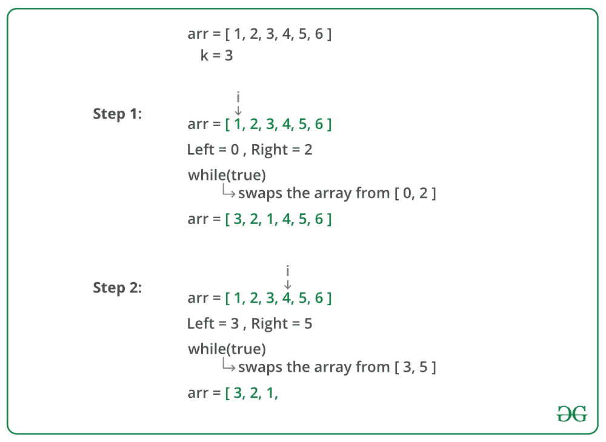

# 按照给定的大小分组反转一个数组

> 原文:[https://www . geesforgeks . org/给定大小的反向数组/](https://www.geeksforgeeks.org/reverse-an-array-in-groups-of-given-size/)

给定一个数组，反转由连续 k 个元素组成的每个子数组。

**示例:**

> **输入:**
> arr =【1，2，3，4，5，6，7，8，9】
> k = 3
> **输出:**
> 【3，2，1，6，5，4，9，8，7】
> 
> **输入:**
> arr =【1，2，3，4，5，6，7，8】
> k = 5
> **输出:**
> 【5，4，3，2，1，8，7，6】
> 
> **输入:**
> arr =【1，2，3，4，5，6】
> k = 1
> **输出:**
> 【1，2，3，4，5，6】
> 
> **输入:**
> arr =【1，2，3，4，5，6，7，8】
> k = 10
> **输出:**
> 【8，7，6，5，4，3，2，1】

**逼近**:从数组开始处开始考虑每一个大小为 **k** 的子数组，并将其反转。我们需要处理一些特殊情况。如果 k 不是 n 的倍数，其中 n 是数组的大小，对于最后一组，我们将剩下少于 k 个元素，我们需要反转所有剩余的元素。如果 **k = 1** ，数组应该保持不变。如果 k > = n，我们反转数组中的所有元素。

下图是上述方法的模拟运行:



下面是上述方法的实现:

## C++

```
// C++ program to reverse every sub-array formed by
// consecutive k elements
#include <iostream>
using namespace std;

// Function to reverse every sub-array formed by
// consecutive k elements
void reverse(int arr[], int n, int k)
{
    for (int i = 0; i < n; i += k)
    {
        int left = i;

        // to handle case when k is not multiple of n
        int right = min(i + k - 1, n - 1);

        // reverse the sub-array [left, right]
        while (left < right)
            swap(arr[left++], arr[right--]);

    }
}

// Driver code
int main()
{
    int arr[] = {1, 2, 3, 4, 5, 6, 7, 8};
    int k = 3;

    int n = sizeof(arr) / sizeof(arr[0]);

    reverse(arr, n, k);

    for (int i = 0; i < n; i++)
        cout << arr[i] << " ";

    return 0;
}
```

## Java 语言(一种计算机语言，尤用于创建网站)

```
// Java program to reverse every sub-array formed by
// consecutive k elements
class GFG {

    // Function to reverse every sub-array formed by
    // consecutive k elements
    static void reverse(int arr[], int n, int k)
    {
        for (int i = 0; i < n; i += k)
        {
            int left = i;

            // to handle case when k is not multiple
            // of n
            int right = Math.min(i + k - 1, n - 1);
            int temp;

            // reverse the sub-array [left, right]
            while (left < right)
            {
                temp=arr[left];
                arr[left]=arr[right];
                arr[right]=temp;
                left+=1;
                right-=1;
            }
        }
    }

    // Driver method
    public static void main(String[] args)
    {

        int arr[] = {1, 2, 3, 4, 5, 6, 7, 8};
        int k = 3;

        int n = arr.length;

        reverse(arr, n, k);

        for (int i = 0; i < n; i++)
            System.out.print(arr[i] + " ");
    }
}

// This code is contributed by Anant Agarwal.
```

## 蟒蛇 3

```
# Python 3 program to reverse every
# sub-array formed by consecutive k
# elements

# Function to reverse every sub-array
# formed by consecutive k elements
def reverse(arr, n, k):
    i = 0

    while(i<n):

        left = i

        # To handle case when k is not
        # multiple of n
        right = min(i + k - 1, n - 1)

        # Reverse the sub-array [left, right]
        while (left < right):

            arr[left], arr[right] = arr[right], arr[left]
            left+= 1;
            right-=1
        i+= k

# Driver code
arr = [1, 2, 3, 4, 5, 6,
                   7, 8]

k = 3
n = len(arr)
reverse(arr, n, k)

for i in range(0, n):
        print(arr[i], end =" ")

# This code is contributed by Smitha Dinesh Semwal
```

## C#

```
// C# program to reverse every sub-array
// formed by consecutive k elements
using System;

class GFG
{

// Function to reverse every sub-array
// formed by consecutive k elements
public static void reverse(int[] arr,
                           int n, int k)
{
    for (int i = 0; i < n; i += k)
    {
        int left = i;

        // to handle case when k is
        // not multiple of n
        int right = Math.Min(i + k - 1, n - 1);
        int temp;

        // reverse the sub-array [left, right]
        while (left < right)
        {
            temp = arr[left];
            arr[left] = arr[right];
            arr[right] = temp;
            left += 1;
            right -= 1;
        }
    }
}

// Driver Code
public static void Main(string[] args)
{
    int[] arr = new int[] {1, 2, 3, 4,
                           5, 6, 7, 8};
    int k = 3;

    int n = arr.Length;

    reverse(arr, n, k);

    for (int i = 0; i < n; i++)
    {
        Console.Write(arr[i] + " ");
    }
}
}

// This code is contributed
// by Shrikant13
```

## 服务器端编程语言（Professional Hypertext Preprocessor 的缩写）

```
<?php
// PHP program to reverse every sub-array
// formed by consecutive k elements

// Function to reverse every sub-array
// formed by consecutive k elements
function reverse($arr, $n, $k)
{
    for ($i = 0; $i < $n; $i += $k)
    {
        $left = $i;

        // to handle case when k is not
        // multiple of n
        $right = min($i + $k - 1, $n - 1);
        $temp;

        // reverse the sub-array [left, right]
        while ($left < $right)
        {
            $temp = $arr[$left];
            $arr[$left] = $arr[$right];
            $arr[$right] = $temp;
            $left += 1;
            $right -= 1;
        }
    }
    return $arr;
}

// Driver Code
$arr = array(1, 2, 3, 4, 5, 6, 7, 8);
$k = 3;

$n = sizeof($arr);

$arr1 = reverse($arr, $n, $k);

for ($i = 0; $i < $n; $i++)
    echo $arr1[$i] . " ";

// This code is contributed
// by Akanksha Rai
?>
```

## java 描述语言

```
<script>

// Javascript program to reverse every sub-array
// formed by consecutive k elements

// Function to reverse every sub-array
// formed by consecutive k elements
function reverse(arr, n, k)
{
    for(let i = 0; i < n; i += k)
    {
        let left = i;

        // To handle case when k is not
        // multiple of n
        let right = Math.min(i + k - 1, n - 1);
        let temp;

        // Reverse the sub-array [left, right]
        while (left < right)
        {
            temp = arr[left];
            arr[left] = arr[right];
            arr[right] = temp;
            left += 1;
            right -= 1;
        }
    }
    return arr;
}

// Driver Code
let arr = new Array(1, 2, 3, 4, 5, 6, 7, 8);
let k = 3;
let n = arr.length;
let arr1 = reverse(arr, n, k);

for(let i = 0; i < n; i++)
    document.write(arr1[i] + " ");

// This code is contributed by saurabh jaiswal

</script>
```

**输出:**

```
3 2 1 6 5 4 8 7
```

**上述解的时间复杂度**为 O(n)。
**辅助空间**所使用的程序是 O(1)。

本文由**阿迪蒂亚·戈尔**供稿。如果你喜欢 GeeksforGeeks 并想投稿，你也可以使用[write.geeksforgeeks.org](https://write.geeksforgeeks.org)写一篇文章或者把你的文章邮寄到 review-team@geeksforgeeks.org。看到你的文章出现在极客博客主页上，帮助其他极客。
如果你发现任何不正确的地方，或者你想分享更多关于上面讨论的话题的信息，请写评论。