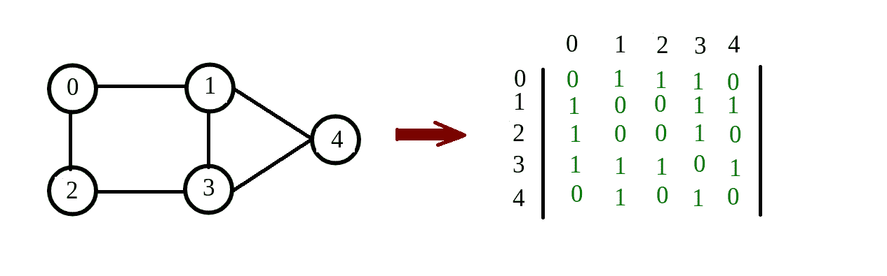
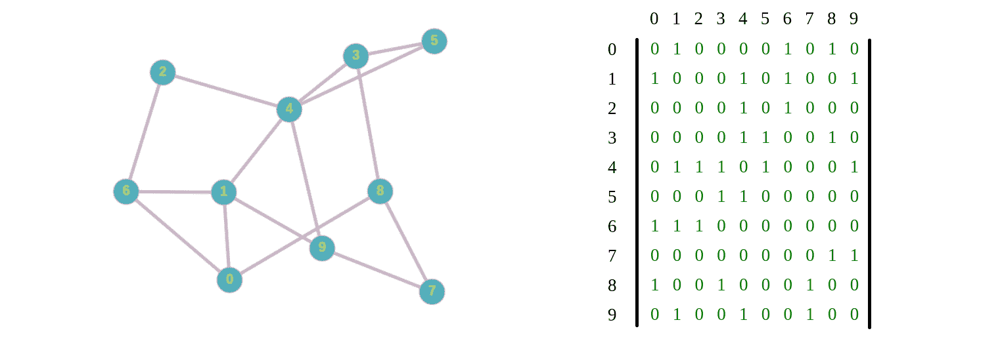
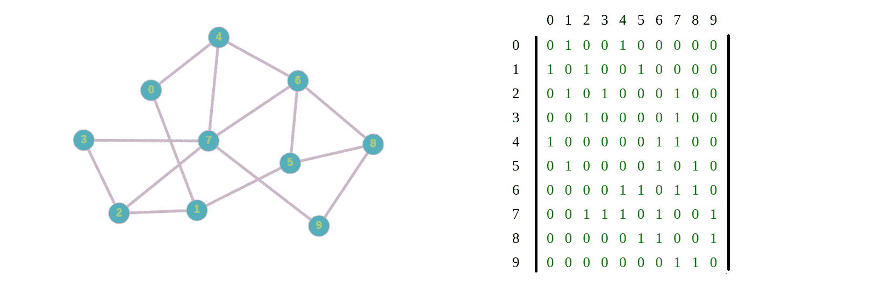
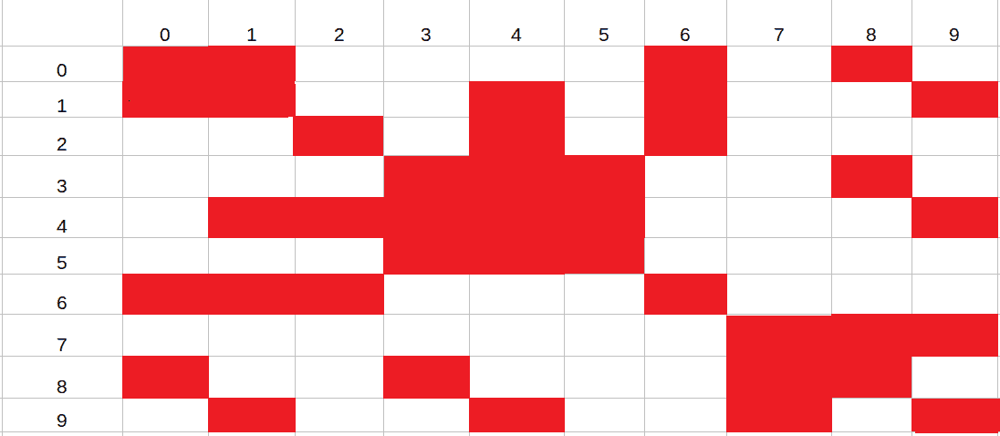
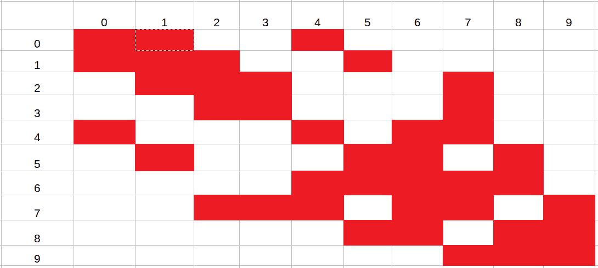

# 反向割丘麦基算法

> 原文:[https://www . geesforgeks . org/reverse-cut hill-McKee-algorithm/](https://www.geeksforgeeks.org/reverse-cuthill-mckee-algorithm/)

**Cuthill-Mckee** 算法用于对称方阵的重新排序。它基于图的[广度优先搜索算法](https://www.geeksforgeeks.org/breadth-first-search-or-bfs-for-a-graph/)，图的邻接矩阵是输入方阵的稀疏版本。
当要生成一个矩阵，该矩阵的行和列根据节点的编号进行编号时，经常使用这种排序。通过对节点进行适当的重新编号，通常可以产生一个带宽更小的矩阵。

[矩阵的稀疏化](https://en.wikipedia.org/wiki/Sparse_matrix)版本是一个矩阵，其中大部分元素为零。
反向 Cuthill-Mckee 算法与 **Cuthill-Mckee** 算法相同，唯一的区别是使用 Cuthill-Mckee 算法获得的最终指数在反向 Cuthill-Mckee 算法中是反向的。

以下是反向颤栗-麦基算法的步骤:

1.  实例化一个空队列 **Q** 和一个空数组用于对象的排列顺序 **R** 。
2.  **S1:** 我们先找到索引还没有加到 **R** 的最小度对象。比方说，对应于 **pth** 行的对象已经被识别为具有最小度数的对象。将 **p** 加到 **R** 上。
3.  **S2:** 作为索引被添加到 **R** 中，并将该索引处对应对象的所有邻居，
    按照度数递增的顺序添加到 **Q** 。邻居是在 pth 行的非对角线元素中具有非零值的节点。
4.  **S3:** 提取 **Q** 中的第一个节点，说 **C** 。如果 **C** 还没有插入 **R** 中，则加到 **R** 上，按照度数递增的顺序加到 **Q** 上 **C** 的邻居上。
5.  **S4:** 如果 **Q** 不为空，重复 **S3** 。
6.  **S5:** 如果 **Q** 为空，但矩阵中有未包含在 **R** 中的对象，则再次从 **S1** 开始。(如果有不相交的图，这可能会发生)
7.  **S6:** 一旦所有对象都包含在 **R** 中，则终止该算法。
8.  **S7:** 最后反转 **R** 中的指数，即(**互换(R[i]，R[P-i+1])** )。

**度:**度的定义不是恒定的，它会根据您使用的数据集而变化。对于下面给出的例子，节点的度数被定义为相应行中非对角线元素的总和。

节点“A”的**度**的广义定义是连接到“A”的节点数。

**示例:**

```
Given a symmetric matrix:  
| 0.0    0.78    0.79    0.8     0.23  |
| 0.9    0.0     0.43    0.771   0.752 |
| 0.82   0.0     0.0     0.79    0.34  |
| 0.8    0.8     0.8     0.0     0.8   |
| 0.54   0.97    0.12    0.78    0.0   | 

Degree here is defined as sum of non-diagonal 
elements in the corresponding row.
Specification for a matrix is defined as, 
if the element of the matrix at i, j has a value 
less than 0.75 its made to 0 otherwise its made to 1.
```

**规格后矩阵**:



```
Degree of node 0 = 2.6
Degree of node 1 = 2.803
Degree of node 2 = 2.55
Degree of node 3 = 3.2
Degree of node 4 = 2.41

Permutation order of objects (R) : 0 2 1 3 4
```

新的排列顺序只是节点的顺序，即将节点“R[i]”转换为节点“I”。
因此，将节点‘R[0]= 0’转换为 0；节点“R[1] = 2”，设置为 1；节点' R[2] = 1 '，到 2；节点' R[3] = 3 '，到 3；和节点‘R[4]= 4’，到 4；
让我们举一个更大的例子来理解重新排序的结果:

```
Give a adjacency matrix : 

| 0   1   0   0   0   0   1   0   1   0 |
| 1   0   0   0   1   0   1   0   0   1 |
| 0   0   0   0   1   0   1   0   0   0 |
| 0   0   0   0   1   1   0   0   1   0 |
| 0   1   1   1   0   1   0   0   0   1 | 
| 0   0   0   1   1   0   0   0   0   0 |
| 1   1   1   0   0   0   0   0   0   0 |
| 0   0   0   0   0   0   0   0   1   1 |
| 1   0   0   1   0   0   0   1   0   0 |
| 0   1   0   0   1   0   0   1   0   0 | 

Degree of node 'A' is defined as number of 
nodes connected to 'A'
```



```
Output : 
Permutation order of objects (R) : 
7 8 3 5 9 0 1 4 6 2 
```

现在将节点“R[i]”转换为节点“I”
这样图表就变成了:



重新排序的结果可以从两个图的邻接矩阵中看出:



原矩阵



重组矩阵

从这里我们可以清楚地看到，Cuthill-Mckee 算法如何帮助将一个正方形矩阵重新排序为一个非分布矩阵。

下面是上述算法的实现。取度的一般定义。

## C++

```
// C++ program for Implementation of
// Reverse Cuthill Mckee Algorithm

#include <bits/stdc++.h>
using namespace std;

vector<double> globalDegree;

int findIndex(vector<pair<int, double> > a, int x)
{
    for (int i = 0; i < a.size(); i++)
        if (a[i].first == x)
            return i;
    return -1;
}

bool compareDegree(int i, int j)
{
    return ::globalDegree[i] < ::globalDegree[j];
}

template <typename T>
ostream& operator<<(ostream& out, vector<T> const& v)
{
    for (int i = 0; i < v.size(); i++)
        out << v[i] << ' ';
    return out;
}

class ReorderingSSM {
private:
    vector<vector<double> > _matrix;

public:
    // Constructor and Destructor
    ReorderingSSM(vector<vector<double> > m)
    {
        _matrix = m;
    }

    ReorderingSSM() {}
    ~ReorderingSSM() {}

    // class methods

    // Function to generate degree of all the nodes
    vector<double> degreeGenerator()
    {

        vector<double> degrees;

        for (int i = 0; i < _matrix.size(); i++) {
            double count = 0;
            for (int j = 0; j < _matrix[0].size(); j++) {
                count += _matrix[i][j];
            }

            degrees.push_back(count);
        }

        return degrees;
    }

    // Implementation of Cuthill-Mckee algorithm
    vector<int> CuthillMckee()
    {
        vector<double> degrees = degreeGenerator();

        ::globalDegree = degrees;

        queue<int> Q;
        vector<int> R;
        vector<pair<int, double> > notVisited;

        for (int i = 0; i < degrees.size(); i++)
            notVisited.push_back(make_pair(i, degrees[i]));

        // Vector notVisited helps in running BFS
        // even when there are dijoind graphs
        while (notVisited.size()) {

            int minNodeIndex = 0;

            for (int i = 0; i < notVisited.size(); i++)
                if (notVisited[i].second < notVisited[minNodeIndex].second)
                    minNodeIndex = i;

            Q.push(notVisited[minNodeIndex].first);

            notVisited.erase(notVisited.begin()
                                    + findIndex(notVisited,
                                                notVisited[Q.front()].first));

            // Simple BFS
            while (!Q.empty()) {

                vector<int> toSort;

                for (int i = 0; i < _matrix[0].size(); i++) {
                    if (i != Q.front() && _matrix[Q.front()][i] == 1
                        && findIndex(notVisited, i) != -1) {
                        toSort.push_back(i);
                        notVisited.erase(notVisited.begin()
                                           + findIndex(notVisited, i));
                    }
                }

                sort(toSort.begin(), toSort.end(), compareDegree);

                for (int i = 0; i < toSort.size(); i++)
                    Q.push(toSort[i]);

                R.push_back(Q.front());
                Q.pop();
            }
        }

        return R;
    }

    // Implementation of reverse Cuthill-Mckee algorithm
    vector<int> ReverseCuthillMckee()
    {

        vector<int> cuthill = CuthillMckee();

        int n = cuthill.size();

        if (n % 2 == 0)
            n -= 1;

        n = n / 2;

        for (int i = 0; i <= n; i++) {
            int j = cuthill[cuthill.size() - 1 - i];
            cuthill[cuthill.size() - 1 - i] = cuthill[i];
            cuthill[i] = j;
        }

        return cuthill;
    }
};

// Driver Code
int main()
{
    int num_rows = 10;

    vector<vector<double> > matrix;

    for (int i = 0; i < num_rows; i++) {
        vector<double> datai;

        for (int j = 0; j < num_rows; j++)
            datai.push_back(0.0);

        matrix.push_back(datai);
    }

    // This is the test graph,
    // check out the above graph photo
    matrix[0] = { 0, 1, 0, 0, 0, 0, 1, 0, 1, 0 };
    matrix[1] = { 1, 0, 0, 0, 1, 0, 1, 0, 0, 1 };
    matrix[2] = { 0, 0, 0, 0, 1, 0, 1, 0, 0, 0 };
    matrix[3] = { 0, 0, 0, 0, 1, 1, 0, 0, 1, 0 };
    matrix[4] = { 0, 1, 1, 1, 0, 1, 0, 0, 0, 1 };
    matrix[5] = { 0, 0, 0, 1, 1, 0, 0, 0, 0, 0 };
    matrix[6] = { 1, 1, 1, 0, 0, 0, 0, 0, 0, 0 };
    matrix[7] = { 0, 0, 0, 0, 0, 0, 0, 0, 1, 1 };
    matrix[8] = { 1, 0, 0, 1, 0, 0, 0, 1, 0, 0 };
    matrix[9] = { 0, 1, 0, 0, 1, 0, 0, 1, 0, 0 };

    ReorderingSSM m(matrix);

    vector<int> r = m.ReverseCuthillMckee();

    cout << "Permutation order of objects: " << r << endl;

    return 0;
}
```

## 蟒蛇 3

```
# C++ program for Implementation of
# Reverse Cuthill Mckee Algorithm
from collections import deque as Queue

globalDegree = []

def findIndex(a, x):
    for i in range(len(a)):
        if a[i][0] == x:
            return i
    return -1

class ReorderingSSM:
    __matrix = []
    # Constructor and Destructor
    def __init__(self, m):
        self.__matrix = m

    # class methods

    # Function to generate degree of all the nodes
    def degreeGenerator(self):

        degrees = []

        for i in range(len(self.__matrix)):
            count = 0
            for j in range(len(self.__matrix[0])):
                count += self.__matrix[i][j]

            degrees.append(count)

        return degrees

    # Implementation of Cuthill-Mckee algorithm
    def CuthillMckee(self):
        global globalDegree
        degrees = self.degreeGenerator()

        globalDegree = degrees

        Q = Queue()
        R = []
        notVisited = []

        for i in range(len(degrees)):
            notVisited.append((i, degrees[i]))

        # Vector notVisited helps in running BFS
        # even when there are dijoind graphs
        while len(notVisited):

            minNodeIndex = 0

            for i in range(len(notVisited)):
                if notVisited[i][1] < notVisited[minNodeIndex][1]:
                    minNodeIndex = i

            Q.append(notVisited[minNodeIndex][0])

            notVisited.pop(findIndex(notVisited, notVisited[Q[0]][0]))

            # Simple BFS
            while Q:

                toSort = []

                for i in range(len(self.__matrix[0])):
                    if (
                        i != Q[0]
                        and self.__matrix[Q[0]][i] == 1
                        and findIndex(notVisited, i) != -1
                    ):
                        toSort.append(i)
                        notVisited.pop(findIndex(notVisited, i))

                toSort.sort(key=lambda x: globalDegree[x])

                for i in range(len(toSort)):
                    Q.append(toSort[i])

                R.append(Q[0])
                Q.popleft()

        return R

    # Implementation of reverse Cuthill-Mckee algorithm
    def ReverseCuthillMckee(self):

        cuthill = self.CuthillMckee()

        n = len(cuthill)

        if n % 2 == 0:
            n -= 1

        n = n // 2

        for i in range(n + 1):
            j = cuthill[len(cuthill) - 1 - i]
            cuthill[len(cuthill) - 1 - i] = cuthill[i]
            cuthill[i] = j

        return cuthill

# Driver Code
if __name__ == "__main__":
    num_rows = 10

    matrix = [[0.0] * num_rows for _ in range(num_rows)]

    # This is the test graph,
    # check out the above graph photo
    matrix[0] = [0, 1, 0, 0, 0, 0, 1, 0, 1, 0]
    matrix[1] = [1, 0, 0, 0, 1, 0, 1, 0, 0, 1]
    matrix[2] = [0, 0, 0, 0, 1, 0, 1, 0, 0, 0]
    matrix[3] = [0, 0, 0, 0, 1, 1, 0, 0, 1, 0]
    matrix[4] = [0, 1, 1, 1, 0, 1, 0, 0, 0, 1]
    matrix[5] = [0, 0, 0, 1, 1, 0, 0, 0, 0, 0]
    matrix[6] = [1, 1, 1, 0, 0, 0, 0, 0, 0, 0]
    matrix[7] = [0, 0, 0, 0, 0, 0, 0, 0, 1, 1]
    matrix[8] = [1, 0, 0, 1, 0, 0, 0, 1, 0, 0]
    matrix[9] = [0, 1, 0, 0, 1, 0, 0, 1, 0, 0]

    m = ReorderingSSM(matrix)

    r = m.ReverseCuthillMckee()

    print("Permutation order of objects:", r)
```

**Output**

```
Permutation order of objects: 7 8 9 3 5 1 0 4 6 2 
```

**参考**:[https://en . Wikipedia . org/wiki/Cuthill % E2 % 80% 93 mcke _ algorithm](https://en.wikipedia.org/wiki/Cuthill%E2%80%93McKee_algorithm)T4】