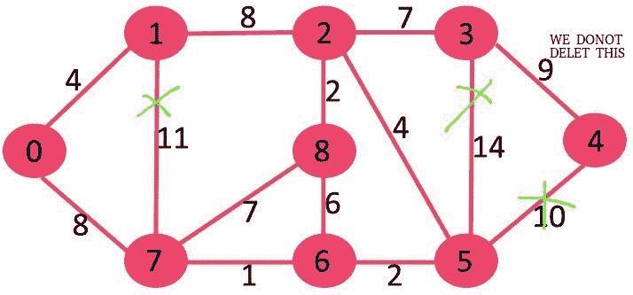

# 最小生成树反向删除算法

> 原文:[https://www . geesforgeks . org/reverse-delete-algorithm-minimum-生成树/](https://www.geeksforgeeks.org/reverse-delete-algorithm-minimum-spanning-tree/)

反向删除算法与[克鲁斯卡尔算法](https://www.geeksforgeeks.org/greedy-algorithms-set-2-kruskals-minimum-spanning-tree-mst/)密切相关。在 Kruskal 的算法中，我们做的是:通过增加边的权重来排序边。排序后，我们一个接一个地按递增的顺序挑选边。如果通过在生成树中包含当前拾取的边，在生成树中有 V-1 条边之前不形成任何循环，则我们包含当前拾取的边，其中 V =顶点数。

在反向删除算法中，我们按照权重递减的顺序对所有边进行排序。排序后，我们一个接一个地按降序挑选边。如果排除当前边缘会导致当前图形断开，我们**会包含当前拾取的边缘。主要思想是删除边，如果它的删除不会导致图的断开。**

算法

```
1) Sort all edges of graph in non-increasing order of
   edge weights.

2) Initialize MST as original graph and remove extra
   edges using step 3.

3) Pick highest weight edge from remaining edges and 
   check if deleting the edge disconnects the graph  
   or not.
       If disconnects, then we don't delete the edge.
       Else we delete the edge and continue. 
```

**图解:**
让我们用下面的例子来理解:
[](https://media.geeksforgeeks.org/wp-content/cdn-uploads/Fig-11.jpg)

如果我们删除权重 14 的最高权重边，图形不会断开，所以我们删除它。


接下来，我们删除 11，因为删除它不会断开图形。


接下来，我们删除 10，因为删除它不会断开图形。


接下来是 9。我们不能删除 9，因为删除它会导致断开连接。


我们继续这种方式，下面的边保留在最终的 MST 中。

```
Edges in MST
(3, 4) 
(0, 7) 
(2, 3) 
(2, 5) 
(0, 1) 
(5, 6) 
(2, 8) 
(6, 7) 
```

 **注意:**在等权重边的情况下，我们可以选取任意一条等权重边的边。

下面是以上步骤的 C++实现。

## C++

```
// C++ program to find Minimum Spanning Tree
// of a graph using Reverse Delete Algorithm
#include<bits/stdc++.h>
using namespace std;

// Creating shortcut for an integer pair
typedef  pair<int, int> iPair;

// Graph class represents a directed graph
// using adjacency list representation
class Graph
{
    int V;    // No. of vertices
    list<int> *adj;
    vector< pair<int, iPair> > edges;
    void DFS(int v, bool visited[]);

public:
    Graph(int V);   // Constructor

    // function to add an edge to graph
    void addEdge(int u, int v, int w);

    // Returns true if graph is connected
    bool isConnected();

    void reverseDeleteMST();
};

Graph::Graph(int V)
{
    this->V = V;
    adj = new list<int>[V];
}

void Graph::addEdge(int u, int v, int w)
{
    adj[u].push_back(v); // Add w to v’s list.
    adj[v].push_back(u); // Add w to v’s list.
    edges.push_back({w, {u, v}});
}

void Graph::DFS(int v, bool visited[])
{
    // Mark the current node as visited and print it
    visited[v] = true;

    // Recur for all the vertices adjacent to
    // this vertex
    list<int>::iterator i;
    for (i = adj[v].begin(); i != adj[v].end(); ++i)
        if (!visited[*i])
            DFS(*i, visited);
}

// Returns true if given graph is connected, else false
bool Graph::isConnected()
{
    bool visited[V];
    memset(visited, false, sizeof(visited));

    // Find all reachable vertices from first vertex
    DFS(0, visited);

    // If set of reachable vertices includes all,
    // return true.
    for (int i=1; i<V; i++)
        if (visited[i] == false)
            return false;

    return true;
}

// This function assumes that edge (u, v)
// exists in graph or not,
void Graph::reverseDeleteMST()
{
    // Sort edges in increasing order on basis of cost
    sort(edges.begin(), edges.end());

    int mst_wt = 0;  // Initialize weight of MST

    cout << "Edges in MST\n";

    // Iterate through all sorted edges in
    // decreasing order of weights
    for (int i=edges.size()-1; i>=0; i--)
    {
        int u = edges[i].second.first;
        int v = edges[i].second.second;

        // Remove edge from undirected graph
        adj[u].remove(v);
        adj[v].remove(u);

        // Adding the edge back if removing it
        // causes disconnection. In this case this 
        // edge becomes part of MST.
        if (isConnected() == false)
        {
            adj[u].push_back(v);
            adj[v].push_back(u);

            // This edge is part of MST
            cout << "(" << u << ", " << v << ") \n";
            mst_wt += edges[i].first;
        }
    }

    cout << "Total weight of MST is " << mst_wt;
}

// Driver code
int main()
{
    // create the graph given in above fugure
    int V = 9;
    Graph g(V);

    //  making above shown graph
    g.addEdge(0, 1, 4);
    g.addEdge(0, 7, 8);
    g.addEdge(1, 2, 8);
    g.addEdge(1, 7, 11);
    g.addEdge(2, 3, 7);
    g.addEdge(2, 8, 2);
    g.addEdge(2, 5, 4);
    g.addEdge(3, 4, 9);
    g.addEdge(3, 5, 14);
    g.addEdge(4, 5, 10);
    g.addEdge(5, 6, 2);
    g.addEdge(6, 7, 1);
    g.addEdge(6, 8, 6);
    g.addEdge(7, 8, 7);

    g.reverseDeleteMST();
    return 0;
}
```

## 蟒蛇 3

```
# Python3 program to find Minimum Spanning Tree
# of a graph using Reverse Delete Algorithm

# Graph class represents a directed graph
# using adjacency list representation
class Graph:
    def __init__(self, v):

        # No. of vertices
        self.v = v
        self.adj = [0] * v
        self.edges = []
        for i in range(v):
            self.adj[i] = []

    # function to add an edge to graph
    def addEdge(self, u: int, v: int, w: int):
        self.adj[u].append(v) # Add w to v’s list.
        self.adj[v].append(u) # Add w to v’s list.
        self.edges.append((w, (u, v)))

    def dfs(self, v: int, visited: list):

        # Mark the current node as visited and print it
        visited[v] = True

        # Recur for all the vertices adjacent to
        # this vertex
        for i in self.adj[v]:
            if not visited[i]:
                self.dfs(i, visited)

    # Returns true if graph is connected
    # Returns true if given graph is connected, else false
    def connected(self):
        visited = [False] * self.v

        # Find all reachable vertices from first vertex
        self.dfs(0, visited)

        # If set of reachable vertices includes all,
        # return true.
        for i in range(1, self.v):
            if not visited[i]:
                return False

        return True

    # This function assumes that edge (u, v)
    # exists in graph or not,
    def reverseDeleteMST(self):

        # Sort edges in increasing order on basis of cost
        self.edges.sort(key = lambda a: a[0])

        mst_wt = 0 # Initialize weight of MST

        print("Edges in MST")

        # Iterate through all sorted edges in
        # decreasing order of weights
        for i in range(len(self.edges) - 1, -1, -1):
            u = self.edges[i][1][0]
            v = self.edges[i][1][1]

            # Remove edge from undirected graph
            self.adj[u].remove(v)
            self.adj[v].remove(u)

            # Adding the edge back if removing it
            # causes disconnection. In this case this
            # edge becomes part of MST.
            if self.connected() == False:
                self.adj[u].append(v)
                self.adj[v].append(u)

                # This edge is part of MST
                print("( %d, %d )" % (u, v))
                mst_wt += self.edges[i][0]
        print("Total weight of MST is", mst_wt)

# Driver Code
if __name__ == "__main__":

    # create the graph given in above fugure
    V = 9
    g = Graph(V)

    # making above shown graph
    g.addEdge(0, 1, 4)
    g.addEdge(0, 7, 8)
    g.addEdge(1, 2, 8)
    g.addEdge(1, 7, 11)
    g.addEdge(2, 3, 7)
    g.addEdge(2, 8, 2)
    g.addEdge(2, 5, 4)
    g.addEdge(3, 4, 9)
    g.addEdge(3, 5, 14)
    g.addEdge(4, 5, 10)
    g.addEdge(5, 6, 2)
    g.addEdge(6, 7, 1)
    g.addEdge(6, 8, 6)
    g.addEdge(7, 8, 7)

    g.reverseDeleteMST()

# This code is contributed by
# sanjeev2552
```

**Output :**

```
Edges in MST
(3, 4) 
(0, 7) 
(2, 3) 
(2, 5) 
(0, 1) 
(5, 6) 
(2, 8) 
(6, 7) 
Total weight of MST is 37
```

**备注:**

1.  以上实现是反向删除算法的简单/幼稚实现，可以优化为 O(E log V (log log V) <sup>3</sup> )【来源: [Wiki](https://en.wikipedia.org/wiki/Reverse-delete_algorithm#Running_time) 。但是这种优化的时间复杂度仍然低于 MST 的 [Prim](https://www.geeksforgeeks.org/prims-algorithm-using-priority_queue-stl/) 和 [Kruskal](https://www.geeksforgeeks.org/greedy-algorithms-set-2-kruskals-minimum-spanning-tree-mst/) 算法。
2.  上述实现修改了原始图形。如果必须保留原始图形，我们可以创建图形的副本。

**参考文献:**
[https://en.wikipedia.org/wiki/Reverse-delete_algorithm](https://en.wikipedia.org/wiki/Reverse-delete_algorithm)

本文由**胃窦部**供稿。如果你喜欢 GeeksforGeeks 并想投稿，你也可以使用[contribute.geeksforgeeks.org](http://www.contribute.geeksforgeeks.org)写一篇文章或者把你的文章邮寄到 contribute@geeksforgeeks.org。看到你的文章出现在极客博客主页上，帮助其他极客。

如果您发现任何不正确的地方，或者您想分享更多关于上面讨论的主题的信息，请写评论