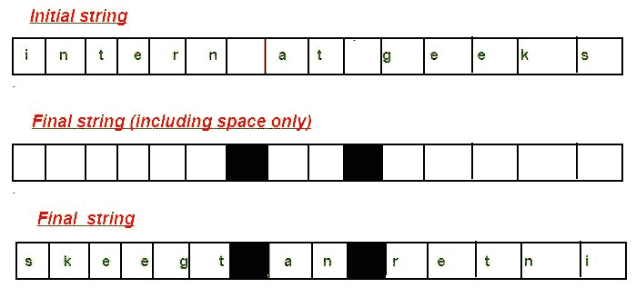

# 反转字符串保留空间位置

> 原文:[https://www . geesforgeks . org/reverse-string-preserving-space-positions/](https://www.geeksforgeeks.org/reverse-string-preserving-space-positions/)

编写一个程序来反转给定的字符串，同时保留空格的位置。

**示例:**

```
Input  : "abc de"
Output : edc ba

Input : "intern at geeks"
Output : skeegt an retni

Input : "Help others"
Output : sreh topleH
```



1.  创建一个字符串来存储结果。标记给定字符串在该字符串中的空格位置。
2.  将输入字符串中的字符以相反的顺序插入到结果字符串中。
3.  插入字符时，检查结果字符串在索引“j”处是否已经包含空格。如果它包含，我们将字符复制到下一个位置。

下面是上述步骤的实现。

## C++

```
// C++ program to reverse a string preserving
// spaces.
#include <iostream>
using namespace std;

// Function to reverse the string
// and preserve the space position
string reverses(string str)
{
    // Mark spaces in result
    int n = str.size();
    string result(n, '\0');
    for (int i = 0; i < n; i++)
        if (str[i] == ' ')
            result[i] = ' ';

    // Traverse input string from beginning
    // and put characters in result from end
    int j = n - 1;
    for (int i = 0; i < str.length(); i++) {
        // Ignore spaces in input string
        if (str[i] != ' ') {
            // ignore spaces in result.
            while(result[j] == ' ')
                j--;

            result[j] = str[i];
            j--;
        }
    }

    return result;
}

// Driver code
int main()
{
    string str = "internship at geeks for geeks";
    cout << reverses(str) << endl;
    return 0;
}
```

## Java 语言(一种计算机语言，尤用于创建网站)

```
// Java program to reverse a string
// preserving spaces.
public class ReverseStringPreserveSpace {
    // Function to reverse the string
    // and preserve the space position
    static void reverses(String str)
    {

        char[] inputArray = str.toCharArray();
        char[] result = new char[inputArray.length];

        // Mark spaces in result
        for (int i = 0; i < inputArray.length; i++) {
            if (inputArray[i] == ' ') {
                result[i] = ' ';
            }
        }

        // Traverse input string from beginning
        // and put characters in result from end
        int j = result.length - 1;
        for (int i = 0; i < inputArray.length; i++) {

            // Ignore spaces in input string
            if (inputArray[i] != ' ') {

                // ignore spaces in result.
                if (result[j] == ' ') {
                    j--;
                }
                result[j] = inputArray[i];
                j--;
            }
        }
        System.out.println(String.valueOf(result));
    }

    // driver function
    public static void main(String[] args)
    {
        reverses("internship at geeks for geeks");
    }
}

// This code is contributed by Rishabh Jain
```

## 蟒蛇 3

```
# Python3 program to reverse a string preserving
# spaces.

# Function to reverse the string
# and preserve the space position
def reverses(st):

    # Mark spaces in result
    n = len(st)
    result = [0] * n

    for i in range(n):
        if (st[i] == ' '):
            result[i] = ' '

    # Traverse input string from beginning
    # and put characters in result from end
    j = n - 1
    for i in range(len(st)):

        # Ignore spaces in input string
        if (st[i] != ' '):

            # Ignore spaces in result.
            if (result[j] == ' '):
                j -= 1

            result[j] = st[i]
            j -= 1

    return ''.join(result)

# Driver code
if __name__ == "__main__":

    st = "internship at geeks for geeks"
    print(reverses(st))

# This code is contributed by ukasp
```

## C#

```
// C# program to reverse a
// string preserving spaces.
using System;

class GFG {

    // Function to reverse the string
    // and preserve the space position
    static void reverses(string str)
    {
        char[] inputArray = str.ToCharArray();
        char[] result = new char[inputArray.Length];

        // Mark spaces in result
        for (int i = 0; i < inputArray.Length; i++) {
            if (inputArray[i] == ' ') {
                result[i] = ' ';
            }
        }

        // Traverse input string from beginning
        // and put characters in result from end
        int j = result.Length - 1;
        for (int i = 0; i < inputArray.Length; i++) {

            // Ignore spaces in input string
            if (inputArray[i] != ' ') {

                // ignore spaces in result.
                if (result[j] == ' ') {
                    j--;
                }
                result[j] = inputArray[i];
                j--;
            }
        }
        for (int i = 0; i < result.Length; i++)
            Console.Write(result[i]);
    }

    // Driver code
    public static void Main()
    {
        reverses("internship at geeks for geeks");
    }
}

// This code is contributed by Sam007
```

## java 描述语言

```
<script>
// Javascript program to reverse a string
// preserving spaces.

// Function to reverse the string
    // and preserve the space position
function reverses(str)
{
    let inputArray = str.split("");
        let result = new Array(inputArray.length);

        // Mark spaces in result
        for (let i = 0; i < inputArray.length; i++) {
            if (inputArray[i] == ' ') {
                result[i] = ' ';
            }
        }

        // Traverse input string from beginning
        // and put characters in result from end
        let j = result.length - 1;
        for (let i = 0; i < inputArray.length; i++) {

            // Ignore spaces in input string
            if (inputArray[i] != ' ') {

                // ignore spaces in result.
                if (result[j] == ' ') {
                    j--;
                }
                result[j] = inputArray[i];
                j--;
            }
        }
        document.write((result).join(""));
}
// driver function
reverses("internship at geeks for geeks");

// This code is contributed by ab2127
</script>
```

**Output:** 

```
skeegrofsk ee gtapi hsn retni
```

时间复杂度-> O(N)
辅助空间- > O(N)

**优化解**
思路是用两个指针反向。

## C++

```
// C++ program to implement
// the above approach
#include <iostream>
using namespace std;

void preserveSpace(string &str)
{
    int n = str.length();

    // Initialize two pointers as two corners
    int start = 0;
    int end = n - 1;

    // Move both pointers toward each other
    while (start < end) {

        // If character at start or end is space,
        // ignore it
        if (str[start] == ' ') {
            start++;
            continue;
        }
        else if (str[end] == ' ') {
            end--;
            continue;
        }

        // If both are not spaces, do swap
        else {
            swap(str[start], str[end]);
            start++;
            end--;
        }
    }
}

// Driver code
int main()
{
    string str = "internship at geeks for geeks";
    preserveSpace(str);
    cout << str;
    return 0;
}
```

## Java 语言(一种计算机语言，尤用于创建网站)

```
// Java program to implement
// the above approach
import java.io.*;
import java.util.*;

class GFG{

public static void preserveSpace(String str)
{
    int n = str.length();

    // Initialize two pointers as two corners
    int start = 0;
    int end = n - 1;

    char[] Str = str.toCharArray();

    // Move both pointers toward each other
    while (start < end)
    {

        // If character at start or end
        // is space, ignore it
        if (Str[start] == ' ')
        {
            start++;
            continue;
        }
        else if (Str[end] == ' ')
        {
            end--;
            continue;
        }

        // If both are not spaces, do swap
        else
        {
            char temp = Str[start];
            Str[start] = Str[end];
            Str[end] = temp;
            start++;
            end--;
        }
    }
    System.out.println(String.valueOf(Str));
}

// Driver Code
public static void main(String[] args)
{
    String str = "internship at geeks for geeks";

    preserveSpace(str);
}
}

// This code is contributed by divyeshrabadiya07
```

## 蟒蛇 3

```
# Python3 program to implement
# the above approach
def preserveSpace(Str):

    n = len(Str)
    Str = list(Str)

    # Initialize two pointers
    # as two corners
    start = 0
    end = n - 1

    # Move both pointers
    # toward each other
    while(start < end):

        # If character at start
        # or end is space,
        # ignore it
        if(Str[start] == ' '):
            start += 1
            continue
        elif(Str[end] == ' '):
            end -= 1
            continue

        # If both are not
        # spaces, do swap
        else:
            Str[start], Str[end] = (Str[end],
                                    Str[start])
            start += 1
            end -= 1
    print(''.join(Str))

# Driver code
Str = "internship at geeks for geeks"
preserveSpace(Str);

# This code is contributed by avanitrachhadiya2155
```

## C#

```
// C# program to implement
// the above approach
using System;
using System.Collections.Generic;

class GFG{

static void preserveSpace(string str)
{
    int n = str.Length;

    // Initialize two pointers
    // as two corners
    int start = 0;
    int end = n - 1;

    char[] Str = str.ToCharArray();

    // Move both pointers toward
    // each other
    while (start < end)
    {

        // If character at start or
        // end is space, ignore it
        if (Str[start] == ' ')
        {
            start++;
            continue;
        }
        else if (Str[end] == ' ')
        {
            end--;
            continue;
        }

        // If both are not spaces, do swap
        else
        {
            char temp = Str[start];
            Str[start] = Str[end];
            Str[end] = temp;
            start++;
            end--;
        }
    }
    Console.Write(new string(Str));
}

// Driver code   
static void Main()
{
    string str = "internship at geeks for geeks";

    preserveSpace(str);
}
}

// This code is contributed by divyesh072019
```

## java 描述语言

```
<script>

    // Javascript program to implement
    // the above approach

    function preserveSpace(str)
    {
        let n = str.length;

        // Initialize two pointers
        // as two corners
        let start = 0;
        let end = n - 1;

        let Str = str.split('');

        // Move both pointers toward
        // each other
        while (start < end)
        {

            // If character at start or
            // end is space, ignore it
            if (Str[start] == ' ')
            {
                start++;
                continue;
            }
            else if (Str[end] == ' ')
            {
                end--;
                continue;
            }

            // If both are not spaces, do swap
            else
            {
                let temp = Str[start];
                Str[start] = Str[end];
                Str[end] = temp;
                start++;
                end--;
            }
        }
        document.write(Str.join(""));
    }

    let str = "internship at geeks for geeks";

    preserveSpace(str);

</script>
```

**Output:** 

```
skeegrofsk ee gtapi hsn retni
```

本文由**里沙布·贾恩**供稿。如果你喜欢 GeeksforGeeks 并想投稿，你也可以使用[write.geeksforgeeks.org](http://www.write.geeksforgeeks.org)写一篇文章或者把你的文章邮寄到 contribute@geeksforgeeks.org。看到你的文章出现在极客博客主页上，帮助其他极客。
如果你发现任何不正确的地方，或者你想分享更多关于上面讨论的话题的信息，请写评论。