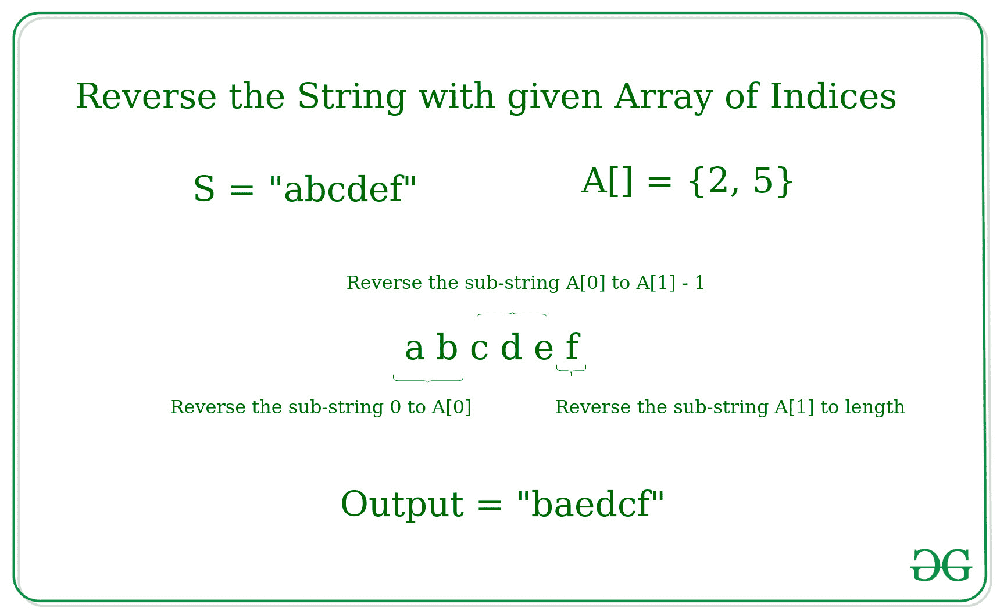

# 根据给定的索引数组

反转给定字符串的子字符串

> 原文:[https://www . geesforgeks . org/根据给定的索引数组反转给定字符串的子字符串/](https://www.geeksforgeeks.org/reverse-the-substrings-of-the-given-string-according-to-the-given-array-of-indices/)

给定一个字符串 **S** 和一个索引数组 **A[]** ，任务是根据给定的索引数组反转给定字符串的子字符串。
**注:** A[i] ≤长度(S)，为所有 i.
**例:**

> **输入:** S = "abcdef "，A[] = {2，5}
> **输出:** baedcf
> **解释:**
> 
> 
> 
> **输入:**S =“abcdefghij”，A[] = {2，5 }
> T3】输出:baedchjigff

**方法:**想法是使用反转给定字符串的子字符串的概念。

*   对索引数组进行排序。
*   提取给定数组中为每个索引形成的子字符串，如下所示:
    *   对于数组 A 中的第一个索引，形成的子字符串将是从给定字符串的索引 0 到 A[0](不包括 0)，即[0，A[0])
    *   对于数组 A 中的所有其他索引(最后一个除外)，形成的子串将是从给定字符串的索引 A[i]到 A[i+1](不包括)的子串，即[A[i]，A[i+1])
    *   对于数组 A 中的最后一个索引，形成的子串将是从索引 A[i]到 L(包括 L)，其中 L 是字符串的长度，即[A[i]，L]
*   反转给定字符串中的每个子字符串

下面是上述方法的实现。

## C++

```
// C++ implementation to reverse
// the substrings of the given String
// according to the given Array of indices

#include <bits/stdc++.h>
using namespace std;

// Function to reverse a string
void reverseStr(string& str,
                int l, int h)
{
    int n = h - l;

    // Swap character starting
    // from two corners
    for (int i = 0; i < n / 2; i++) {
        swap(str[i + l], str[n - i - 1 + l]);
    }
}

// Function to reverse the string
// with the given array of indices
void reverseString(string& s, int A[], int n)
{

    // Reverse the string from 0 to A[0]
    reverseStr(s, 0, A[0]);

    // Reverse the string for A[i] to A[i+1]
    for (int i = 1; i < n; i++)
        reverseStr(s, A[i - 1], A[i]);

    // Reverse String for A[n-1] to length
    reverseStr(s, A[n - 1], s.length());
}

// Driver Code
int main()
{
    string s = "abcdefgh";
    int A[] = { 2, 4, 6 };
    int n = sizeof(A) / sizeof(A[0]);

    reverseString(s, A, n);
    cout << s;

    return 0;
}
```

## Java 语言(一种计算机语言，尤用于创建网站)

```
// Java implementation to reverse
// the subStrings of the given String
// according to the given Array of indices
class GFG
{

static String s;

// Function to reverse a String
static void reverseStr(int l, int h)
{
    int n = h - l;

    // Swap character starting
    // from two corners
    for (int i = 0; i < n / 2; i++)
    {
        s = swap(i + l, n - i - 1 + l);
    }
}

// Function to reverse the String
// with the given array of indices
static void reverseString(int A[], int n)
{

    // Reverse the String from 0 to A[0]
    reverseStr(0, A[0]);

    // Reverse the String for A[i] to A[i+1]
    for (int i = 1; i < n; i++)
        reverseStr(A[i - 1], A[i]);

    // Reverse String for A[n-1] to length
    reverseStr(A[n - 1], s.length());
}
static String swap(int i, int j)
{
    char ch[] = s.toCharArray();
    char temp = ch[i];
    ch[i] = ch[j];
    ch[j] = temp;
    return String.valueOf(ch);
}

// Driver Code
public static void main(String[] args)
{
    s = "abcdefgh";
    int A[] = { 2, 4, 6 };
    int n = A.length;

    reverseString(A, n);
    System.out.print(s);
}
}

// This code is contributed by Rajput-Ji
```

## 蟒蛇 3

```
# Python3 implementation to reverse
# the substrings of the given String
# according to the given Array of indices

# Function to reverse a string
def reverseStr(str, l, h):
    n = h - l

    # Swap character starting
    # from two corners
    for i in range(n//2):
        str[i + l], str[n - i - 1 + l] = str[n - i - 1 + l], str[i + l]

# Function to reverse the string
# with the given array of indices
def reverseString(s, A, n):

    # Reverse the from 0 to A[0]
    reverseStr(s, 0, A[0])

    # Reverse the for A[i] to A[i+1]
    for i in range(1, n):
        reverseStr(s, A[i - 1], A[i])

    # Reverse String for A[n-1] to length
    reverseStr(s, A[n - 1], len(s))

# Driver Code
s = "abcdefgh"
s = [i for i in s]
A = [2, 4, 6]
n = len(A)

reverseString(s, A, n)
print("".join(s))

# This code is contributed by mohit kumar 29
```

## C#

```
// C# implementation to reverse
// the subStrings of the given String
// according to the given Array of indices
using System;

class GFG
{

static String s;

// Function to reverse a String
static void reverseStr(int l, int h)
{
    int n = h - l;

    // Swap character starting
    // from two corners
    for (int i = 0; i < n / 2; i++)
    {
        s = swap(i + l, n - i - 1 + l);
    }
}

// Function to reverse the String
// with the given array of indices
static void reverseString(int []A, int n)
{

    // Reverse the String from 0 to A[0]
    reverseStr(0, A[0]);

    // Reverse the String for A[i] to A[i+1]
    for (int i = 1; i < n; i++)
        reverseStr(A[i - 1], A[i]);

    // Reverse String for A[n-1] to length
    reverseStr(A[n - 1], s.Length);
}

static String swap(int i, int j)
{
    char []ch = s.ToCharArray();
    char temp = ch[i];
    ch[i] = ch[j];
    ch[j] = temp;
    return String.Join("",ch);
}

// Driver Code
public static void Main(String[] args)
{
    s = "abcdefgh";
    int []A = { 2, 4, 6 };
    int n = A.Length;

    reverseString(A, n);
    Console.Write(s);
}
}

// This code is contributed by 29AjayKumar
```

## java 描述语言

```
<script>

// JavaScript implementation to reverse
// the substrings of the given String
// according to the given Array of indices

// Function to reverse a string
function reverseStr(str, l, h)
{
    var n = h - l;

    // Swap character starting
    // from two corners
    for (var i = 0; i < n / 2; i++) {
        [str[i + l], str[n - i - 1 + l]] =
        [str[n - i - 1 + l], str[i + l]];
    }
    return str;
}

// Function to reverse the string
// with the given array of indices
function reverseString(s, A, n)
{

    // Reverse the string from 0 to A[0]
    s = reverseStr(s, 0, A[0]);

    // Reverse the string for A[i] to A[i+1]
    for (var i = 1; i < n; i++)
        s = reverseStr(s, A[i - 1], A[i]);

    // Reverse String for A[n-1] to length
    s = reverseStr(s, A[n - 1], s.length);
    return s;
}

// Driver Code
var s = "abcdefgh";
var A = [2, 4, 6];
var n = A.length;
s = reverseString(s.split(''), A, n);
document.write( s.join(''));

</script>
```

**Output:** 

```
badcfehg
```