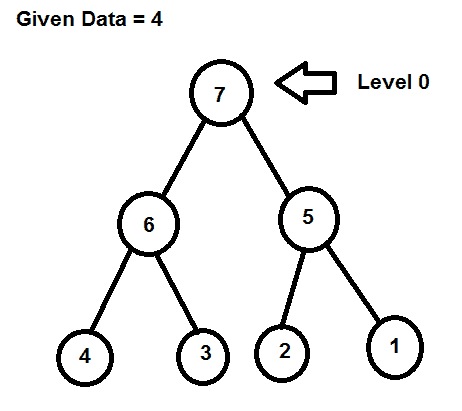
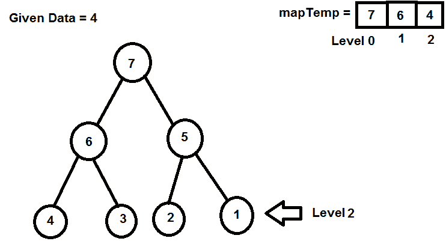
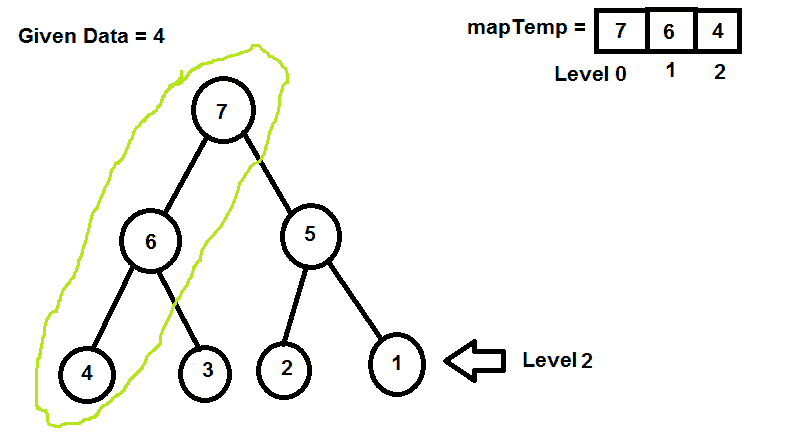
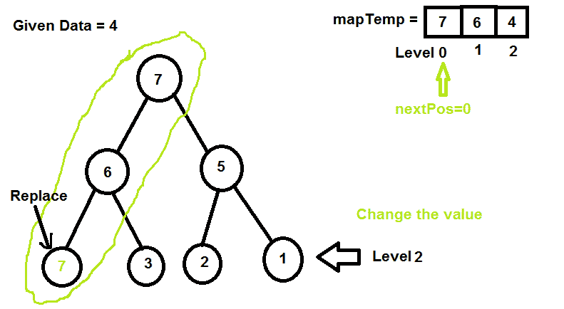
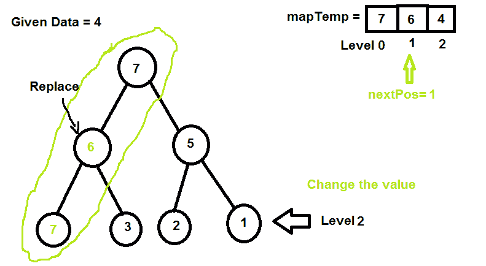
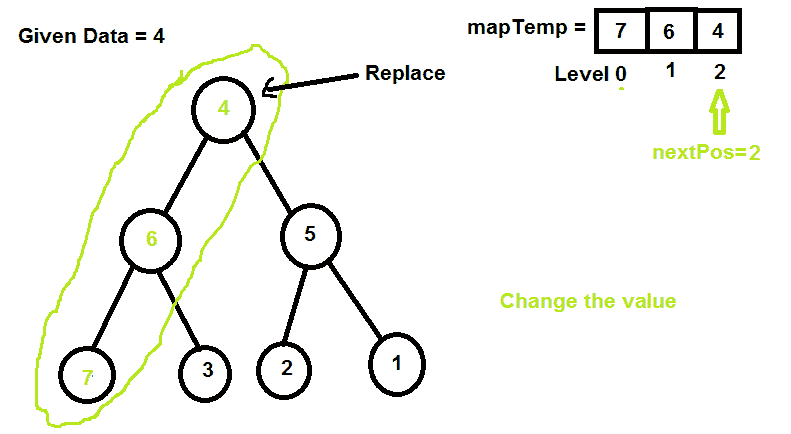

# 逆向树路径

> 原文:[https://www.geeksforgeeks.org/reverse-tree-path/](https://www.geeksforgeeks.org/reverse-tree-path/)

给定一个树和节点数据，反转该特定节点路径的任务。

**示例:**

```
Input: 
            7
         /    \
        6       5
       / \     / \
      4  3     2  1    
Data = 4 
Output: Inorder of tree
7 6 3 4 2 5 1

Input:
            7
         /    \
        6       5
       / \     / \
      4  3     2  1   
Data = 2 
Output : Inorder of tree
4 6 3 2 7 5 1
```

这个想法是使用地图来存储路径级别。



找到节点路径并存储在地图中



路径是



用地图下一个位置索引值
替换该位置



增加下一个位置索引并替换下一个值



增加下一个位置索引并替换下一个值



让我们理解代码:

## C++

```
// C++ program to Reverse Tree path
#include <bits/stdc++.h>
using namespace std;

// A Binary Tree Node
struct Node {
    int data;
    struct Node *left, *right;
};

// 'data' is input. We need to reverse path from
// root to data.
// 'level' is current level.
// 'temp' that stores path nodes.
// 'nextpos' used to pick next item for reversing.
Node* reverseTreePathUtil(Node* root, int data,
       map<int, int>& temp, int level, int& nextpos)
{
    // return NULL if root NULL
    if (root == NULL)
        return NULL;

    // Final condition
    // if the node is found then
    if (data == root->data) {

        // store the value in it's level
        temp[level] = root->data;

        // change the root value with the current
        // next element of the map
        root->data = temp[nextpos];

        // increment in k for the next element
        nextpos++;
        return root;
    }

    // store the data in particular level
    temp[level] = root->data;

    // We go to right only when left does not
    // contain given data. This way we make sure
    // that correct path node is stored in temp[]
    Node *left, *right;
    left = reverseTreePathUtil(root->left, data, temp,
                                  level + 1, nextpos);
    if (left == NULL)
        right = reverseTreePathUtil(root->right, data,
                            temp, level + 1, nextpos);

    // If current node is part of the path,
    // then do reversing.
    if (left || right) {
        root->data = temp[nextpos];
        nextpos++;
        return (left ? left : right);
    }

    // return NULL if not element found
    return NULL;
}

// Reverse Tree path
void reverseTreePath(Node* root, int data)
{
    // store per level data
    map<int, int> temp;

    // it is for replacing the data
    int nextpos = 0;

    // reverse tree path
    reverseTreePathUtil(root, data, temp, 0, nextpos);
}

// INORDER
void inorder(Node* root)
{
    if (root != NULL) {
        inorder(root->left);
        cout << root->data << " ";
        inorder(root->right);
    }
}

// Utility function to create a new tree node
Node* newNode(int data)
{
    Node* temp = new Node;
    temp->data = data;
    temp->left = temp->right = NULL;
    return temp;
}

// Driver program to test above functions
int main()
{
    // Let us create binary tree shown in above diagram
    Node* root = newNode(7);
    root->left = newNode(6);
    root->right = newNode(5);
    root->left->left = newNode(4);
    root->left->right = newNode(3);
    root->right->left = newNode(2);
    root->right->right = newNode(1);

    /*     7
         /    \
        6       5
       / \     / \
      4  3     2  1          */

    int data = 4;

    // Reverse Tree Path
    reverseTreePath(root, data);

    // Traverse inorder
    inorder(root);
    return 0;
}
```

## Java 语言(一种计算机语言，尤用于创建网站)

```
// Java program to Reverse Tree path
import java.util.*;
class solution
{

// A Binary Tree Node
static class Node {
    int data;
     Node left, right;
};

//class for int values
static class INT {
    int data;
};

// 'data' is input. We need to reverse path from
// root to data.
// 'level' is current level.
// 'temp' that stores path nodes.
// 'nextpos' used to pick next item for reversing.
 static Node reverseTreePathUtil(Node root, int data,
       Map<Integer, Integer> temp, int level, INT nextpos)
{
    // return null if root null
    if (root == null)
        return null;

    // Final condition
    // if the node is found then
    if (data == root.data) {

        // store the value in it's level
        temp.put(level,root.data);

        // change the root value with the current 
        // next element of the map
        root.data = temp.get(nextpos.data);

        // increment in k for the next element
        nextpos.data++;
        return root;
    }

    // store the data in particular level
    temp.put(level,root.data);

    // We go to right only when left does not 
    // contain given data. This way we make sure
    // that correct path node is stored in temp[]
    Node left, right=null;
    left = reverseTreePathUtil(root.left, data, temp, 
                                  level + 1, nextpos);
    if (left == null)
        right = reverseTreePathUtil(root.right, data, 
                            temp, level + 1, nextpos);

    // If current node is part of the path,
    // then do reversing.
    if (left!=null || right!=null) {
        root.data = temp.get(nextpos.data);
        nextpos.data++;
        return (left!=null ? left : right);
    }

    // return null if not element found
    return null;
}

// Reverse Tree path
 static void reverseTreePath(Node root, int data)
{
    // store per level data
    Map< Integer, Integer> temp= new HashMap< Integer, Integer>();

    // it is for replacing the data
    INT nextpos=new INT();
    nextpos.data = 0;

    // reverse tree path
    reverseTreePathUtil(root, data, temp, 0, nextpos);
}

// INORDER
static void inorder(Node root)
{
    if (root != null) {
        inorder(root.left);
        System.out.print( root.data + " ");
        inorder(root.right);
    }
}

// Utility function to create a new tree node
 static Node newNode(int data)
{
    Node temp = new Node();
    temp.data = data;
    temp.left = temp.right = null;
    return temp;
}

// Driver program to test above functions
public static void main(String args[])
{
    // Let us create binary tree shown in above diagram
    Node root = newNode(7);
    root.left = newNode(6);
    root.right = newNode(5);
    root.left.left = newNode(4);
    root.left.right = newNode(3);
    root.right.left = newNode(2);
    root.right.right = newNode(1);

      /*   7
         /    \
        6       5
       / \     / \
      4  3     2  1         */

    int data = 4;

    // Reverse Tree Path
    reverseTreePath(root, data);

    // Traverse inorder
    inorder(root);
}
}
//contributed by Arnab Kundu
```

## 蟒蛇 3

```
# Python3 program to Reverse Tree path

# A Binary Tree Node
class Node:
    def __init__(self, data):
        self.data = data
        self.left = None
        self.right = None

# 'data' is input. We need to reverse path from
# root to data.
# 'level' is current level.
# 'temp' that stores path nodes.
# 'nextpos' used to pick next item for reversing.
def reverseTreePathUtil(root, data,temp, level, nextpos):

    # return None if root None
    if (root == None):
        return None, temp, nextpos;

    # Final condition
    # if the node is found then
    if (data == root.data):

        # store the value in it's level
        temp[level] = root.data;

        # change the root value with the current
        # next element of the map
        root.data = temp[nextpos];

        # increment in k for the next element
        nextpos += 1
        return root, temp, nextpos;

    # store the data in particular level
    temp[level] = root.data;

    # We go to right only when left does not
    # contain given data. This way we make sure
    # that correct path node is stored in temp[]
    right = None
    left, temp, nextpos = reverseTreePathUtil(root.left, data, temp,
                                  level + 1, nextpos);
    if (left == None):
        right, temp, nextpos = reverseTreePathUtil(root.right, data,
                            temp, level + 1, nextpos);

    # If current node is part of the path,
    # then do reversing.
    if (left or right):
        root.data = temp[nextpos];
        nextpos += 1
        return (left if left != None else right), temp, nextpos;

    # return None if not element found
    return None, temp, nextpos;

# Reverse Tree path
def reverseTreePath(root, data):

    # store per level data
    temp = dict()

    # it is for replacing the data
    nextpos = 0;

    # reverse tree path
    reverseTreePathUtil(root, data, temp, 0, nextpos);

# INORDER
def inorder(root):
    if (root != None):
        inorder(root.left);
        print(root.data, end = ' ')
        inorder(root.right);

# Utility function to create a new tree node
def newNode(data):
    temp = Node(data)
    return temp;

# Driver code
if __name__=='__main__':

    # Let us create binary tree shown in above diagram
    root = newNode(7);
    root.left = newNode(6);
    root.right = newNode(5);
    root.left.left = newNode(4);
    root.left.right = newNode(3);
    root.right.left = newNode(2);
    root.right.right = newNode(1);

    '''     7
         /    \
        6       5
       / \     / \
      4  3     2  1          '''

    data = 4;

    # Reverse Tree Path
    reverseTreePath(root, data);

    # Traverse inorder
    inorder(root);

# This code is contributed by rutvik_56.
```

## C#

```
// C# program to Reverse Tree path
using System;
using System.Collections.Generic;

class GFG
{

// A Binary Tree Node
public class Node
{
    public int data;
    public Node left, right;
}

//class for int values
public class INT
{
    public int data;
}

// 'data' is input. We need to reverse
// path from root to data.
// 'level' is current level.
// 'temp' that stores path nodes.
// 'nextpos' used to pick next item for reversing.
public static Node reverseTreePathUtil(Node root, int data,
                                       IDictionary<int, int> temp,
                                       int level, INT nextpos)
{
    // return null if root null
    if (root == null)
    {
        return null;
    }

    // Final condition
    // if the node is found then
    if (data == root.data)
    {

        // store the value in it's level
        temp[level] = root.data;

        // change the root value with the
        // current next element of the map
        root.data = temp[nextpos.data];

        // increment in k for the next element
        nextpos.data++;
        return root;
    }

    // store the data in particular level
    temp[level] = root.data;

    // We go to right only when left does not
    // contain given data. This way we make sure
    // that correct path node is stored in temp[]
    Node left, right = null;
    left = reverseTreePathUtil(root.left, data, temp,
                               level + 1, nextpos);
    if (left == null)
    {
        right = reverseTreePathUtil(root.right, data, temp,
                                    level + 1, nextpos);
    }

    // If current node is part of the path,
    // then do reversing.
    if (left != null || right != null)
    {
        root.data = temp[nextpos.data];
        nextpos.data++;
        return (left != null ? left : right);
    }

    // return null if not element found
    return null;
}

// Reverse Tree path
public static void reverseTreePath(Node root,
                                   int data)
{
    // store per level data
    IDictionary<int,
                int> temp = new Dictionary<int,
                                           int>();

    // it is for replacing the data
    INT nextpos = new INT();
    nextpos.data = 0;

    // reverse tree path
    reverseTreePathUtil(root, data,
                        temp, 0, nextpos);
}

// INORDER
public static void inorder(Node root)
{
    if (root != null)
    {
        inorder(root.left);
        Console.Write(root.data + " ");
        inorder(root.right);
    }
}

// Utility function to create
// a new tree node
public static Node newNode(int data)
{
    Node temp = new Node();
    temp.data = data;
    temp.left = temp.right = null;
    return temp;
}

// Driver Code
public static void Main(string[] args)
{
    // Let us create binary tree
    // shown in above diagram
    Node root = newNode(7);
    root.left = newNode(6);
    root.right = newNode(5);
    root.left.left = newNode(4);
    root.left.right = newNode(3);
    root.right.left = newNode(2);
    root.right.right = newNode(1);

    /* 7
        / \
        6     5
    / \     / \
    4 3     2 1         */

    int data = 4;

    // Reverse Tree Path
    reverseTreePath(root, data);

    // Traverse inorder
    inorder(root);
}
}

// This code is contributed by Shrikant13
```

## java 描述语言

```
<script>

// Javascript program to Reverse Tree path

// A Binary Tree Node
class Node
{
    constructor()
    {
        this.data = 0;
        this.left = null;
        this.right = null;
    }
}

// Class for int values
class INT
{
    constructor()
    {
        this.data = 0;
    }
}

// 'data' is input. We need to reverse
// path from root to data.
// 'level' is current level.
// 'temp' that stores path nodes.
// 'nextpos' used to pick next item for reversing.
function reverseTreePathUtil(root, data,  temp,
                             level, nextpos)
{

    // Return null if root null
    if (root == null)
    {
        return null;
    }

    // Final condition
    // if the node is found then
    if (data == root.data)
    {

        // Store the value in it's level
        temp[level] = root.data;

        // Change the root value with the
        // current next element of the map
        root.data = temp[nextpos.data];

        // Increment in k for the next element
        nextpos.data++;
        return root;
    }

    // Store the data in particular level
    temp[level] = root.data;

    // We go to right only when left does not
    // contain given data. This way we make sure
    // that correct path node is stored in temp[]
    var left, right = null;
    left = reverseTreePathUtil(root.left, data, temp,
                               level + 1, nextpos);
    if (left == null)
    {
        right = reverseTreePathUtil(root.right, data, temp,
                                    level + 1, nextpos);
    }

    // If current node is part of the path,
    // then do reversing.
    if (left != null || right != null)
    {
        root.data = temp[nextpos.data];
        nextpos.data++;
        return (left != null ? left : right);
    }

    // Return null if not element found
    return null;
}

// Reverse Tree path
function reverseTreePath(root, data)
{

    // Store per level data
    var temp = new Map();

    // It is for replacing the data
    var nextpos = new INT();
    nextpos.data = 0;

    // Reverse tree path
    reverseTreePathUtil(root, data,
                        temp, 0, nextpos);
}

// INORDER
function inorder(root)
{
    if (root != null)
    {
        inorder(root.left);
        document.write(root.data + " ");
        inorder(root.right);
    }
}

// Utility function to create
// a new tree node
function newNode(data)
{
    var temp = new Node();
    temp.data = data;
    temp.left = temp.right = null;
    return temp;
}

// Driver Code

// Let us create binary tree
// shown in above diagram
var root = newNode(7);
root.left = newNode(6);
root.right = newNode(5);
root.left.left = newNode(4);
root.left.right = newNode(3);
root.right.left = newNode(2);
root.right.right = newNode(1);
/*   7
    / \
   6    5
  / \  / \
 4   3 2  1         */
var data = 4;

// Reverse Tree Path
reverseTreePath(root, data);

// Traverse inorder
inorder(root);

// This code is contributed by rrrtnx

</script>
```

**Output**

```
7 6 3 4 2 5 1 
```

#### 另一种方法:

使用[的概念打印所有的根到叶路径](https://www.geeksforgeeks.org/given-a-binary-tree-print-all-root-to-leaf-paths/)。我们的想法是跟踪从根节点到特定节点的路径，直到该路径被反转，一旦我们得到该特定节点，我们只需反转这些节点的数据。
在这里，我们不仅要跟踪所有的根叶路径，还要检查我们需要反转路径的节点。

使用向量存储每条路径。

一旦我们得到需要反转路径的节点，我们使用一个简单的算法来反转存储在向量中的跟随路径中找到的节点的数据。

实施上述方法如下:

## C++

```
// CPP program for the above approach
#include <bits/stdc++.h>
using namespace std;
#define nl "\n"
class Node {
public:
    int data;
    Node* left;
    Node* right;
    Node(int value) { data = value; }
};

// Function to print inorder
// traversal of the tree
void inorder(Node* temp)
{
    if (temp == NULL)
        return;

    inorder(temp->left);
    cout << temp->data << " ";
    inorder(temp->right);
}

// Utility function to track
// root to leaf paths
void reverseTreePathUtil(Node* root, vector<Node*> path,
                         int pathLen, int key)
{
    // Check if root is null then return
    if (root == NULL)
        return;

    // Store the node in path array
    path[pathLen] = root;
    pathLen++;

    // Check if we find the node upto
    // which oath needs to be
    // reversed
    if (root->data == key) {

        // Current path array contains
        // the path which needs
        // to be reversed
        int i = 0, j = pathLen - 1;

        // Swap the data of two nodes
        while (i < j) {
            int temp = path[i]->data;
            path[i]->data = path[j]->data;
            path[j]->data = temp;
            i++;
            j--;
        }
    }

    // Check if the node is a
    // leaf node then return
    if (!root->left and !root->right)
        return;

    // Call utility function for
    // left and right subtree
    // recursively
    reverseTreePathUtil(root->left, path,
                             pathLen, key);
    reverseTreePathUtil(root->right, path,
                              pathLen, key);
}

// Function to reverse tree path
void reverseTreePath(Node* root, int key)
{
    if (root == NULL)
        return;

    // Initialize a vector to store paths
    vector<Node*> path(50, NULL);
    reverseTreePathUtil(root, path, 0, key);
}

// Driver Code
int main()
{
    Node* root = new Node(7);
    root->left = new Node(6);
    root->right = new Node(5);
    root->left->left = new Node(4);
    root->left->right = new Node(3);
    root->right->left = new Node(2);
    root->right->right = new Node(1);

    /*     7
         /    \
        6       5
       / \     / \
      4  3     2  1          */

    int key = 4;
    reverseTreePath(root, key);
    inorder(root);
    return 0;
}
```

## Java 语言(一种计算机语言，尤用于创建网站)

```
// Java program for the above approach
import java.util.*;
class GFG
{

static class Node {
    int data;
    Node left;
    Node right;
    Node(int value)
    { this.data = value; }
};

// Function to print inorder
// traversal of the tree
static void inorder(Node temp)
{
    if (temp == null)
        return;

    inorder(temp.left);
    System.out.print(temp.data+" ");
    inorder(temp.right);
}

// Utility function to track
// root to leaf paths
static void reverseTreePathUtil(Node root, ArrayList<Node> path,
                         int pathLen, int key)
{

    // Check if root is null then return
    if (root == null)
        return;

    // Store the node in path array
    path.set(pathLen, root);
    pathLen++;

    // Check if we find the node upto
    // which oath needs to be
    // reversed
    if (root.data == key) {

        // Current path array contains
        // the path which needs
        // to be reversed
        int i = 0, j = pathLen - 1;

        // Swap the data of two nodes
        while (i < j)
        {
            int temp = path.get(i).data;
            path.get(i).data = path.get(j).data;
            path.get(j).data = temp;
            i++;
            j--;
        }
    }

    // Check if the node is a
    // leaf node then return
    if (root.left == null && root.right == null)
        return;

    // Call utility function for
    // left and right subtree
    // recursively
    reverseTreePathUtil(root.left, path,
                             pathLen, key);
    reverseTreePathUtil(root.right, path,
                              pathLen, key);
}

// Function to reverse tree path
static void reverseTreePath(Node root, int key)
{
    if (root == null)
        return;

    // Initialize a vector to store paths
    ArrayList<Node> path = new ArrayList<Node>();
    for(int i = 0; i < 50; i++)
    {
        path.add(null);
    }
    reverseTreePathUtil(root, path, 0, key);
}

// Driver Code
public static void main(String []args)
{
    Node root = new Node(7);
    root.left = new Node(6);
    root.right = new Node(5);
    root.left.left = new Node(4);
    root.left.right = new Node(3);
    root.right.left = new Node(2);
    root.right.right = new Node(1);

    /*     7
         /    \
        6       5
       / \     / \
      4  3     2  1          */

    int key = 4;
    reverseTreePath(root, key);
    inorder(root);
}
}

// This code is contributed by pratham76.
```

## 蟒蛇 3

```
# Python program for the above approach
class Node:
    def __init__(self, data):
        self.data = data;
        self.left = None;
        self.right = None;

# Function to prinorder
# traversal of the tree
def inorder(temp):
    if (temp == None):
        return;

    inorder(temp.left);
    print(temp.data, end=" ");
    inorder(temp.right);

# Utility function to track
# root to leaf paths
def reverseTreePathUtil(root, path, pathLen, key):

    # Check if root is None then return
    if (root == None):
        return;

    # Store the Node in path array
    path[pathLen] = root;
    pathLen+=1;

    # Check if we find the Node upto
    # which oath needs to be
    # reversed
    if (root.data == key):

        # Current path array contains
        # the path which needs
        # to be reversed
        i = 0;
        j = pathLen - 1;

        # Swap the data of two Nodes
        while (i < j):
            temp = path[i].data;
            path[i].data = path[j].data;
            path[j].data = temp;
            i += 1;
            j -= 1;

    # Check if the Node is a
    # leaf Node then return
    if (root.left == None and root.right == None):
        return;

    # Call utility function for
    # left and right subtree
    # recursively
    reverseTreePathUtil(root.left, path, pathLen, key);
    reverseTreePathUtil(root.right, path, pathLen, key);

# Function to reverse tree path
def reverseTreePath(root, key):
    if (root == None):
        return;

    # Initialize a vector to store paths
    path = [None for i in range(50)];

    reverseTreePathUtil(root, path, 0, key);

# Driver Code
if __name__ == '__main__':
    root = Node(7);
    root.left = Node(6);
    root.right = Node(5);
    root.left.left = Node(4);
    root.left.right = Node(3);
    root.right.left = Node(2);
    root.right.right = Node(1);

    '''
     * 7 / \ 6 5 / \ / \ 4 3 2 1
     '''

    key = 4;
    reverseTreePath(root, key);
    inorder(root);

# This code is contributed by umadevi9616
```

## C#

```
// C# program for the above approach
using System;
using System.Collections.Generic;

public class GFG
{

public class Node {
   public int data;
   public Node left;
   public Node right;
   public Node(int value)
    { this.data = value; }
};

// Function to print inorder
// traversal of the tree
static void inorder(Node temp)
{
    if (temp == null)
        return;

    inorder(temp.left);
    Console.Write(temp.data+" ");
    inorder(temp.right);
}

// Utility function to track
// root to leaf paths
static void reverseTreePathUtil(Node root, List<Node> path,
                         int pathLen, int key)
{

    // Check if root is null then return
    if (root == null)
        return;

    // Store the node in path array
    path[pathLen]= root;
    pathLen++;

    // Check if we find the node upto
    // which oath needs to be
    // reversed
    if (root.data == key) {

        // Current path array contains
        // the path which needs
        // to be reversed
        int i = 0, j = pathLen - 1;

        // Swap the data of two nodes
        while (i < j)
        {
            int temp = path[i].data;
            path[i].data = path[j].data;
            path[j].data = temp;
            i++;
            j--;
        }
    }

    // Check if the node is a
    // leaf node then return
    if (root.left == null && root.right == null)
        return;

    // Call utility function for
    // left and right subtree
    // recursively
    reverseTreePathUtil(root.left, path,
                             pathLen, key);
    reverseTreePathUtil(root.right, path,
                              pathLen, key);
}

// Function to reverse tree path
static void reverseTreePath(Node root, int key)
{
    if (root == null)
        return;

    // Initialize a vector to store paths
    List<Node> path = new List<Node>();
    for(int i = 0; i < 50; i++)
    {
        path.Add(null);
    }
    reverseTreePathUtil(root, path, 0, key);
}

// Driver Code
public static void Main(String []args)
{
    Node root = new Node(7);
    root.left = new Node(6);
    root.right = new Node(5);
    root.left.left = new Node(4);
    root.left.right = new Node(3);
    root.right.left = new Node(2);
    root.right.right = new Node(1);

    /*     7
         /    \
        6       5
       / \     / \
      4  3     2  1          */

    int key = 4;
    reverseTreePath(root, key);
    inorder(root);
}
}

// This code is contributed by umadevi9616
```

## java 描述语言

```
<script>

// JavaScript program for the above approach

class Node
{
    constructor(value)
    {
        this.data=value;
        this.left=this.right=null;
    }
}

// Function to print inorder
// traversal of the tree   
function inorder(temp)
{
    if (temp == null)
        return;

    inorder(temp.left);
    document.write(temp.data+" ");
    inorder(temp.right);
}

// Utility function to track
// root to leaf paths
function reverseTreePathUtil(root,path,pathLen,key)
{
    // Check if root is null then return
    if (root == null)
        return;

    // Store the node in path array
    path[pathLen] = root;
    pathLen++;

    // Check if we find the node upto
    // which oath needs to be
    // reversed
    if (root.data == key) {

        // Current path array contains
        // the path which needs
        // to be reversed
        let i = 0, j = pathLen - 1;

        // Swap the data of two nodes
        while (i < j)
        {
            let temp = path[i].data;
            path[i].data = path[j].data;
            path[j].data = temp;
            i++;
            j--;
        }
    }

    // Check if the node is a
    // leaf node then return
    if (root.left == null && root.right == null)
        return;

    // Call utility function for
    // left and right subtree
    // recursively
    reverseTreePathUtil(root.left, path,
                             pathLen, key);
    reverseTreePathUtil(root.right, path,
                              pathLen, key);
}

// Function to reverse tree path
function reverseTreePath(root,key)
{
    if (root == null)
        return;

    // Initialize a vector to store paths
    let path = [];
    for(let i = 0; i < 50; i++)
    {
        path.push(null);
    }
    reverseTreePathUtil(root, path, 0, key);
}

// Driver Code
let root = new Node(7);
root.left = new Node(6);
root.right = new Node(5);
root.left.left = new Node(4);
root.left.right = new Node(3);
root.right.left = new Node(2);
root.right.right = new Node(1);

/*         7
         /    \
        6       5
       / \     / \
      4  3     2  1          */

let key = 4;
reverseTreePath(root, key);
inorder(root);

// This code is contributed by avanitrachhadiya2155

</script>
```

**Output**

```
7 6 3 4 2 5 1 
```

**时间复杂度:** O(N)

**空间复杂度:** O(N)