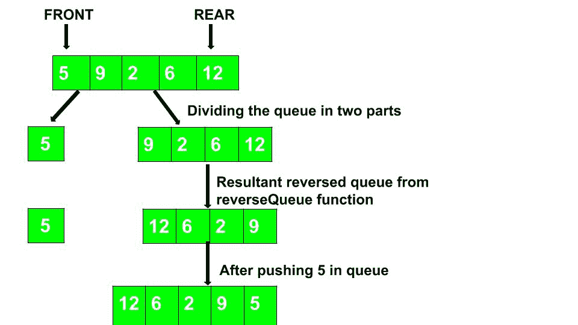

# 使用递归反转队列

> 原文:[https://www . geesforgeks . org/reversing-queue-use-recursion/](https://www.geeksforgeeks.org/reversing-queue-using-recursion/)

给定一个队列，编写一个递归函数来反转它。
**允许标准操作:**
入队(x):在队列后方增加一个物品 x。
出列() :从队列前面移除一个项目。
空() :检查队列是否为空。
**举例:**

```
Input : Q = [5, 24, 9, 6, 8, 4, 1, 8, 3, 6]
Output : Q = [6, 3, 8, 1, 4, 8, 6, 9, 24, 5]

Explanation : Output queue is the reverse of the input queue.

Input : Q = [8, 7, 2, 5, 1]
Output : Q = [1, 5, 2, 7, 8]
```

**递归算法:**

1.  如果队列中有元素，则从队列中弹出元素，否则返回空队列。
2.  对剩余的队列调用 reverseQueue 函数。
3.  将弹出的元素推入结果反转队列。



**伪代码:**

```
queue reverseFunction(queue)
{
    if (queue is empty)
       return queue;
    else {
       data = queue.front()
       queue.pop()
       queue = reverseFunction(queue);
       q.push(data);
       return queue;
    }
}
```

## C++

```
// C++ code for reversing a queue
#include <bits/stdc++.h>
using namespace std;

// Utility function to print the queue
void printQueue(queue<long long int> Queue)
{
    while (!Queue.empty()) {
        cout << Queue.front() << " ";
        Queue.pop();
    }
}

// Recursive function to reverse the queue
void reverseQueue(queue<long long int>& q)
{
    // Base case
    if (q.empty())
        return;

    // Dequeue current item (from front) 
    long long int data = q.front();
    q.pop();

    // Reverse remaining queue 
    reverseQueue(q);

    // Enqueue current item (to rear) 
    q.push(data);
}

// Driver code
int main()
{
    queue<long long int> Queue;
    Queue.push(56);
    Queue.push(27);
    Queue.push(30);
    Queue.push(45);
    Queue.push(85);
    Queue.push(92);
    Queue.push(58);
    Queue.push(80);
    Queue.push(90);
    Queue.push(100);
    reverseQueue(Queue);
    printQueue(Queue);
}
```

## Java 语言(一种计算机语言，尤用于创建网站)

```
// Java program to reverse a Queue by recursion
import java.util.LinkedList;
import java.util.Queue;
import java.util.Stack;

// Java program to reverse a queue recursively
public class Queue_reverse {

    static Queue<Integer> queue;

    // Utility function to print the queue
    static void Print()
    {
        while (!queue.isEmpty())
        {
            System.out.print(queue.peek() + " ");
            queue.remove();
        }
    }

// Recurrsive function to reverse the queue
static Queue<Integer> reverseQueue(Queue<Integer> q)
{
    // Base case
    if (q.isEmpty())
        return q;

    // Dequeue current item (from front) 
    int data = q.peek();
    q.remove();

    // Reverse remaining queue 
    q = reverseQueue(q);

    // Enqueue current item (to rear) 
    q.add(data);

    return q;
}

// Driver code
public static void main(String args[])
{
    queue = new LinkedList<Integer>();
    queue.add(56);
    queue.add(27);
    queue.add(30);
    queue.add(45);
    queue.add(85);
    queue.add(92);
    queue.add(58);
    queue.add(80);
    queue.add(90);
    queue.add(100);
    queue = reverseQueue(queue);
    Print();
}
}
```

## 蟒蛇 3

```
from queue import Queue

def reverse_queue(queue: Queue):
    # Base case
    if queue.empty():
        return

    # Dequeue current item (from front)
    item = queue.queue[0]
    queue.get()

    # Reverse remaining queue
    reverse_queue(queue)

    # Enqueue current item (to rear)
    queue.put(item)

def print_queue(queue: Queue):
    while not queue.empty():
        print(queue.queue[0], end=" ")
        queue.get()
    print()

# Driver Code
if __name__ == "__main__":
    q = Queue()
    q.put(56)
    q.put(27)
    q.put(30)
    q.put(45)
    q.put(85)
    q.put(92)
    q.put(58)
    q.put(80)
    q.put(90)
    q.put(100)

    reverse_queue(q)
    print_queue(q)
```

## C#

```
// C# code for reversing a queue
using System;
using System.Collections.Generic;

class GFG
{
    // Utility function
    // to print the queue
    static void printQueue(Queue<long> queue)
    {
        while (queue.Count != 0)
        {
            Console.Write(queue.Peek() + " ");
            queue.Dequeue();
        }
    }

    // Recursive function
    // to reverse the queue
    static void reverseQueue(ref Queue<long> q)
    {
        // Base case
        if (q.Count == 0)
            return;

        // Dequeue current
        // item (from front)
        long data = q.Peek();
        q.Dequeue();

        // Reverse remaining queue
        reverseQueue(ref q);

        // Enqueue current
        // item (to rear)
        q.Enqueue(data);
    }    

    // Driver code
    static void Main()
    {
        Queue<long> queue = new Queue<long>();
        queue.Enqueue(56);
        queue.Enqueue(27);
        queue.Enqueue(30);
        queue.Enqueue(45);
        queue.Enqueue(85);
        queue.Enqueue(92);
        queue.Enqueue(58);
        queue.Enqueue(80);
        queue.Enqueue(90);
        queue.Enqueue(100);
        reverseQueue(ref queue);
        printQueue(queue);
    }
}

// This code is contributed by
// Manish Shaw(manishshaw1)
```

## java 描述语言

```
<script>
    // Javascript code for reversing a queue

    // Utility function
    // to print the queue
    function printQueue(queue)
    {
        while (queue.length != 0)
        {
            document.write(queue[0] + " ");
            queue.shift();
        }
    }

    // Recursive function
    // to reverse the queue
    function reverseQueue(q)
    {
        // Base case
        if (q.length == 0)
            return;

        // Dequeue current
        // item (from front)
        let data = q[0];
        q.shift();

        // Reverse remaining queue
        reverseQueue(q);

        // Enqueue current
        // item (to rear)
        q.push(data);
    }   

    let queue = [];
    queue.push(56);
    queue.push(27);
    queue.push(30);
    queue.push(45);
    queue.push(85);
    queue.push(92);
    queue.push(58);
    queue.push(80);
    queue.push(90);
    queue.push(100);
    reverseQueue(queue);
    printQueue(queue);

// This code is contributed by divyeshrabadiya07.
</script>
```

**Output:** 

```
100 90 80 58 92 85 45 30 27 56
```

**时间复杂度:** O(n)。
视频: