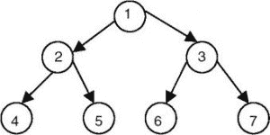

# 给定为边数组的树中每个节点的右同级

> 原文:[https://www . geesforgeks . org/right-树中每个节点的同级-给定为边数组/](https://www.geeksforgeeks.org/right-sibling-of-each-node-in-a-tree-given-as-array-of-edges/)

给定一棵树，有 *N* 个节点和 *E* 条边(每条边用两个整数表示， *X，Y* 表示 X 是 Y 的父节点)，任务是将所有节点及其右兄弟节点打印在单独的行中。
如果特定节点没有合适的兄弟节点，则打印 *-1* 。

**示例:**

> 
> 
> 在上面显示的图像中，节点 3、5、6、7 分别是节点 2、4、5、6 的右兄弟，而节点 1、3 和 7 没有右兄弟。
> 
> **输入:** N = 7，E = 6
> 边[][] = {{1，2}，{1，3}，{2，4}，{2，5}，{3，6}，{3，7 } }
> T4】输出:1-1
> 2 3
> 3-1
> 4 5
> 5 6
> 6 7
> 7-1
> 
> **输入:** N = 5，E = 4
> 边[][] = {{7，8}，{7，10}，{7，15}，{10，3 } }
> T4】输出:7-1
> 8 10
> 10 15
> 15-1
> 3-1

**方法:**主要思想是使用[广度优先遍历](https://www.geeksforgeeks.org/breadth-first-search-or-bfs-for-a-graph/)。

*   最初，根节点和“-1”值将被推入队列。树中特定级别的每个节点都被推入队列后，必须推入“-1”以确保该级别的最后一个节点没有正确的同级节点。
*   从队列中弹出每个节点后，队列前面的节点将始终是弹出节点的右同级。
*   如果弹出的节点值为“-1”，则表示当前级别已被访问，如果队列不为空，则表示该级别的前一个节点至少有一个子节点未被访问。
*   当队列非空时，重复上述步骤。

下面是上述方法的实现:

## C++

```
// C++ program to print right siblings
// of all the nodes in a tree
#include <bits/stdc++.h>
using namespace std;

void PrintSiblings(int root, int N, int E, vector<int> adj[])
{
    // boolean array to mark the visited nodes
    vector<bool> vis(N+1, false);

    // queue data structure to implement bfs
    queue<int> q;
    q.push(root);
    q.push(-1);
    vis[root] = 1;
    while (!q.empty()) {
        int node = q.front();
        q.pop();
        if (node == -1) {

            // if queue is empty then
            // the popped node is the last node
            // no need to push -1.
            if (!q.empty())
                q.push(-1);
            continue;
        }

        // node and its right sibling
        cout << node << " " << q.front() << "\n";
        for (auto s : adj[node]) {
            if (!vis[s]) {
                vis[s] = 1;
                q.push(s);
            }
        }
    }
}

// Driver code
int main()
{
    // nodes and edges
    int N = 7, E = 6;
    vector<int> adj[N+1];

    // The tree is represented in the form of
    // an adjacency list as there can be
    // multiple children of a node
    adj[1].push_back(2);
    adj[1].push_back(3);
    adj[2].push_back(4);
    adj[2].push_back(5);
    adj[3].push_back(6);
    adj[3].push_back(7);
    int root = 1;
    PrintSiblings(root, N, E, adj);
    return 0;
}
```

## Java 语言(一种计算机语言，尤用于创建网站)

```
// Java program to print right siblings
// of all the nodes in a tree
import java.util.*;

class GFG
{
static void PrintSiblings(int root, int N,
                          int E, Vector<Integer> adj[])
{
    // boolean array to mark the visited nodes
    boolean []vis = new boolean[N + 1];

    // queue data structure to implement bfs
    Queue<Integer> q = new LinkedList<>();
    q.add(root);
    q.add(-1);
    vis[root] = true;
    while (!q.isEmpty())
    {
        int node = q.peek();
        q.remove();
        if (node == -1)
        {

            // if queue is empty then
            // the popped node is the last node
            // no need to push -1.
            if (!q.isEmpty())
                q.add(-1);
            continue;
        }

        // node and its right sibling
        System.out.print(node + " " +
                           q.peek() + "\n");
        for (Integer s : adj[node])
        {
            if (!vis[s])
            {
                vis[s] = true;
                q.add(s);
            }
        }
    }
}

// Driver code
public static void main(String[] args)
{
    // nodes and edges
    int N = 7, E = 6;
    Vector<Integer> []adj = new Vector[N + 1];
    for(int i = 0; i < N + 1; i++)
        adj[i] = new Vector<Integer>();

    // The tree is represented in the form of
    // an adjacency list as there can be
    // multiple children of a node
    adj[1].add(2);
    adj[1].add(3);
    adj[2].add(4);
    adj[2].add(5);
    adj[3].add(6);
    adj[3].add(7);
    int root = 1;
    PrintSiblings(root, N, E, adj);
}
}

// This code is contributed by Rajput-Ji
```

## 蟒蛇 3

```
# Python3 program to print right
# siblings of all the nodes in
# a tree
def PrintSiblings(root, N, E, adj):

    # Boolean array to mark the
    # visited nodes
    vis = [False for i in  range(N + 1)]

    # queue data structure to
    # implement bfs
    q = []
    q.append(root)
    q.append(-1)
    vis[root] = 1

    while (len(q) != 0):
        node = q[0]
        q.pop(0)

        if (node == -1):

            # If queue is empty then the
              # popped node is the last node
            # no need to append -1.
            if (len(q) != 0):
                q.append(-1)

            continue

        # Node and its right sibling
        print(str(node) + " " + str(q[0]))

        for s in adj[node]:
            if (not vis[s]):
                vis[s] = True
                q.append(s)

# Driver code
if __name__=='__main__':

    # Nodes and edges
    N = 7
    E = 6
    adj = [[] for i in range(N + 1)]

    # The tree is represented in the
      # form of an adjacency list as
    # there can be multiple children
    # of a node
    adj[1].append(2)
    adj[1].append(3)
    adj[2].append(4)
    adj[2].append(5)
    adj[3].append(6)
    adj[3].append(7)
    root = 1

    PrintSiblings(root, N, E, adj)

# This code is contributed by rutvik_56
```

## C#

```
// C# program to print right siblings
// of all the nodes in a tree
using System;
using System.Collections.Generic;

class GFG
{
static void PrintSiblings(int root, int N,
                          int E, List<int> []adj)
{
    // bool array to mark the visited nodes
    bool []vis = new bool[N + 1];

    // queue data structure to implement bfs
    Queue<int> q = new Queue<int>();
    q.Enqueue(root);
    q.Enqueue(-1);
    vis[root] = true;
    while (q.Count != 0)
    {
        int node = q.Peek();
        q.Dequeue();
        if (node == -1)
        {

            // if queue is empty then
            // the popped node is the last node
            // no need to push -1.
            if (q.Count != 0)
                q.Enqueue(-1);
            continue;
        }

        // node and its right sibling
        Console.Write(node + " " +
                      q.Peek() + "\n");
        foreach (int s in adj[node])
        {
            if (!vis[s])
            {
                vis[s] = true;
                q.Enqueue(s);
            }
        }
    }
}

// Driver code
public static void Main(String[] args)
{
    // nodes and edges
    int N = 7, E = 6;
    List<int> []adj = new List<int>[N + 1];
    for(int i = 0; i < N + 1; i++)
        adj[i] = new List<int>();

    // The tree is represented in the form of
    // an adjacency list as there can be
    // multiple children of a node
    adj[1].Add(2);
    adj[1].Add(3);
    adj[2].Add(4);
    adj[2].Add(5);
    adj[3].Add(6);
    adj[3].Add(7);
    int root = 1;
    PrintSiblings(root, N, E, adj);
}
}

// This code is contributed by Rajput-Ji
```

## java 描述语言

```
<script>
    // Javascript program to print right siblings
    // of all the nodes in a tree

    function PrintSiblings(root, N, E, adj)
    {
        // boolean array to mark the visited nodes
        let vis = new Array(N + 1);

        // queue data structure to implement bfs
        let q = [];
        q.push(root);
        q.push(-1);
        vis[root] = true;
        while (q.length > 0)
        {
            let node = q[0];
            q.shift();
            if (node == -1)
            {

                // if queue is empty then
                // the popped node is the last node
                // no need to push -1.
                if (q.length > 0)
                    q.push(-1);
                continue;
            }

            // node and its right sibling
            document.write(node + " " + q[0] + "</br>");
            for (let s = 0; s < adj[node].length; s++)
            {
                if (!vis[adj[node][s]])
                {
                    vis[adj[node][s]] = true;
                    q.push(adj[node][s]);
                }
            }
        }
    }

    // nodes and edges
    let N = 7, E = 6;
    let adj = new Array(N + 1);
    for(let i = 0; i < N + 1; i++)
        adj[i] = [];

    // The tree is represented in the form of
    // an adjacency list as there can be
    // multiple children of a node
    adj[1].push(2);
    adj[1].push(3);
    adj[2].push(4);
    adj[2].push(5);
    adj[3].push(6);
    adj[3].push(7);
    let root = 1;
    PrintSiblings(root, N, E, adj);

// This code is contributed by decode2207.
</script>
```

**Output:** 

```
1 -1
2 3
3 -1
4 5
5 6
6 7
7 -1
```