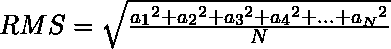

# JavaScript 中数组的有效值

> 原文:[https://www . geesforgeks . org/rms-JavaScript 数组值/](https://www.geeksforgeeks.org/rms-value-of-array-in-javascript/)

分布的均方根值是元素平方平均值的平方根。求均方根值的公式如下:



要计算一个数组的有效值，首先需要对数组中的所有元素进行平方。然后，取这些平方值的平均值，将其相加，除以元素数，最后取该数的平方根。

**示例:**

```
<script>

let CalculateRMS = function (arr) {

    // Map will return another array with each 
    // element corresponding to the elements of
    // the original array mapped according to
    // some relation
    let Squares = arr.map((val) => (val*val));

    // Function reduce the array to a value
    // Here, all the elements gets added to the first
    // element which acted as the accumulator initially.
    let Sum = Squares.reduce((acum, val) => (acum + val));

    Mean = Sum/arr.length;
    return Math.sqrt(Mean);
}

let arr = [5, 9, 3, -7, -4];

let Rms = CalculateRMS(arr);

document.write(Rms);
</script>                    
```

**输出:**

```
6
```

现在上面的脚本转换成单行脚本。要将上述脚本编写成一行，首先使用返回数组的 Map 函数将 arr 转换成另一个正方形数组。现在直接在数组上应用 reduce，它将返回一个值(所有平方的和)。数的平方和除以元素数，得到平方根。它将产生均方根值。

**示例:**

```
<script>
let CalculateRMS = (arr) => Math.sqrt(
            arr
                .map( val => (val * val))
                .reduce((acum, val) => acum + val)
            /arr.length
);

// The above can be written without any 
// line breaks in between as a single-line.
// For the sake of easy 
// understanding it is written like that.

let arr = [5, 9, 3, -7, -4];
let RMS = CalculateRMS(arr);
document.write(RMS);
</script>                    
```

**输出:**

```
6
```

**编写单行函数的好处**
代码越少，需要的内存就越少，因此任何网络浏览器用更少的内存加载脚本所需的时间就越少。此外，浏览器通过逐行执行代码来呈现网页，因此网站上任何涉及单行函数的操作都会比普通函数响应快得多。