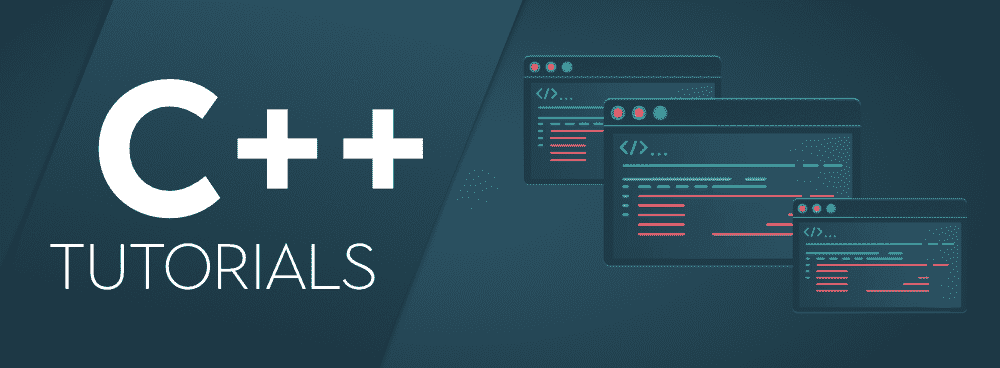
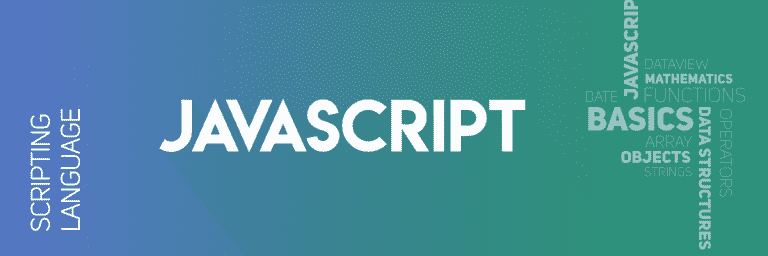
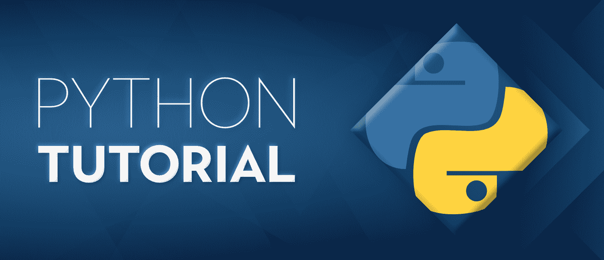
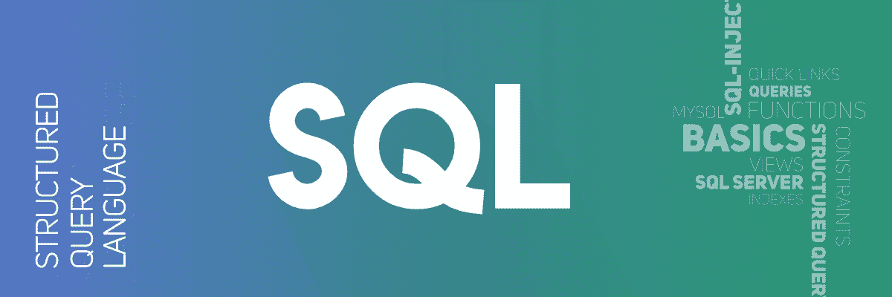
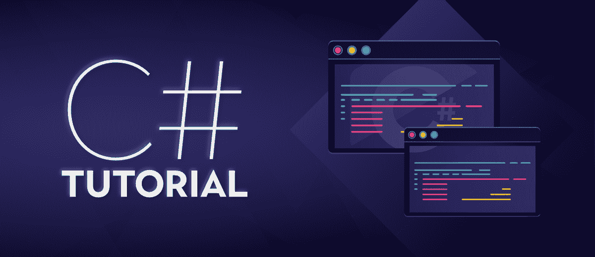

# 分号在各种编程语言中的作用

> 原文:[https://www . geesforgeks . org/各种编程语言中分号的作用/](https://www.geeksforgeeks.org/role-of-semicolon-in-various-programming-languages/)

**分号**为标点符号(；)表示停顿，通常在两个主分句之间，比逗号表示的停顿更明显。在编程中，分号符号起着至关重要的作用。它还用于显示各种编程语言中指令的终止，如 **C、C++、Java、JavaScript 和 Python** 。

在本文中，让我们看看分号在不同编程语言中的行为:

<u>分号在 C 语言中的作用:</u>

 <u>[](https://practice.geeksforgeeks.org/batch/aktu-1)

1.  分号是 c 语言中的结束语句。
2.  分号表示当前语句已经终止，后面的其他语句是新语句。
3.  C 语言中分号的使用将消除看代码时的歧义和混乱。
4.  它们不用于控制流语句之间，而是用于分隔循环中的条件。

    ```
    for(initialization/declaration;
        condition; 
        increment/decrements)
    {
        // body
    }

    ```

<u>分号在 C++中的作用:</u>

 <u>[](https://www.geeksforgeeks.org/cpp-tutorial/)

1.  分号是 C++中的一个命令。
2.  分号让编译器知道它已经到达命令的末尾。
3.  分号通常用于分隔 C++源代码的一个位，表示有意将其与相应的代码分开。
4.  分号在 C++中的用法是在类和结构定义、变量声明、函数声明之后，一般在每个语句之后。

<u>分号在 Java 中的作用:</u>

 <u>[](https://www.geeksforgeeks.org/java-tutorials/)

1.  Java 使用类似 c 的分号。
2.  分号是 Java 语法的一部分。
3.  它向编译器显示一条指令在哪里结束，下一条指令在哪里开始。
4.  分号通过让编译器知道指令的结束位置，允许 java 程序被写成一行或多行。

<u>分号在 JavaScript 中的作用:</u>

 <u>[](https://www.geeksforgeeks.org/javascript-tutorial/)

1.  JavaScript 中的分号是可选的。
2.  在 JavaScript 中，有一个叫做**自动分号插入(ASI)** 的过程，它会在需要时插入一个分号，但不会被放置。
3.  分号也用于终止语句。
4.  将新行放在前一行的旁边将产生有效的 JavaScript，这不会触发 ASI 纠正它。
5.  所以在像[这样的条件语句中，如果..else](https://www.geeksforgeeks.org/else-statement-javascript/) 和[循环语句如 while、for、do-while、](https://www.geeksforgeeks.org/loops-in-javascript/)不需要分号。

<u>分号在 Python 中的作用:</u>

 <u>[](https://www.geeksforgeeks.org/python-tutorial/)

1.  Python 不使用分号，但它不受限制。
2.  在 Python 中，分号不是用来表示行尾的。
3.  Python 被称为简单编码语言，因为不需要使用分号，即使我们忘记放置，它也不会抛出错误。
4.  有时 Python 使用分号作为行终止符，在这里分号被用作分隔符来分隔多行。

<u>分号在 Perl 中的作用:</u>

 <u>[](https://www.geeksforgeeks.org/perl-tutorial-learn-perl-with-examples/)

1.  Perl 语言在每行之后都使用分号，除了在块的末尾。
2.  Perl 让我们省略分号，因为它可以用作分隔符，而不是终止符。
3.  Perl 中的每条语句都以分号结束，除非它是程序的最后一行。

<u>分号在 SQL 中的作用:</u>

 <u>[](https://www.geeksforgeeks.org/sql-tutorial/)

1.  SQL 中的分号通过分隔数据库中的语句，允许用户在同一个调用中执行程序。
2.  SQL 有一个独特的功能，默认情况下添加分号来终止语句。
3.  分号是一个语句结束符，纯粹用于标识语句的结尾。
4.  一般来说，通过查看语法，我们可以识别，但是使用分号会使它更加清晰。

<u>分号在围棋语言中的作用:</u>

 <u>[](https://www.geeksforgeeks.org/golang-tutorial-learn-go-programming-language/)

1.  Go 语言中的分号用于分隔初始值设定项、条件和延续元素。
2.  当行的最后一个标记是:
    *   整数、浮点、虚数或字符串
    *   关键词之一(如中断、继续、返回等)..,)
    *   一个标识符。
    *   运算符和分隔符之一，如++、–、、]、或}

<u>分号在 C#中的作用:</u>

 <u>[](https://www.geeksforgeeks.org/csharp-programming-language/)

1.  C#使用分号来消除歧义和混乱，因为它的使用使代码清晰、结构化和有组织。
2.  像其他语言一样，尤其是 C 和 C++，C#在分号应用程序中也遵循相同的规则。
3.  分号的缺失会引发编译器的错误，必须予以纠正。
4.  它还让编译器知道语句的结尾。

<u>分号在 Scala 中的作用:</u>

 <u>[](https://www.geeksforgeeks.org/scala-tutorial-learn-scala-with-step-by-step-guide/)

1.  分号通过标记语句的结尾在所有编程语言中起着至关重要的作用。
2.  但是 Scala 中的分号，不仅标志着语句的结束，也标志着表达式的结束。
3.  Scala 的语法鼓励清晰简洁的代码，所以无论何时需要，都有必要正确使用分号。
4.  Scala 采用不同的语法，如点语法、使用大括号的语法、使用括号的语法和使用空行分隔符的语法，它取代了分号的使用。

<u>分号在 PL/I 中的作用:</u>

1.  <u>PL/I 是一种由一系列声明和语句组成的语言。所以分号有必要将语句分开，避免歧义。</u>
2.  <u>PL/I 语言中的语句应该用分号分开放置，以提高可读性。</u>
3.  <u>在多行语句中，分号用于分隔各行，在单行语句中，分号用于终止。</u>

<u><u>分号在帕斯卡中的作用:</u></u>

1.  <u><u>帕斯卡中的分号充当语句分隔符，即它分隔两个或多个语句。</u></u>
2.  <u><u>应该用一个分号来分隔两个语句。但是使用多个分号(额外的分号)会产生错误。</u></u>
3.  <u><u>与其他语言不同，帕斯卡以不同的方式使用分号。在帕斯卡中，没有必要在其他之前直接使用分号。此外，代码/程序结束前的最后一条语句不需要分号。</u></u>
4.  <u><u>当语句按顺序书写时，Pascal 需要分号。</u></u>
5.  <u><u>Pascal 不需要分号来表示大小写或块，也不需要分号来表示关键字。</u></u></u></u></u></u></u></u></u></u></u></u>