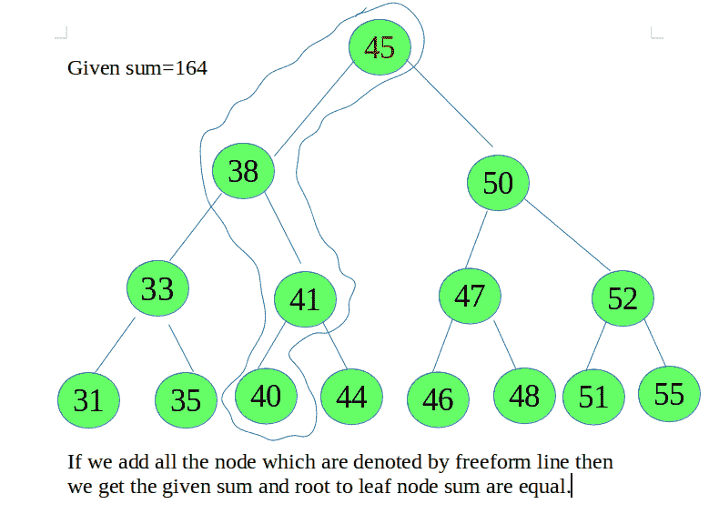

# 根到叶路径和等于 BST 中给定的数字

> 原文:[https://www . geeksforgeeks . org/根到叶路径总和等于给定数量 in-bst/](https://www.geeksforgeeks.org/root-to-leaf-path-sum-equal-to-a-given-number-in-bst/)

给定一个 BST 和一个数字。任务是检查给定的数字是否等于给定的[二叉查找树](https://www.geeksforgeeks.org/binary-search-tree-set-1-search-and-insertion/)中从根叶到叶路径的所有节点的总和。



**方法**:想法是从根到所有叶子以自上而下的方式遍历，保持一个 path[]数组来存储当前根到叶子的路径。遍历时，将当前路径的所有节点的数据存储在数组路径[]中。每当到达叶节点时，使用数组路径[]计算当前路径上所有节点的总和，并检查它是否等于给定的总和。
以下是上述办法的实施:

## C++

```
// CPP program to check if root to leaf path
// sum to a given number in BST

#include<bits/stdc++.h>
using namespace std;

// BST node
struct Node {
    int data;
    Node *left, *right;
};

/* Helper function that allocates a new node */
Node* newNode(int data)
{
    Node* node = (Node*)malloc(sizeof(Node));
    node->data = data;
    node->left = node->right = NULL;
    return (node);
}

// Function to check if root to leaf path
// sum to a given number in BST
int checkThesum(struct Node *root, int path[], int i, int sum)
{
    int sum1 = 0, x, y, j;

    if(root == NULL)
        return 0;

    // insert the data of a node
    path[i] = root->data;

    // if the node is leaf
    // add all the element in array
    if(root->left==NULL&&root->right==NULL)
    {
        for(j = 0; j <= i; j++)
            sum1 = sum1 + path[j];

        // if the sum of root node to leaf
        // node data is equal then return 1
        if(sum == sum1)
            return 1;
        else
            return 0;
    }

    x = checkThesum(root->left, path, i+1, sum);

    // if x is 1, it means the given sum is matched
    // with root to leaf node sum
    if(x==1)
        return 1;
    else
    {
        return checkThesum(root->right, path, i+1, sum);
    }
}

// Driver code
int main()
{
    int path[100], sum = 164;

    Node *root = newNode(45);
    root->left = newNode(38);
    root->left->left = newNode(33);
    root->left->left->left = newNode(31);
    root->left->left->right = newNode(35);
    root->left->right = newNode(41);
    root->left->right->left = newNode(40);
    root->left->right->right = newNode(44);
    root->right = newNode(50);
    root->right->left = newNode(47);
    root->right->left->left = newNode(46);
    root->right->left->right = newNode(48);
    root->right->right = newNode(52);
    root->right->right->left = newNode(51);
    root->right->right->right = newNode(55);

    if(checkThesum(root, path, 0, sum)==1)
        cout<<"YES\n";
    else
        cout<<"NO\n";

    return 0;
}
```

## Java 语言(一种计算机语言，尤用于创建网站)

```
// Java program to check if
// root to leaf path sum to
// a given number in BST
class GFG
{

// BST node
static class Node
{
    int data;
    Node left, right;
}

/* Helper function that
   allocates a new node */
static Node newNode(int data)
{
    Node node = new Node();
    node.data = data;
    node.left = node.right = null;
    return (node);
}

// Function to check if root
// to leaf path sum to a
// given number in BST
static int checkThesum(Node root, int path[],
                           int i, int sum)
{
    int sum1 = 0, x, y, j;

    if(root == null)
        return 0;

    // insert the data of a node
    path[i] = root.data;

    // if the node is leaf
    // add all the element in array
    if(root.left == null &&
       root.right == null)
    {
        for(j = 0; j <= i; j++)
            sum1 = sum1 + path[j];

        // if the sum of root node to leaf
        // node data is equal then return 1
        if(sum == sum1)
            return 1;
        else
            return 0;
    }

    x = checkThesum(root.left, path,
                        i + 1, sum);

    // if x is 1, it means the
    // given sum is matched with
    // root to leaf node sum
    if(x == 1)
        return 1;
    else
    {
        return checkThesum(root.right, path,
                                i + 1, sum);
    }
}

// Driver code
public static void main(String args[])
{
    int path[] = new int[100], sum = 164;

    Node root = newNode(45);
    root.left = newNode(38);
    root.left.left = newNode(33);
    root.left.left.left = newNode(31);
    root.left.left.right = newNode(35);
    root.left.right = newNode(41);
    root.left.right.left = newNode(40);
    root.left.right.right = newNode(44);
    root.right = newNode(50);
    root.right.left = newNode(47);
    root.right.left.left = newNode(46);
    root.right.left.right = newNode(48);
    root.right.right = newNode(52);
    root.right.right.left = newNode(51);
    root.right.right.right = newNode(55);

    if(checkThesum(root, path, 0, sum) == 1)
        System.out.print("YES\n");
    else
        System.out.print("NO\n");
}
}

// This code is contributed by Arnab Kundu
```

## 蟒蛇 3

```
# Python program to check if root to leaf path
# sum to a given number in BST
import math

# BST node
class Node:
    def __init__(self,data):
        self.data = data
        self.left = None
        self.right= None

# Helper function that allocates a new node */
def newNode(data):
    node = Node(data)
    node.data = data
    node.left = None
    node.right = None

    return node

# Function to check if root to leaf path
# sum to a given number in BST
def checkThesum(root, path, i, sum):
    sum1 = 0

    # x, y, j
    if(root == None):
        return 0

    # insert the data of a node
    path[i] = root.data

    # if the node is leaf
    # add all the element in array
    if(root.left == None and root.right == None):
        for j in range(0, i + 1):
            sum1 = sum1 + path[j]

        # if the sum of root node to leaf
        # node data is equal then return 1
        if(sum == sum1):
            return 1
        else:
            return 0

    x = checkThesum(root.left, path, i + 1, sum)

    # if x is 1, it means the given sum is matched
    # with root to leaf node sum
    if(x == 1):
        return 1
    else:
        return checkThesum(root.right, path, i + 1, sum)

# Driver code
if __name__=='__main__':

    path = [None] * 100
    sum = 164

    root = newNode(45)
    root.left = newNode(38)
    root.left.left = newNode(33)
    root.left.left.left = newNode(31)
    root.left.left.right = newNode(35)
    root.left.right = newNode(41)
    root.left.right.left = newNode(40)
    root.left.right.right = newNode(44)
    root.right = newNode(50)
    root.right.left = newNode(47)
    root.right.left.left = newNode(46)
    root.right.left.right = newNode(48)
    root.right.right = newNode(52)
    root.right.right.left = newNode(51)
    root.right.right.right = newNode(55)

    if(checkThesum(root, path, 0, sum) == 1):
        print("YES")
    else:
        print("NO")

# This code is contributed by Srathore
```

## C#

```
// C# program to check if
// root to leaf path sum to
// a given number in BST
using System;

class GFG
{

// BST node
public class Node
{
    public int data;
    public Node left, right;
}

/* Helper function that
allocates a new node */
static Node newNode(int data)
{
    Node node = new Node();
    node.data = data;
    node.left = node.right = null;
    return (node);
}

// Function to check if root
// to leaf path sum to a
// given number in BST
static int checkThesum(Node root, int []path,
                        int i, int sum)
{
    int sum1 = 0, x, y, j;

    if(root == null)
        return 0;

    // insert the data of a node
    path[i] = root.data;

    // if the node is leaf
    // add all the element in array
    if(root.left == null &&
    root.right == null)
    {
        for(j = 0; j <= i; j++)
            sum1 = sum1 + path[j];

        // if the sum of root node to leaf
        // node data is equal then return 1
        if(sum == sum1)
            return 1;
        else
            return 0;
    }

    x = checkThesum(root.left, path,
                        i + 1, sum);

    // if x is 1, it means the
    // given sum is matched with
    // root to leaf node sum
    if(x == 1)
        return 1;
    else
    {
        return checkThesum(root.right, path,
                                i + 1, sum);
    }
}

// Driver code
public static void Main(String []args)
{
    int []path = new int[100];int sum = 164;

    Node root = newNode(45);
    root.left = newNode(38);
    root.left.left = newNode(33);
    root.left.left.left = newNode(31);
    root.left.left.right = newNode(35);
    root.left.right = newNode(41);
    root.left.right.left = newNode(40);
    root.left.right.right = newNode(44);
    root.right = newNode(50);
    root.right.left = newNode(47);
    root.right.left.left = newNode(46);
    root.right.left.right = newNode(48);
    root.right.right = newNode(52);
    root.right.right.left = newNode(51);
    root.right.right.right = newNode(55);

    if(checkThesum(root, path, 0, sum) == 1)
        Console.Write("YES\n");
    else
        Console.Write("NO\n");
}
}

// This code is contributed 29AjayKumar
```

## java 描述语言

```
<script>

// Javascript program to check if
// root to leaf path sum to
// a given number in BST

// BST node
class Node
{
    constructor()
    {
        this.data = 0;
        this.left = null;
        this.right = null;
    }
}

/* Helper function that
allocates a new node */
function newNode(data)
{
    var node = new Node();
    node.data = data;
    node.left = node.right = null;
    return (node);
}

// Function to check if root
// to leaf path sum to a
// given number in BST
function checkThesum(root, path, i, sum)
{
    var sum1 = 0, x, y, j;

    if(root == null)
        return 0;

    // insert the data of a node
    path[i] = root.data;

    // if the node is leaf
    // add all the element in array
    if(root.left == null &&
    root.right == null)
    {
        for(j = 0; j <= i; j++)
            sum1 = sum1 + path[j];

        // if the sum of root node to leaf
        // node data is equal then return 1
        if(sum == sum1)
            return 1;
        else
            return 0;
    }

    x = checkThesum(root.left, path,
                        i + 1, sum);

    // if x is 1, it means the
    // given sum is matched with
    // root to leaf node sum
    if(x == 1)
        return 1;
    else
    {
        return checkThesum(root.right, path,
                                i + 1, sum);
    }
}

// Driver code
var path = Array(100);
var sum = 164;

var root = newNode(45);
root.left = newNode(38);
root.left.left = newNode(33);
root.left.left.left = newNode(31);
root.left.left.right = newNode(35);
root.left.right = newNode(41);
root.left.right.left = newNode(40);
root.left.right.right = newNode(44);
root.right = newNode(50);
root.right.left = newNode(47);
root.right.left.left = newNode(46);
root.right.left.right = newNode(48);
root.right.right = newNode(52);
root.right.right.left = newNode(51);
root.right.right.right = newNode(55);

if(checkThesum(root, path, 0, sum) == 1)
    document.write("YES<br>");
else
    document.write("NO<br>");

// This code is contributed by itsok.
</script>
```

**Output:** 

```
YES
```