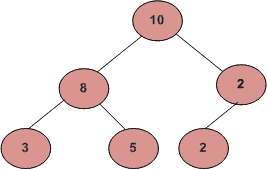

# 根到叶的路径和等于给定的数

> 原文:[https://www . geesforgeks . org/根到叶路径总和等于给定数字/](https://www.geeksforgeeks.org/root-to-leaf-path-sum-equal-to-a-given-number/)

给定一棵二叉树和一个数，如果该树有一个从根到叶的路径，使得沿着该路径的所有值相加等于给定的数，则返回 true。如果找不到这样的路径，则返回 false。



例如，在上面的树中，从根到叶的路径存在以下总和。
21–>10–8–3
23–>10–8–5
14–>10–2–2
因此返回值应该只对数字 21、23 和 14 为真。对于任何其他数字，返回值应为 false。

算法:
递归检查左或右子节点的路径和是否等于(数字–当前节点的值)
实现:

## C++

```
#include <bits/stdc++.h>
using namespace std;
#define bool int

/* A binary tree node has data, pointer to left child
and a pointer to right child */
class node
{
    public:
    int data;
    node* left;
    node* right;
};

/*
Given a tree and a sum, return true if there is a path from the root
down to a leaf, such that adding up all the values along the path
equals the given sum.

Strategy: subtract the node value from the sum when recurring down,
and check to see if the sum is 0 when you when you reach the leaf node.
*/
bool hasPathSum(node* Node, int sum)
{

  bool ans = 0;

  int subSum = sum - Node->data;

  /* If we reach a leaf node and sum becomes 0 then return true*/
  if ( subSum == 0 && Node->left == NULL && Node->right == NULL )
    return 1;

  /* otherwise check both subtrees */
  if(Node->left)
    ans = ans || hasPathSum(Node->left, subSum);
  if(Node->right)
    ans = ans || hasPathSum(Node->right, subSum);

  return ans;

}

/* UTILITY FUNCTIONS */
/* Helper function that allocates a new node with the
given data and NULL left and right pointers. */
node* newnode(int data)
{
    node* Node = new node();
    Node->data = data;
    Node->left = NULL;
    Node->right = NULL;

    return(Node);
}

// Driver Code
int main()
{

    int sum = 21;

    /* Constructed binary tree is
                10
            / \
            8 2
        / \ /
        3 5 2
    */
    node *root = newnode(10);
    root->left = newnode(8);
    root->right = newnode(2);
    root->left->left = newnode(3);
    root->left->right = newnode(5);
    root->right->left = newnode(2);

    if(hasPathSum(root, sum))
        cout << "There is a root-to-leaf path with sum " << sum;
    else
        cout << "There is no root-to-leaf path with sum " << sum;

    return 0;
}

// This code is contributed by rathbhupendra
```

## C

```
#include <stdio.h>
#include <stdlib.h>
#define bool int

/* A binary tree node has data, pointer to left child
   and a pointer to right child */
struct node {
    int data;
    struct node* left;
    struct node* right;
};

/*
 Given a tree and a sum, return
 true if there is a path from
 the root down to a leaf, such
 that adding up all the values
 along the path equals the given sum.

 Strategy: subtract the node
 value from the sum when
 recurring down, and check to
 see if the sum is 0 when you reach the leaf node.
*/
bool hasPathSum(struct node* node, int sum)
{

  bool ans = 0;

  int subSum = sum - node->data;

  /* If we reach a leaf node
        and sum becomes 0 then
         * return true*/
  if (subSum == 0 && node->left == NULL
      && node->right == NULL)
    return 1;

  /* otherwise check both subtrees */
  if (node->left)
    ans = ans
    || hasPathSum(node->left, subSum);
  if (node->right)
    ans = ans
    || hasPathSum(node->right, subSum);

  return ans;

}

/* UTILITY FUNCTIONS */
/* Helper function that
   allocates a new node with the
   given data and NULL left
   and right pointers. */
struct node* newnode(int data)
{
    struct node* node
        = (struct node*)malloc(sizeof(struct node));
    node->data = data;
    node->left = NULL;
    node->right = NULL;

    return (node);
}

// Driver Code
int main()
{

    int sum = 21;

    /* Constructed binary tree is
              10
            /   \
          8      2
        /  \    /
      3     5  2
    */
    struct node* root = newnode(10);
    root->left = newnode(8);
    root->right = newnode(2);
    root->left->left = newnode(3);
    root->left->right = newnode(5);
    root->right->left = newnode(2);

    if (hasPathSum(root, sum))
        printf("There is a root-to-leaf path with sum %d",
               sum);
    else
        printf("There is no root-to-leaf path with sum %d",
               sum);

    getchar();
    return 0;
}
```

## Java 语言(一种计算机语言，尤用于创建网站)

```
// Java program to print
// root to leaf path sum
// equal to a given number

/* A binary tree node has data,
 pointer to left child
   and a pointer to right child */
class Node {
    int data;
    Node left, right;

    Node(int item)
    {
        data = item;
        left = right = null;
    }
}

class BinaryTree {

    Node root;

    /*
     Given a tree and a sum,
     return true if there is a path
     from the root down to a leaf,
     such that adding up all
     the values along the path
     equals the given sum.

     Strategy: subtract the node
     value from the sum when
     recurring down, and check to
     see if the sum is 0 you reach the leaf node.
     */

    boolean hasPathSum(Node node, int sum)
    {
      boolean ans = false;
      int subSum = sum - node.data;
      if(subSum == 0 && node.left == null && node.right == null)
        return(ans = true);
      if(node.left != null) 

        // ans || hasPathSum... has no utility if the ans is false
        ans = ans || hasPathSum(node.left, subSum);       

      if(node.right != null)

        // But if it is true then we can avoid calling hasPathSum
        // here as answer has already been found
        ans = ans || hasPathSum(node.right, subSum);   
      return(ans);
    }

    // Driver Code
    public static void main(String args[])
    {
        int sum = 21;

        /* Constructed binary tree is
              10
             /  \
           8     2
          / \   /
         3   5 2
        */
        BinaryTree tree = new BinaryTree();
        tree.root = new Node(10);
        tree.root.left = new Node(8);
        tree.root.right = new Node(2);
        tree.root.left.left = new Node(3);
        tree.root.left.right = new Node(5);
        tree.root.right.left = new Node(2);

        if (tree.hasPathSum(tree.root, sum))
            System.out.println(
                "There is a root to leaf path with sum "
                + sum);
        else
            System.out.println(
                "There is no root to leaf path with sum "
                + sum);
    }
}

// This code has been contributed by Mayank
// Jaiswal(mayank_24)
```

## 计算机编程语言

```
# Python program to find if
# there is a root to sum path

# A binary tree node

class Node:

    # Constructor to create a new node
    def __init__(self, data):
        self.data = data
        self.left = None
        self.right = None

"""
 Given a tree and a sum, return
 true if there is a path from the root
 down to a leaf, such that
 adding up all the values along the path
 equals the given sum.

 Strategy: subtract the node
 value from the sum when recurring down,
 and check to see if the sum
 is 0 when you run out of tree.
"""
# s is the sum

def hasPathSum(node, s):
        ans = 0
        subSum = s - node.data

        # If we reach a leaf node and sum becomes 0, then
        # return True
        if(subSum == 0 and node.left == None and node.right == None):
            return True

        # Otherwise check both subtrees
        if node.left is not None:
            ans = ans or hasPathSum(node.left, subSum)
        if node.right is not None:
            ans = ans or hasPathSum(node.right, subSum)

        return ans

# Driver Code

s = 21
root = Node(10)
root.left = Node(8)
root.right = Node(2)
root.left.right = Node(5)
root.left.left = Node(3)
root.right.left = Node(2)

if hasPathSum(root, s):
    print "There is a root-to-leaf path with sum %d" % (s)
else:
    print "There is no root-to-leaf path with sum %d" % (s)

# This code is contributed by Nikhil Kumar Singh(nickzuck_007)
```

## C#

```
// C# program to print root to
// leaf path sum equal to a given number
using System;

/* A binary tree node has data, pointer
to left child and a pointer to right child */
public class Node {
    public int data;
    public Node left, right;

    public Node(int item)
    {
        data = item;
        left = right = null;
    }
}

class GFG {
    public Node root;

    /*
    Given a tree and a sum, return true if
    there is a path from the root down to a
    leaf, such that adding up all the values
    along the path equals the given sum.

    Strategy: subtract the node value from the
    sum when recurring down, and check to see
    if the sum is 0 when you you reach the leaf node..
    */

    public virtual bool haspathSum(Node node, int sum)
    {
      ans = false;

      int subsum = sum - node.data;
      if (subsum == 0 && node.left == null
          && node.right == null) {
        return true;
      }

      /* otherwise check both subtrees */
      if (node.left != null) {
        ans = ans || haspathSum(node.left, subsum);
      }
      if (node.right != null) {
        ans = ans || haspathSum(node.right, subsum);
      }
      return ans;

    }

    // Driver Code
    public static void Main(string[] args)
    {
        int sum = 21;

        /* Constructed binary tree is
            10
            / \
        8     2
        / \ /
        3 5 2
        */
        GFG tree = new GFG();
        tree.root = new Node(10);
        tree.root.left = new Node(8);
        tree.root.right = new Node(2);
        tree.root.left.left = new Node(3);
        tree.root.left.right = new Node(5);
        tree.root.right.left = new Node(2);

        if (tree.haspathSum(tree.root, sum)) {
            Console.WriteLine("There is a root to leaf "
                              + "path with sum " + sum);
        }
        else {
            Console.WriteLine("There is no root to leaf "
                              + "path with sum " + sum);
        }
    }
}

// This code is contributed by Shrikant13
```

## java 描述语言

```
<script>
// javascript program to print
// root to leaf path sum
// equal to a given number

/* A binary tree node has data,
 pointer to left child
   and a pointer to right child */

class Node {
        constructor(val) {
            this.data = val;
            this.left = null;
            this.right = null;
        }
    }

var root;

    /*
     Given a tree and a sum,
     return true if there is a path
     from the root down to a leaf,
     such that adding up all
     the values along the path
     equals the given sum.

     Strategy: subtract the node
     value from the sum when
     recurring down, and check to
     see if the sum is 0 you reach the leaf node.
     */

    function hasPathSum(node , sum)
    {
      var ans = false;
      var subSum = sum - node.data;
      if(subSum == 0 && node.left == null && node.right == null)
        return(ans = true);
      if(node.left != null) 

        // ans || hasPathSum... has no utility if the ans is false
        ans = ans || hasPathSum(node.left, subSum);       

      if(node.right != null)

        // But if it is true then we can afunction calling hasPathSum
        // here as answer has already been found
        ans = ans || hasPathSum(node.right, subSum);   
      return(ans);
    }

    // Driver Code

        var sum = 21;

        /* Constructed binary tree is
              10
             /  \
           8     2
          / \   /
         3   5 2
        */

        var root = new Node(10);
        root.left = new Node(8);
        root.right = new Node(2);
        root.left.left = new Node(3);
        root.left.right = new Node(5);
        root.right.left = new Node(2);

        if (hasPathSum(root, sum))
            document.write(
                "There is a root to leaf path with sum "
                + sum);
        else
            document.write(
                "There is no root to leaf path with sum "
                + sum);

// This code is contributed by gauravrajput1
</script>
```

**Output**

```
There is a root-to-leaf path with sum 21
```

**时间复杂度** : O(n)
**参考文献**:[http://cslibrary.stanford.edu/110/BinaryTrees.html](http://cslibrary.stanford.edu/110/BinaryTrees.html)
作者:图沙·罗伊

如果发现以上代码/算法有任何 bug，请写评论，或者找其他方法解决同样的问题