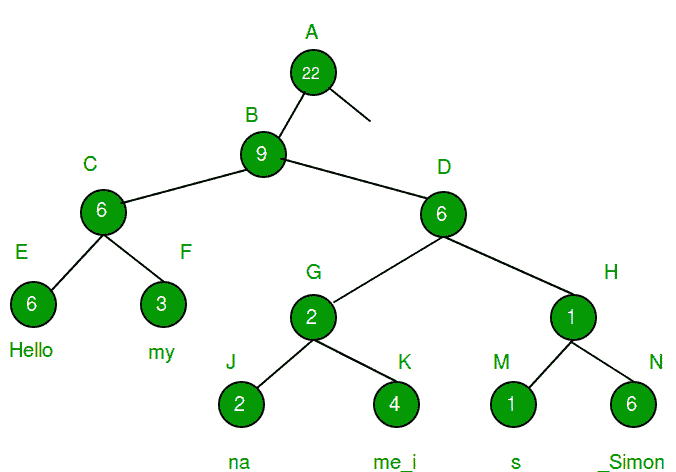
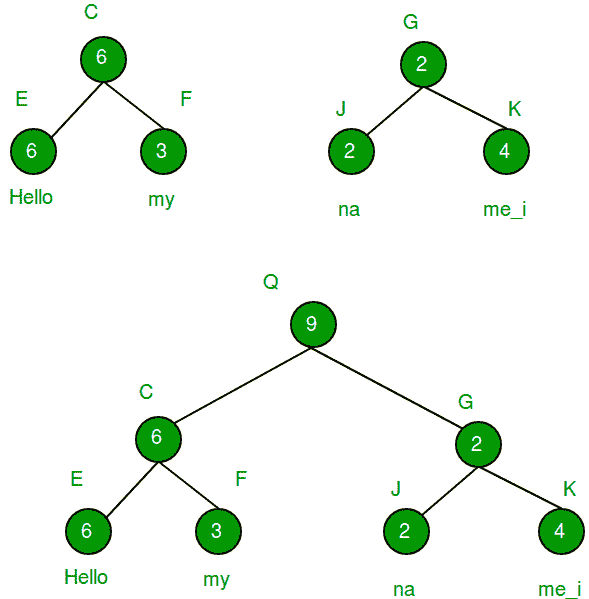

# 绳索数据结构(快速字符串连接)

> 原文:[https://www . geesforgeks . org/ropes-data-structure-fast-string-concation/](https://www.geeksforgeeks.org/ropes-data-structure-fast-string-concatenation/)

对字符串最常见的操作之一是追加或连接。当字符串以传统方式(即字符数组)存储时，追加到字符串末尾将花费最少 O(n)个时间(其中 n 是原始字符串的长度)。
我们可以通过追加使用绳索数据结构来减少花费的时间。

**Ropes Data Structure**

绳子是一种二叉树结构，其中除叶节点外的每个节点 ***包含出现在该节点左侧的字符数*** 。叶节点包含分成子串的实际字符串(这些子串的大小可以由用户决定)。
请看下图。



该图显示了字符串是如何存储在内存中的。每个叶节点包含原始字符串的子字符串，所有其他节点包含出现在该节点左侧的字符数。将字符数存储在左边的想法是为了最大限度地降低查找第 I 个位置的字符的成本。
T1】优势 T3】1。绳索大大降低了附加两根绳子的成本。
2。与数组不同，绳索不需要大的连续内存分配。
3。绳索不需要额外的内存来执行插入/删除/搜索等操作。
4。如果用户想要撤销上一次连接，他可以在 O(1)时间内通过移除树的根节点来完成。
**弊**
1。源代码的复杂性增加了。
2。虫子的可能性更大。
3。存储父节点需要额外的内存。
4。访问第一个字符的时间增加。
**现在我们来看一个情况，解释为什么 Ropes 是单片字符串数组的良好替代品。**
给定两个字符串 a[]和 b[]。将它们连接成第三个字符串 c[]。
示例:

```
Input  : a[] = "This is ", b[] = "an apple"
Output : "This is an apple"

Input  : a[] = "This is ", b[] = "geeksforgeeks"
Output : "This is geeksforgeeks"
```

**Method 1 (Naive method)**

我们创建一个字符串 c[]来存储串联的字符串。我们首先遍历[]并将[]的所有字符复制到 c[]。然后我们将 b[]的所有字符复制到 c[]。

## C++

```
// Simple C++ program to concatenate two strings
#include <iostream>
using namespace std;

// Function that concatenates strings a[0..n1-1]
// and b[0..n2-1] and stores the result in c[]
void concatenate(char a[], char b[], char c[],
                              int n1, int n2)
{
    // Copy characters of A[] to C[]
    int i;
    for (i=0; i<n1; i++)
        c[i] = a[i];

    // Copy characters of B[]
    for (int j=0; j<n2; j++)
        c[i++] = b[j];

    c[i] = '\0';
}

// Driver code
int main()
{
    char a[] =  "Hi This is geeksforgeeks. ";
    int n1 = sizeof(a)/sizeof(a[0]);

    char b[] =  "You are welcome here.";
    int n2 = sizeof(b)/sizeof(b[0]);

    // Concatenate a[] and b[] and store result
    // in c[]
    char c[n1 + n2 - 1];
    concatenate(a, b, c, n1, n2);
    for (int i=0; i<n1+n2-1; i++)
        cout << c[i];

    return 0;
}
```

## Java 语言(一种计算机语言，尤用于创建网站)

```
//Java program to concatenate two strings

class GFG {

    // Function that concatenates strings a[0..n1-1]
    // and b[0..n2-1] and stores the result in c[]
    static void concatenate(char a[], char b[], char c[],
            int n1, int n2) {
        // Copy characters of A[] to C[]
        int i;
        for (i = 0; i < n1; i++) {
            c[i] = a[i];
        }

        // Copy characters of B[]
        for (int j = 0; j < n2; j++) {
            c[i++] = b[j];
        }

    }

    // Driver code
    public static void main(String[] args) {
        char a[] = "Hi This is geeksforgeeks. ".toCharArray();
        int n1 = a.length;

        char b[] = "You are welcome here.".toCharArray();
        int n2 = b.length;

        // Concatenate a[] and b[] and store result
        // in c[]
        char c[] = new char[n1 + n2];
        concatenate(a, b, c, n1, n2);
        for (int i = 0; i < n1 + n2 - 1; i++) {
            System.out.print(c[i]);
        }

    }
}
// This code is contributed by PrinciRaj1992
```

## 蟒蛇 3

```
# Python3 program to concatenate two strings

# Function that concatenates strings a[0..n1-1]
# and b[0..n2-1] and stores the result in c[]
def concatenate(a, b, c, n1, n2):

    # Copy characters of A[] to C[]
    i = -1
    for i in range(n1):
        c[i] = a[i]

    # Copy characters of B[]
    for j in range(n2):
        c[i] = b[j]
        i += 1

# Driver Code
if __name__ == "__main__":
    a = "Hi This is geeksforgeeks. "
    n1 = len(a)

    b = "You are welcome here."
    n2 = len(b)

    a = list(a)
    b = list(b)

    # Concatenate a[] and b[] and
    # store result in c[]
    c = [0] * (n1 + n2 - 1)

    concatenate(a, b, c, n1, n2)

    for i in c:
        print(i, end = "")

# This code is contributed by
# sanjeev2552
```

## C#

```
// C# program to concatenate two strings
using System;

public class GFG {

    // Function that concatenates strings a[0..n1-1]
    // and b[0..n2-1] and stores the result in c[]
    static void concatenate(char []a, char []b, char []c,
            int n1, int n2) {
        // Copy characters of A[] to C[]
        int i;
        for (i = 0; i < n1; i++) {
            c[i] = a[i];
        }

        // Copy characters of B[]
        for (int j = 0; j < n2; j++) {
            c[i++] = b[j];
        }

    }

    // Driver code
    public static void Main() {
        char []a = "Hi This is geeksforgeeks. ".ToCharArray();
        int n1 = a.Length;

        char []b = "You are welcome here.".ToCharArray();
        int n2 = b.Length;

        // Concatenate a[] and b[] and store result
        // in c[]
        char []c = new char[n1 + n2];
        concatenate(a, b, c, n1, n2);
        for (int i = 0; i < n1 + n2 - 1; i++) {
            Console.Write(c[i]);
        }

    }
}
/*This code is contributed by PrinciRaj1992*/
```

**输出:**

```
Hi This is geeksforgeeks. You are welcome here
```

时间复杂度: **O(n)**
现在我们试着用 Ropes 来解决同样的问题。

**Method 2 (Rope structure method)**

这种绳索结构可以用来在恒定时间内连接两根绳子。
1。创建新的根节点(存储新连接字符串的根)
2。标记此节点的左子节点，即最先出现的字符串的根。
3。标记该节点的右子节点，即第二个出现的字符串的根。
就这样。由于这种方法只需要制作一个新的节点，所以它的复杂度是 **O(1)** 。
考虑下图(图片来源:https://en . Wikipedia . org/wiki/Rope _(data _ structure))



## 卡片打印处理机（Card Print Processor 的缩写）

```
// C++ program to concatenate two strings using
// rope data structure.
#include <bits/stdc++.h>
using namespace std;

// Maximum no. of characters to be put in leaf nodes
const int LEAF_LEN = 2;

// Rope structure
class Rope
{
public:
    Rope *left, *right, *parent;
    char *str;
    int lCount;
};

// Function that creates a Rope structure.
// node --> Reference to pointer of current root node
//   l  --> Left index of current substring (initially 0)
//   r  --> Right index of current substring (initially n-1)
//   par --> Parent of current node (Initially NULL)
void createRopeStructure(Rope *&node, Rope *par,
                         char a[], int l, int r)
{
    Rope *tmp = new Rope();
    tmp->left = tmp->right = NULL;

    // We put half nodes in left subtree
    tmp->parent = par;

    // If string length is more
    if ((r-l) > LEAF_LEN)
    {
        tmp->str = NULL;
        tmp->lCount = (r-l)/2;
        node = tmp;
        int m = (l + r)/2;
        createRopeStructure(node->left, node, a, l, m);
        createRopeStructure(node->right, node, a, m+1, r);
    }
    else
    {
        node = tmp;
        tmp->lCount = (r-l);
        int j = 0;
        tmp->str = new char[LEAF_LEN];
        for (int i=l; i<=r; i++)
            tmp->str[j++] = a[i];
    }
}

// Function that prints the string (leaf nodes)
void printstring(Rope *r)
{
    if (r==NULL)
        return;
    if (r->left==NULL && r->right==NULL)
        cout << r->str;
    printstring(r->left);
    printstring(r->right);
}

// Function that efficiently concatenates two strings
// with roots root1 and root2 respectively. n1 is size of
// string represented by root1.
// root3 is going to store root of concatenated Rope.
void concatenate(Rope *&root3, Rope *root1, Rope *root2, int n1)
{
    // Create a new Rope node, and make root1
    // and root2 as children of tmp.
    Rope *tmp = new Rope();
    tmp->parent = NULL;
    tmp->left = root1;
    tmp->right = root2;
    root1->parent = root2->parent = tmp;
    tmp->lCount = n1;

    // Make string of tmp empty and update
    // reference r
    tmp->str = NULL;
    root3 = tmp;
}

// Driver code
int main()
{
    // Create a Rope tree for first string
    Rope *root1 = NULL;
    char a[] =  "Hi This is geeksforgeeks. ";
    int n1 = sizeof(a)/sizeof(a[0]);
    createRopeStructure(root1, NULL, a, 0, n1-1);

    // Create a Rope tree for second string
    Rope *root2 = NULL;
    char b[] =  "You are welcome here.";
    int n2 = sizeof(b)/sizeof(b[0]);
    createRopeStructure(root2, NULL, b, 0, n2-1);

    // Concatenate the two strings in root3.
    Rope *root3 = NULL;
    concatenate(root3, root1, root2, n1);

    // Print the new concatenated string
    printstring(root3);
    cout << endl;
    return 0;
}
```

**输出:**

```
Hi This is geeksforgeeks. You are welcome here.
```

**时间复杂度** : O(1)
本文由**阿基尔·戈尔**供稿。如果你喜欢 GeeksforGeeks 并想投稿，你也可以使用[write.geeksforgeeks.org](https://write.geeksforgeeks.org)写一篇文章或者把你的文章邮寄到 review-team@geeksforgeeks.org。看到你的文章出现在极客博客主页上，帮助其他极客。
如果发现有不正确的地方，或者想分享更多关于上述话题的信息，请写评论。