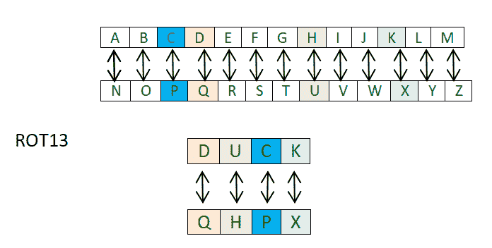

# ROT13 密码

> 原文:[https://www.geeksforgeeks.org/rot13-cipher/](https://www.geeksforgeeks.org/rot13-cipher/)

ROT13 密码(读作–“旋转 13 位”)是[凯撒密码](https://www.geeksforgeeks.org/caesar-cipher/)的一个特例，其中的班次始终为 13。
所以每个字母都要移动 13 个位置来加密或解密信息。



我
你一定认为这只是另一个凯撒密码那么*这次有什么不同？*不同之处在于它的实施。方法是使用两个独立的 python 字典。

1.  首先根据字母在英文字母中的位置查找不同的字母，得到移位的数字
2.  第二步，得到对应于这些移位数字的字母。

**代码:**

## 计算机编程语言

```
# Python program to implement
# ROT13 Caesar cipher

'''This script uses dictionaries instead of 'chr()' & 'ord()' function'''

# Dictionary to lookup the index of alphabets
dict1 = {'A' : 1, 'B' : 2, 'C' : 3, 'D' : 4, 'E' : 5,
        'F' : 6, 'G' : 7, 'H' : 8, 'I' : 9, 'J' : 10,
        'K' : 11, 'L' : 12, 'M' : 13, 'N' : 14, 'O' : 15,
        'P' : 16, 'Q' : 17, 'R' : 18, 'S' : 19, 'T' : 20,
        'U' : 21, 'V' : 22, 'W' : 23, 'X' : 24, 'Y' : 25, 'Z' : 26}

# Dictionary to lookup alphabets
# corresponding to the index after shift
dict2 = {0 : 'Z', 1 : 'A', 2 : 'B', 3 : 'C', 4 : 'D', 5 : 'E',
        6 : 'F', 7 : 'G', 8 : 'H', 9 : 'I', 10 : 'J',
        11 : 'K', 12 : 'L', 13 : 'M', 14 : 'N', 15 : 'O',
        16 : 'P', 17 : 'Q', 18 : 'R', 19 : 'S', 20 : 'T',
        21 : 'U', 22 : 'V', 23 : 'W', 24 : 'X', 25 : 'Y'}

# Function to encrypt the string
# according to the shift provided
def encrypt(message, shift):
    cipher = ''
    for letter in message:
        # checking for space
        if(letter != ' '):
            # looks up the dictionary and
            # adds the shift to the index
            num = ( dict1[letter] + shift ) % 26
            # looks up the second dictionary for
            # the shifted alphabets and adds them
            cipher += dict2[num]
        else:
            # adds space
            cipher += ' '

    return cipher

# Function to decrypt the string
# according to the shift provided
def decrypt(message, shift):
    decipher = ''
    for letter in message:
        # checks for space
        if(letter != ' '):
            # looks up the dictionary and
            # subtracts the shift to the index
            num = ( dict1[letter] - shift + 26) % 26
            # looks up the second dictionary for the
            # shifted alphabets and adds them
            decipher += dict2[num]
        else:
            # adds space
            decipher += ' '

    return decipher

# driver function to run the program
def main():
    # use 'upper()' function to convert any lowercase characters to uppercase
    message = "GEEKS FOR GEEKS"
    shift = 13
    result = encrypt(message.upper(), shift)
    print (result)

    message = "TRRXF SBE TRRXF"
    shift = 13
    result = decrypt(message.upper(), shift)
    print (result)

# Executes the main function
if __name__ == '__main__':
    main()
```

## C++

```
// CPP program to implement
// ROT13 Caesar Cipher

#include<bits/stdc++.h>
using namespace std;

// Map to lookup the index of alphabets
map <char,int> dict1;

// Map to lookup alphabets corresponding
// to the index after shift
map <int,char> dict2;

// Function to create map to lookup
void create_dict()
{
    for(int i = 1; i < 27; i++)
        dict1[char(64 + i)] = i;

    dict2[0] = 'Z';

    for(int i = 1; i < 26; i++)
        dict2[i] = char(64 + i);

    return;
}

// Function to encrypt the string
// according to the shift provided
string encrypt(string message, int shift)
{
    string cipher = "";
    for(int i = 0; i < message.size(); i++)
    {
        // Checking for namespace
        if(message[i] != ' ')
        {
            // looks up the map and
            // adds the shift to the index
            int num = (dict1[message[i]] + shift) % 26;

            // looks up the second map for the
            // shifted alphabets and adds them
            cipher += dict2[num];
        }
        else
        {
            // adds space
            cipher += " ";
        }
    }
    return cipher;
}

// Function to decrypt the string
// according to the shift provided
string decrypt(string message, int shift)
{
    string decipher = "";
    for(int i = 0; i < message.size(); i++)
    {
        // checks for space
        if(message[i] != ' ')
        {
            // looks up the map and
            // subtracts the shift to the index
            int num = (dict1[message[i]] - shift + 26) % 26;
            // looks up the second map for the
            // shifted alphabets and adds them
            decipher += dict2[num];
        }
        else
        {
            // adds space
            decipher += " ";
        }
    }
    return decipher;
}

// Driver code
int main()
{
    create_dict();

    string message = "GEEKS FOR GEEKS";
    int shift = 13;

    cout << encrypt(message, shift) << "\n";

    message = "TRRXF SBE TRRXF";
    shift = 13;

    cout << decrypt(message, shift) << "\n";

    return 0;
}
// This code is contributed by Sachin Bisht
```

```
Output :
TRRXF SBE TRRXF
GEEKS FOR GEEKS
```

**分析:**ROT13 密码不太安全，因为它只是凯撒密码的特例。凯撒密码可以通过频率分析或通过尝试所有 25 个密钥来破解，而 ROT13 密码可以通过将字母移动 13 位来破解。因此没有实际用途。
**应用:** ROT13 在 20 世纪 80 年代早期就在网络笑话新闻组中使用。
本文由 [Palash Nigam](https://www.linkedin.com/in/palash25) 供稿。如果你喜欢 GeeksforGeeks 并想投稿，你也可以用[write.geeksforgeeks.org](http://www.write.geeksforgeeks.org)写一篇文章或者把你的文章邮寄到 review-team@geeksforgeeks.org。看到你的文章出现在极客博客主页上，帮助其他极客。
如果发现有不正确的地方，或者想分享更多关于上述话题的信息，请写评论。