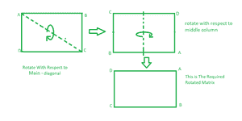
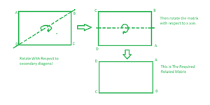

# 在不使用任何额外空间的情况下，将矩阵顺时针旋转 90 度

> 原文:[https://www . geesforgeks . org/顺时针旋转矩阵 90 度，不使用任何额外空间/](https://www.geeksforgeeks.org/rotate-a-matrix-by-90-degree-in-clockwise-direction-without-using-any-extra-space/)

给定一个正方形矩阵，在不使用任何额外空间的情况下，将其顺时针旋转 90 度。

**示例:**

```
Input:
1 2 3 
4 5 6
7 8 9  
Output:
7 4 1 
8 5 2
9 6 3

Input:
1 2
3 4
Output:
3 1
4 2 
```

**方法 1**

**方法:**方法类似于[在原地将正方形矩阵旋转 90 度|设置 1](https://www.geeksforgeeks.org/inplace-rotate-square-matrix-by-90-degrees/) 。唯一不同的是以顺时针方向打印周期的元素，即一个 N×N 矩阵将有地板(N/2)平方周期。
例如，一个 3 X 3 矩阵将有 1 个周期。循环由其第一行、最后一列、最后一行和第一列组成。
对于每个平方周期，我们以顺时针方向交换矩阵中相应单元所涉及的元素。我们只需要一个临时变量。

**说明:**

> 让行和列的大小为 3。
> **在第一次迭代期间–**
> a[I][j]=第一个索引处的元素(最左上角)= 1。
> a[j][n-1-i]=最右上角的元素= 3。
> a[n-1-i][n-1-j] =最右下角底元素= 9。
> a[n-1-j][i] =最左角底元素= 7。
> 顺时针方向移动这些元素。
> **在第二次迭代期间–**
> a[I][j]= 2。
> a[j][n-1-i] = 6。
> a[n-1-i][n-1-j] = 8。
> a[n-1-j][i] = 4。
> 同样，顺时针方向移动这些元素。

下面是上述方法的实现:

## C++

```
// C++ implementation of above approach
#include <bits/stdc++.h>
using namespace std;

#define N 4

// Function to rotate the matrix 90 degree clockwise
void rotate90Clockwise(int a[N][N])
{

    // Traverse each cycle
    for (int i = 0; i < N / 2; i++) {
        for (int j = i; j < N - i - 1; j++) {

            // Swap elements of each cycle
            // in clockwise direction
            int temp = a[i][j];
            a[i][j] = a[N - 1 - j][i];
            a[N - 1 - j][i] = a[N - 1 - i][N - 1 - j];
            a[N - 1 - i][N - 1 - j] = a[j][N - 1 - i];
            a[j][N - 1 - i] = temp;
        }
    }
}

// Function for print matrix
void printMatrix(int arr[N][N])
{
    for (int i = 0; i < N; i++) {
        for (int j = 0; j < N; j++)
            cout << arr[i][j] << " ";
        cout << '\n';
    }
}

// Driver code
int main()
{
    int arr[N][N] = { { 1, 2, 3, 4 },
                      { 5, 6, 7, 8 },
                      { 9, 10, 11, 12 },
                      { 13, 14, 15, 16 } };
    rotate90Clockwise(arr);
    printMatrix(arr);
    return 0;
}
```

## Java 语言(一种计算机语言，尤用于创建网站)

```
// Java implementation of above approach
import java.io.*;

class GFG
{

static int N = 4;

// Function to rotate the matrix 90 degree clockwise
static void rotate90Clockwise(int a[][])
{

    // Traverse each cycle
    for (int i = 0; i < N / 2; i++)
    {
        for (int j = i; j < N - i - 1; j++)
        {

            // Swap elements of each cycle
            // in clockwise direction
            int temp = a[i][j];
            a[i][j] = a[N - 1 - j][i];
            a[N - 1 - j][i] = a[N - 1 - i][N - 1 - j];
            a[N - 1 - i][N - 1 - j] = a[j][N - 1 - i];
            a[j][N - 1 - i] = temp;
        }
    }
}

// Function for print matrix
static void printMatrix(int arr[][])
{
    for (int i = 0; i < N; i++)
    {
        for (int j = 0; j < N; j++)
        System.out.print( arr[i][j] + " ");
        System.out.println();
    }
}

// Driver code

    public static void main (String[] args)
    {
            int arr[][] = { { 1, 2, 3, 4 },
                      { 5, 6, 7, 8 },
                      { 9, 10, 11, 12 },
                      { 13, 14, 15, 16 } };
    rotate90Clockwise(arr);
    printMatrix(arr);
    }
}

// This code has been contributed by inder_verma.
```

## 计算机编程语言

```
# Function to rotate the matrix
# 90 degree clockwise
def rotate90Clockwise(A):
    N = len(A[0])
    for i in range(N // 2):
        for j in range(i, N - i - 1):
            temp = A[i][j]
            A[i][j] = A[N - 1 - j][i]
            A[N - 1 - j][i] = A[N - 1 - i][N - 1 - j]
            A[N - 1 - i][N - 1 - j] = A[j][N - 1 - i]
            A[j][N - 1 - i] = temp

# Function to print the matrix
def printMatrix(A):
    N = len(A[0])
    for i in range(N):
        print(A[i])

# Driver code
A = [[1, 2, 3, 4],
     [5, 6, 7, 8],
     [9, 10, 11, 12],
     [13, 14, 15, 16]]
rotate90Clockwise(A)
printMatrix(A)

# This code was contributed
# by pk_tautolo
```

## C#

```
// C# implementation of above approach
using System;

class GFG
{
static int N = 4;

// Function to rotate the matrix
// 90 degree clockwise
static void rotate90Clockwise(int[,] a)
{

    // Traverse each cycle
    for (int i = 0; i < N / 2; i++)
    {
        for (int j = i; j < N - i - 1; j++)
        {

            // Swap elements of each cycle
            // in clockwise direction
            int temp = a[i, j];
            a[i, j] = a[N - 1 - j, i];
            a[N - 1 - j, i] = a[N - 1 - i, N - 1 - j];
            a[N - 1 - i, N - 1 - j] = a[j, N - 1 - i];
            a[j, N - 1 - i] = temp;
        }
    }
}

// Function for print matrix
static void printMatrix(int[,] arr)
{
    for (int i = 0; i < N; i++)
    {
        for (int j = 0; j < N; j++)
        Console.Write( arr[i, j] + " ");
        Console.Write("\n");
    }
}

// Driver code
public static void Main ()
    {
    int [,]arr = {{1, 2, 3, 4},
                  {5, 6, 7, 8},
                  {9, 10, 11, 12},
                  {13, 14, 15, 16}};
    rotate90Clockwise(arr);
    printMatrix(arr);
}
}

// This code is contributed
// by ChitraNayal
```

## 服务器端编程语言（Professional Hypertext Preprocessor 的缩写）

```
<?php
// PHP implementation of above approach
$N = 4;

// Function to rotate the matrix
// 90 degree clockwise
function rotate90Clockwise(&$a)
{
    global $N;

    // Traverse each cycle
    for ($i = 0; $i < $N / 2; $i++)
    {
        for ($j = $i;
             $j < $N - $i - 1; $j++)
        {

            // Swap elements of each cycle
            // in clockwise direction
            $temp = $a[$i][$j];
            $a[$i][$j] = $a[$N - 1 - $j][$i];
            $a[$N - 1 - $j][$i] =
               $a[$N - 1 - $i][$N - 1 - $j];
            $a[$N - 1 - $i][$N - 1 - $j] =
                         $a[$j][$N - 1 - $i];
            $a[$j][$N - 1 - $i] = $temp;
        }
    }
}

// Function for print matrix
function printMatrix(&$arr)
{
    global $N;
    for ($i = 0; $i < $N; $i++)
    {
        for ($j = 0; $j < $N; $j++)
            echo $arr[$i][$j] . " ";
        echo "\n";
    }
}

// Driver code
$arr = array(array(1, 2, 3, 4),
             array(5, 6, 7, 8),
             array(9, 10, 11, 12),
             array(13, 14, 15, 16));
rotate90Clockwise($arr);
printMatrix($arr);

// This code is contributed
// by ChitraNayal
?>
```

## java 描述语言

```
<script>

// Javascript implementation of above approach

    var N = 4;

    // Function to rotate the matrix 90 degree clockwise
    function rotate90Clockwise(a) {

        // Traverse each cycle
        for (i = 0; i < parseInt(N / 2); i++) {
            for (j = i; j < N - i - 1; j++) {

                // Swap elements of each cycle
                // in clockwise direction
                var temp = a[i][j];
                a[i][j] = a[N - 1 - j][i];
                a[N - 1 - j][i] = a[N - 1 - i][N - 1 - j];
                a[N - 1 - i][N - 1 - j] = a[j][N - 1 - i];
                a[j][N - 1 - i] = temp;
            }
        }
    }

    // Function for prvar matrix
    function printMatrix(arr) {
        for (i = 0; i < N; i++) {
            for (j = 0; j < N; j++)
                document.write(arr[i][j] + " ");
            document.write("<br/>");
        }
    }

    // Driver code

        var arr = [ [ 1, 2, 3, 4 ],
                    [ 5, 6, 7, 8 ],
                    [ 9, 10, 11, 12 ],
                    [ 13, 14, 15, 16 ] ];
        rotate90Clockwise(arr);
        printMatrix(arr);

// This code contributed by Rajput-Ji

</script>
```

**Output**

```
13 9 5 1 
14 10 6 2 
15 11 7 3 
16 12 8 4 
```

**方法二:**

**方法:**该方法基于旋转矩阵后由指数形成的模式。请考虑下面的插图，以便对其有一个清晰的了解。

考虑具有指数(I，j)的 3×3 矩阵，如下所示。

00 01 02
10 11 12
20 21 22

将矩阵顺时针旋转 90 度后，索引转换为
20 10 00 current_row_index = 0，i = 2，1，0
21 11 01 current_row_index = 1，i = 2，1，0
22 12 02 current_row_index = 2，i = 2，1，0

**观察:**在任一行中，对于每一个递减的行索引 **i** ，存在一个恒定的列索引 **j** 、**T7】，使得 **j = current_row_index** 。**

这个图案可以用两个嵌套的循环来打印。
(这种写入索引的模式是通过写入
的期望元素的精确索引来实现的，其中它们实际上存在于原始数组中。)

下面是上述方法的实现:

## C++

```
// C++ implementation of above approach
#include <bits/stdc++.h>
using namespace std;

#define N 4

// Function to rotate the matrix 90 degree clockwise
void rotate90Clockwise(int arr[N][N])
{
    // printing the matrix on the basis of
    // observations made on indices.
    for (int j = 0; j < N; j++)
    {
        for (int i = N - 1; i >= 0; i--)
            cout << arr[i][j] << " ";
        cout << '\n';
    }
}

// Driver code
int main()
{
    int arr[N][N] = { { 1, 2, 3, 4 },
                      { 5, 6, 7, 8 },
                      { 9, 10, 11, 12 },
                      { 13, 14, 15, 16 } };
    rotate90Clockwise(arr);
    return 0;
}

// This code is contributed by yashbeersingh42
```

## Java 语言(一种计算机语言，尤用于创建网站)

```
// Java implementation of above approach
import java.io.*;

class GFG {
    static int N = 4;

    // Function to rotate the matrix 90 degree clockwise
    static void rotate90Clockwise(int arr[][])
    {
        // printing the matrix on the basis of
        // observations made on indices.
        for (int j = 0; j < N; j++)
        {
            for (int i = N - 1; i >= 0; i--)
                System.out.print(arr[i][j] + " ");
            System.out.println();
        }
    }
    public static void main(String[] args)
    {
        int arr[][] = { { 1, 2, 3, 4 },
                        { 5, 6, 7, 8 },
                        { 9, 10, 11, 12 },
                        { 13, 14, 15, 16 } };
        rotate90Clockwise(arr);
    }
}
// This code is contributed by yashbeersingh42
```

## 蟒蛇 3

```
# Python3 implementation of above approach
N = 4

# Function to rotate the matrix 90 degree clockwise
def rotate90Clockwise(arr) :
    global N

    # printing the matrix on the basis of
    # observations made on indices.
    for j in range(N) :
        for i in range(N - 1, -1, -1) :
            print(arr[i][j], end = " ")
        print()

# Driver code       
arr = [ [ 1, 2, 3, 4 ],
          [ 5, 6, 7, 8 ],
          [ 9, 10, 11, 12 ],
          [ 13, 14, 15, 16 ] ]
rotate90Clockwise(arr);

# This code is contributed by divyesh072019.
```

## C#

```
// C# implementation of above approach
using System;
class GFG {

    static int N = 4;

    // Function to rotate the matrix 90 degree clockwise
    static void rotate90Clockwise(int[,] arr)
    {

        // printing the matrix on the basis of
        // observations made on indices.
        for (int j = 0; j < N; j++)
        {
            for (int i = N - 1; i >= 0; i--)
                Console.Write(arr[i, j] + " ");
            Console.WriteLine();
        }
    }

  // Driver code
  static void Main() {
    int[,] arr = { { 1, 2, 3, 4 },
                  { 5, 6, 7, 8 },
                  { 9, 10, 11, 12 },
                  { 13, 14, 15, 16 } };
    rotate90Clockwise(arr);
  }
}

// This code is contributed by divyeshrabadiya07.
```

## java 描述语言

```
<script>
// javascript implementation of above approach
    var N = 4;

    // Function to rotate the matrix 90 degree clockwise
    function rotate90Clockwise(arr) {
        // printing the matrix on the basis of
        // observations made on indices.
        for (j = 0; j < N; j++) {
            for (i = N - 1; i >= 0; i--)
                document.write(arr[i][j] + " ");
            document.write("<br/>");
        }
    }

        var arr = [ [ 1, 2, 3, 4 ],
                    [ 5, 6, 7, 8 ],
                    [ 9, 10, 11, 12 ],
                    [ 13, 14, 15, 16 ] ];
        rotate90Clockwise(arr);

// This code contributed by Rajput-Ji
</script>
```

**Output**

```
13 9 5 1 
14 10 6 2 
15 11 7 3 
16 12 8 4 
```

**方法 3:**

**方法:**方法是将给定矩阵旋转两次，第一次相对于主对角线，下一次相对于中间列旋转结果矩阵，考虑下图以清楚地了解它。



顺时针方向将正方形矩阵旋转 90 度

下面是上述方法的实现:

## C++

```
#include <bits/stdc++.h>
using namespace std;

#define N 4

void print(int arr[N][N])
{
    for(int i = 0; i < N; ++i)
    {
        for(int j = 0; j < N; ++j)
            cout << arr[i][j] << " ";

        cout << '\n';
    }
}

void rotate(int arr[N][N])
{

    // First rotation
    // with respect to main diagonal
    for(int i = 0; i < N; ++i)
    {
        for(int j = 0; j < i; ++j)
        {
            int temp = arr[i][j];
            arr[i][j] = arr[j][i];
            arr[j][i] = temp;
        }
    }

    // Second rotation
    // with respect to middle column
    for(int i = 0; i < N; ++i)
    {
        for(int j = 0; j < N / 2; ++j)
        {
            int temp = arr[i][j];
            arr[i][j] = arr[i][N - j - 1];
            arr[i][N - j - 1] = temp;
        }
    }
}

// Driver code
int main()
{
    int arr[N][N] = { { 1, 2, 3, 4 },
                      { 5, 6, 7, 8 },
                      { 9, 10, 11, 12 },
                      { 13, 14, 15, 16 } };
    rotate(arr);
    print(arr);
    return 0;
}

// This code is contributed  by Rahul Verma
```

## Java 语言(一种计算机语言，尤用于创建网站)

```
import java.io.*;

class GFG {

  static void rotate(int[][] arr) {

        int n=arr.length;

    // first rotation
    // with respect to main diagonal
        for(int i=0;i<n;++i)
        {
            for(int j=0;j<i;++j)
            {
                int temp = arr[i][j];
                arr[i][j]=arr[j][i];
                arr[j][i]=temp;
            }
        }
         // Second rotation
    // with respect to middle column
        for(int i=0;i<n;++i)
        {
            for(int j=0;j<n/2;++j)
            {
                int temp =arr[i][j];
                arr[i][j] = arr[i][n-j-1];
                arr[i][n-j-1]=temp;
            }
        }

    }

  // to print matrix
   static void printMatrix(int arr[][])
    {
        int n=arr.length;
        for (int i = 0; i < n; i++)
        {
            for (int j = 0; j < n; j++)
                System.out.print( arr[i][j] + " ");
            System.out.println();
        }
    }
  // Driver code
    public static void main (String[] args) {
       int arr[][] = { { 1, 2, 3, 4 },
                      { 5, 6, 7, 8 },
                      { 9, 10, 11, 12 },
                      { 13, 14, 15, 16 } };
    rotate(arr);
    printMatrix(arr);
    }
}
// This code is contributed  by Rahul Verma
```

## C#

```
using System;
using System.Collections.Generic;
public class GFG {

  static void rotate(int[,] arr) {

        int n=arr.GetLength(0);

    // first rotation
    // with respect to main diagonal
        for(int i=0;i<n;++i)
        {
            for(int j=0;j<i;++j)
            {
                int temp = arr[i,j];
                arr[i,j]=arr[j,i];
                arr[j,i]=temp;
            }
        }
         // Second rotation
    // with respect to middle column
        for(int i=0;i<n;++i)
        {
            for(int j=0;j<n/2;++j)
            {
                int temp =arr[i,j];
                arr[i,j] = arr[i,n-j-1];
                arr[i,n-j-1]=temp;
            }
        }

    }

  // to print matrix
   static void printMatrix(int [,]arr)
    {
        int n=arr.GetLength(0);
        for (int i = 0; i < n; i++)
        {
            for (int j = 0; j < n; j++)
                Console.Write( arr[i,j] + " ");
            Console.WriteLine();
        }
    }
  // Driver code
    public static void Main(String[] args) {
       int [,]arr = { { 1, 2, 3, 4 },
                      { 5, 6, 7, 8 },
                      { 9, 10, 11, 12 },
                      { 13, 14, 15, 16 } };
    rotate(arr);
    printMatrix(arr);
    }
}

// This code contributed by Rajput-Ji
```

## java 描述语言

```
<script>

let N = 4

function print(arr)
{
    for(let i = 0; i < N; ++i)
    {
        for(let j = 0; j < N; ++j)
            document.write(arr[i][j] + " ");

        document.write("<br>");
    }
}

function rotate(arr)
{

    // First rotation
    // with respect to main diagonal
    for(let i = 0; i < N; ++i)
    {
        for(let j = 0; j < i; ++j)
        {
            let temp = arr[i][j];
            arr[i][j] = arr[j][i];
            arr[j][i] = temp;
        }
    }

    // Second rotation
    // with respect to middle column
    for(let i = 0; i < N; ++i)
    {
        for(let j = 0; j < N / 2; ++j)
        {
            let temp = arr[i][j];
            arr[i][j] = arr[i][N - j - 1];
            arr[i][N - j - 1] = temp;
        }
    }
}

// Driver code

    let arr = [ [ 1, 2, 3, 4 ],
                    [ 5, 6, 7, 8 ],
                    [ 9, 10, 11, 12 ],
                    [ 13, 14, 15, 16 ] ];
    rotate(arr);
    print(arr);

//This code is contributed by Mayank Tyagi
</script>
```

**Output**

```
13 9 5 1 
14 10 6 2 
15 11 7 3 
16 12 8 4 
```

**方法 4:**

**方法:**这种方法类似于方法 3，唯一的区别是在第一次旋转中，我们围绕**次对角线**旋转，然后围绕中间一排旋转。



顺时针方向将正方形矩阵旋转 90 度

下面是上述方法的实现:

## C++

```
#include <bits/stdc++.h>
using namespace std;

#define N 4

void print(int arr[N][N])
{
    for(int i = 0; i < N; ++i)
    {
        for(int j = 0; j < N; ++j)
            cout << arr[i][j] << " ";

        cout << '\n';
    }
}

void rotate(int arr[N][N])
{

    // First rotation
    // with respect to Secondary diagonal
    for(int i = 0; i < N; i++)
    {
        for(int j = 0; j < N - i; j++)
        {
            int temp = arr[i][j];
            arr[i][j] = arr[N - 1 - j][N - 1 - i];
            arr[N - 1 - j][N - 1 - i] = temp;
        }
    }

    // Second rotation
    // with respect to middle row
    for(int i = 0; i < N / 2; i++)
    {
        for(int j = 0; j < N; j++)
        {
            int temp = arr[i][j];
            arr[i][j] = arr[N - 1 - i][j];
            arr[N - 1 - i][j] = temp;
        }
    }
}

// Driver code
int main()
{
    int arr[N][N] = { { 1, 2, 3, 4 },
                      { 5, 6, 7, 8 },
                      { 9, 10, 11, 12 },
                      { 13, 14, 15, 16 } };
    rotate(arr);
    print(arr);
    return 0;
}

// This code is contributed  by Rahul Verma
```

## Java 语言(一种计算机语言，尤用于创建网站)

```
import java.io.*;

class GFG {

    static void rotate(int[][] arr)
    {

        int n = arr.length;

        // first rotation
        // with respect to Secondary diagonal
        for (int i = 0; i < n; i++) {
            for (int j = 0; j < n - i; j++) {
                int temp = arr[i][j];
                arr[i][j] = arr[n - 1 - j][n - 1 - i];
                arr[n - 1 - j][n - 1 - i] = temp;
            }
        }
        // Second rotation
        // with respect to middle row
        for (int i = 0; i < n / 2; i++) {
            for (int j = 0; j < n; j++) {
                int temp = arr[i][j];
                arr[i][j] = arr[n - 1 - i][j];
                arr[n - 1 - i][j] = temp;
            }
        }
    }

    // to print matrix
    static void printMatrix(int arr[][])
    {
        int n = arr.length;
        for (int i = 0; i < n; i++) {
            for (int j = 0; j < n; j++)
                System.out.print(arr[i][j] + " ");
            System.out.println();
        }
    }
    // Driver code
    public static void main(String[] args)
    {
        int arr[][] = { { 1, 2, 3, 4 },
                        { 5, 6, 7, 8 },
                        { 9, 10, 11, 12 },
                        { 13, 14, 15, 16 } };
        rotate(arr);
        printMatrix(arr);
    }
}
// This code is contributed  by Rahul Verma
```

## C#

```
using System;
using System.Collections.Generic;

class GFG{

static void rotate(int[,] arr)
{
    int n = arr.GetLength(0);

    // First rotation
    // with respect to Secondary diagonal
    for(int i = 0; i < n; i++)
    {
        for(int j = 0; j < n - i; j++)
        {
            int temp = arr[i, j];
            arr[i, j] = arr[n - 1 - j, n - 1 - i];
            arr[n - 1 - j, n - 1 - i] = temp;
        }
    }

    // Second rotation
    // with respect to middle row
    for(int i = 0; i < n / 2; i++)
    {
        for(int j = 0; j < n; j++)
        {
            int temp = arr[i, j];
            arr[i, j] = arr[n - 1 - i, j];
            arr[n - 1 - i, j] = temp;
        }
    }
}

// To print matrix
static void printMatrix(int [,]arr)
{
    int n = arr.GetLength(0);
    for(int i = 0; i < n; i++)
    {
        for(int j = 0; j < n; j++)
            Console.Write(arr[i, j] + " ");

        Console.WriteLine();
    }
}

// Driver code
public static void Main(String[] args)
{
    int [,]arr = { { 1, 2, 3, 4 },
                   { 5, 6, 7, 8 },
                   { 9, 10, 11, 12 },
                   { 13, 14, 15, 16 } };
    rotate(arr);
    printMatrix(arr);
}
}

// This code is contributed by aashish1995
```

## java 描述语言

```
<script>
    function rotate(arr) {

        var n = arr.length;

        // first rotation
        // with respect to Secondary diagonal
        for (i = 0; i < n; i++) {
            for (j = 0; j < n - i; j++) {
                var temp = arr[i][j];
                arr[i][j] = arr[n - 1 - j][n - 1 - i];
                arr[n - 1 - j][n - 1 - i] = temp;
            }
        }

        // Second rotation
        // with respect to middle row
        for (i = 0; i < n / 2; i++) {
            for (j = 0; j < n; j++) {
                var temp = arr[i][j];
                arr[i][j] = arr[n - 1 - i][j];
                arr[n - 1 - i][j] = temp;
            }
        }
    }

    // to prvar matrix
    function printMatrix(arr) {
        var n = arr.length;
        for (i = 0; i < n; i++) {
            for (j = 0; j < n; j++)
                document.write(arr[i][j] + " ");
            document.write("<br/>");
        }
    }

    // Driver code
        var arr = [ [ 1, 2, 3, 4 ],
        [ 5, 6, 7, 8 ],
        [ 9, 10, 11, 12 ],
        [ 13, 14, 15, 16 ] ];
        rotate(arr);
        printMatrix(arr);

// This code is contributed by gauravrajput1
</script>
```

**Output**

```
13 9 5 1 
14 10 6 2 
15 11 7 3 
16 12 8 4 
```

**方法 5:**

**方法:**我们首先转置给定的矩阵，然后反转单个行的内容，得到最终的顺时针旋转 90 度的矩阵。

1  2  3                                                1  4  7                                                                 7  4  1

4 5 6 —转置—> 2 5 8—-反转单个行—-> 8 5 2(结果矩阵)

7  8  9                                                3  6  9                                                                 9  6  3

下面是上述方法的实现:

## C++

```
#include <iostream>
using namespace std;
const int n = 4;
void print(int mat[n][n])
{
    for (int i = 0; i < n; i++) {
        for (int j = 0; j < n; j++)
            cout << mat[i][j] << " ";
        cout << endl;
    }
}
void rotate90clockwise(int mat[n][n])
{
    // Transpose of matrix
    for (int i = 0; i < n; i++)
        for (int j = i + 1; j < n; j++)
            swap(mat[i][j], mat[j][i]);
    // Reverse individual rows
    for (int i = 0; i < n; i++) {
        int low = 0, high = n - 1;
        while (low < high) {
            swap(mat[i][low], mat[i][high]);
            low++;
            high--;
        }
    }
}
int main()
{
    int mat[n][n]
        = { { 1, 2, 3, 4 },
                      { 5, 6, 7, 8 },
                      { 9, 10, 11, 12 },
                      { 13, 14, 15, 16 } };
    rotate90clockwise(mat);
    print(mat);
}
```

## Java 语言(一种计算机语言，尤用于创建网站)

```
import java.util.*;

class GFG {
    static int n = 4;

    static void print(int mat[][]) {
        for (int i = 0; i < n; i++) {
            for (int j = 0; j < n; j++)
                System.out.print(mat[i][j] + " ");
            System.out.println();
        }
    }

    static void rotate90clockwise(int mat[][])
    {

        // Transpose of matrix
        for (int i = 0; i < n; i++)
            for (int j = i + 1; j < n; j++) {
                int t = mat[i][j];
                mat[i][j] = mat[j][i];
                mat[j][i] = t;
            }

        // Reverse individual rows
        for (int i = 0; i < n; i++) {
            int low = 0, high = n - 1;
            while (low < high) {
                int t = mat[i][low];
                mat[i][low] = mat[i][high];
                mat[i][high] = t;
                low++;
                high--;
            }
        }
    }

  // Driver code
    public static void main(String[] args) {
        int mat[][] = { { 1, 2, 3, 4 },
                       { 5, 6, 7, 8 },
                       { 9, 10, 11, 12 },
                       { 13, 14, 15, 16 } };
        rotate90clockwise(mat);
        print(mat);
    }
}

// This code is contributed by umadevi9616
```

**Output**

```
13 9 5 1 
14 10 6 2 
15 11 7 3 
16 12 8 4 
```

**复杂度分析:**

*时间复杂度*–O(n * n)

*辅助空间*–O(1)