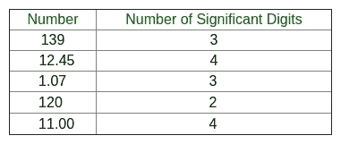
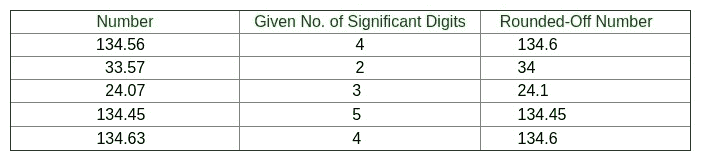

# 将一个数字四舍五入到给定的有效位数

> 原文:[https://www . geesforgeks . org/四舍五入-给定数字-有效数字/](https://www.geeksforgeeks.org/round-off-number-given-number-significant-digits/)

给定一个正数 n (n > 1)，将该数四舍五入为给定的有效位数 d.
**示例:**

```
Input : n = 139.59
        d = 4
Output : The number after rounding-off is 139.6 .

The number 139.59 has 5 significant figures and for rounding-off 
the number to 4 significant figures, 139.59 is converted to 139.6 .

Input : n = 1240
        d = 2
Output : The number after rounding-off is 1200 .
```

**什么是显著数字？**

从第一个非零数字开始，一个数字的每个数字都被称为有效数字，用来表示它达到要求的精确度。
由于存在位数较多的数字，例如 = 3.142857143，所以为了将此类数字限制在一个可管理的位数，我们去掉了不需要的数字，这个过程称为**舍入**。
有效数字包括属于以下类别之一的数字中的所有数字–

*   所有非零数字。
*   零位数-
    1.  位于有效数字之间。
    2.  位于小数点右边，同时位于非零数字的右边。
    3.  被特别指出是重要的。

下表显示了数字和其中有效数字的数量–



**四舍五入规则**

将一个数字四舍五入到 n 个有效数字-

1.  丢弃第 n 个<sup>有效数字右侧的所有数字。</sup>
2.  如果这个被丢弃的号码是-
    *   第 n <sup>个</sup>位不足半个单位，保持第 n <sup>个</sup>位数字不变。
    *   在第 n <sup>个</sup>位大于半个单位，将第 n <sup>个</sup>位数增加 1。
    *   在第 n <sup>个</sup>位置正好半个单位，如果其奇数，将第 n <sup>个</sup>位数增加 1，否则保持不变。

下表显示了将数字舍入到给定的有效位数–



## C++

```
// C++ program to round-off a number to given no. of
// significant digits
#include <bits/stdc++.h>
using namespace std;

// Function to round - off the number
void Round_off(double N, double n)
{
    int h;
    double l, a, b, c, d, e, i, j, m, f, g;
    b = N;
    c = floor(N);

    // Counting the no. of digits to the left of decimal point
    // in the given no.
    for (i = 0; b >= 1; ++i)
        b = b / 10;

    d = n - i;
    b = N;
    b = b * pow(10, d);
    e = b + 0.5;
    if ((float)e == (float)ceil(b)) {
        f = (ceil(b));
        h = f - 2;
        if (h % 2 != 0) {
            e = e - 1;
        }
    }
    j = floor(e);
    m = pow(10, d);
    j = j / m;
    cout << "The number after rounding-off is " << j;
}

// Driver main function
int main()
{
    double N, n;

    // Number to be rounded - off
    N = 139.59;

    // No. of Significant digits required in the no.
    n = 4;

    Round_off(N, n);
    return 0;
}
```

## Java 语言(一种计算机语言，尤用于创建网站)

```
// Java program to round-off a number to given no. of
// significant digits

import java.io.*;
import static java.lang.Math.*;
public class A {

    // Function to round - off the number
    static void Round_off(double N, double n)
    {
        int h;
        double l, a, b, c, d, e, i, j, m, f, g;
        b = N;
        c = floor(N);

        // Counting the no. of digits to the left of decimal point
        // in the given no.
        for (i = 0; b >= 1; ++i)
            b = b / 10;

        d = n - i;
        b = N;
        b = b * pow(10, d);
        e = b + 0.5;
        if ((float)e == (float)ceil(b)) {
            f = (ceil(b));
            h = (int)(f - 2);
            if (h % 2 != 0) {
                e = e - 1;
            }
        }
        j = floor(e);
        m = pow(10, d);
        j = j / m;
        System.out.println("The number after rounding-off is "
                           + j);
    }

    // Driver main function
    public static void main(String args[])
    {
        double N, n;

        // Number to be rounded - off
        N = 139.59;

        // No. of Significant digits required in the no.
        n = 4;

        Round_off(N, n);
    }
}
```

## 蟒蛇 3

```
# Python 3 program to round-off a number
# to given no. of significant digits
from math import ceil, floor, pow

# Function to round - off the number
def Round_off(N, n):
    b = N
    c = floor(N)

    # Counting the no. of digits
    # to the left of decimal point
    # in the given no.
    i = 0;
    while(b >= 1):
        b = b / 10
        i = i + 1

    d = n - i
    b = N
    b = b * pow(10, d)
    e = b + 0.5
    if (float(e) == float(ceil(b))):
        f = (ceil(b))
        h = f - 2
        if (h % 2 != 0):
            e = e - 1
    j = floor(e)
    m = pow(10, d)
    j = j / m
    print("The number after rounding-off is", j)

# Driver Code
if __name__ == '__main__':

    # Number to be rounded - off
    N = 139.59

    # No. of Significant digits
    # required in the no.
    n = 4

    Round_off(N, n)

# This code is contributed by
# Surendra_Gangwar
```

## C#

```
// C# program to round-off a number
// to given no. of significant digits
using System;

class A {

    // Function to round - off the number
    static void Round_off(double N, double n)
    {
        int h;
        double b, d, e, i, j, m, f;
        b = N;
        // c = Math.Floor(N);

        // Counting the no. of digits to the
        // left of decimal point in the given no.
        for (i = 0; b >= 1; ++i)
            b = b / 10;

        d = n - i;
        b = N;
        b = b * Math.Pow(10, d);
        e = b + 0.5;
        if ((float)e == (float)Math.Ceiling(b)) {
            f = (Math.Ceiling(b));
            h = (int)(f - 2);
            if (h % 2 != 0) {
                e = e - 1;
            }
        }
        j = Math.Floor(e);
        m = Math.Pow(10, d);
        j = j / m;
        Console.WriteLine("The number after " +
                       "rounding-off is " + j);
    }

    // Driver main function
    public static void Main()
    {
        double N, n;

        // Number to be rounded - off
        N = 139.59;

        // No. of Significant digits required in the no.
        n = 4;

        Round_off(N, n);
    }
}

// This code is contributed by vt_m.
```

## 服务器端编程语言（Professional Hypertext Preprocessor 的缩写）

```
<?php
// PHP program to round-off
// a number to given no. of
// significant digits

// Function to round -
// off the number
function Round_off($N, $n)
{

    $h;
    $l; $a; $b; $c;
    $d; $e; $i; $j;
    $m; $f; $g;
    $b = $N;
    $c = floor($N);

    // Counting the no. of digits
    // to the left of decimal point
    // in the given no.
    for ($i = 0; $b >= 1; ++$i)
        $b = $b / 10;

    $d = $n - $i;
    $b = $N;
    $b = $b * pow(10, $d);
    $e = $b + 0.5;
    if ($e == ceil($b))
    {
        $f = (ceil($b));
        $h = $f - 2;
        if ($h % 2 != 0)
        {
            $e = $e - 1;
        }
    }
    $j = floor($e);
    $m = pow(10, $d);
    $j = $j / $m;
    echo "The number after rounding-off is " ,$j;
}

    // Driver Code
    $N; $n;

    // Number to be rounded - off
    $N = 139.59;

    // No. of Significant digits
    // required in the no.
    $n = 4;

    Round_off($N, $n);

// This code is contributed by anuj_67
?>
```

## java 描述语言

```
<script>

// Javascript program to round-off a number to given no. of
// significant digitsimport

// Function to round - off the number
function Round_off(N , n)
{
    var h;
    var l, a, b, c, d, e, i, j, m, f, g;
    b = N;
    c = Math.floor(N);

    // Counting the no. of digits to the left of decimal point
    // in the given no.
    for (i = 0; b >= 1; ++i)
        b = parseInt(b / 10);

    d = n - i;
    b = N;
    b = b * Math.pow(10, d);
    e = b + 0.5;
    if (e == Math.ceil(b)) {
        f = (Math.ceil(b));
        h = parseInt(f - 2);
        if (h % 2 != 0) {
            e = e - 1;
        }
    }
    j = Math.floor(e);
    m = Math.pow(10, d);
    j = j / m;
    document.write("The number after rounding-off is "
                       + j);
}

// Driver main function
var N, n;

// Number to be rounded - off
N = 139.59;

// No. of Significant digits required in the no.
n = 4;

Round_off(N, n);

// This code contributed by Princi Singh

</script>
```

**输出:**

```
The number after rounding-off is 139.6 
```

本文由**姆里根德拉·辛格**供稿。如果你喜欢 GeeksforGeeks 并想投稿，你也可以使用[contribute.geeksforgeeks.org](http://www.contribute.geeksforgeeks.org)写一篇文章或者把你的文章邮寄到 contribute@geeksforgeeks.org。看到你的文章出现在极客博客主页上，帮助其他极客。
如果你发现任何不正确的地方，或者你想分享更多关于上面讨论的话题的信息，请写评论。