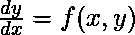
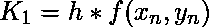
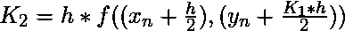
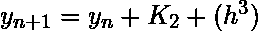

# 解微分方程的龙格-库塔二阶方法

> 原文:[https://www . geeksforgeeks . org/runge-kutta-二阶方法求解微分方程/](https://www.geeksforgeeks.org/runge-kutta-2nd-order-method-to-solve-differential-equations/)

给定以下输入:

1.  一个普通的[微分方程](https://www.geeksforgeeks.org/second-order-linear-differential-equations/)，定义 **dy/dx** 的值，形式为 **x** 和 **y** 。
    
2.  y 的初始值，即 **y(0)** 。
    T3】

任务是求未知函数 y 在给定点 x 处的值，即 **y(x)** 。
**例:**

> **输入:** x <sub>0</sub> = 0，y <sub>0</sub> = 1，x = 2，h = 0.2
> **输出:** y(x) = 0.645590
> **输入:** x <sub>0</sub> = 2，y <sub>0</sub> = 1，x = 4，h = 0.4
> **输出:** y(x) = 4.122991

**方法:**
[龙格-库塔法](https://www.geeksforgeeks.org/runge-kutta-4th-order-method-solve-differential-equation/)求给定 x 的 y 的近似值。只有一阶常微分方程可以用龙格-库塔二阶法求解。
以下是根据前一个值 y <sub>n</sub> 计算下一个值 y <sub>n+1</sub> 的公式。
因此:

```
yn+1 = value of y at (x = n + 1)
yn = value of y at (x = n)
where
  0 ≤ n ≤ (x - x0)/h
  h is step height
  xn+1 = x0 + h
```

计算 y(n+1)值的基本公式:



该公式基本上使用当前的 **y <sub>n</sub>** 加上两个增量的加权平均值来计算下一个值 **y <sub>n+1</sub>**

*   **K <sub>1</sub>** 是基于区间开始时斜率的增量，使用 y
*   **K <sub>2</sub>** 是基于区间中点斜率的增量，使用 **(y + h*K <sub>1</sub> /2)** 。

该方法为二阶方法，意味着局部截断误差在 O(h <sup>3</sup> 量级，而总累积误差为 O(h <sup>4</sup> 量级)。
以下是上述方法的实施:

## C++

```
// C++ program to implement Runge
// Kutta method
#include <bits/stdc++.h>
using namespace std;

// A sample differential equation
// "dy/dx = (x - y)/2"
float dydx(float x, float y)
{
    return (x + y - 2);
}

// Finds value of y for a given x
// using step size h
// and initial value y0 at x0.
float rungeKutta(float x0, float y0,
                 float x, float h)
{
    // Count number of iterations
    // using step size or
    // step height h
    int n = (int)((x - x0) / h);

    float k1, k2;

    // Iterate for number of iterations
    float y = y0;
    for (int i = 1; i <= n; i++) {
        // Apply Runge Kutta Formulas
        // to find next value of y
        k1 = h * dydx(x0, y);
        k2 = h * dydx(x0 + 0.5 * h,
                      y + 0.5 * k1);

        // Update next value of y
        y = y + (1.0 / 6.0) * (k1 + 2 * k2);

        // Update next value of x
        x0 = x0 + h;
    }

    return y;
}

// Driver Code
int main()
{
    float x0 = 0, y = 1,
          x = 2, h = 0.2;

    cout << fixed << setprecision(6) << "y(x) = " << rungeKutta(x0, y, x, h);
    return 0;
}

// This code is contributed by shivani
```

## C

```
// C program to implement Runge
// Kutta method

#include <stdio.h>

// A sample differential equation
// "dy/dx = (x - y)/2"
float dydx(float x, float y)
{
    return (x + y - 2);
}

// Finds value of y for a given x
// using step size h
// and initial value y0 at x0.
float rungeKutta(float x0, float y0,
                 float x, float h)
{
    // Count number of iterations
    // using step size or
    // step height h
    int n = (int)((x - x0) / h);

    float k1, k2;

    // Iterate for number of iterations
    float y = y0;
    for (int i = 1; i <= n; i++) {
        // Apply Runge Kutta Formulas
        // to find next value of y
        k1 = h * dydx(x0, y);
        k2 = h * dydx(x0 + 0.5 * h,
                      y + 0.5 * k1);

        // Update next value of y
        y = y + (1.0 / 6.0) * (k1 + 2 * k2);

        // Update next value of x
        x0 = x0 + h;
    }

    return y;
}

// Driver Code
int main()
{
    float x0 = 0, y = 1,
          x = 2, h = 0.2;

    printf("y(x) = %f",
           rungeKutta(x0, y, x, h));
    return 0;
}
```

## Java 语言(一种计算机语言，尤用于创建网站)

```
// Java program to implement Runge
// Kutta method
class GFG {

    // A sample differential equation
    // "dy/dx = (x - y)/2"
    static double dydx(double x, double y)
    {
        return (x + y - 2);
    }

    // Finds value of y for a given x
    // using step size h
    // and initial value y0 at x0.
    static double rungeKutta(double x0, double y0,
                     double x, double h)
    {
        // Count number of iterations
        // using step size or
        // step height h
        int n = (int)((x - x0) / h);

        double k1, k2;

        // Iterate for number of iterations
        double y = y0;
        for (int i = 1; i <= n; i++) {
            // Apply Runge Kutta Formulas
            // to find next value of y
            k1 = h * dydx(x0, y);
            k2 = h * dydx(x0 + 0.5 * h,
                          y + 0.5 * k1);

            // Update next value of y
            y = y + (1.0 / 6.0) * (k1 + 2 * k2);

            // Update next value of x
            x0 = x0 + h;
        }

        return y;
    }

    // Driver Code
    public static void main (String[] args)
    {
        double x0 = 0, y = 1,
              x = 2, h = 0.2;

        System.out.println(rungeKutta(x0, y, x, h));
    }
}

// This code is contributed by Yash_R
```

## 蟒蛇 3

```
# Python3 program to implement Runge
# Kutta method

# A sample differential equation
# "dy/dx = (x - y)/2"
def dydx(x, y) :

    return (x + y - 2);

# Finds value of y for a given x
# using step size h
# and initial value y0 at x0.
def rungeKutta(x0, y0, x, h) :

    # Count number of iterations
    # using step size or
    # step height h
    n = round((x - x0) / h);

        # Iterate for number of iterations
    y = y0;

    for i in range(1, n + 1) :

                # Apply Runge Kutta Formulas
        # to find next value of y
        k1 = h * dydx(x0, y);
        k2 = h * dydx(x0 + 0.5 * h, y + 0.5 * k1);

        # Update next value of y
        y = y + (1.0 / 6.0) * (k1 + 2 * k2);

        # Update next value of x
        x0 = x0 + h;

    return y;

# Driver Code
if __name__ == "__main__" :

    x0 = 0; y = 1;
    x = 2; h = 0.2;

    print("y(x) =",rungeKutta(x0, y, x, h));

# This code is contributed by Yash_R
```

## C#

```
// C# program to implement Runge
// Kutta method
using System;

class GFG {

    // A sample differential equation
    // "dy/dx = (x - y)/2"
    static double dydx(double x, double y)
    {
        return (x + y - 2);
    }

    // Finds value of y for a given x
    // using step size h
    // and initial value y0 at x0.
    static double rungeKutta(double x0, double y0,
                     double x, double h)
    {
        // Count number of iterations
        // using step size or
        // step height h
        int n = (int)((x - x0) / h);

        double k1, k2;

        // Iterate for number of iterations
        double y = y0;
        for (int i = 1; i <= n; i++) {
            // Apply Runge Kutta Formulas
            // to find next value of y
            k1 = h * dydx(x0, y);
            k2 = h * dydx(x0 + 0.5 * h,
                          y + 0.5 * k1);

            // Update next value of y
            y = y + (1.0 / 6.0) * (k1 + 2 * k2);

            // Update next value of x
            x0 = x0 + h;
        }

        return y;
    }

    // Driver Code
    public static void Main (string[] args)
    {
        double x0 = 0, y = 1,
              x = 2, h = 0.2;

        Console.WriteLine(rungeKutta(x0, y, x, h));
    }
}

// This code is contributed by Yash_R
```

## java 描述语言

```
<script>

// JavaScript program to implement Runge
// Kutta method

    // A sample differential equation
    // "dy/dx = (x - y)/2"
    function dydx(x, y)
    {
        return (x + y - 2);
    }

    // Finds value of y for a given x
    // using step size h
    // and initial value y0 at x0.
    function rungeKutta(x0, y0, x, h)
    {
        // Count number of iterations
        // using step size or
        // step height h
        let n = ((x - x0) / h);

        let k1, k2;

        // Iterate for number of iterations
        let y = y0;
        for (let i = 1; i <= n; i++) {
            // Apply Runge Kutta Formulas
            // to find next value of y
            k1 = h * dydx(x0, y);
            k2 = h * dydx(x0 + 0.5 * h,
                          y + 0.5 * k1);

            // Update next value of y
            y = y + (1.0 / 6.0) * (k1 + 2 * k2);

            // Update next value of x
            x0 = x0 + h;
        }

        return y;
    }

// Driver Code

    let x0 = 0, y = 1,
              x = 2, h = 0.2;

    document.write(rungeKutta(x0, y, x, h).toFixed(6));

</script>
```

**Output:** 

```
y(x) = 0.645590
```

时间复杂度:0(n)

辅助空间:0(1)

**参考:**T2https://en.wikipedia.org/wiki/Runge%E2%80%93Kutta_methods