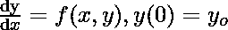
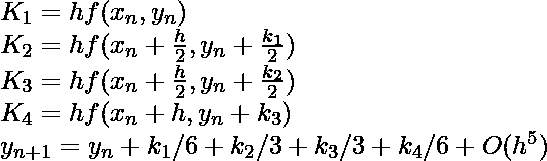

# 解微分方程的龙格-库塔四阶方法

> 原文:[https://www . geeksforgeeks . org/runge-kutta-四阶-方法-求解-微分方程/](https://www.geeksforgeeks.org/runge-kutta-4th-order-method-solve-differential-equation/)

给定以下输入，

*   以 x 和 y 形式定义 dy/dx 值的常微分方程。
*   y 的初始值，即 y(0)

因此我们在下面给出。

任务是求未知函数 y 在给定点 x 的值。
龙格-库塔法求给定 x 的 y 的近似值，只有一阶常微分方程可以用龙格-库塔四阶法求解。
以下是用于根据前一个值 y <sub>n</sub> 计算下一个值 y <sub>n+1</sub> 的公式。n 的值是 0，1，2，3，…(x–x0)/h .此处 **h 为步高**，**x<sub>n+1</sub>= x<sub>0</sub>+h**
。较小的步长意味着更高的精度。


该公式基本上使用当前 y <sub>n</sub> 加上四个增量的加权平均值来计算下一个值 y <sub>n+1</sub> 。

*   k <sub>1</sub> 是基于区间开始时斜率的增量，使用 y
*   k <sub>2</sub> 是基于区间中点斜率的增量，使用 y + hk <sub>1</sub> /2。
*   k <sub>3</sub> 同样是基于中点斜率的增量，使用 y + hk <sub>2</sub> /2。
*   k <sub>4</sub> 是基于区间末端斜率的增量，使用 y + hk <sub>3</sub> 。

该方法为四阶方法，即局部截断误差为 O(h <sup>5</sup> 阶)，而总累积误差为 O(h <sup>4</sup> 阶。
来源:[https://en.wikipedia.org/wiki/Runge%E2%80%93Kutta_methods](https://en.wikipedia.org/wiki/Runge%E2%80%93Kutta_methods)

下面是上述公式的实现。

## C

```
// C program to implement Runge Kutta method
#include<stdio.h>

// A sample differential equation "dy/dx = (x - y)/2"
float dydx(float x, float y)
{
    return((x - y)/2);
}

// Finds value of y for a given x using step size h
// and initial value y0 at x0.
float rungeKutta(float x0, float y0, float x, float h)
{
    // Count number of iterations using step size or
    // step height h
    int n = (int)((x - x0) / h);

    float k1, k2, k3, k4, k5;

    // Iterate for number of iterations
    float y = y0;
    for (int i=1; i<=n; i++)
    {
        // Apply Runge Kutta Formulas to find
        // next value of y
        k1 = h*dydx(x0, y);
        k2 = h*dydx(x0 + 0.5*h, y + 0.5*k1);
        k3 = h*dydx(x0 + 0.5*h, y + 0.5*k2);
        k4 = h*dydx(x0 + h, y + k3);

        // Update next value of y
        y = y + (1.0/6.0)*(k1 + 2*k2 + 2*k3 + k4);;

        // Update next value of x
        x0 = x0 + h;
    }

    return y;
}

// Driver method
int main()
{
    float x0 = 0, y = 1, x = 2, h = 0.2;
    printf("\nThe value of y at x is : %f",
            rungeKutta(x0, y, x, h));
    return 0;
}
```

## Java 语言(一种计算机语言，尤用于创建网站)

```
// Java program to implement Runge Kutta method
import java.io.*;
class differential
{
    double dydx(double x, double y)
    {
        return ((x - y) / 2);
    }

    // Finds value of y for a given x using step size h
    // and initial value y0 at x0.
    double rungeKutta(double x0, double y0, double x, double h)
    {
        differential d1 = new differential();
        // Count number of iterations using step size or
        // step height h
        int n = (int)((x - x0) / h);

        double k1, k2, k3, k4, k5;

        // Iterate for number of iterations
        double y = y0;
        for (int i = 1; i <= n; i++)
        {
            // Apply Runge Kutta Formulas to find
            // next value of y
            k1 = h * (d1.dydx(x0, y));
            k2 = h * (d1.dydx(x0 + 0.5 * h, y + 0.5 * k1));
            k3 = h * (d1.dydx(x0 + 0.5 * h, y + 0.5 * k2));
            k4 = h * (d1.dydx(x0 + h, y + k3));

            // Update next value of y
            y = y + (1.0 / 6.0) * (k1 + 2 * k2 + 2 * k3 + k4);

            // Update next value of x
            x0 = x0 + h;
        }
        return y;
    }

    public static void main(String args[])
    {
        differential d2 = new differential();
        double x0 = 0, y = 1, x = 2, h = 0.2;

        System.out.println("\nThe value of y at x is : "
                    + d2.rungeKutta(x0, y, x, h));
    }
}

// This code is contributed by Prateek Bhindwar
```

## 计算机编程语言

```
# Python program to implement Runge Kutta method
# A sample differential equation "dy / dx = (x - y)/2"
def dydx(x, y):
    return ((x - y)/2)

# Finds value of y for a given x using step size h
# and initial value y0 at x0.
def rungeKutta(x0, y0, x, h):
    # Count number of iterations using step size or
    # step height h
    n = (int)((x - x0)/h)
    # Iterate for number of iterations
    y = y0
    for i in range(1, n + 1):
        "Apply Runge Kutta Formulas to find next value of y"
        k1 = h * dydx(x0, y)
        k2 = h * dydx(x0 + 0.5 * h, y + 0.5 * k1)
        k3 = h * dydx(x0 + 0.5 * h, y + 0.5 * k2)
        k4 = h * dydx(x0 + h, y + k3)

        # Update next value of y
        y = y + (1.0 / 6.0)*(k1 + 2 * k2 + 2 * k3 + k4)

        # Update next value of x
        x0 = x0 + h
    return y

# Driver method
x0 = 0
y = 1
x = 2
h = 0.2
print 'The value of y at x is:', rungeKutta(x0, y, x, h)

# This code is contributed by Prateek Bhindwar
```

## C#

```
// C# program to implement Runge
// Kutta method
using System;

class GFG {

    static double dydx(double x, double y)
    {
        return ((x - y) / 2);
    }

    // Finds value of y for a given x
    // using step size h and initial
    // value y0 at x0.
    static double rungeKutta(double x0,
                double y0, double x, double h)
    {

        // Count number of iterations using
        // step size or step height h
        int n = (int)((x - x0) / h);

        double k1, k2, k3, k4;

        // Iterate for number of iterations
        double y = y0;

        for (int i = 1; i <= n; i++)
        {

            // Apply Runge Kutta Formulas
            // to find next value of y
            k1 = h * (dydx(x0, y));

            k2 = h * (dydx(x0 + 0.5 * h,
                             y + 0.5 * k1));

            k3 = h * (dydx(x0 + 0.5 * h,
                            y + 0.5 * k2));

            k4 = h * (dydx(x0 + h, y + k3));

            // Update next value of y
            y = y + (1.0 / 6.0) * (k1 + 2
                       * k2 + 2 * k3 + k4);

            // Update next value of x
            x0 = x0 + h;
        }

        return y;
    }

    // Driver code
    public static void Main()
    {

        double x0 = 0, y = 1, x = 2, h = 0.2;

        Console.WriteLine("\nThe value of y"
                             + " at x is : "
                 + rungeKutta(x0, y, x, h));
    }
}

// This code is contributed by Sam007.
```

## 服务器端编程语言（Professional Hypertext Preprocessor 的缩写）

```
<?php
// PHP program to implement
// Runge Kutta method

// A sample differential equation
// "dy/dx = (x - y)/2"
function dydx($x, $y)
{
    return(($x - $y) / 2);
}

// Finds value of y for a
// given x using step size h
// and initial value y0 at x0.
function rungeKutta($x0, $y0, $x, $h)
{

    // Count number of iterations
    // using step size or step
    // height h
    $n = (($x - $x0) / $h);

    $k1; $k2; $k3; $k4; $k5;

    // Iterate for number
    // of iterations
    $y = $y0;
    for($i = 1; $i <= $n; $i++)
    {

        // Apply Runge Kutta
        // Formulas to find
        // next value of y
        $k1 = $h * dydx($x0, $y);
        $k2 = $h * dydx($x0 + 0.5 * $h,
                        $y + 0.5 * $k1);
        $k3 = $h * dydx($x0 + 0.5 * $h,
                        $y + 0.5 * $k2);
        $k4 = $h * dydx($x0 + $h, $y + $k3);

        // Update next value of y
        $y = $y + (1.0 / 6.0) * ($k1 + 2 *
                    $k2 + 2 * $k3 + $k4);;

        // Update next value of x
        $x0 = $x0 + $h;
    }

    return $y;
}

    // Driver method
    $x0 = 0;
    $y = 1;
    $x = 2;
    $h = 0.2;
    echo "The value of y at x is : ",
          rungeKutta($x0, $y, $x, $h);

// This code is contributed by anuj_67.
?>
```

## java 描述语言

```
<script>

// Javascript program to implement Runge Kutta method

// A sample differential equation "dy/dx = (x - y)/2"
function dydx(x, y)
{
    return((x - y) / 2);
}

// Finds value of y for a given x using step size h
// and initial value y0 at x0.
function rungeKutta(x0, y0, x, h)
{

    // Count number of iterations using
    // step size or step height h
    let n = parseInt((x - x0) / h, 10);

    let k1, k2, k3, k4, k5;

    // Iterate for number of iterations
    let y = y0;
    for(let i = 1; i <= n; i++)
    {

        // Apply Runge Kutta Formulas to find
        // next value of y
        k1 = h * dydx(x0, y);
        k2 = h * dydx(x0 + 0.5 * h, y + 0.5 * k1);
        k3 = h * dydx(x0 + 0.5 * h, y + 0.5 * k2);
        k4 = h * dydx(x0 + h, y + k3);

        // Update next value of y
        y = y + (1 / 6) * (k1 + 2 * k2 +
                            2 * k3 + k4);;

        // Update next value of x
        x0 = x0 + h;
    }
    return y.toFixed(6);
}

// Driver code
let x0 = 0, y = 1, x = 2, h = 0.2;

document.write("The value of y at x is : " +
               rungeKutta(x0, y, x, h));   

// This code is contributed by divyesh072019

</script>
```

**输出:**

```
The value of y at x is : 1.103639
```

以上解的时间复杂度为 O(n)，其中 n 为(x-x0)/h.
一些有用的资源提供了详细的例子和更多的解释。
[http://w3.gazi.edu.tr/~balbasi/mws_gen_ode_txt_runge4th.pdf](http://w3.gazi.edu.tr/~balbasi/mws_gen_ode_txt_runge4th.pdf)T4[https://www.youtube.com/watch?v=kUcc8vAgoQ0](https://www.youtube.com/watch?v=kUcc8vAgoQ0)T7】

本文由 **Arpit Agarwal** 供稿。如果你喜欢极客博客并想投稿，你也可以写一篇文章并把你的文章邮寄到 review-team@geeksforgeeks.org。看到你的文章出现在极客博客主页上，帮助其他极客。

如果发现有不正确的地方，请写评论，或者想分享更多关于以上讨论话题的信息