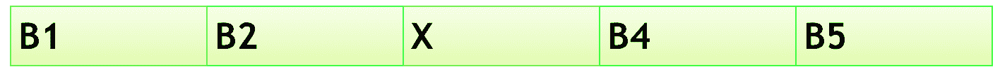

# 三星半导体研究院(SSIR 软件)实习生/FTE | Set-2

> 原文:[https://www . geesforgeks . org/Samsung-semiconductor-institute-research ssir-software-intern-fte-set-2/](https://www.geeksforgeeks.org/samsung-semiconductor-institute-of-researchssir-software-intern-fte-set-2/)

有 N 个标有值 Bi 的气球(其中 B(i…N))。
用户将获得 N 发子弹的枪，用户必须射击 N 次。
当任何一个气球爆炸时，它的相邻气球就会彼此挨着。
用户必须获得最高分才能获得奖品，分数从 0 开始。
下面是计算分数的条件。
当气球 Bi 爆炸时，分数将是 Bi-1 & Bi+1 的乘积(分数= Bi-1 * Bi+1)。
当气球 Bi 爆炸，只剩下气球在场时，得分为 Bi-1。
当气球 Bi 爆炸并且只有正确的气球出现时，分数将为 Bi+1。
当气球 Bi 爆炸，没有左右气球出现时，得分为 Bi。
写一个最高分的程序。

```
Example: 
Input: B[] = {1, 2, 3, 4}
Output: 20
Explanation:
For max score:
3 explodes, score= 4*2=8 (product of adjacent balloons) 
2 explodes score= 4*1 + 8 = 12 (product of adjacent balloons) 
1 explodes score=  4 + 12= 16  (only 4 is left on the left side)
4 explodes score = 4 + 16 = 20 (no balloons left so add 4)
score =20
other combinations will result in lesser scores.
```

**分析:**
1)目的是寻找最大得分
2)最大得分取决于相邻的分数，然而没有简单的方法可以找到哪个序列给出最大得分，所以唯一的方法是找到所有可能的序列来获得最大得分。
3)输入 N 的顺序问题，我们可以有 N！序列。nPn 路(第一个气球 N 路，第二个气球 N-1 路…最后一个气球 1 路 N*(N-1)(N-2)..2*1= N！
**复杂度:**
生成全序列 O(N！)
要获得 1 个序列的得分，对于序列中的每个气球，我们需要左右邻居最坏的情况需要在数组中完成遍历，因此复杂度为 O(N*N)
总复杂度为 O(N！)* O(N*N)(注:每个序列末尾都做了计算)
50 TC，N 50 *是 O(N！* N*N) = > 50 * 100 * 10！=>5000 * 3628800 =>1.5 * 10^10 这不能在给定的 3 秒内执行(10^9 指令每秒)。
所以需要寻找优化
**伪代码生成所有序列:**

```
INPUT[N]
CHOICE[N] <= -1 //initialize to -1
Permute(0)
Permute(Position)
{
   // stop condition
   If ( all balloon shot )
   {
     Compute the score for this sequence in CHOICE[]
     If score better than previous then store
   }

   For i:0~N-1
   {
     If (ith balloon not selected // CHOICE[i]==-1)
     {
        Select ith balloon  // CHOICE[Position]= i 
        Permute (Position+1)
        Unselect ith balloon// CHOICE[Position]= -1
     }
   }
}
```

**优化:**
我们可以在上面的算法中看到 2 大操作都是进行
(1)生成所有序列 O(N！)
(2)计算每个序列的得分 O(N*N)
我们不能优化算法来生成所有序列，但是我们可以进一步减少计算部分。
优化计算部分
如果可以优化寻找 O(1)的邻居，我们可以将计算部分减少到 O(N ),这使得我们的算法在 1.5 * 10^9 中执行，这可以在 3 秒内实现。
或者，我们可以计算每个选择的气球的得分，以拍摄“在旅途中”这里，当每次选择气球时，查找邻居是额外的，可以是 O(N ),还可以减少 1.5 * 10^9
**算法，以获得邻居:**
天真的方法由 O(N):
邻居(选择的)
为左:选择-1~0，如果左气球没有选择打破；
对于右侧:如果右侧气球没有选择破裂，则选择+1 ~ N-1；
if(Right = = N)
Right =-1；
左右返回；
**优化方式由 O(1)**
1。保留 2 个左[]和右[]数组，其中包含每个气球的邻居。
2。最初邻居是已知的，因为第一个气球左边是 i-1，右边是 i+1，除了第一个气球没有左边，最后一个气球没有右边。
3。当选择气球时，我们可以通过 O(1)
4 得到它的左右。当气球被击中时，更新邻居左[I+1]=左[i]右[I-1]=右[i]
注:
不调用新函数获取左、右计算递归分数内部的左、右会减少很多隐藏的指令至于调用新函数编译器添加很多可以减少的指令
**替代方式:**
即时计算分数的方式
将当前分数变量传递给递归函数
当选择一个气球拍摄时获取左、右邻居
计算拍摄所选气球获得的分数
将此加入给定分数并传递到下一级

```

Permute(Position, score)
{
   // stop condition
   If( all balloon shot )
   {
     If score better than previous then store
   }

   For i:0~N-1
   {
      If (ith balloon not selected // CHOICE[i]==-1)
      {
         Select ith balloon  // CHOICE[Position]= i 
         Gain = Compute the gain by shooting ith balloon 
         Permute (Position+1, score+ Gain)
         Unselect ith balloon// CHOICE[Position]= -1
      }
   }
} 
```

**替代优化方法(分治法)和动态规划**
这个问题起初看起来不像是一个分治的问题。
原因:如果我们选择一个气球(用于爆炸)，那么我们的阵列将被分成两个子阵列。但这两个子阵列不会是独立的子问题。
例
考虑 5 个气球 B1，..，B5。爆裂 B3 将阵列分成两个子阵列{B1，B2}和{B4，B5}。但是这两个子阵列不是相互独立的。突发 B4 的分数取决于{B1，B2}的突发顺序。
关键洞察
1。为了将问题分成两半，我们必须确保一半的任何动作(气球爆裂)都不会影响另一半的分数。
2。如果我们固定一个气球，并确保我们不会把它炸开，直到我们把它左边的所有气球和右边的所有气球都炸开，那么我们可以成功地把这个问题分成两个子问题。
示例
考虑前面五个气球的情况。现在，我们修复的不是爆破 B3，而是在所有气球爆炸后爆破 B3，这使得{B1，B2}和{B4，B5}彼此独立，即爆破 B4 的分数现在独立于{B1，B2}。



另一种将分治法形象化的方法是，我们逆向思考问题。平行的问题是给一组 n 个放气的气球，每个气球都有一个分数，选择你给气球充气的顺序。给气球充气的分数等于附在气球上的分数的乘积，气球位于所述气球的左右。
下面是递归解:

## 卡片打印处理机（Card Print Processor 的缩写）

```
#include <iostream>
using namespace std;

// recursive function to generate scores
int getmaxscore(int arr[], int l, int r, int n)
{
    int mscore = 0;
    for (int i = l + 1; i < r; i++) {

        // to permute through all cases
        int cs = getmaxscore(arr, l, i, n) + getmaxscore(arr, i, r, n);
        if (l == 0 && r == n)
            cs = cs + arr[i];
        else
            cs = cs + (arr[l] * arr[r]);

        if (cs > mscore)
            mscore = cs;
    }
    return mscore;
}

int main() // driver function
{
    int n = 4; // no of balloons

    // assigning scores to each balloon 1-based indexing
    // arr[0]=1 because to calculate score when no
    //             balloons are left after popping
    // arr[5]=1 because to calculate score when no
    //             balloons are left after popping
    // scores of balloons are assigned from 1 to 4 i.e 1 to n
    int arr[] = { 1, 1, 2, 3, 4, 1 };

    /* for input input arr[n+2],
      arr[0]=1 && arr[n+1]=1
      cin>>n;
      for(int i=1;i<=n;i++)
         cin>>arr[i]; */

    cout << getmaxscore(arr, 0, n + 1, n + 1) << "\n";

    return 0;
}
```

```
Output:
20
```