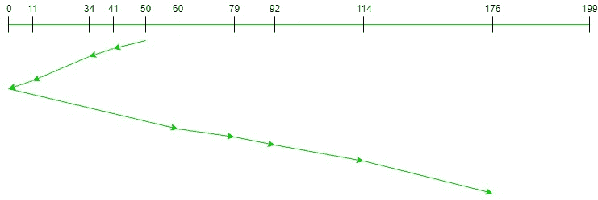

# 扫描(电梯)磁盘调度算法

> 原文:[https://www . geesforgeks . org/scan-电梯-磁盘-调度-算法/](https://www.geeksforgeeks.org/scan-elevator-disk-scheduling-algorithms/)

先决条件- [磁盘调度算法。](https://www.geeksforgeeks.org/disk-scheduling-algorithms/)
给定一组磁盘磁道号和初始磁头位置，如果使用 SCAN 磁盘调度算法，我们的任务是找到访问所有请求磁道的寻道操作总数。

**SCAN(升降舵)算法**
在 SCAN 磁盘调度算法中，磁头从磁盘的一端开始，向另一端移动，一个接一个地为中间的请求提供服务，并到达另一端。然后磁头的方向被反转，并且随着磁头连续地来回扫描以访问磁盘，该过程继续。因此，这个算法作为一个电梯工作，因此也被称为**电梯算法**。因此，中端的请求得到了更多的服务，而那些到达磁盘臂后面的请求将不得不等待。

**SCAN(电梯)算法的优势**

1.  该算法简单易懂。
2.  扫描算法没有饥饿。
3.  该算法优于 FCFS 调度算法。

**SCAN(电梯)算法的缺点**

1.  更复杂的算法要实现。
2.  这种算法是不公平的，因为它会导致头部刚访问的柱面等待时间过长。
3.  它使磁头移动到磁盘的末端，这样，到达臂位置之前的请求将立即得到服务，但是到达臂位置之后的一些其他请求将不得不等待请求完成。

**算法-**

1.  Let Request 数组表示一个数组，该数组存储按到达时间升序请求的磁道索引。“head”是磁盘磁头的位置。
2.  让方向代表头部是向左还是向右移动。
3.  在磁头移动的方向上，所有磁道都一一服务。
4.  计算轨道与头部的绝对距离。
5.  用此距离增加总寻道计数。
6.  当前维修的履带位置现在成为新的头部位置。
7.  转到步骤 3，直到我们到达磁盘的一端。
8.  如果我们到达磁盘的末尾，则反转方向并转到步骤 2，直到请求阵列中的所有磁道都没有得到服务。

**示例:**

```
Input: 
Request sequence = {176, 79, 34, 60, 92, 11, 41, 114}
Initial head position = 50
Direction = left (We are moving from right to left)

Output:
Total number of seek operations = 226
Seek Sequence is
41
34
11
0
60
79
92
114
176
```

下图显示了使用扫描为请求的磁道提供服务的顺序。



因此，总寻道计数计算如下:

```
= (50-41)+(41-34)+(34-11)
 +(11-0)+(60-0)+(79-60)
 +(92-79)+(114-92)+(176-114)
= 226
```

**实现:**
SCAN 的实现如下。请注意，距离用于存储磁头和当前磁道位置之间的绝对距离。disk_size 是磁盘的大小。向量左侧和右侧分别存储初始头部位置左侧和右侧的所有请求轨迹。

## C++

```
// C++ program to demonstrate
// SCAN Disk Scheduling algorithm

#include <bits/stdc++.h>
using namespace std;

int size = 8;
int disk_size = 200;

void SCAN(int arr[], int head, string direction)
{
    int seek_count = 0;
    int distance, cur_track;
    vector<int> left, right;
    vector<int> seek_sequence;

    // appending end values
    // which has to be visited
    // before reversing the direction
    if (direction == "left")
        left.push_back(0);
    else if (direction == "right")
        right.push_back(disk_size - 1);

    for (int i = 0; i < size; i++) {
        if (arr[i] < head)
            left.push_back(arr[i]);
        if (arr[i] > head)
            right.push_back(arr[i]);
    }

    // sorting left and right vectors
    std::sort(left.begin(), left.end());
    std::sort(right.begin(), right.end());

    // run the while loop two times.
    // one by one scanning right
    // and left of the head
    int run = 2;
    while (run--) {
        if (direction == "left") {
            for (int i = left.size() - 1; i >= 0; i--) {
                cur_track = left[i];

                // appending current track to seek sequence
                seek_sequence.push_back(cur_track);

                // calculate absolute distance
                distance = abs(cur_track - head);

                // increase the total count
                seek_count += distance;

                // accessed track is now the new head
                head = cur_track;
            }
            direction = "right";
        }
        else if (direction == "right") {
            for (int i = 0; i < right.size(); i++) {
                cur_track = right[i];
                // appending current track to seek sequence
                seek_sequence.push_back(cur_track);

                // calculate absolute distance
                distance = abs(cur_track - head);

                // increase the total count
                seek_count += distance;

                // accessed track is now new head
                head = cur_track;
            }
            direction = "left";
        }
    }

    cout << "Total number of seek operations = "
         << seek_count << endl;

    cout << "Seek Sequence is" << endl;

    for (int i = 0; i < seek_sequence.size(); i++) {
        cout << seek_sequence[i] << endl;
    }
}

// Driver code
int main()
{

    // request array
    int arr[size] = { 176, 79, 34, 60,
                      92, 11, 41, 114 };
    int head = 50;
    string direction = "left";

    SCAN(arr, head, direction);

    return 0;
}
```

## Java 语言(一种计算机语言，尤用于创建网站)

```
// Java program to demonstrate
// SCAN Disk Scheduling algorithm
import java.util.*;

class GFG
{

static int size = 8;
static int disk_size = 200;

static void SCAN(int arr[], int head, String direction)
{
    int seek_count = 0;
    int distance, cur_track;
    Vector<Integer> left = new Vector<Integer>(),
                    right = new Vector<Integer>();
    Vector<Integer> seek_sequence = new Vector<Integer>();

    // appending end values
    // which has to be visited
    // before reversing the direction
    if (direction == "left")
        left.add(0);
    else if (direction == "right")
        right.add(disk_size - 1);

    for (int i = 0; i < size; i++)
    {
        if (arr[i] < head)
            left.add(arr[i]);
        if (arr[i] > head)
            right.add(arr[i]);
    }

    // sorting left and right vectors
    Collections.sort(left);
    Collections.sort(right);

    // run the while loop two times.
    // one by one scanning right
    // and left of the head
    int run = 2;
    while (run-- >0)
    {
        if (direction == "left")
        {
            for (int i = left.size() - 1; i >= 0; i--)
            {
                cur_track = left.get(i);

                // appending current track to seek sequence
                seek_sequence.add(cur_track);

                // calculate absolute distance
                distance = Math.abs(cur_track - head);

                // increase the total count
                seek_count += distance;

                // accessed track is now the new head
                head = cur_track;
            }
            direction = "right";
        }
        else if (direction == "right")
        {
            for (int i = 0; i < right.size(); i++)
            {
                cur_track = right.get(i);

                // appending current track to seek sequence
                seek_sequence.add(cur_track);

                // calculate absolute distance
                distance = Math.abs(cur_track - head);

                // increase the total count
                seek_count += distance;

                // accessed track is now new head
                head = cur_track;
            }
            direction = "left";
        }
    }

    System.out.print("Total number of seek operations = "
                        + seek_count + "\n");

    System.out.print("Seek Sequence is" + "\n");

    for (int i = 0; i < seek_sequence.size(); i++)
    {
        System.out.print(seek_sequence.get(i) + "\n");
    }
}

// Driver code
public static void main(String[] args)
{

    // request array
    int arr[] = { 176, 79, 34, 60,
                    92, 11, 41, 114 };
    int head = 50;
    String direction = "left";

    SCAN(arr, head, direction);
}
}

// This code is contributed by 29AjayKumar
```

## 蟒蛇 3

```
# Python3 program to demonstrate
# SCAN Disk Scheduling algorithm
size = 8
disk_size = 200

def SCAN(arr, head, direction):

    seek_count = 0
    distance, cur_track = 0, 0
    left = []
    right = []
    seek_sequence = []

    # Appending end values
    # which has to be visited
    # before reversing the direction
    if (direction == "left"):
        left.append(0)
    elif (direction == "right"):
        right.append(disk_size - 1)

    for i in range(size):
        if (arr[i] < head):
            left.append(arr[i])
        if (arr[i] > head):
            right.append(arr[i])

    # Sorting left and right vectors
    left.sort()
    right.sort()

    # Run the while loop two times.
    # one by one scanning right
    # and left of the head
    run = 2
    while (run != 0):
        if (direction == "left"):
            for i in range(len(left) - 1, -1, -1):
                cur_track = left[i]

                # Appending current track to
                # seek sequence
                seek_sequence.append(cur_track)

                # Calculate absolute distance
                distance = abs(cur_track - head)

                # Increase the total count
                seek_count += distance

                # Accessed track is now the new head
                head = cur_track

            direction = "right"

        elif (direction == "right"):
            for i in range(len(right)):
                cur_track = right[i]

                # Appending current track to seek
                # sequence
                seek_sequence.append(cur_track)

                # Calculate absolute distance
                distance = abs(cur_track - head)

                # Increase the total count
                seek_count += distance

                # Accessed track is now new head
                head = cur_track

            direction = "left"

        run -= 1

    print("Total number of seek operations =",
          seek_count)

    print("Seek Sequence is")

    for i in range(len(seek_sequence)):
        print(seek_sequence[i])

# Driver code

# request array
arr = [ 176, 79, 34, 60,
         92, 11, 41, 114 ]
head = 50
direction = "left"

SCAN(arr, head, direction)

# This code is contributed by divyesh072019
```

## C#

```
// C# program to demonstrate
// SCAN Disk Scheduling algorithm
using System;
using System.Collections.Generic;

class GFG
{

static int size = 8;
static int disk_size = 200;

static void SCAN(int []arr, int head, String direction)
{
    int seek_count = 0;
    int distance, cur_track;
    List<int> left = new List<int>(),
                    right = new List<int>();
    List<int> seek_sequence = new List<int>();

    // appending end values
    // which has to be visited
    // before reversing the direction
    if (direction == "left")
        left.Add(0);
    else if (direction == "right")
        right.Add(disk_size - 1);

    for (int i = 0; i < size; i++)
    {
        if (arr[i] < head)
            left.Add(arr[i]);
        if (arr[i] > head)
            right.Add(arr[i]);
    }

    // sorting left and right vectors
    left.Sort();
    right.Sort();

    // run the while loop two times.
    // one by one scanning right
    // and left of the head
    int run = 2;
    while (run-- >0)
    {
        if (direction == "left")
        {
            for (int i = left.Count - 1; i >= 0; i--)
            {
                cur_track = left[i];

                // appending current track to seek sequence
                seek_sequence.Add(cur_track);

                // calculate absolute distance
                distance = Math.Abs(cur_track - head);

                // increase the total count
                seek_count += distance;

                // accessed track is now the new head
                head = cur_track;
            }
            direction = "right";
        }
        else if (direction == "right")
        {
            for (int i = 0; i < right.Count; i++)
            {
                cur_track = right[i];

                // appending current track to seek sequence
                seek_sequence.Add(cur_track);

                // calculate absolute distance
                distance = Math.Abs(cur_track - head);

                // increase the total count
                seek_count += distance;

                // accessed track is now new head
                head = cur_track;
            }
            direction = "left";
        }
    }

    Console.Write("Total number of seek operations = "
                        + seek_count + "\n");
    Console.Write("Seek Sequence is" + "\n");
    for (int i = 0; i < seek_sequence.Count; i++)
    {
        Console.Write(seek_sequence[i] + "\n");
    }
}

// Driver code
public static void Main(String[] args)
{

    // request array
    int []arr = { 176, 79, 34, 60,
                    92, 11, 41, 114 };
    int head = 50;
    String direction = "left";

    SCAN(arr, head, direction);
}
}

// This code is contributed by 29AjayKumar
```

## java 描述语言

```
<script>

    // Javascript program to demonstrate
    // SCAN Disk Scheduling algorithm

    let size = 8;
    let disk_size = 200;

    function SCAN(arr, head, direction)
    {
        let seek_count = 0;
        let distance, cur_track;
        let left = [], right = [];
        let seek_sequence = [];

        // appending end values
        // which has to be visited
        // before reversing the direction
        if (direction == "left")
            left.push(0);
        else if (direction == "right")
            right.push(disk_size - 1);

        for (let i = 0; i < size; i++)
        {
            if (arr[i] < head)
                left.push(arr[i]);
            if (arr[i] > head)
                right.push(arr[i]);
        }

        // sorting left and right vectors
        left.sort(function(a, b){return a - b});
        right.sort(function(a, b){return a - b});

        // run the while loop two times.
        // one by one scanning right
        // and left of the head
        let run = 2;
        while (run-- >0)
        {
            if (direction == "left")
            {
                for (let i = left.length - 1; i >= 0; i--)
                {
                    cur_track = left[i];

                    // appending current track to seek sequence
                    seek_sequence.push(cur_track);

                    // calculate absolute distance
                    distance = Math.abs(cur_track - head);

                    // increase the total count
                    seek_count += distance;

                    // accessed track is now the new head
                    head = cur_track;
                }
                direction = "right";
            }
            else if (direction == "right")
            {
                for (let i = 0; i < right.length; i++)
                {
                    cur_track = right[i];

                    // appending current track to seek sequence
                    seek_sequence.push(cur_track);

                    // calculate absolute distance
                    distance = Math.abs(cur_track - head);

                    // increase the total count
                    seek_count += distance;

                    // accessed track is now new head
                    head = cur_track;
                }
                direction = "left";
            }
        }

        document.write("Total number of seek operations = "
                            + seek_count + "</br>");
        document.write("Seek Sequence is" + "</br>");
        for (let i = 0; i < seek_sequence.length; i++)
        {
            document.write(seek_sequence[i] + "</br>");
        }
    }

    // request array

    let arr = [ 176, 79, 34, 60, 92, 11, 41, 114 ];
    let head = 50;
    let direction = "left";

    SCAN(arr, head, direction);

</script>
```

**Output:** 

```
Total number of seek operations = 226
Seek Sequence is
41
34
11
0
60
79
92
114
176
```

**时间复杂度:**O(N * logN)
T3】辅助空间: O(N)