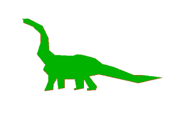

# 在 C

中使用 OPENGL 进行扫描线多边形填充

> 原文:[https://www . geesforgeks . org/scan-line-polygon-filling-use-OpenGL-c/](https://www.geeksforgeeks.org/scan-line-polygon-filling-using-opengl-c/)

计算机屏幕上的图形可以用多边形绘制。为了用颜色填充这些图形，我们需要开发一些算法。为此，有两种著名的算法:边界填充和扫描线填充算法。
边界填充需要大量处理，因此实时遇到的问题很少。因此，可行的替代方案是扫描线填充，因为它本质上非常健壮。本文讨论如何使用扫描线填充算法来填充图像中的颜色。

**扫描线多边形填充算法**

扫描线填充基本上是使用水平线或扫描线填充多边形。SLPF 算法的目的是仅给定图形的顶点来填充(着色)多边形的内部像素。为了理解扫描线，想象一下用单支笔从左下方开始，一直画到右边，只画出图像中存在一个点的点，当线完成时，从下一条线开始并继续。
该算法通过将扫描线与多边形边缘相交来工作，并填充相交对之间的多边形。


**多边形顶点的特殊情况:**

1.  如果在顶点相交的两条线都在扫描线的同一侧，则将其视为两点。
2.  如果在顶点相交的线位于扫描线的相对两侧，则只将其视为一个点。

**多边形填充的组件:**

1.  **边桶:**包含边的信息。边缘桶的条目根据您使用的数据结构而有所不同。在下面的例子中，有三个边桶，即:ymax、xofymin、
    slopeinverse。
2.  **边表:**它由几个边列表组成- >保存组成图形的所有边。当创建边时，边的顶点需要从左到右排序，并且这些边保持递增的 yMin 顺序。从 ET 中移除所有边缘后，填充完成
3.  **活动列表:**它保持当前用于填充多边形的边。当一条边的 yMin 等于正在处理的当前扫描线时，该边被从边表推入到自动线中。
    活动列表将在每次通过后重新排序。

**数据结构:**


```
Algorithm:

1\. We will process the polygon edge after edge, and store in the edge Table.
2\. Storing is done by storing the edge in the same scanline edge tuple as 
   the lowermost point's y-coordinate value of the edge.
3\. After addition of any edge in an edge tuple, the tuple is 
   sorted using insertion sort, according to its xofymin value.
4\. After the whole polygon is added to the edge table, 
   the figure is now filled.
5\. Filling is started from the first scanline at the bottom,
   and continued till the top.
6\. Now the active edge table is taken and the following things 
   are repeated for each scanline:
       i. Copy all edge buckets of the designated scanline 
          to the active edge tuple
       ii. Perform an insertion sort according
          to the xofymin values
       iii. Remove all edge buckets whose ymax is equal 
            or greater than the scanline
       iv. Fillup pairs of edges in active tuple, if any vertex is got, 
           follow these instructions:
            o If both lines intersecting at the vertex are on
              the same side of the scanline, consider it as two points.
            o If lines intersecting at the vertex are at 
              opposite sides of the scanline, consider it as only one point.
       v. Update the xofymin by adding slopeinverse for each bucket.

```

**样本图像**

我们使用的是多边形恐龙的例子。将以下内容粘贴到可执行文件所在文件夹的文本文件中，并将其重命名为聚二号 txt。
链接:[聚二号 txt](https://github.com/sprtkd/someCCodes/blob/master/graphix/ass6/PolyDino.txt)T3】

## C

```
// CPP program to illustrate
// Scanline Polygon fill Algorithm

#include <stdio.h>
#include <math.h>
#include <GL/glut.h>
#define maxHt 800
#define maxWd 600
#define maxVer 10000

FILE *fp;

// Start from lower left corner
typedef struct edgebucket
{
    int ymax;   //max y-coordinate of edge
    float xofymin;  //x-coordinate of lowest edge point updated only in aet
    float slopeinverse;
}EdgeBucket;

typedef struct edgetabletup
{
    // the array will give the scanline number
    // The edge table (ET) with edges entries sorted
    // in increasing y and x of the lower end

    int countEdgeBucket;    //no. of edgebuckets
    EdgeBucket buckets[maxVer];
}EdgeTableTuple;

EdgeTableTuple EdgeTable[maxHt], ActiveEdgeTuple;

// Scanline Function
void initEdgeTable()
{
    int i;
    for (i=0; i<maxHt; i++)
    {
        EdgeTable[i].countEdgeBucket = 0;
    }

    ActiveEdgeTuple.countEdgeBucket = 0;
}

void printTuple(EdgeTableTuple *tup)
{
    int j;

    if (tup->countEdgeBucket)
        printf("\nCount %d-----\n",tup->countEdgeBucket);

        for (j=0; j<tup->countEdgeBucket; j++)
        {
            printf(" %d+%.2f+%.2f",
            tup->buckets[j].ymax, tup->buckets[j].xofymin,tup->buckets[j].slopeinverse);
        }
}

void printTable()
{
    int i,j;

    for (i=0; i<maxHt; i++)
    {
        if (EdgeTable[i].countEdgeBucket)
            printf("\nScanline %d", i);

        printTuple(&EdgeTable[i]);
    }
}

/* Function to sort an array using insertion sort*/
void insertionSort(EdgeTableTuple *ett)
{
    int i,j;
    EdgeBucket temp;

    for (i = 1; i < ett->countEdgeBucket; i++)
    {
        temp.ymax = ett->buckets[i].ymax;
        temp.xofymin = ett->buckets[i].xofymin;
        temp.slopeinverse = ett->buckets[i].slopeinverse;
        j = i - 1;

    while ((temp.xofymin < ett->buckets[j].xofymin) && (j >= 0))
    {
        ett->buckets[j + 1].ymax = ett->buckets[j].ymax;
        ett->buckets[j + 1].xofymin = ett->buckets[j].xofymin;
        ett->buckets[j + 1].slopeinverse = ett->buckets[j].slopeinverse;
        j = j - 1;
    }
    ett->buckets[j + 1].ymax = temp.ymax;
    ett->buckets[j + 1].xofymin = temp.xofymin;
    ett->buckets[j + 1].slopeinverse = temp.slopeinverse;
    }
}

void storeEdgeInTuple (EdgeTableTuple *receiver,int ym,int xm,float slopInv)
{
    // both used for edgetable and active edge table..
    // The edge tuple sorted in increasing ymax and x of the lower end.
    (receiver->buckets[(receiver)->countEdgeBucket]).ymax = ym;
    (receiver->buckets[(receiver)->countEdgeBucket]).xofymin = (float)xm;
    (receiver->buckets[(receiver)->countEdgeBucket]).slopeinverse = slopInv;

    // sort the buckets
    insertionSort(receiver);

    (receiver->countEdgeBucket)++;

}

void storeEdgeInTable (int x1,int y1, int x2, int y2)
{
    float m,minv;
    int ymaxTS,xwithyminTS, scanline; //ts stands for to store

    if (x2==x1)
    {
        minv=0.000000;
    }
    else
    {
    m = ((float)(y2-y1))/((float)(x2-x1));

    // horizontal lines are not stored in edge table
    if (y2==y1)
        return;

    minv = (float)1.0/m;
    printf("\nSlope string for %d %d & %d %d: %f",x1,y1,x2,y2,minv);
    }

    if (y1>y2)
    {
        scanline=y2;
        ymaxTS=y1;
        xwithyminTS=x2;
    }
    else
    {
        scanline=y1;
        ymaxTS=y2;
        xwithyminTS=x1;    
    }
    // the assignment part is done..now storage..
    storeEdgeInTuple(&EdgeTable[scanline],ymaxTS,xwithyminTS,minv);

}

void removeEdgeByYmax(EdgeTableTuple *Tup,int yy)
{
    int i,j;
    for (i=0; i< Tup->countEdgeBucket; i++)
    {
        if (Tup->buckets[i].ymax == yy)
        {
            printf("\nRemoved at %d",yy);

            for ( j = i ; j < Tup->countEdgeBucket -1 ; j++ )
                {
                Tup->buckets[j].ymax =Tup->buckets[j+1].ymax;
                Tup->buckets[j].xofymin =Tup->buckets[j+1].xofymin;
                Tup->buckets[j].slopeinverse = Tup->buckets[j+1].slopeinverse;
                }
                Tup->countEdgeBucket--;
            i--;
        }
    }
}    

void updatexbyslopeinv(EdgeTableTuple *Tup)
{
    int i;

    for (i=0; i<Tup->countEdgeBucket; i++)
    {
        (Tup->buckets[i]).xofymin =(Tup->buckets[i]).xofymin + (Tup->buckets[i]).slopeinverse;
    }
}

void ScanlineFill()
{
    /* Follow the following rules:
    1\. Horizontal edges: Do not include in edge table
    2\. Horizontal edges: Drawn either on the bottom or on the top.
    3\. Vertices: If local max or min, then count twice, else count
        once.
    4\. Either vertices at local minima or at local maxima are drawn.*/

    int i, j, x1, ymax1, x2, ymax2, FillFlag = 0, coordCount;

    // we will start from scanline 0;
    // Repeat until last scanline:
    for (i=0; i<maxHt; i++)//4\. Increment y by 1 (next scan line)
    {

        // 1\. Move from ET bucket y to the
        // AET those edges whose ymin = y (entering edges)
        for (j=0; j<EdgeTable[i].countEdgeBucket; j++)
        {
            storeEdgeInTuple(&ActiveEdgeTuple,EdgeTable[i].buckets[j].
                     ymax,EdgeTable[i].buckets[j].xofymin,
                    EdgeTable[i].buckets[j].slopeinverse);
        }
        printTuple(&ActiveEdgeTuple);

        // 2\. Remove from AET those edges for
        // which y=ymax (not involved in next scan line)
        removeEdgeByYmax(&ActiveEdgeTuple, i);

        //sort AET (remember: ET is presorted)
        insertionSort(&ActiveEdgeTuple);

        printTuple(&ActiveEdgeTuple);

        //3\. Fill lines on scan line y by using pairs of x-coords from AET
        j = 0;
        FillFlag = 0;
        coordCount = 0;
        x1 = 0;
        x2 = 0;
        ymax1 = 0;
        ymax2 = 0;
        while (j<ActiveEdgeTuple.countEdgeBucket)
        {
            if (coordCount%2==0)
            {
                x1 = (int)(ActiveEdgeTuple.buckets[j].xofymin);
                ymax1 = ActiveEdgeTuple.buckets[j].ymax;
                if (x1==x2)
                {
                /* three cases can arrive-
                    1\. lines are towards top of the intersection
                    2\. lines are towards bottom
                    3\. one line is towards top and other is towards bottom
                */
                    if (((x1==ymax1)&&(x2!=ymax2))||((x1!=ymax1)&&(x2==ymax2)))
                    {
                        x2 = x1;
                        ymax2 = ymax1;
                    }

                    else
                    {
                        coordCount++;
                    }
                }

                else
                {
                        coordCount++;
                }
            }
            else
            {
                x2 = (int)ActiveEdgeTuple.buckets[j].xofymin;
                ymax2 = ActiveEdgeTuple.buckets[j].ymax;

                FillFlag = 0;

                // checking for intersection...
                if (x1==x2)
                {
                /*three cases can arrive-
                    1\. lines are towards top of the intersection
                    2\. lines are towards bottom
                    3\. one line is towards top and other is towards bottom
                */
                    if (((x1==ymax1)&&(x2!=ymax2))||((x1!=ymax1)&&(x2==ymax2)))
                    {
                        x1 = x2;
                        ymax1 = ymax2;
                    }
                    else
                    {
                        coordCount++;
                        FillFlag = 1;
                    }
                }
                else
                {
                        coordCount++;
                        FillFlag = 1;
                }

            if(FillFlag)
            {
                //drawing actual lines...
                glColor3f(0.0f,0.7f,0.0f);

                glBegin(GL_LINES);
                glVertex2i(x1,i);
                glVertex2i(x2,i);
                glEnd();
                glFlush();        

                // printf("\nLine drawn from %d,%d to %d,%d",x1,i,x2,i);
            }

        }

        j++;
    }

    // 5\. For each nonvertical edge remaining in AET, update x for new y
    updatexbyslopeinv(&ActiveEdgeTuple);
}

printf("\nScanline filling complete");

}

void myInit(void)
{

    glClearColor(1.0,1.0,1.0,0.0);
    glMatrixMode(GL_PROJECTION);

    glLoadIdentity();
    gluOrtho2D(0,maxHt,0,maxWd);
    glClear(GL_COLOR_BUFFER_BIT);
}

void drawPolyDino()
{

    glColor3f(1.0f,0.0f,0.0f);
    int count = 0,x1,y1,x2,y2;
    rewind(fp);
    while(!feof(fp) )
    {
        count++;
        if (count>2)
        {
            x1 = x2;
            y1 = y2;
            count=2;
        }
        if (count==1)
        {
            fscanf(fp, "%d,%d", &x1, &y1);
        }
        else
        {
            fscanf(fp, "%d,%d", &x2, &y2);
            printf("\n%d,%d", x2, y2);
            glBegin(GL_LINES);
                glVertex2i( x1, y1);
                glVertex2i( x2, y2);
            glEnd();
            storeEdgeInTable(x1, y1, x2, y2);//storage of edges in edge table.

            glFlush();
        }
    }

}

void drawDino(void)
{
    initEdgeTable();
    drawPolyDino();
    printf("\nTable");
    printTable();

    ScanlineFill();//actual calling of scanline filling..
}

void main(int argc, char** argv)
{
    fp=fopen ("PolyDino.txt","r");
    if ( fp == NULL )
    {
        printf( "Could not open file" ) ;
        return;
    }
    glutInit(&argc, argv);
    glutInitDisplayMode(GLUT_SINGLE | GLUT_RGB);
    glutInitWindowSize(maxHt,maxWd);
    glutInitWindowPosition(100, 150);
    glutCreateWindow("Scanline filled dinosaur");
    myInit();
    glutDisplayFunc(drawDino);

    glutMainLoop();
    fclose(fp);
}
```

输出:
填满恐龙:



注意:在 opengl 窗口中查看您的输出。请注意，您必须安装过量。你可以看[这个](https://github.com/sprtkd/someCCodes/blob/master/graphix/a.avi)视频观看输出。
本文由**掌门人**供稿。如果你喜欢 GeeksforGeeks 并想投稿，你也可以使用[write.geeksforgeeks.org](https://write.geeksforgeeks.org)写一篇文章或者把你的文章邮寄到 review-team@geeksforgeeks.org。看到你的文章出现在极客博客主页上，帮助其他极客。
如果发现有不正确的地方，或者想分享更多关于上述话题的信息，请写评论。