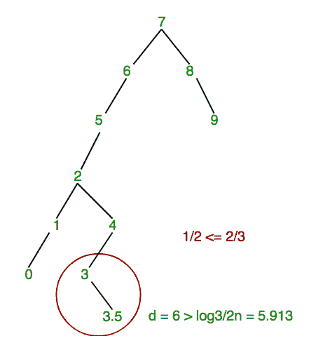
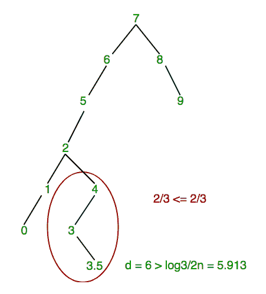
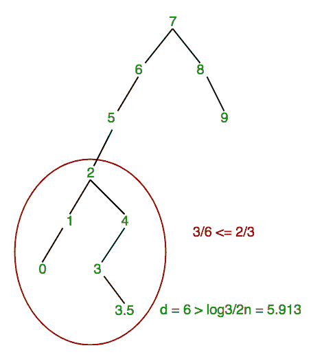
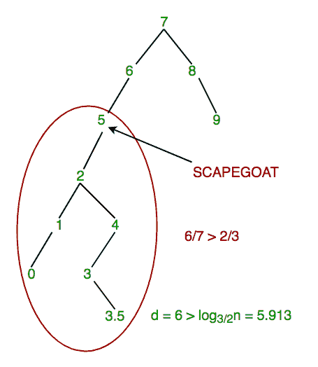
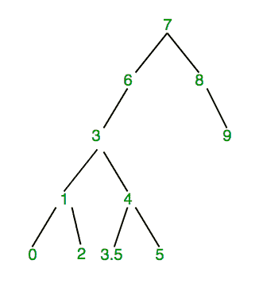

# 替罪羊树|集合 1(引入和插入)

> 原文:[https://www . geesforgeks . org/替罪羊-树-集合-1-介绍-插入/](https://www.geeksforgeeks.org/scapegoat-tree-set-1-introduction-insertion/)

替罪羊树是像 [AVL 树](https://www.geeksforgeeks.org/avl-tree-set-1-insertion/)[红黑树](https://www.geeksforgeeks.org/red-black-tree-set-1-introduction-2/)[八字树](https://www.geeksforgeeks.org/splay-tree-set-1-insert/)一样的自平衡二叉查找树，..等等。

*   在最坏的情况下，搜索时间为 0(对数 n)。删除和插入所花费的时间是[摊销的](https://www.geeksforgeeks.org/analysis-algorithm-set-5-amortized-analysis-introduction/) O(Log n)
*   平衡思想是确保节点是α大小平衡的。α大小平衡意味着左右子树的大小最多为α *(节点大小)。这个想法是基于这样一个事实:*如果一个节点是α权重平衡的，那么它也是高度平衡的:高度<= log<sub>1/&aplpha；(大小)+ 1= ></sub>*
*   与其他自平衡 BST 不同，替罪羊树不需要每个节点额外的空间。例如，红黑树节点需要有颜色。在下面替罪羊树的实现中，我们在节点类中只有左、右和父指针。使用父级是为了实现简单，可以避免。

**插入(假设α = 2/3):**
要在替罪羊树中插入值 **x** :

*   创建一个新节点 **u** 并使用 [BST insert](http://geeksquiz.com/binary-search-tree-set-1-search-and-insertion/) 算法插入 x。
*   如果 **u** 的深度大于 log <sub>3/2</sub> n，其中 n 是树中的节点数，那么我们需要使树平衡。为了做到平衡，我们用下面的步骤来找一个替罪羊。
    *   从 **u** 向上走，直到我们到达一个节点 **w** ，大小为(w)>(2/3)*大小(w 母)。这个节点是替罪羊
    *   重建以 w.parent 为根的子树。

**重建子树是什么意思？**
在重建中，我们只需将子树转换为最可能平衡的 BST。我们首先在一个数组中存储对 BST 的有序遍历，然后通过递归地将数组分成两半来构建一个新的 BST。

```
        60                            50
       /                           /     \
      40                          42       58
        \          Rebuild      /    \    /   \
         50       --------->  40      47 55    60
           \
            55
           /   \
         47     58
        /
      42 

```

下面是替罪羊树上插入操作的 C++实现。

```
// C++ program to implement insertion in
// ScapeGoat Tree
#include<bits/stdc++.h>
using namespace std;

// Utility function to get value of log32(n)
static int const log32(int n)
{
    double const log23 = 2.4663034623764317;
    return (int)ceil(log23 * log(n));
}

// A ScapeGoat Tree node
class Node
{
public:
    Node *left, *right, *parent;
    float value;
    Node()
    {
        value = 0;
        left = right = parent = NULL;
    }
    Node (float v)
    {
        value = v;
        left = right = parent = NULL;
    }
};

// This functions stores inorder traversal
// of tree rooted with ptr in an array arr[]
int storeInArray(Node *ptr, Node *arr[], int i)
{
    if (ptr == NULL)
        return i;

    i = storeInArray(ptr->left, arr, i);
    arr[i++] = ptr;
    return storeInArray(ptr->right, arr, i);
}

// Class to represent a ScapeGoat Tree
class SGTree
{
private:
    Node *root;
    int n;  // Number of nodes in Tree
public:
    void preorder(Node *);
    int size(Node *);
    bool insert(float x);
    void rebuildTree(Node *u);
    SGTree()     { root = NULL; n = 0; }
    void preorder() { preorder(root);  }

    // Function to built tree with balanced nodes
    Node *buildBalancedFromArray(Node **a, int i, int n);

    // Height at which element is to be added
    int BSTInsertAndFindDepth(Node *u);
};

// Preorder traversal of the tree
void SGTree::preorder(Node *node)
{
    if (node != NULL)
    {
        cout << node->value << " ";
        preorder(node -> left);
        preorder(node -> right);
    }
}

// To count number of nodes in the tree
int SGTree::size(Node *node)
{
    if (node == NULL)
        return 0;
    return 1 + size(node->left) + size(node->right);
}

// To insert new element in the tree
bool SGTree::insert(float x)
{
    // Create a new node
    Node *node = new Node(x);

    // Perform BST insertion and find depth of
    // the inserted node.
    int h = BSTInsertAndFindDepth(node);

    // If tree becomes unbalanced
    if (h > log32(n))
    {
        // Find Scapegoat
        Node *p = node->parent;
        while (3*size(p) <= 2*size(p->parent))
            p = p->parent;

        // Rebuild tree rooted under scapegoat
        rebuildTree(p->parent);
    }

    return h >= 0;
}

// Function to rebuilt tree from new node. This
// function basically uses storeInArray() to
// first store inorder traversal of BST rooted
// with u in an array.
// Then it converts array to the most possible
// balanced BST using buildBalancedFromArray()
void SGTree::rebuildTree(Node *u)
{
    int n = size(u);
    Node *p = u->parent;
    Node **a = new Node* [n];
    storeInArray(u, a, 0);
    if (p == NULL)
    {
        root = buildBalancedFromArray(a, 0, n);
        root->parent = NULL;
    }
    else if (p->right == u)
    {
        p->right = buildBalancedFromArray(a, 0, n);
        p->right->parent = p;
    }
    else
    {
        p->left = buildBalancedFromArray(a, 0, n);
        p->left->parent = p;
    }
}

// Function to built tree with balanced nodes
Node * SGTree::buildBalancedFromArray(Node **a,
                                  int i, int n)
{
    if (n== 0)
        return NULL;
    int m = n / 2;

    // Now a[m] becomes the root of the new
    // subtree a[0],.....,a[m-1]
    a[i+m]->left = buildBalancedFromArray(a, i, m);

    // elements a[0],...a[m-1] gets stored
    // in the left subtree
    if (a[i+m]->left != NULL)
        a[i+m]->left->parent = a[i+m];

    // elements a[m+1],....a[n-1] gets stored
    // in the right subtree
    a[i+m]->right =
         buildBalancedFromArray(a, i+m+1, n-m-1);
    if (a[i+m]->right != NULL)
        a[i+m]->right->parent = a[i+m];

    return a[i+m];
}

// Performs standard BST insert and returns
// depth of the inserted node.
int SGTree::BSTInsertAndFindDepth(Node *u)
{
    // If tree is empty
    Node *w = root;
    if (w == NULL)
    {
        root = u;
        n++;
        return 0;
    }

    // While the node is not inserted
    // or a node with same key exists.
    bool done = false;
    int d = 0;
    do
    {
        if (u->value < w->value)
        {
            if (w->left == NULL)
            {
                w->left = u;
                u->parent = w;
                done = true;
            }
            else
                w = w->left;
        }
        else if (u->value > w->value)
        {
            if (w->right == NULL)
            {
                w->right = u;
                u->parent = w;
                done = true;
            }
            else
                w = w->right;
        }
        else
            return -1;
        d++;
    }
    while (!done);

    n++;
    return d;
}

// Driver code
int main()
{
    SGTree sgt;
    sgt.insert(7);
    sgt.insert(6);
    sgt.insert(3);
    sgt.insert(1);
    sgt.insert(0);
    sgt.insert(8);
    sgt.insert(9);
    sgt.insert(4);
    sgt.insert(5);
    sgt.insert(2);
    sgt.insert(3.5);
    printf("Preorder traversal of the"
           " constructed ScapeGoat tree is \n");
    sgt.preorder();
    return 0;
}
```

输出:

```
Preorder traversal of the constructed ScapeGoat tree is 
7 6 3 1 0 2 4 3.5 5 8 9 

```

<center>**Example to illustrate insertion:**</center>

A scapegoat tree with 10 nodes and height 5.

```

               7
             /  \
            6    8
           /      \
          5        9
        /
       2
     /  \
    1    4
   /    /  
  0    3 

Let’s insert 3.5 in the below scapegoat tree.

```

最初 d = 5 < log <sub>3/2</sub> n，其中 n = 10
T3】

既然，d > log <sub>3/2</sub> n 即 6 > log <sub>3/2</sub> n，那么为了解决身高超标的问题，我们就要找替罪羊了。

*   现在我们找到一个替罪羊。我们从新添加的节点 3.5 开始，检查大小(3.5)/大小(3) >2/3。
*   因为，大小(3.5) = 1，大小(3) = 2，所以大小(3.5)/大小(3) =小于 2/3。所以，这不是替罪羊，我们继续前进。

[](https://media.geeksforgeeks.org/wp-content/uploads/scapegoat-tree-1.png)

*   **由于 3 不是替罪羊，我们移动并检查节点 4 的相同条件。因为大小(3) = 2，大小(4) = 3，所以大小(3)/大小(4) = 2/3，不大于 2/3。所以，这不是替罪羊，我们继续前进。**

****

*   ******由于 3 不是替罪羊，我们移动并检查节点 4 的相同条件。因为，大小(3) = 2，大小(4) = 3，所以大小(3)/大小(4) = 2/3，不大于 2/3。所以，这不是替罪羊，我们继续前进。******

*   ********现在，size(4)/size(2) = 3/6。因为，大小(4)= 3，大小(2) = 6，但 3/6 仍然小于 2/3，这不满足替罪羊的条件，所以我们再次上移。********

************

*   ********现在，大小(2)/大小(5) = 6/7。因为，大小(2) = 6，大小(5) = 7。6/7 > 2/3 满足替罪羊的条件，所以我们到此为止，因此节点 5 是替罪羊********

******
最后，找到替罪羊后，在以替罪羊为根的子树即 5 处进行重建。******

******最终树:
[](https://media.geeksforgeeks.org/wp-content/uploads/scapegoat-tree-5.png)******

********与其他自平衡 BST 的比较**
红黑棋和 AVL:搜索、插入和删除的时间复杂度为 O(Log n)
显示树:搜索、插入和删除的最坏情况时间复杂度为 O(n)。但是这些操作的摊余时间复杂度是 O(Log n)。
替罪羊树:和八字树一样，容易实现，搜索的最坏情况时间复杂度为 O(Log n)。插入和删除的最坏情况和摊余时间复杂性与替罪羊树的显示树相同。******

********参考文献:********

*   ******[https://en.wikipedia.org/wiki/Scapegoat_tree](https://en.wikipedia.org/wiki/Scapegoat_tree)******
*   ******[http://open data structures . org/ODS-Java/8 _ 替罪羊 _Trees.html](http://opendatastructures.org/ods-java/8_Scapegoat_Trees.html)******

******本文由**拉胡尔·阿加尔瓦尔、[萨希尔·查布拉(akku)](https://www.facebook.com/sahil.chhabra.965)** 供稿。如果你喜欢极客博客并想投稿，你也可以写一篇文章并把你的文章邮寄到 contribute@geeksforgeeks.org。看到你的文章出现在极客博客主页上，帮助其他极客。******

******如果您发现任何不正确的地方，或者您想分享更多关于上面讨论的主题的信息，请写评论******