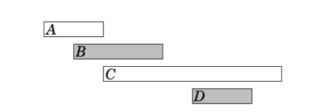
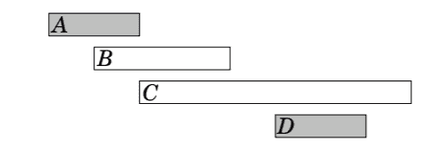
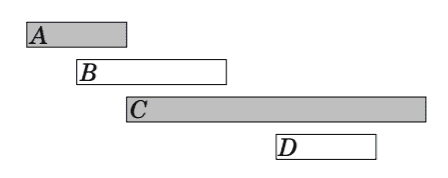
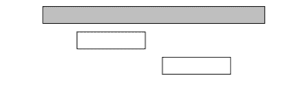
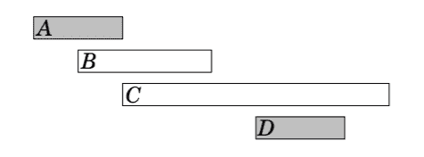

# 贪婪算法中的调度

> 原文:[https://www . geeksforgeeks . org/贪婪算法调度/](https://www.geeksforgeeks.org/scheduling-in-greedy-algorithms/)

在本文中，我们将讨论[贪婪算法](https://www.geeksforgeeks.org/greedy-algorithms/)的各种调度算法。许多[调度](https://www.geeksforgeeks.org/cpu-scheduling-in-operating-systems/)问题可以使用贪婪算法来解决。

**问题陈述:**给定 **N** 个事件及其开始和结束时间，找到一个包含尽可能多事件的时间表。不可能部分选择事件。考虑以下事件:

*   在这种情况下，事件的最大数量是两个。**作为**选定的赛事 **B** 和 **D** 如下:

*   有可能发明几个贪婪算法来解决这个问题。

适用于所有情况的算法:

**<u>算法 1</u> :**

*   第一个想法是选择尽可能短的事件。在该示例中，该算法选择以下事件:

*   然而，选择短事件并不总是正确的策略。例如，算法在以下情况下失败:

*   如果选择了短事件，它只能选择一个事件。然而，两个长项都可以选择。

**<u>算法 2</u> :**

*   另一个想法是总是尽可能早地选择下一个可能开始的事件。该算法选择以下事件:

*   然而，给出了这个算法的反例。在这种情况下，算法只选择一个事件:

*   如果选择了第一个事件，则无法选择任何其他事件。然而，有可能选择另外两个事件。

**<u>算法 3</u> :**

*   第三个想法是总是尽可能早地选择下一个可能结束的事件。该算法选择以下事件:

*   事实证明，这种算法总能产生一个最优解。
*   这样做的原因是，首先选择一个尽可能早结束的事件总是一个最佳选择。
*   在此之后，使用相同的策略选择下一个事件是最佳选择，等等。，直到无法选择任何其他事件。
*   一种方法是算法的工作原理是考虑如果首先选择一个结束得晚于结束得早的事件会发生什么。
*   现在，最多有相同数量的选择，如何选择下一个事件。
*   因此，选择稍后结束的事件永远不会产生更好的解决方案，而贪婪算法是正确的。