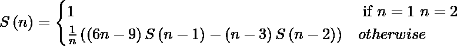

# 【薛定谔-嬉皮数字】

> 原文:[https://www.geeksforgeeks.org/schroder-hipparchus-number/](https://www.geeksforgeeks.org/schroder-hipparchus-number/)

[施罗德-希帕克数](https://en.wikipedia.org/wiki/Schr%C3%B6der%E2%80%93Hipparchus_number)构成了一个整数序列，可以用来计算给定一组叶子的平面树的数量、在序列中插入括号的方法的数量以及通过插入对角线将凸多边形分解成更小多边形的方法的数量。

施罗德-希帕克数可以用递推关系定义:


施罗德-希帕克数可以用来计算几个密切相关的组合对象:

1.  序列中的第 n 个数字计算通过添加原始多边形的对角线将 n + 1 条边的多边形细分为更小的多边形的不同方式的数量。详见[本](https://en.wikipedia.org/wiki/Schr%C3%B6der%E2%80%93Hipparchus_number#/media/File:Tree-polygon-paren_equivalence.svg)图。
    图片来源:[维基百科](https://en.wikipedia.org/wiki/Schr%C3%B6der%E2%80%93Hipparchus_number#/media/File:Tree-polygon-paren_equivalence.svg)
2.  第 n 个数字计算具有 n 个叶子和所有内部顶点具有两个或更多子级的不同平面树的数量。
3.  第 n 个数字计算在 n 个符号的序列中插入括号的不同方式的数量，每对括号包围两个或多个符号或带圆括号的组，并且没有任何括号包围整个序列。
4.  第 n 个数计算 n 维的关联面 Kn + 1 的所有维的面的个数？1，包括 associahedron 本身作为面，但不包括空集。例如，K4 二维协会是一个五边形；它有五个顶点、五个面和一个完整的关联面，总共有 11 个面。
5.  计算避免排列模式 12312 和 121323 的双排列(从 1 到 n 的数字序列，每个数字出现两次，每个数字的第一次出现按排序顺序排列)的数量。

**示例:**

```
Input : n = 5
Output : 45

Input : n = 6
Output : 197
```

一个简单的解决方案是简单地实现一个数字的递归公式。

## C++

```
// A simple recursive CPP program to find n-th
// Schröder–Hipparchus number
#include <bits/stdc++.h>
using namespace std;
int nthSHN(int n)
{
    if (n == 1 || n == 2)
        return 1;

    return ((6 * n - 9) * nthSHN(n - 1) -
           (n - 3) * nthSHN(n - 2)) / n;
}

// Driven Program
int main()
{
    int n = 6;
    cout << nthSHN(n) << endl;
    return 0;
}
```

## Java 语言(一种计算机语言，尤用于创建网站)

```
// A simple recursive Java program to
// find n-th Schroder-Hipparchus number
class GFG
{
static int nthSHN(int n)
{
    if (n == 1 || n == 2)
        return 1;

    return ((6 * n - 9) * nthSHN(n - 1) -
        (n - 3) * nthSHN(n - 2)) / n;
}

// Driver code
public static void main (String[] args)
{
    int n = 6;
    System.out.println(nthSHN(n));
}
}

// This code is contributed by Anant Agarwal.
```

## 蟒蛇 3

```
# A simple recursive Python3 program to
# find n-th Schröder–Hipparchus numberr

def nthSHN(n):
    if (n == 1 or n == 2):
        return 1
    else:
        return ((6 * n - 9) * nthSHN(n - 1) -
               ((n - 3) * nthSHN(n - 2))) / n

# Driven Program
n = 6
print (nthSHN(n))

# This code is contributed by Sachin Bisht
```

## C#

```
// A simple recursive C# program to
// find n-th Schroder-Hipparchus number
using System;

class GFG
{
    static int nthSHN(int n)
    {
        if (n == 1 || n == 2)
            return 1;

        return ((6 * n - 9) * nthSHN(n - 1) -
                (n - 3) * nthSHN(n - 2)) / n;
    }

    // Driver code
    public static void Main ()
    {
        int n = 6;
        Console.WriteLine(nthSHN(n));
    }
}

// This code is contributed by vt_m.
```

## 服务器端编程语言（Professional Hypertext Preprocessor 的缩写）

```
<?php
// A simple recursive PHP
// program to find n-th
// Schröder–Hipparchus number

// function returns the n-th
// Schröder–Hipparchus number
function nthSHN( $n)
{
    if ($n == 1 || $n == 2)
        return 1;

    return ((6 * $n - 9) * nthSHN($n - 1) -
           ($n - 3) * nthSHN($n - 2)) / $n;
}

    // Driver Program
    $n = 6;
    echo nthSHN($n);

// This code is contributed by anuj_67.
?>
```

## java 描述语言

```
<script>

// Javascript Program program to
// find n-th Schroder-Hipparchus number
function nthSHN(n)
{
    if (n == 1 || n == 2)
        return 1;

    return ((6 * n - 9) * nthSHN(n - 1) -
                (n - 3) * nthSHN(n - 2)) / n;
}

// Driver code
let n = 6;

document.write(nthSHN(n));

// This code is contributed by sanjoy_62

</script>
```

**输出:**

```
197
```

下面是寻找第 n 个施罗德-希帕克数的动态规划解:

## C++

```
// A memoization based optimized CPP program to
// find n-th Schröder–Hipparchus number
#include <bits/stdc++.h>
#define MAX 500
using namespace std;

int nthSHN(int n, int dp[])
{
    if (n == 1 || n == 2)
        return dp[n] = 1;

    if (dp[n] != -1)
        return dp[n];

    return dp[n] = ((6 * n - 9) * nthSHN(n - 1, dp) -
                   (n - 3) * nthSHN(n - 2, dp)) / n;
}

// Driven Program
int main()
{
    int n = 6;
    int dp[MAX];
    memset(dp, -1, sizeof dp);
    cout << nthSHN(n, dp) << endl;
    return 0;
}
```

## Java 语言(一种计算机语言，尤用于创建网站)

```
// A memoization based optimized
// Java program to find n-th
// Schroder-Hipparchus number
import java.util.Arrays;

class GFG
{
static final int MAX=500;

static int nthSHN(int n, int dp[])
{
    if (n == 1 || n == 2)
        return dp[n] = 1;

    if (dp[n] != -1)
        return dp[n];

    return dp[n] = ((6 * n - 9) * nthSHN(n - 1, dp) -
                     (n - 3) * nthSHN(n - 2, dp)) / n;
}

// Driver code
public static void main (String[] args)
{
    int n = 6;
    int dp[] = new int[MAX];
    Arrays.fill(dp, -1);
    System.out.println(nthSHN(n, dp));
}
}

// This code is contributed by Anant Agarwal.
```

## 蟒蛇 3

```
# A memoization based optimized
# Python3 program to find n-th
# Schröder–Hipparchus number

def nthSHN(n, dp):
    if (n == 1 or n == 2):
        dp[n] = 1
        return dp[n]

    if (dp[n] != -1):
        return dp[n]

    dp[n] = ((6 * n - 9) * nthSHN(n - 1, dp) -
             (n - 3) * nthSHN(n - 2, dp)) / n
    return dp[n]

# Driven Program
n = 6;
dp = [-1 for i in range(500)]
print (nthSHN(n, dp))

# This code is contributed by Sachin Bisht
```

## C#

```
// A memoization based optimized
// C# program to find n-th
// Schroder-Hipparchus number
using System;

class GFG
{
static int MAX = 500;

static int nthSHN(int n, int[] dp)
{
    if (n == 1 || n == 2)
        return dp[n] = 1;

    if (dp[n] != -1)
        return dp[n];

    return dp[n] = ((6 * n - 9) *
                     nthSHN(n - 1, dp) -
                    (n - 3) *
                     nthSHN(n - 2, dp)) / n;
}

// Driver code
public static void Main ()
{
    int n = 6;
    int[] dp = new int[MAX];
    for(int i = 0; i < dp.Length; i++)
    dp[i] = -1;
    Console.Write(nthSHN(n, dp));
}
}

// This code is contributed by mits.
```

## 服务器端编程语言（Professional Hypertext Preprocessor 的缩写）

```
<?php
// A memoization based optimized
// PHP program to find n-th
// Schröder–Hipparchus number
$MAX = 500;

function nthSHN($n, $dp)
{
    if ($n == 1 || $n == 2)
        return $dp[$n] = 1;

    if ($dp[$n] != -1)
        return $dp[$n];

    return $dp[$n] = ((6 * $n - 9) *
                       nthSHN($n - 1, $dp) -
                      ($n - 3) *
                       nthSHN($n - 2, $dp)) / $n;
}

// Driver Code
$n = 6;

$dp=array_fill(0, $MAX, true);
echo nthSHN($n, $dp), "\n";

// This code is contributed by ajit
?>
```

## java 描述语言

```
<script>
    // A memoization based optimized
    // Javascript program to find n-th
    // Schroder-Hipparchus number

    let MAX = 500;

    function nthSHN(n, dp)
    {
        if (n == 1 || n == 2)
            return dp[n] = 1;

        if (dp[n] != -1)
            return dp[n];

        return dp[n] = ((6 * n - 9) * nthSHN(n - 1, dp) - (n - 3) * nthSHN(n - 2, dp)) / n;
    }

    let n = 6;
    let dp = new Array(MAX);
    for(let i = 0; i < dp.length; i++)
        dp[i] = -1;
    document.write(nthSHN(n, dp));

</script>
```

**输出:**

```
197
```

资料来源:[https://en . Wikipedia . org/wiki/sch % C3 % B6 % E2 % 80% 93 hippoarch _ number](https://en.wikipedia.org/wiki/Schr%C3%B6der%E2%80%93Hipparchus_number)T3]