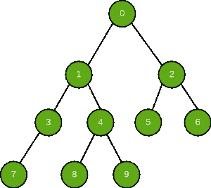

# 在二叉树中搜索一个节点

> 原文:[https://www.geeksforgeeks.org/search-a-node-in-binary-tree/](https://www.geeksforgeeks.org/search-a-node-in-binary-tree/)

给定一个[二叉树](https://www.geeksforgeeks.org/binary-tree-data-structure/)和一个节点。任务是搜索并检查给定的节点是否存在于二叉树中。如果存在，打印是，否则打印否
**给定二叉树** :



**示例**:

```
Input: Node = 4
Output: YES

Input: Node = 40
Output: NO
```

想法是使用任何[树遍历](https://www.geeksforgeeks.org/tree-traversals-inorder-preorder-and-postorder/)遍历树，并在遍历时检查当前节点是否与给定节点匹配。如果任何节点与给定节点匹配，并且停止进一步遍历，则打印是；如果树被完全遍历，并且没有节点与给定节点匹配，则打印否

下面是上述方法的实现:

## C++

```
// C++ program to check if a node exists
// in a binary tree
#include <iostream>
using namespace std;

// Binary tree node
struct Node {
    int data;
    struct Node *left, *right;
    Node(int data)
    {
        this->data = data;
        left = right = NULL;
    }
};

// Function to traverse the tree in preorder
// and check if the given node exists in it
bool ifNodeExists(struct Node* node, int key)
{
    if (node == NULL)
        return false;

    if (node->data == key)
        return true;

    /* then recur on left subtree */
    bool res1 = ifNodeExists(node->left, key);
    // node found, no need to look further
    if(res1) return true;

    /* node is not found in left,
    so recur on right subtree */
    bool res2 = ifNodeExists(node->right, key);

    return res2;
}

// Driver Code
int main()
{
    struct Node* root = new Node(0);
    root->left = new Node(1);
    root->left->left = new Node(3);
    root->left->left->left = new Node(7);
    root->left->right = new Node(4);
    root->left->right->left = new Node(8);
    root->left->right->right = new Node(9);
    root->right = new Node(2);
    root->right->left = new Node(5);
    root->right->right = new Node(6);

    int key = 4;

    if (ifNodeExists(root, key))
        cout << "YES";
    else
        cout << "NO";

    return 0;
}
```

## Java 语言(一种计算机语言，尤用于创建网站)

```
// Java program to check if a node exists
// in a binary tree
class GFG
{

// Binary tree node
static class Node
{
    int data;
    Node left, right;
    Node(int data)
    {
        this.data = data;
        left = right = null;
    }
};

// Function to traverse the tree in preorder
// and check if the given node exists in it
static boolean ifNodeExists( Node node, int key)
{
    if (node == null)
        return false;

    if (node.data == key)
        return true;

    // then recur on left subtree /
    boolean res1 = ifNodeExists(node.left, key);

    // node found, no need to look further
    if(res1) return true;

    // node is not found in left,
    // so recur on right subtree /
    boolean res2 = ifNodeExists(node.right, key);

    return res2;
}

// Driver Code
public static void main(String args[])
{
    Node root = new Node(0);
    root.left = new Node(1);
    root.left.left = new Node(3);
    root.left.left.left = new Node(7);
    root.left.right = new Node(4);
    root.left.right.left = new Node(8);
    root.left.right.right = new Node(9);
    root.right = new Node(2);
    root.right.left = new Node(5);
    root.right.right = new Node(6);

    int key = 4;

    if (ifNodeExists(root, key))
        System.out.println("YES");
    else
        System.out.println("NO");
}
}

// This code is contributed by Arnab Kundu
```

## 蟒蛇 3

```
"""Python program to check if a node exists
in a binary tree."""

# A Binary Tree Node
# Utility function to create a new tree node
class newNode:

    # Constructor to create a newNode
    def __init__(self, data):
        self.data = data
        self.left = None
        self.right = None

# Function to traverse the tree in preorder
# and check if the given node exists in it
def ifNodeExists(node, key):

    if (node == None):
        return False

    if (node.data == key):
        return True

    """ then recur on left subtree """
    res1 = ifNodeExists(node.left, key)
    # node found, no need to look further
    if res1:
        return True

    """ node is not found in left,
    so recur on right subtree """
    res2 = ifNodeExists(node.right, key)

    return res2

# Driver Code
if __name__ == '__main__':
    root = newNode(0)
    root.left = newNode(1)
    root.left.left = newNode(3)
    root.left.left.left = newNode(7)
    root.left.right = newNode(4)
    root.left.right.left = newNode(8)
    root.left.right.right = newNode(9)
    root.right = newNode(2)
    root.right.left = newNode(5)
    root.right.right = newNode(6)

    key = 4

    if (ifNodeExists(root, key)):
        print("YES" )
    else:
        print("NO")

# This code is contributed by SHUBHAMSINGH10
```

## C#

```
// C# program to check if a node exists
// in a binary tree
using System;

class GFG
{

// Binary tree node
public class Node
{
    public int data;
    public Node left, right;
    public Node(int data)
    {
        this.data = data;
        left = right = null;
    }
};

// Function to traverse the tree in preorder
// and check if the given node exists in it
static bool ifNodeExists( Node node, int key)
{
    if (node == null)
        return false;

    if (node.data == key)
        return true;

    // then recur on left subtree /
    bool res1 = ifNodeExists(node.left, key);

    // node found, no need to look further
    if(res1) return true;

    // node is not found in left,
    // so recur on right subtree /
    bool res2 = ifNodeExists(node.right, key);

    return res2;
}

// Driver Code
public static void Main(String []args)
{
    Node root = new Node(0);
    root.left = new Node(1);
    root.left.left = new Node(3);
    root.left.left.left = new Node(7);
    root.left.right = new Node(4);
    root.left.right.left = new Node(8);
    root.left.right.right = new Node(9);
    root.right = new Node(2);
    root.right.left = new Node(5);
    root.right.right = new Node(6);

    int key = 4;

    if (ifNodeExists(root, key))
        Console.WriteLine("YES");
    else
       Console.WriteLine("NO");
}
}

// This code has been contributed by 29AjayKumar
```

## java 描述语言

```
<script>
// javascript program to check if a node exists
// in a binary tree     // Binary tree node
     class Node {

         constructor(data) {
            this.data = data;
            this.left = this.right = null;
        }
    }

    // Function to traverse the tree in preorder
    // and check if the given node exists in it
    function ifNodeExists(node , key) {
        if (node == null)
            return false;

        if (node.data == key)
            return true;

        // then recur on left subtree /
        var res1 = ifNodeExists(node.left, key);

        // node found, no need to look further
        if (res1)
            return true;

        // node is not found in left,
        // so recur on right subtree /
        var res2 = ifNodeExists(node.right, key);

        return res2;
    }

    // Driver Code

var root = new Node(0);
        root.left = new Node(1);
        root.left.left = new Node(3);
        root.left.left.left = new Node(7);
        root.left.right = new Node(4);
        root.left.right.left = new Node(8);
        root.left.right.right = new Node(9);
        root.right = new Node(2);
        root.right.left = new Node(5);
        root.right.right = new Node(6);

        var key = 4;

        if (ifNodeExists(root, key))
            document.write("YES");
        else
            document.write("NO");

// This code is contributed by todaysgaurav
</script>
```

**Output**

```
YES
```