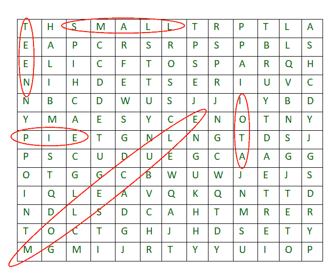

# 在 2D 字符网格中搜索一个单词

> 原文:[https://www . geesforgeks . org/search-a-word-in-a-2d-grid-of-characters/](https://www.geeksforgeeks.org/search-a-word-in-a-2d-grid-of-characters/)

给定一个由字符和单词组成的 2D 网格，在网格中查找给定单词的所有匹配项。一个单词可以在任何一点在所有 8 个方向上匹配。如果所有字符都在一个方向上匹配(不是之字形)，那么单词就被认为是在这个方向上找到的。
8 个方向是，水平向左、水平向右、垂直向上、垂直向下和 4 个对角线方向。
**例:**

```
Input:  grid[][] = {"GEEKSFORGEEKS",
                    "GEEKSQUIZGEEK",
                    "IDEQAPRACTICE"};
        word = "GEEKS"

Output: pattern found at 0, 0
        pattern found at 0, 8
        pattern found at 1, 0
Explanation: 'GEEKS' can be found as prefix of
1st 2 rows and suffix of first row

Input:  grid[][] = {"GEEKSFORGEEKS",
                    "GEEKSQUIZGEEK",
                    "IDEQAPRACTICE"};
        word = "EEE"

Output: pattern found at 0, 2
        pattern found at 0, 10
        pattern found at 2, 2
        pattern found at 2, 12
Explanation: EEE can be found in first row 
twice at index 2 and index 10
and in second row at 2 and 12
```

下图显示了一个更大的网格和其中不同单词的存在。



**来源:**微软面试问题。

**<u>进场:</u>** 这里用到的思路很简单，我们检查每一个细胞。如果单元格有第一个字符，那么我们逐个尝试该单元格的所有 8 个方向进行匹配。然而，实现是有趣的。我们使用两个数组 x[]和 y[]来查找所有 8 个方向上的下一步。
以下是相同的实施方式:

## C++

```
// C++ programs to search a word in a 2D grid
#include <bits/stdc++.h>
using namespace std;

// For searching in all 8 direction
int x[] = { -1, -1, -1,  0, 0,  1, 1, 1 };
int y[] = { -1,  0,  1, -1, 1, -1, 0, 1 };

// This function searches in
// all 8-direction from point
// (row, col) in grid[][]
bool search2D(char *grid, int row, int col,
               string word, int R, int C)
{
    // If first character of word doesn't
    // match with given starting point in grid.
    if (*(grid+row*C+col) != word[0])
        return false;

    int len = word.length();

    // Search word in all 8 directions
    // starting from (row, col)
    for (int dir = 0; dir < 8; dir++) {
        // Initialize starting point
        // for current direction
        int k, rd = row + x[dir], cd = col + y[dir];

        // First character is already checked,
        // match remaining characters
        for (k = 1; k < len; k++) {
            // If out of bound break
            if (rd >= R || rd < 0 || cd >= C || cd < 0)
                break;

            // If not matched,  break
            if (*(grid+rd*C+cd) != word[k])
                break;

            // Moving in particular direction
            rd += x[dir], cd += y[dir];
        }

        // If all character matched, then value of k must
        // be equal to length of word
        if (k == len)
            return true;
    }
    return false;
}

// Searches given word in a given
// matrix in all 8 directions
void patternSearch(char *grid, string word,
                  int R, int C)
{
    // Consider every point as starting
    // point and search given word
    for (int row = 0; row < R; row++)
        for (int col = 0; col < C; col++)
            if (search2D(grid, row, col, word, R, C))
                cout << "pattern found at "
                     << row << ", "
                     << col << endl;
}

// Driver program
int main()
{
      int R = 3, C = 13;
    char grid[R][C] = { "GEEKSFORGEEKS",
                        "GEEKSQUIZGEEK",
                        "IDEQAPRACTICE" };

    patternSearch((char *)grid, "GEEKS", R, C);
    cout << endl;
    patternSearch((char *)grid, "EEE", R, C);
    return 0;
}
```

## Java 语言(一种计算机语言，尤用于创建网站)

```
// Java program to search
// a word in a 2D grid
import java.io.*;
import java.util.*;

class GFG {

    // Rows and columns in the given grid
    static int R, C;

    // For searching in all 8 direction
    static int[] x = { -1, -1, -1, 0, 0, 1, 1, 1 };
    static int[] y = { -1, 0, 1, -1, 1, -1, 0, 1 };

    // This function searches in all
    // 8-direction from point
    // (row, col) in grid[][]
    static boolean search2D(char[][] grid, int row,
                            int col, String word)
    {
        // If first character of word
        // doesn't match with
        // given starting point in grid.
        if (grid[row][col] != word.charAt(0))
            return false;

        int len = word.length();

        // Search word in all 8 directions
        // starting from (row, col)
        for (int dir = 0; dir < 8; dir++) {
            // Initialize starting point
            // for current direction
            int k, rd = row + x[dir], cd = col + y[dir];

            // First character is already checked,
            // match remaining characters
            for (k = 1; k < len; k++) {
                // If out of bound break
                if (rd >= R || rd < 0 || cd >= C || cd < 0)
                    break;

                // If not matched, break
                if (grid[rd][cd] != word.charAt(k))
                    break;

                // Moving in particular direction
                rd += x[dir];
                cd += y[dir];
            }

            // If all character matched,
            // then value of must
            // be equal to length of word
            if (k == len)
                return true;
        }
        return false;
    }

    // Searches given word in a given
    // matrix in all 8 directions
    static void patternSearch(
        char[][] grid,
        String word)
    {
        // Consider every point as starting
        // point and search given word
        for (int row = 0; row < R; row++) {
            for (int col = 0; col < C; col++) {
                if (search2D(grid, row, col, word))
                    System.out.println(
                        "pattern found at " + row + ", " + col);
            }
        }
    }

    // Driver code
    public static void main(String args[])
    {
        R = 3;
        C = 13;
        char[][] grid = { { 'G', 'E', 'E', 'K', 'S', 'F', 'O', 'R', 'G', 'E', 'E', 'K', 'S' },
                          { 'G', 'E', 'E', 'K', 'S', 'Q', 'U', 'I', 'Z', 'G', 'E', 'E', 'K' },
                          { 'I', 'D', 'E', 'Q', 'A', 'P', 'R', 'A', 'C', 'T', 'I', 'C', 'E' } };
        patternSearch(grid, "GEEKS");
        System.out.println();
        patternSearch(grid, "EEE");
    }
}

// This code is contributed by rachana soma
```

## 蟒蛇 3

```
# Python3 program to search a word in a 2D grid
class GFG:

    def __init__(self):
        self.R = None
        self.C = None
        self.dir = [[-1, 0], [1, 0], [1, 1],
                    [1, -1], [-1, -1], [-1, 1],
                    [0, 1], [0, -1]]

    # This function searches in all 8-direction
    # from point(row, col) in grid[][]
    def search2D(self, grid, row, col, word):

        # If first character of word doesn't match
        # with the given starting point in grid.
        if grid[row][col] != word[0]:
            return False

        # Search word in all 8 directions
        # starting from (row, col)
        for x, y in self.dir:

            # Initialize starting point
            # for current direction
            rd, cd = row + x, col + y
            flag = True

            # First character is already checked,
            # match remaining characters
            for k in range(1, len(word)):

                # If out of bound or not matched, break
                if (0 <= rd <self.R and
                    0 <= cd < self.C and
                    word[k] == grid[rd][cd]):

                    # Moving in particular direction
                    rd += x
                    cd += y
                else:
                    flag = False
                    break

            # If all character matched, then
            # value of flag must be false       
            if flag:
                return True
        return False

    # Searches given word in a given matrix
    # in all 8 directions   
    def patternSearch(self, grid, word):

        # Rows and columns in given grid
        self.R = len(grid)
        self.C = len(grid[0])

        # Consider every point as starting point
        # and search given word
        for row in range(self.R):
            for col in range(self.C):
                if self.search2D(grid, row, col, word):
                    print("pattern found at " +
                           str(row) + ', ' + str(col))

# Driver Code
if __name__=='__main__':
    grid = ["GEEKSFORGEEKS",
            "GEEKSQUIZGEEK",
            "IDEQAPRACTICE"]
    gfg = GFG()
    gfg.patternSearch(grid, 'GEEKS')
    print('')
    gfg.patternSearch(grid, 'EEE')

# This code is contributed by Yezheng Li
```

## C#

```
// C# program to search a word in a 2D grid
using System;
class GFG {

    // Rows and columns in given grid
    static int R, C;

    // For searching in all 8 direction
    static int[] x = { -1, -1, -1, 0, 0, 1, 1, 1 };
    static int[] y = { -1, 0, 1, -1, 1, -1, 0, 1 };

    // This function searches in all 8-direction
    // from point (row, col) in grid[, ]
    static bool search2D(char[, ] grid, int row,
                         int col, String word)
    {
        // If first character of word doesn't match
        // with given starting point in grid.
        if (grid[row, col] != word[0]) {
            return false;
        }

        int len = word.Length;

        // Search word in all 8 directions
        // starting from (row, col)
        for (int dir = 0; dir < 8; dir++) {
            // Initialize starting point
            // for current direction
            int k, rd = row + x[dir], cd = col + y[dir];

            // First character is already checked,
            // match remaining characters
            for (k = 1; k < len; k++) {
                // If out of bound break
                if (rd >= R || rd < 0 || cd >= C || cd < 0) {
                    break;
                }

                // If not matched, break
                if (grid[rd, cd] != word[k]) {
                    break;
                }

                // Moving in particular direction
                rd += x[dir];
                cd += y[dir];
            }

            // If all character matched, then value of k
            // must be equal to length of word
            if (k == len) {
                return true;
            }
        }
        return false;
    }

    // Searches given word in a given
    // matrix in all 8 directions
    static void patternSearch(char[, ] grid,
                              String word)
    {
        // Consider every point as starting
        // point and search given word
        for (int row = 0; row < R; row++) {
            for (int col = 0; col < C; col++) {
                if (search2D(grid, row, col, word)) {
                    Console.WriteLine("pattern found at " + row + ", " + col);
                }
            }
        }
    }

    // Driver code
    public static void Main(String[] args)
    {
        R = 3;
        C = 13;
        char[, ] grid = { { 'G', 'E', 'E', 'K', 'S', 'F', 'O',
                            'R', 'G', 'E', 'E', 'K', 'S' },
                          { 'G', 'E', 'E', 'K', 'S', 'Q', 'U',
                            'I', 'Z', 'G', 'E', 'E', 'K' },
                          { 'I', 'D', 'E', 'Q', 'A', 'P', 'R',
                            'A', 'C', 'T', 'I', 'C', 'E' } };
        patternSearch(grid, "GEEKS");
        Console.WriteLine();
        patternSearch(grid, "EEE");
    }
}

#This code is contributed by Rajput - Ji
```

## java 描述语言

```
<script>

// JavaScript program to search
// a word in a 2D grid

 // Rows and columns in the given grid
let R, C;

// For searching in all 8 direction
let x=[-1, -1, -1, 0, 0, 1, 1, 1];

let y=[-1, 0, 1, -1, 1, -1, 0, 1];

// This function searches in all
    // 8-direction from point
    // (row, col) in grid[][]
function search2D(grid,row,col,word)
{
    // If first character of word
        // doesn't match with
        // given starting point in grid.
        if (grid[row][col] != word[0])
            return false;

        let len = word.length;

        // Search word in all 8 directions
        // starting from (row, col)
        for (let dir = 0; dir < 8; dir++) {
            // Initialize starting point
            // for current direction
            let k, rd = row + x[dir], cd = col + y[dir];

            // First character is already checked,
            // match remaining characters
            for (k = 1; k < len; k++) {
                // If out of bound break
                if (rd >= R || rd < 0 || cd >= C || cd < 0)
                    break;

                // If not matched, break
                if (grid[rd][cd] != word[k])
                    break;

                // Moving in particular direction
                rd += x[dir];
                cd += y[dir];
            }

            // If all character matched,
            // then value of must
            // be equal to length of word
            if (k == len)
                return true;
        }
        return false;
}

// Searches given word in a given
    // matrix in all 8 directions
function patternSearch( grid,word)
{
    // Consider every point as starting
        // point and search given word
        for (let row = 0; row < R; row++) {
            for (let col = 0; col < C; col++) {
                if (search2D(grid, row, col, word))
                    document.write(
                        "pattern found at " + row + ", " + col+"<br>");
            }
        }
}

// Driver code
R = 3;
C = 13;
let grid = [[ 'G', 'E', 'E', 'K', 'S', 'F', 'O',
'R', 'G', 'E', 'E', 'K', 'S' ],

[ 'G', 'E', 'E', 'K', 'S', 'Q', 'U', 'I', 'Z',
'G', 'E', 'E', 'K' ],

[ 'I', 'D', 'E', 'Q', 'A', 'P', 'R', 'A', 'C',
'T', 'I', 'C', 'E' ] ];
patternSearch(grid, "GEEKS");
document.write("<br>");
patternSearch(grid, "EEE");

// This code is contributed by avanitrachhadiya2155
</script>
```

**输出:**

```
pattern found at 0, 0
pattern found at 0, 8
pattern found at 1, 0

pattern found at 0, 2
pattern found at 0, 10
pattern found at 2, 2
pattern found at 2, 12
```

**复杂度分析:**

*   **时间复杂度:** O(R*C*8*len(str))。
    所有的细胞将被访问和遍历所有 8 个方向，其中 R 和 C 是矩阵的一边，所以时间复杂度是 O(R*C)。
*   **辅助空间:** O(1)。
    因为不需要额外的空间。

**练习:**以上解决方案只打印单词的位置。将其扩展到打印单词所在的方向。
见[本](https://www.geeksforgeeks.org/find-all-occurrences-of-the-word-in-a-matrix/)解操。
本文由 **Utkarsh Trivedi** 供稿。如果你发现任何不正确的地方，或者你想分享更多关于上面讨论的话题的信息，请写评论。