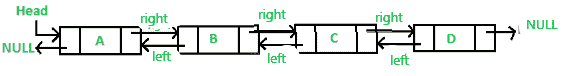

# 在双向链表中搜索元素

> 原文:[https://www . geesforgeks . org/search-双链表中的一个元素/](https://www.geeksforgeeks.org/search-an-element-in-a-doubly-linked-list/)

给定一个包含 **N** 节点和一个整数 **X** 的[双链表(DLL)](https://www.geeksforgeeks.org/doubly-linked-list/) ，任务是找到整数 **X** 在双链表中的位置。如果没有找到这样的位置，则打印 **-1** 。

[](https://media.geeksforgeeks.org/wp-content/uploads/20201125191410/rep.PNG)

**示例:**

> **输入:**15<=>16<=>8<=>7<=>13，X = 8
> **输出:** 3
> **说明:** X (= 8)出现在双链表的第 3 个节点。
> 因此，要求的输出为 3
> 
> 输入:5 <=> 3 <=> 4 <=> 2 <=> 9，X = 0
> **输出:** -1
> **说明:** X (= 0)不在双链表中。
> 因此，要求的输出为-1

**方法:**按照以下步骤解决问题:

*   初始化一个变量，比如说 **pos** ，来存储包含数据值 **X** 的节点在[双链表](https://www.geeksforgeeks.org/doubly-linked-list/)中的位置。
*   初始化一个指针，比如 **temp** ，存储[双链表](https://www.geeksforgeeks.org/doubly-linked-list/)的**头节点**。
*   [遍历链表](https://www.geeksforgeeks.org/linkedlist-listiterator-method-in-java/)，对于每个节点，检查该节点的数据值是否等于 **X** 。如果发现属实，则打印 **pos** 。
*   否则，打印 **-1** 。

下面是上述方法的实现

## C++

```
// C++ program to implement
// the above approach

#include <bits/stdc++.h>
using namespace std;

// Structure of a node of
// the doubly linked list
struct Node {

    // Stores data value
    // of a node
    int data;

    // Stores pointer
    // to next node
    Node* next;

    // Stores pointer
    // to previous node
    Node* prev;
};

// Function to insert a node at the
// beginning of the Doubly Linked List
void push(Node** head_ref, int new_data)
{

    // Allocate memory for new node
    Node* new_node
        = (Node*)malloc(sizeof(struct Node));

    // Insert the data
    new_node->data = new_data;

    // Since node is added at the
    // beginning, prev is always NULL
    new_node->prev = NULL;

    // Link the old list to the new node
    new_node->next = (*head_ref);

    // If pointer to head is not NULL
    if ((*head_ref) != NULL) {

        // Change the prev of head
        // node to new node
        (*head_ref)->prev = new_node;
    }

    // Move the head to point to the new node
    (*head_ref) = new_node;
}

// Function to find the position of
// an integer in doubly linked list
int search(Node** head_ref, int x)
{

    // Stores head Node
    Node* temp = *head_ref;

    // Stores position of the integer
    // in the doubly linked list
    int pos = 0;

    // Traverse the doubly linked list
    while (temp->data != x
           && temp->next != NULL) {

        // Update pos
        pos++;

        // Update temp
        temp = temp->next;
    }

    // If the integer not present
    // in the doubly linked list
    if (temp->data != x)
        return -1;

    // If the integer present in
    // the doubly linked list
    return (pos + 1);
}

// Driver Code
int main()
{
    Node* head = NULL;
    int X = 8;

    // Create the doubly linked list
    // 18 <-> 15 <-> 8 <-> 9 <-> 14
    push(&head, 14);
    push(&head, 9);
    push(&head, 8);
    push(&head, 15);
    push(&head, 18);

    cout << search(&head, X);

    return 0;
}
```

## Java 语言(一种计算机语言，尤用于创建网站)

```
// Java program to implement
// the above approach
import java.util.*;
class GFG
{

  // Structure of a node of
  // the doubly linked list
  static class Node
  {
    // Stores data value
    // of a node
    int data;

    // Stores pointer
    // to next node
    Node next;

    // Stores pointer
    // to previous node
    Node prev;
  };

  // Function to insert a node at the
  // beginning of the Doubly Linked List
  static Node push(Node head_ref, int new_data)
  {

    // Allocate memory for new node
    Node new_node = new Node();

    // Insert the data
    new_node.data = new_data;

    // Since node is added at the
    // beginning, prev is always null
    new_node.prev = null;

    // Link the old list to the new node
    new_node.next = head_ref;

    // If pointer to head is not null
    if (head_ref != null)
    {

      // Change the prev of head
      // node to new node
      head_ref.prev = new_node;
    }

    // Move the head to point to the new node
    head_ref = new_node;
    return head_ref;
  }

  // Function to find the position of
  // an integer in doubly linked list
  static int search(Node head_ref, int x)
  {

    // Stores head Node
    Node temp = head_ref;

    // Stores position of the integer
    // in the doubly linked list
    int pos = 0;

    // Traverse the doubly linked list
    while (temp.data != x
               && temp.next != null)
    {
      // Update pos
      pos++;

      // Update temp
      temp = temp.next;
    }

    // If the integer not present
    // in the doubly linked list
    if (temp.data != x)
      return -1;
    // If the integer present in
    // the doubly linked list
    return (pos + 1);
  }

  // Driver Code
  public static void main(String[] args)
  {
    Node head = null;
    int X = 8;
    // Create the doubly linked list
    // 18 <-> 15 <-> 8 <-> 9 <-> 14
    head = push(head, 14);
    head = push(head, 9);
    head = push(head, 8);
    head = push(head, 15);
    head = push(head, 18);
    System.out.print(search(head, X));
  }
}

// This code is contributed by Rajput-Ji
```

## C#

```
// C# program to implement
// the above approach
using System;

class GFG{

// Structure of a node of
// the doubly linked list
public class Node
{

    // Stores data value
    // of a node
    public int data;

    // Stores pointer
    // to next node
    public Node next;

    // Stores pointer
    // to previous node
    public Node prev;
};

// Function to insert a node at the
// beginning of the Doubly Linked List
static Node push(Node head_ref, int new_data)
{

    // Allocate memory for new node
    Node new_node = new Node();

    // Insert the data
    new_node.data = new_data;

    // Since node is added at the
    // beginning, prev is always null
    new_node.prev = null;

    // Link the old list to the new node
    new_node.next = head_ref;

    // If pointer to head is not null
    if (head_ref != null)
    {

        // Change the prev of head
        // node to new node
        head_ref.prev = new_node;
    }

    // Move the head to point to the new node
    head_ref = new_node;
    return head_ref;
}

// Function to find the position of
// an integer in doubly linked list
static int search(Node head_ref, int x)
{

    // Stores head Node
    Node temp = head_ref;

    // Stores position of the integer
    // in the doubly linked list
    int pos = 0;

    // Traverse the doubly linked list
    while (temp.data != x &&
           temp.next != null)
    {

        // Update pos
        pos++;

        // Update temp
        temp = temp.next;
    }

    // If the integer not present
    // in the doubly linked list
    if (temp.data != x)
        return -1;

    // If the integer present in
    // the doubly linked list
    return (pos + 1);
}

// Driver Code
public static void Main(String[] args)
{
    Node head = null;
    int X = 8;

    // Create the doubly linked list
    // 18 <-> 15 <-> 8 <-> 9 <-> 14
    head = push(head, 14);
    head = push(head, 9);
    head = push(head, 8);
    head = push(head, 15);
    head = push(head, 18);

    Console.Write(search(head, X));
}
}

// This code is contributed by gauravrajput1
```

## java 描述语言

```
<script>

// Javascript program to implement
// the above approach

// Structure of a node of
// the doubly linked list
class Node {

    constructor()
    {
         // Stores data value
         // of a node
         this.data = 0;

         // Stores pointer
         // to next node
         this.next = null;

         // Stores pointer
         // to previous node
         this.prev = null;
    }
};

// Function to insert a node at the
// beginning of the Doubly Linked List
function push(head_ref, new_data)
{

    // Allocate memory for new node
    var new_node
        = new Node();

    // Insert the data
    new_node.data = new_data;

    // Since node is added at the
    // beginning, prev is always null
    new_node.prev = null;

    // Link the old list to the new node
    new_node.next = (head_ref);

    // If pointer to head is not null
    if ((head_ref) != null) {

        // Change the prev of head
        // node to new node
        (head_ref).prev = new_node;
    }

    // Move the head to point to the new node
    (head_ref) = new_node;

    return head_ref;
}

// Function to find the position of
// an integer in doubly linked list
function search( head_ref, x)
{

    // Stores head Node
    var temp = head_ref;

    // Stores position of the integer
    // in the doubly linked list
    var pos = 0;

    // Traverse the doubly linked list
    while (temp.data != x
           && temp.next != null) {

        // Update pos
        pos++;

        // Update temp
        temp = temp.next;
    }

    // If the integer not present
    // in the doubly linked list
    if (temp.data != x)
        return -1;

    // If the integer present in
    // the doubly linked list
    return (pos + 1);
}

// Driver Code
var head = null;
var X = 8;

// Create the doubly linked list
// 18 <. 15 <. 8 <. 9 <. 14
head = push(head, 14);
head = push(head, 9);
head = push(head, 8);
head = push(head, 15);
head = push(head, 18);
document.write( search(head, X));

// This code is contributed by rrrtnx.
</script>
```

**Output:** 

```
3
```

***时间复杂度:**O(N)*
T5**辅助空间:** O(1)