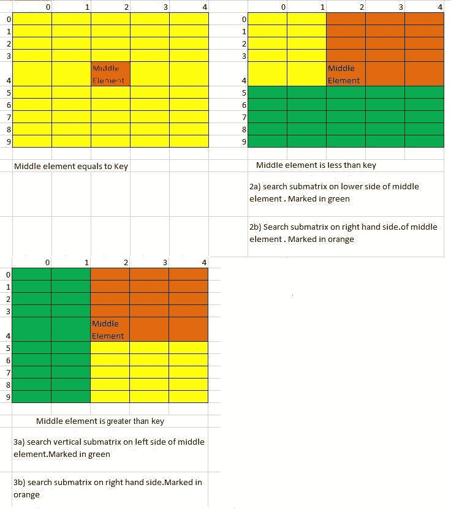

# 使用分治算法在逐行和逐列排序的 2D 数组中搜索

> 原文:[https://www . geesforgeks . org/逐行逐列搜索排序 2d 数组使用分治算法/](https://www.geeksforgeeks.org/search-in-a-row-wise-and-column-wise-sorted-2d-array-using-divide-and-conquer-algorithm/)

给定一个 n×n 矩阵，其中每一行和每一列按递增顺序排序。给定一个键，如何决定这个键是否在矩阵中。
[一个线性时间复杂度在之前的帖子里讨论过。](https://www.geeksforgeeks.org/search-in-row-wise-and-column-wise-sorted-matrix/)这个问题也可以作为[分治算法](https://www.geeksforgeeks.org/tag/divide-and-conquer/)的一个很好的例子。下面是分治算法。
1)找到中间元素。
2)如果中间元素与回车键相同。
3)如果中间元素小于键，则
….3a)搜索中间元素下侧的子矩阵
….3b)搜索中间元素右侧的子矩阵
4)如果中间元素大于键，则
….4a)搜索中间元素左侧的垂直子矩阵
….4b)搜索右侧的子矩阵。



随着上述算法的实现。

## C++

```
// C++ program for implementation of
// divide and conquer algorithm
// to find a given key in a row-wise
// and column-wise sorted 2D array
#include<bits/stdc++.h>
#define ROW 4
#define COL 4
using namespace std;

// A divide and conquer method to
// search a given key in mat[]
// in rows from fromRow to toRow
// and columns from fromCol to
// toCol
void search(int mat[ROW][COL], int fromRow, int toRow,
                    int fromCol, int toCol, int key)
    {
        // Find middle and compare with middle
        int i = fromRow + (toRow-fromRow )/2;
        int j = fromCol + (toCol-fromCol )/2;
        if (mat[i][j] == key) // If key is present at middle
        cout<<"Found "<< key << " at "<< i <<
                            " " << j<<endl;
        else
        {
            // right-up quarter of matrix is searched in all cases.
            // Provided it is different from current call
            if (i != toRow || j != fromCol)
            search(mat, fromRow, i, j, toCol, key);

            // Special case for iteration with 1*2 matrix
            // mat[i][j] and mat[i][j+1] are only two elements.
            // So just check second element
            if (fromRow == toRow && fromCol + 1 == toCol)
            if (mat[fromRow][toCol] == key)
                cout<<"Found "<< key<< " at "<<
                            fromRow << " " << toCol<<endl;

            // If middle key is lesser then search lower horizontal
            // matrix and right hand side matrix
            if (mat[i][j] < key)
            {
                // search lower horizontal if such matrix exists
                if (i + 1 <= toRow)
                search(mat, i + 1, toRow, fromCol, toCol, key);
            }

            // If middle key is greater then search left vertical
            // matrix and right hand side matrix
            else
            {
                // search left vertical if such matrix exists
                if (j - 1 >= fromCol)
                search(mat, fromRow, toRow, fromCol, j - 1, key);
            }
        }
    }

// Driver code
int main()
{
    int mat[ROW][COL] = { {10, 20, 30, 40},
                            {15, 25, 35, 45},
                            {27, 29, 37, 48},
                            {32, 33, 39, 50}};
    int key = 50;
    for (int i = 0; i < ROW; i++)
    for (int j = 0; j < COL; j++)
        search(mat, 0, ROW - 1, 0, COL - 1, mat[i][j]);
    return 0;
}

// This code is contributed by Rajput-Ji
```

## Java 语言(一种计算机语言，尤用于创建网站)

```
// Java program for implementation of divide and conquer algorithm
// to find a given key in a row-wise and column-wise sorted 2D array
class SearchInMatrix
{
    public static void main(String[] args)
    {
        int[][] mat = new int[][] { {10, 20, 30, 40},
                                    {15, 25, 35, 45},
                                    {27, 29, 37, 48},
                                    {32, 33, 39, 50}};
        int rowcount = 4,colCount=4,key=50;
        for (int i=0; i<rowcount; i++)
          for (int j=0; j<colCount; j++)
             search(mat, 0, rowcount-1, 0, colCount-1, mat[i][j]);
    }

    // A divide and conquer method to search a given key in mat[]
    // in rows from fromRow to toRow and columns from fromCol to
    // toCol
    public static void search(int[][] mat, int fromRow, int toRow,
                              int fromCol, int toCol, int key)
    {
        // Find middle and compare with middle
        int i = fromRow + (toRow-fromRow )/2;
        int j = fromCol + (toCol-fromCol )/2;
        if (mat[i][j] == key) // If key is present at middle
          System.out.println("Found "+ key + " at "+ i +
                               " " + j);
        else
        {
            // right-up quarter of matrix is searched in all cases.
            // Provided it is different from current call
            if (i!=toRow || j!=fromCol)
             search(mat,fromRow,i,j,toCol,key);

            // Special case for iteration with 1*2 matrix
            // mat[i][j] and mat[i][j+1] are only two elements.
            // So just check second element
            if (fromRow == toRow && fromCol + 1 == toCol)
              if (mat[fromRow][toCol] == key)
                System.out.println("Found "+ key+ " at "+
                                   fromRow + " " + toCol);

            // If middle key is lesser then search lower horizontal
            // matrix and right hand side matrix
            if (mat[i][j] < key)
            {
                // search lower horizontal if such matrix exists
                if (i+1<=toRow)
                  search(mat, i+1, toRow, fromCol, toCol, key);
            }

            // If middle key is greater then search left vertical
            // matrix and right hand side matrix
            else
            {
                // search left vertical if such matrix exists
                if (j-1>=fromCol)
                  search(mat, fromRow, toRow, fromCol, j-1, key);
            }
        }
    }
}
```

## 蟒蛇 3

```
# Python3 program for implementation of
# divide and conquer algorithm to find
# a given key in a row-wise and column-wise
# sorted 2D array a divide and conquer method
# to search a given key in mat in rows from
# fromRow to toRow and columns from fromCol to
# toCol
def search(mat, fromRow, toRow, fromCol, toCol, key):

    # Find middle and compare with middle
    i = fromRow + (toRow - fromRow) // 2;
    j = fromCol + (toCol - fromCol) // 2;
    if (mat[i][j] == key): # If key is present at middle
        print("Found " , key , " at " , i , " " , j);
    else:

        # right-up quarter of matrix is searched in all cases.
        # Provided it is different from current call
        if (i != toRow or j != fromCol):
            search(mat, fromRow, i, j, toCol, key);

        # Special case for iteration with 1*2 matrix
        # mat[i][j] and mat[i][j+1] are only two elements.
        # So just check second element
        if (fromRow == toRow and fromCol + 1 == toCol):
            if (mat[fromRow][toCol] == key):
                print("Found " , key , " at " , fromRow , " " , toCol);

        # If middle key is lesser then search lower horizontal
        # matrix and right hand side matrix
        if (mat[i][j] < key):

            # search lower horizontal if such matrix exists
            if (i + 1 <= toRow):
                search(mat, i + 1, toRow, fromCol, toCol, key);

        # If middle key is greater then search left vertical
        # matrix and right hand side matrix
        else:

            # search left vertical if such matrix exists
            if (j - 1 >= fromCol):
                search(mat, fromRow, toRow, fromCol, j - 1, key);

# Driver code
if __name__ == '__main__':
    mat = [[ 10, 20, 30, 40],
           [15, 25, 35, 45],
           [27, 29, 37, 48],
           [32, 33, 39, 50]];
    rowcount = 4; colCount = 4; key = 50;
    for i in range(rowcount):
        for j in range(colCount):
            search(mat, 0, rowcount - 1, 0, colCount - 1, mat[i][j]);

# This code is contributed by 29AjayKumar
```

## C#

```
// C# program for implementation of
// divide and conquer algorithm
// to find a given key in a row-wise
// and column-wise sorted 2D array
using System;

public class SearchInMatrix
{
    public static void Main(String[] args)
    {
        int[,] mat = new int[,] { {10, 20, 30, 40},
                                    {15, 25, 35, 45},
                                    {27, 29, 37, 48},
                                    {32, 33, 39, 50}};
        int rowcount = 4, colCount = 4, key = 50;
        for (int i = 0; i < rowcount; i++)
            for (int j = 0; j < colCount; j++)
            search(mat, 0, rowcount - 1, 0, colCount - 1, mat[i, j]);
    }

    // A divide and conquer method to
    // search a given key in mat[]
    // in rows from fromRow to toRow
    // and columns from fromCol to
    // toCol
    public static void search(int[,] mat, int fromRow, int toRow,
                            int fromCol, int toCol, int key)
    {
        // Find middle and compare with middle
        int i = fromRow + (toRow-fromRow )/2;
        int j = fromCol + (toCol-fromCol )/2;
        if (mat[i, j] == key) // If key is present at middle
        Console.WriteLine("Found "+ key + " at "+ i +
                            " " + j);
        else
        {
            // right-up quarter of matrix is searched in all cases.
            // Provided it is different from current call
            if (i != toRow || j != fromCol)
            search(mat, fromRow, i, j, toCol, key);

            // Special case for iteration with 1*2 matrix
            // mat[i][j] and mat[i][j+1] are only two elements.
            // So just check second element
            if (fromRow == toRow && fromCol + 1 == toCol)
            if (mat[fromRow,toCol] == key)
                Console.WriteLine("Found "+ key + " at "+
                                fromRow + " " + toCol);

            // If middle key is lesser then search lower horizontal
            // matrix and right hand side matrix
            if (mat[i, j] < key)
            {
                // search lower horizontal if such matrix exists
                if (i + 1 <= toRow)
                search(mat, i + 1, toRow, fromCol, toCol, key);
            }

            // If middle key is greater then search left vertical
            // matrix and right hand side matrix
            else
            {
                // search left vertical if such matrix exists
                if (j - 1 >= fromCol)
                search(mat, fromRow, toRow, fromCol, j - 1, key);
            }
        }
    }
}

// This code has been contributed by 29AjayKumar
```

## java 描述语言

```
<script>

// JavaScript program for implementation
// of divide and conquer algorithm
// to find a given key in a row-wise
// and column-wise sorted 2D array

    // A divide and conquer method to search a given key in mat
    // in rows from fromRow to toRow and columns from fromCol to
    // toCol
    function search(mat , fromRow , toRow,
                               fromCol , toCol , key)
    {
        // Find middle and compare with middle
        var i = parseInt(fromRow + (toRow-fromRow )/2);
        var j = parseInt(fromCol + (toCol-fromCol )/2);
        if (mat[i][j] == key) // If key is present at middle
          document.write("Found "+ key + " at "+ i +
                               " " + j+"<br/>");
        else
        {
            // right-up quarter of matrix is searched in all cases.
            // Provided it is different from current call
            if (i!=toRow || j!=fromCol)
             search(mat,fromRow,i,j,toCol,key);

            // Special case for iteration with 1*2 matrix
            // mat[i][j] and mat[i][j+1] are only two elements.
            // So just check second element
            if (fromRow == toRow && fromCol + 1 == toCol)
              if (mat[fromRow][toCol] == key)
                document.write("Found "+ key+ " at "+
                                   fromRow + " " + toCol+"<br/>");

            // If middle key is lesser then search lower horizontal
            // matrix and right hand side matrix
            if (mat[i][j] < key)
            {
                // search lower horizontal if such matrix exists
                if (i+1<=toRow)
                  search(mat, i+1, toRow, fromCol, toCol, key);
            }

            // If middle key is greater then search left vertical
            // matrix and right hand side matrix
            else
            {
                // search left vertical if such matrix exists
                if (j-1>=fromCol)
                  search(mat, fromRow, toRow, fromCol, j-1, key);
            }
        }
        }

       var mat = [[10, 20, 30, 40],
                   [15, 25, 35, 45],
                   [27, 29, 37, 48],
                   [32, 33, 39, 50]];
        var rowcount = 4,colCount=4,key=50;
        for (var i=0; i<rowcount; i++)
          for (var j=0; j<colCount; j++)
             search(mat, 0, rowcount-1, 0, colCount-1, mat[i][j]);

// This code contributed by umadevi9616

</script>
```

**输出:**

```
Found 10 at 0 0
Found 20 at 0 1
Found 30 at 0 2
Found 40 at 0 3
Found 15 at 1 0
Found 25 at 1 1
Found 35 at 1 2
Found 45 at 1 3
Found 27 at 2 0
Found 29 at 2 1
Found 37 at 2 2
Found 48 at 2 3
Found 32 at 3 0
Found 33 at 3 1
Found 39 at 3 2
Found 50 at 3 3
```

**时间复杂度:**
给我们一个 n*n 的矩阵，这个算法可以看作是对 3 个大小为 n/2×n/2 的矩阵的递归。以下是时间复杂性的重现

```
 T(n) = 3T(n/2) + O(1) 
```

复发的解决方法是使用[大师法](https://www.geeksforgeeks.org/analysis-algorithm-set-4-master-method-solving-recurrences/)O(n<sup>1.58</sup>)。
但实际实现需要一个 n×n/2 或 n/2×n 的子矩阵，以及其他 n/2×n/2 的子矩阵。
本文由**考释乐乐**供稿。如果发现有不正确的地方，请写评论，或者想分享更多关于以上讨论话题的信息