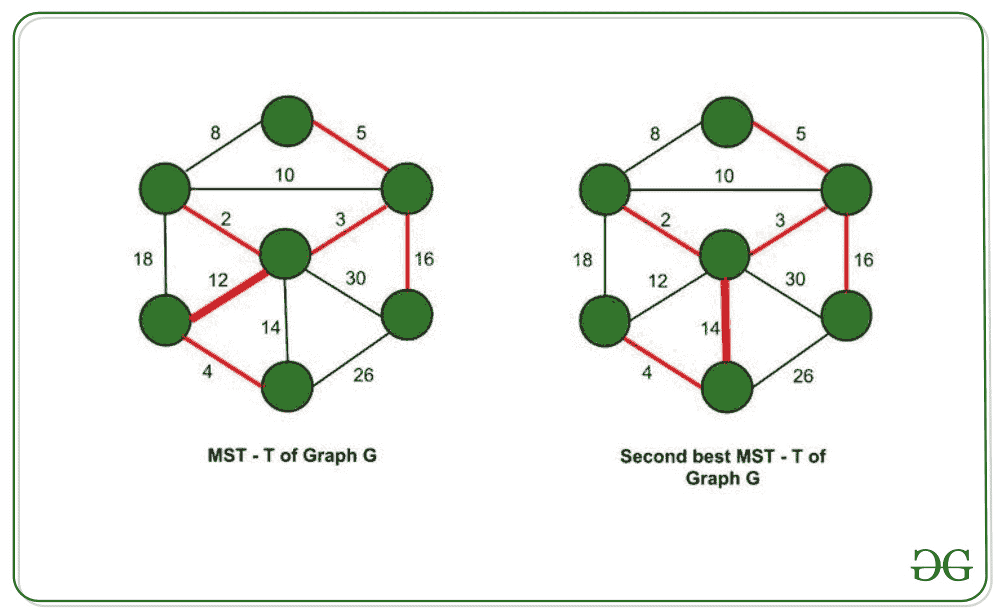

# 次优最小生成树

> 原文:[https://www . geesforgeks . org/次优最小生成树/](https://www.geeksforgeeks.org/second-best-minimum-spanning-tree/)

**先决条件****–**[图](https://www.geeksforgeeks.org/graph-data-structure-and-algorithms/)、[生成树](https://en.wikipedia.org/wiki/Spanning_tree)、[不相交集(并集–查找)](https://www.geeksforgeeks.org/union-find/)。

> 对于给定的图 G，最小生成树(MST) **T** 跨越给定图的所有顶点，并且在所有可能的生成树中具有所有边的最小权重和。
> 
> 第二好的 MST，**T’**是图 G 的所有生成树中所有边的第二最小权重和的生成树。

T 和 T’的区别仅在于一个边缘替换。因此，我们应该找到一个不在 T 中的边 e <sub>新</sub>并用 T 中的边替换它(比如 e <sub>旧</sub>)，这样 T’= T union { e<sub>new</sub>}–{ e<sub>old</sub>就是一棵生成树，并且(e<sub>new</sub>–e<sub>old</sub>)的权重差最小(e <sub>new</sub> ，e <sub>old</sub> 是 T 中的边

[](https://media.geeksforgeeks.org/wp-content/uploads/20201111102628/secondmst.jpg)

**使用[克鲁斯卡尔算法](https://www.geeksforgeeks.org/kruskals-minimum-spanning-tree-algorithm-greedy-algo-2/)–**

*   使用 [Kruskal 算法](https://www.geeksforgeeks.org/kruskals-minimum-spanning-tree-algorithm-greedy-algo-2/)求图 g 的 MST T，从中去掉一条边，用另一条代替，得到 T’。
*   在 O(E)时间内对边进行排序(E-边数)，并在 O(E)时间内使用 Kruskal 算法找到 MST(MST 中的边数= V-1，其中 V =图 G 中的顶点数)。
*   对于 MST 中的每条边，暂时将其从边列表中排除(这样我们就无法选择它)。
*   然后，尝试使用剩余的边在 O(E)中找到 MST。(无需再次排序)
*   对 MST 中的所有边重复上述操作，并选择最佳边。(第二个最小重量总和)。因此，我们获得了 T’–第二好的 MST。
*   整体时间复杂性–O(平均+平均+平均)= O(平均)

下面是上述方法的实现:

## C++

```
// C++ implementation to find the
// second best MST

#include <bits/stdc++.h>
using namespace std;

// used to implement union-find algorithm
int parent[100005];

// to keep track of edges in MST
vector<int> present;

// to keep track of number of edges
// in spanning trees other than the MST
int edg;

// a structure to represent a
// weighted edge in graph
struct edge {
    int src, dest, weight;
} edges[100005];
// array edges is of type edge.

// Compare two edges according
// to their weights.
// Used in sort() for sorting
// an array of edges
bool cmp(edge x, edge y)
{
    return x.weight < y.weight;
}

// initialising the array -
// each vertex is its own parent
// initially
void initialise(int n)
{
    // 1-indexed
    for (int i = 1; i <= n; i++)
        parent[i] = i;
}

// Implementing the union-find algorithm
int find(int x)
{
    if (parent[x] == x)
        return x;
    return parent[x] = find(parent[x]);
}

// Function to find the union
// for the Minimum spanning Tree
int union1(int i, int sum)
{
    int x, y;
    x = find(edges[i].src);
    y = find(edges[i].dest);
    if (x != y) {

        // parent of x = y (LCA) -
        // both are edge connected
        parent[x] = y;

        // keeping track of edges in MST
        present.push_back(i);

        // finding sum of weights
        // of edges in MST
        sum += edges[i].weight;
    }
    return sum;
}

// Function to find the second
// best minimum spanning Tree
int union2(int i, int sum)
{
    int x, y;
    x = find(edges[i].src);
    y = find(edges[i].dest);
    if (x != y) {
        // parent of x = y (LCA) -
        // both are edge connected
        parent[x] = y;

        // sum of weights of edges
        // in spanning tree
        sum += edges[i].weight;
        edg++;
    }
    return sum;
}

// Driver Code
int main()
{
    // V-> Number of vertices,
    // E-> Number of edges
    int V, E;
    V = 5;
    E = 8;

    // initialising the array to
    // be used for union-find
    initialise(V);

    // src, dest and weights can
    // also be taken from user as
    // input the following vectors
    // represent - source[0],
    // destination[0] are connected
    // by an edge with
    // weight[0]

    vector<int> source = { 1, 3, 2, 3,
                           2, 5, 1, 3 };
    vector<int> destination = { 3, 4, 4,
                                2, 5, 4, 2, 5 };
    vector<int> weights = { 75, 51, 19,
                            95, 42, 31, 9, 66 };
    for (int i = 0; i < E; i++) {
        edges[i].src = source[i];
        edges[i].dest = destination[i];
        edges[i].weight = weights[i];
    }

    // sorting the array of edges
    // based on edge weights
    sort(edges, edges + E, cmp);

    int sum = 0;
    for (int i = 0; i < E; i++) {
        sum = union1(i, sum);
    }

    // printing the cost of MST
    cout << "MST: " << sum << "\n";

    // initialising cost of second best MST
    int sec_best_mst = INT_MAX;

    // setting the sum to zero again.
    sum = 0;
    int j;
    for (j = 0; j < present.size(); j++) {
        initialise(V);
        edg = 0;
        for (int i = 0; i < E; i++) {

            // excluding one edge of
            // MST at a time
            // and forming spanning tree
            // with remaining
            // edges
            if (i == present[j])
                continue;
            sum = union2(i, sum);
        }
        // checking if number of edges = V-1 or not
        // since number of edges in a spanning tree of
        // graph with V vertices is (V-1)
        if (edg != V - 1) {
            sum = 0;
            continue;
        }

        // storing the minimum sum
        // in sec_best_mst
        if (sec_best_mst > sum)
            sec_best_mst = sum;
        sum = 0;
    }

    // printing the cost of second best MST
    cout << "Second Best MST: "
         << sec_best_mst << "\n";
    return 0;
}
```

**Output**

```
MST: 110
Second Best MST: 121

```

**时间复杂度–**O(VE)其中 V–输入图中的顶点数，E–输入图中的边数。