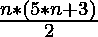

# 第二个七边形数字

> 原文:[https://www.geeksforgeeks.org/second-heptagonal-numbers/](https://www.geeksforgeeks.org/second-heptagonal-numbers/)

第二个七边形数字系列可以表示为

> 4, 13, 27, 46, 70, 99, 133, 172, 216, … ..

第 n 项

给定一个整数 **N** 。任务是找到给定数列的第 N 项。
**例**:

> **输入:**N = 1
> T3】输出: 4
> 
> **输入:**N = 4
> T3】输出: 46

**方法:**思路是寻找第二个七边数的通称。下面是第二个七边形数的一般项的计算:

> 系列= 4，13，27，46，70，99，133，172，216，…..
> 差= 13-4，27-13，46-27，70-46，……
> 差= 9，14，19，24 ……这是一个 AP
> 所以给定系列的第 n 项
> 第 n 项= 4 + (9 + 14 + 19 + 24 …… (n-1)项)
> 第 n 项= 4 + (n-1)/2*(2*9+(n-1-1)*5)
> 第 n 项= 4 + (n-1)/2*(18+5n-10)
> 第 n 项= 4+(T1
> 
> 

下面是上述方法的实现:

## C++

```
// C++ implementation to
// find N-th term in the series

#include <iostream>
#include <math.h>
using namespace std;

// Function to find N-th term
// in the series
void findNthTerm(int n)
{
    cout << n * (5 * n + 3) / 2
         << endl;
}

// Driver code
int main()
{
    int N = 4;
    findNthTerm(N);

    return 0;
}
```

## Java 语言(一种计算机语言，尤用于创建网站)

```
// Java implementation to
// find N-th term in the series
class GFG{

// Function to find N-th term
// in the series
static void findNthTerm(int n)
{
    System.out.println(n * (5 * n + 3) / 2);
}

// Driver code
public static void main(String[] args)
{
    int N = 4;

    findNthTerm(N);
}
}

// This code is contributed by Ritik Bansal
```

## 蟒蛇 3

```
# Python implementation to
# find N-th term in the series

# Function to find N-th term
# in the series
def findNthTerm(n):
    print(n * (5 * n + 3) // 2)

# Driver code
N = 4

# Function call
findNthTerm(N)

# This code is contributed by Vishal Maurya.
```

## C#

```
// C# implementation to
// find N-th term in the series
using System;
class GFG{

// Function to find N-th term
// in the series
static void findNthTerm(int n)
{
    Console.Write(n * (5 * n + 3) / 2);
}

// Driver code
public static void Main()
{
    int N = 4;

    findNthTerm(N);
}
}

// This code is contributed by Code_Mech
```

## java 描述语言

```
<script>
// Javascript implementation to
// find N-th term in the series

// Function to find N-th term
// in the series
function findNthTerm(n)
{
    document.write(parseInt((n * (5 * n + 3)) / 2));
}

// Driver code
let N = 4;
findNthTerm(N);

// This code is contributed by rishavmahato348.
</script>
```

**Output:** 

```
46
```

**时间复杂度:** O(1)

**辅助空间:** O(1)

**参考:**T2】OEIS