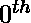

# 二阶欧拉数

> 原文:[https://www . geesforgeks . org/二阶-欧拉-数字/](https://www.geeksforgeeks.org/second-order-eulerian-numbers/)

**d 阶欧拉数**系列可以表示为

> 1, 0, 0, 2, 8, 22, 52, 114, 240, 494, 1004, … ..

第 n 项

给定一个整数 **N** 。任务是找到给定数列的第 N 项。
**示例** :

> **输入:** N = 0
> **输出:** 1
> 项= 1
> **输入:** N = 4
> **输出:** 8

**方法:**想法是找到二阶欧拉数的一般项。下面是二阶欧拉数一般项的计算:

> 第 0 项= 2<sup>0</sup>–2 * 0 = 1
> 第 1 项= 2<sup>1</sup>–2 * 1 = 0
> 第 2 项= 2<sup>2</sup>–2 * 2 = 0
> 第 3 项= 2<sup>3</sup>–2 * 3 = 2
> 第 4 项= 2<sup>4</sup>–2 * 4 = 8
> 第 5 项= 2<sup>5</sup>–2 * 5 = 2
> 。
> 。
> 第 n 项= 2<sup>n</sup>–2 * n
> 因此，该系列的第 n 项给出为

以下是上述方法的实现:

## C++

```
// C++ implementation to
// find N-th term in the series

#include <iostream>
#include <math.h>
using namespace std;

// Function to find N-th term
// in the series
void findNthTerm(int n)
{
    cout << pow(2, n) - 2 * n << endl;
}

// Driver Code
int main()
{
    int N = 4;
    findNthTerm(N);

    return 0;
}
```

## Java 语言(一种计算机语言，尤用于创建网站)

```
// Java implementation to find
// N-th term in the series
class GFG{

// Function to find N-th term
// in the series
static void findNthTerm(int n)
{
    System.out.println(Math.pow(2, n) - 2 * n);
}

// Driver code
public static void main(String[] args)
{
    int N = 4;
    findNthTerm(N);
}
}

// This code is contributed by Pratima Pandey
```

## 蟒蛇 3

```
# Python3 implementation to
# find N-th term in the series

# Function to find N-th term
# in the series
def findNthTerm(n):

    print(pow(2, n) - 2 * n);

# Driver Code
N = 4;
findNthTerm(N);

# This code is contributed by Code_Mech
```

## C#

```
// C# implementation to find
// N-th term in the series
using System;
class GFG{

// Function to find N-th term
// in the series
static void findNthTerm(int n)
{
    Console.Write(Math.Pow(2, n) - 2 * n);
}

// Driver code
public static void Main()
{
    int N = 4;
    findNthTerm(N);
}
}

// This code is contributed by Code_Mech
```

## java 描述语言

```
<script>

// Javascript implementation to
// find N-th term in the series

// Function to find N-th term
// in the series
function findNthTerm(n)
{
    document.write((Math.pow(2, n)) - (2 * n));
}

// Driver Code
N = 4;
findNthTerm(N);

</script>
```

**Output:** 

```
8
```

**参考:**T2】OEIST4】