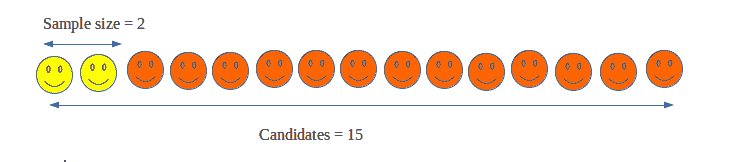
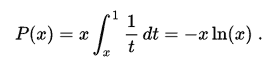
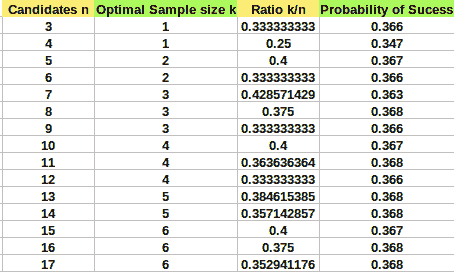

# 秘书问题(一个最优停止问题)

> 原文:[https://www . geesforgeks . org/secretary-problem-optimal-stop-problem/](https://www.geeksforgeeks.org/secretary-problem-optimal-stopping-problem/)

**秘书问题**又称**婚姻问题**、**苏丹嫁妆问题**、**最佳选择问题**就是[最优停止问题](https://en.wikipedia.org/wiki/Optimal_stopping)的一个例子。

这个问题可以用下面的形式来描述:想象一下，一个管理员想从 n 个可排名的职位申请者中雇佣最好的秘书。申请者按照随机顺序逐一面试。面试结束后，将立即对每个申请人做出决定。一旦被拒绝，申请人就不能被召回。在面试过程中，管理员可以在目前面试的所有申请者中对申请者进行排名，但不知道尚未见过的申请者的质量。问题是关于最佳策略(停止规则)以最大化选择最佳申请人的概率。

**最优停止**:在数学上，最优停止或提前停止理论关注的是选择采取某一特定行动的时间的问题，目的是获得最大的预期报酬或最小的预期成本。

如果聘用申请人的决定是在面试所有 n 名候选人结束时做出的，一个简单的解决方案是使用最大选择算法，跟踪运行最大值(以及谁实现了该值)并在结束时选择总体最大值。这个问题的难点在于，必须在面试候选人后立即做出决定。

**最优策略的 1/e 定律**
根据该策略，最优获胜概率始终至少为 1/e。
最优停止规则规定始终拒绝面试的第一个 **n/e** 申请人(其中 e 是自然对数的底数，其值为 **2.71828** )，然后在第一个比迄今为止面试的每个申请人都优秀的申请人处停止(如果这种情况从未发生，则继续到最后一个申请人)。这种策略被称为 1/e 停止规则，因为选择最佳候选的概率是 **1/e** ，换句话说，这种策略选择的最佳候选大约是 **37%** 的时间。

如果你仔细想想，可能很明显，一个人不能选择第一个候选人，因为第一个候选人没有人可以比较。更好的策略是选择几个候选人作为样本，为剩下的候选人设定基准。因此样本将被拒绝，并将仅用于设置基准。

*   If a sample is too small, we don’t get information enough for setting the benchmark for remaining candidates.

    

*   If a sample is too large, though we get plenty of information but we have also burned too many of the potential candidates. This leaves us with very few candidates to choose from, and hence making the strategy a poor one.

    

*   The best strategy is to choose the perfect or optimal sample size (ideal sample size) which can be done using 1/e law that is rejecting **n/e** candidates (this n/e is the sample size).

    

    **不同 n 值的最优样本量和成功概率为** :
    最优样本量 k = n / e
    成功概率由
    
    给出，其中 x = k / n

    

    经典秘书问题中选择最佳申请人的概率收敛于 **1/e = 0.368** (近似值)

    **测试第二个问题的程序:**
    **注*** :最优策略并不总是找到最佳候选人，而是在大多数情况下选择几乎最佳的候选人。

    ## C++

    ```
    // C++ Program to test 1/e law for Secretary Problem :
    #include <iostream>
    #include <time.h>
    #define e 2.71828
    using namespace std;

    // To find closest integer of num.
    int roundNo(float num)
    {
        return num < 0 ? num - 0.5 : num + 0.5;
    }

    // Finds best candidate using n/e rule. candidate[]
    // represents talents of n candidates.
    void printBestCandidate(int candidate[], int n)
    {
        // Calculating sample size for benchmarking.
        int sample_size = roundNo(n/e);
        cout << "\n\nSample size is " << sample_size << endl;

        // Finding best candidate in sample size
        int best = 0; 
        for (int i = 1; i < sample_size; i++)
            if (candidate[i] > candidate[best])
                best = i;

        // Finding the first best candidate that is  
        // better than benchmark set.
        for (int i = sample_size; i < n; i++)
            if (candidate[i] >= candidate[best]) {
                best = i;
                break;
            }

        if (best >= sample_size)
            cout << endl << "Best candidate found is "
                << best + 1 << " with talent " 
                << candidate[best] << endl;
        else
            cout << "Couldn't find a best candidate\n";
    }

    int main()
    {
        int n = 8;

        // n = 8 candidates and candidate array contains
        // talents of n candidate where the largest 
        // number means highest talented candidate.
        int candidate[n];

        // generating random numbers between 1 to 8 
        // for talent of candidate
        srand(time(0));    
        for (int i = 0; i < n; i++)
            candidate[i] = 1 + rand() % 8;

        cout << "Candidate : ";
        for (int i = 0; i < n; i++)
            cout << i + 1 << " ";
        cout << endl;
        cout << "  Talents : ";
        for (int i = 0; i < n; i++)
            cout << candidate[i] << " ";

        printBestCandidate(candidate, n);

        return 0;
    }
    ```

    ## Java 语言(一种计算机语言，尤用于创建网站)

    ```
    // Java Program to test 1/e law for Secretary Problem :
    import java.util.*;
    class GFG
    {
    static double e = 2.71828;

    // To find closest integer of num.
    static int roundNo(float num)
    {
        return (int) (num < 0 ? 
                      num - 0.5 : num + 0.5);
    }

    // Finds best candidate using n/e rule. candidate[]
    // represents talents of n candidates.
    static void printBestCandidate(int candidate[], int n)
    {
        // Calculating sample size for benchmarking.
        int sample_size = roundNo((float) (n / e));
        System.out.println("\n\nSample size is " + sample_size);

        // Finding best candidate in sample size
        int best = 0; 
        for (int i = 1; i < sample_size; i++)
            if (candidate[i] > candidate[best])
                best = i;

        // Finding the first best candidate that is 
        // better than benchmark set.
        for (int i = sample_size; i < n; i++)
            if (candidate[i] >= candidate[best])
            {
                best = i;
                break;
            }

        if (best >= sample_size)
            System.out.println("\nBest candidate found is " + 
                               (best + 1) + " with talent " + 
                                candidate[best]);
        else
            System.out.print("Couldn't find a best candidate\n");
    }

    // Driver Code
    public static void main(String[] args)
    {
        int n = 8;

        // n = 8 candidates and candidate array contains
        // talents of n candidate where the largest 
        // number means highest talented candidate.
        int []candidate = new int[n];

        // generating random numbers between 1 to 8 
        // for talent of candidate
        Random rand = new Random();
        for (int i = 0; i < n; i++)
            candidate[i] = 1 + rand.nextInt((8 - 1) + 1);

        System.out.print("Candidate : ");
        for (int i = 0; i < n; i++)
            System.out.print(i + 1 + " ");
        System.out.println();
        System.out.print("Talents : ");
        for (int i = 0; i < n; i++)
            System.out.print(candidate[i] + " ");

        printBestCandidate(candidate, n);
    }
    }

    // This code is contributed by 29AjayKumar
    ```

    ## 蟒蛇 3

    ```
    # Python3 Program to test 1/e law for
    # Secretary Problem
    import random
    import math

    e = 2.71828;

    # To find closest integer of num.
    def roundNo(num):
        if(num < 0): 
            return (num - 0.5)
        else: 
            return (num + 0.5);

    # Finds best candidate using n/e rule. 
    # candidate[] represents talents of n candidates.
    def printBestCandidate(candidate, n):

        # Calculating sample size for benchmarking.
        sample_size = roundNo(n / e);
        print("\n\nSample size is", 
               math.floor(sample_size));

        # Finding best candidate in sample size
        best = 0; 
        for i in range(1, int(sample_size)):
            if (candidate[i] > candidate[best]):
                best = i;

        # Finding the first best candidate that 
        # is better than benchmark set.
        for i in range(int(sample_size), n):
            if (candidate[i] >= candidate[best]):
                best = i;
                break;

        if (best >= int(sample_size)):
            print("\nBest candidate found is", 
                         math.floor(best + 1), 
                  "with talent", math.floor(candidate[best]));
        else:
            print("Couldn't find a best candidate");

    # Driver code
    n = 8;

    # n = 8 candidates and candidate 
    # array contains talents of n 
    # candidate where the largest 
    # number means highest talented 
    # candidate.
    candidate = [0] * (n);

    # generating random numbers between 1 to 8 
    # for talent of candidate
    for i in range(n):
        candidate[i] = 1 + random.randint(1, 8);
    print("Candidate : ", end = "");

    for i in range(n):
        print((i + 1), end = " ");
    print("\nTalents : ", end = "");

    for i in range(n):
        print(candidate[i], end = " ");

    printBestCandidate(candidate, n);

    # This code is contributed by mits
    ```

    ## C#

    ```
    // C# Program to test 1/e law for Secretary Problem
    using System;

    class GFG
    {
    static double e = 2.71828;

    // To find closest integer of num.
    static int roundNo(float num)
    {
        return (int) (num < 0 ? 
                      num - 0.5 : num + 0.5);
    }

    // Finds best candidate using n/e rule. candidate[]
    // represents talents of n candidates.
    static void printBestCandidate(int []candidate, int n)
    {
        // Calculating sample size for benchmarking.
        int sample_size = roundNo((float) (n / e));
        Console.WriteLine("\n\nSample size is " + 
                                    sample_size);

        // Finding best candidate in sample size
        int best = 0; 
        for (int i = 1; i < sample_size; i++)
            if (candidate[i] > candidate[best])
                best = i;

        // Finding the first best candidate that is 
        // better than benchmark set.
        for (int i = sample_size; i < n; i++)
            if (candidate[i] >= candidate[best])
            {
                best = i;
                break;
            }

        if (best >= sample_size)
            Console.WriteLine("\nBest candidate found is " + 
                              (best + 1) + " with talent " + 
                                           candidate[best]);
        else
            Console.Write("Couldn't find a best candidate\n");
    }

    // Driver Code
    public static void Main(String[] args)
    {
        int n = 8;

        // n = 8 candidates and candidate array contains
        // talents of n candidate where the largest 
        // number means highest talented candidate.
        int []candidate = new int[n];

        // generating random numbers between 1 to 8 
        // for talent of candidate
        Random rand = new Random();
        for (int i = 0; i < n; i++)
            candidate[i] = 1 + rand.Next(1, 8);

        Console.Write("Candidate : ");
        for (int i = 0; i < n; i++)
            Console.Write(i + 1 + " ");
        Console.WriteLine();
        Console.Write("Talents : ");
        for (int i = 0; i < n; i++)
            Console.Write(candidate[i] + " ");

        printBestCandidate(candidate, n);
    }
    }

    // This code is contributed by Princi Singh
    ```

    ## 服务器端编程语言（Professional Hypertext Preprocessor 的缩写）

    ```
    <?php
    // PHP Program to test 1/e 
    // law for Secretary Problem :

    $e = 2.71828;

    // To find closest 
    // integer of num.
    function roundNo($num)
    {
        return $num < 0 ? 
             $num - 0.5 : $num + 0.5;
    }

    // Finds best candidate using 
    // n/e rule. candidate[] 
    // represents talents of n candidates.
    function printBestCandidate($candidate, $n)
    {
        global $e;

        // Calculating sample size 
        // for benchmarking.
        $sample_size = roundNo($n / $e);
        echo "\n\nSample size is " . 
               floor($sample_size) . "\n";

        // Finding best candidate
        // in sample size
        $best = 0; 
        for ($i = 1; $i < $sample_size; $i++)
            if ($candidate[$i] > 
                $candidate[$best])
                $best = $i;

        // Finding the first best 
        // candidate that is better
        // than benchmark set.
        for ($i = $sample_size; $i < $n; $i++)
            if ($candidate[$i] >= 
                $candidate[$best])
            {
                $best = $i;
                break;
            }

        if ($best >= $sample_size)
            echo "\nBest candidate found is " . 
                             floor($best + 1) . 
                              " with talent " . 
                     floor($candidate[$best]) . "\n";
        else
            echo "Couldn't find a best candidate\n";
    }

    // Driver code
    $n = 8;

    // n = 8 candidates and candidate 
    // array contains talents of n 
    // candidate where the largest 
    // number means highest talented 
    // candidate.
    $candidate = array_fill(0, $n, 0);

    // generating random numbers 
    // between 1 to 8 for talent
    // of candidate
    for ($i = 0; $i < $n; $i++)
        $candidate[$i] = 1 + rand(1, 8);
    echo "Candidate : ";

    for ($i = 0; $i < $n; $i++)
        echo ($i + 1) . " ";
    echo "\n Talents : ";

    for ($i = 0; $i < $n; $i++)
        echo $candidate[$i] . " ";

    printBestCandidate($candidate, $n);

    // This code is contributed by mits
    ?>
    ```

    **Output:**

    ```
    Candidates : 1 2 3 4 5 6 7 8 
      Talents  : 5 3 8 6 5 7 8 6 

    Sample size is 3

    Best candidate found is 7 with talent 8

    ```

    **交替最优策略**:该策略不选择样本量为 n/e，而是选择 n 的平方根作为最优样本量(即 **sqrt(n)** )。

    本文由 [**舒巴姆拉纳**](https://auth.geeksforgeeks.org/profile.php?user=shubham_rana_77&list=practice) 供稿。如果你喜欢 GeeksforGeeks 并想投稿，你也可以使用[contribute.geeksforgeeks.org](http://www.contribute.geeksforgeeks.org)写一篇文章或者把你的文章邮寄到 contribute@geeksforgeeks.org。看到你的文章出现在极客博客主页上，帮助其他极客。

    如果你发现任何不正确的地方，或者你想分享更多关于上面讨论的话题的信息，请写评论。