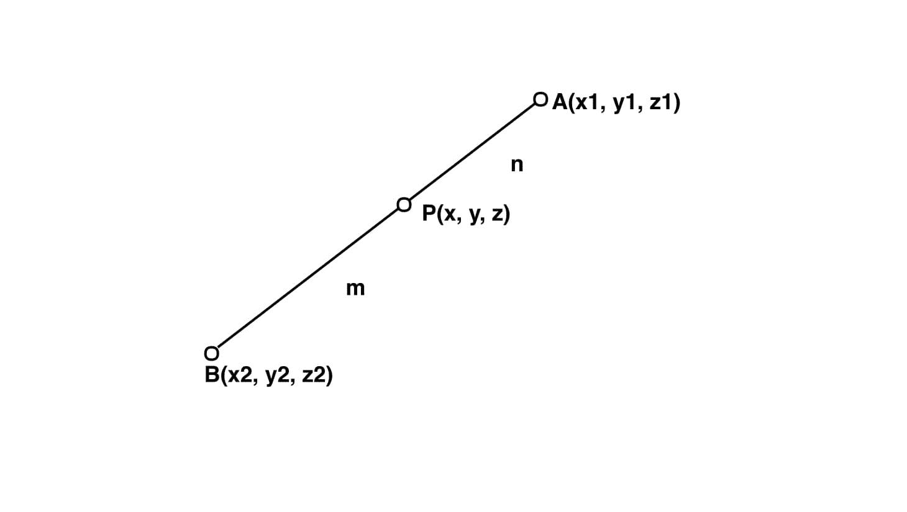

# 3D

截面公式

> 原文:[https://www.geeksforgeeks.org/section-formula-for-3-d/](https://www.geeksforgeeks.org/section-formula-for-3-d/)

给定 3D 中的两个坐标(x1，y1，z1)和(x2，y2，z2)以及 m 和 n，求以 m : n 的比例划分连接线(x1，y1，Z1)和(x2，y2，Z2)的坐标。

**示例:**

> **输入:** x1 = 2，y1 = -1，Z1 = 4，x2 = 4，y2 = 3，Z2 = 2，
> m = 2，n = 3
> **输出:** (2.8，. 6，3.2)
> **解释:**坐标(2.8，. 6，3.2)
> 以 2 : 3
> 的比例分割线



**逼近:**
给定 3D 中的两个坐标 A(x1，y1，Z1)和 B(x2，y2，Z2)，以及 m 和 n，我们必须找到以 m : n 的比例分割连线(x1，y1，Z1)和(x2，y2，Z2)的坐标
让坐标为 P(x，y， z)
然后根据 3 D
中的截面公式 x =(m * x2+n * x1)/(m+n)
y =(m * y2+n * y1)/(m+n)
z =(m * z2+n * Z1)/(m+n)

下面是上述方法的实现:

## C++

```
// CPP program to find point that divides
// given line in given ratio in 3D.
#include <iostream>
using namespace std;

// Function to find the section of the line
void section(double x1, double x2, double y1,
             double y2, double z1, double z2,
             double m, double n)
{
    // Applying section formula
    double x = ((m * x2) + (n * x1)) / (m + n);

    double y = ((m * y2) + (n * y1)) / (m + n);

    double z = ((m * z2) + (n * z1)) / (m + n);

    // Printing result
    cout << "(" << x << ", ";
    cout << y << ", ";
    cout << z << ")" << endl;
}

// Driver code
int main()
{
    double x1 = 2, x2 = 4, y1 = -1,
           y2 = 3, z1 = 4, z2 = 2,
           m = 2, n = 3;
    section(x1, x2, y1, y2, z1, z2, m, n);
    return 0;
}
```

## Java 语言(一种计算机语言，尤用于创建网站)

```
// Java program to find point that divides
// given line in given ratio in 3D.
import java.util.*;

class solution
{

// Function to find the section of the line
static void section(double x1, double x2, double y1,
            double y2, double z1, double z2,
            double m, double n)
{
    // Applying section formula
    double x = ((m * x2) + (n * x1)) / (m + n);

    double y = ((m * y2) + (n * y1)) / (m + n);

    double z = ((m * z2) + (n * z1)) / (m + n);

    System.out.print( "(" +x +", ");
    System.out.print( y+ ", ");
    System.out.println(z + ")" );

}

// Driver code
public static void main(String arr[])
{
    double x1 = 2, x2 = 4, y1 = -1,
        y2 = 3, z1 = 4, z2 = 2,
        m = 2, n = 3;
    section(x1, x2, y1, y2, z1, z2, m, n);

}

}
//This code is contributed by Surendra_Gangwar
```

## 蟒蛇 3

```
# Python 3 program to find point that divides
# given line in given ratio in 3D.

# Function to find the section of the line
def section(x1, x2, y1, y2, z1, z2, m, n):
    # Applying section formula
    x = ((m * x2) + (n * x1)) / (m + n)

    y = ((m * y2) + (n * y1)) / (m + n)

    z = ((m * z2) + (n * z1)) / (m + n)

    # Printing result
    print("(",x,",",y,",",z,")")

# Driver code
if __name__ == '__main__':
    x1 = 2
    x2 = 4
    y1 = -1
    y2 = 3
    z1 = 4
    z2 = 2
    m = 2
    n = 3
    section(x1, x2, y1, y2, z1, z2, m, n)

#This code is contributed by
# Surendra_Gangwar
```

## C#

```
// C# program to find point that divides
// given line in given ratio in 3D.
using System;

class GFG
{

// Function to find the section
// of the line
static void section(double x1, double x2, double y1,
                    double y2, double z1, double z2,
                    double m, double n)
{
    // Applying section formula
    double x = ((m * x2) + (n * x1)) / (m + n);

    double y = ((m * y2) + (n * y1)) / (m + n);

    double z = ((m * z2) + (n * z1)) / (m + n);

    Console.Write("(" + x +", ");
    Console.Write(y + ", ");
    Console.WriteLine(z + ")" );
}

// Driver code
static public void Main ()
{
    double x1 = 2, x2 = 4, y1 = -1,
    y2 = 3, z1 = 4, z2 = 2,
    m = 2, n = 3;
    section(x1, x2, y1, y2, z1, z2, m, n);
}
}

// This code is contributed by ajit.
```

## 服务器端编程语言（Professional Hypertext Preprocessor 的缩写）

```
<?php
// PHP program to find point that divides
// given line in given ratio in 3D.

// Function to find the section of the line
function section($x1, $x2, $y1,
                 $y2, $z1, $z2,
                 $m, $n)
{
    // Applying section formula
    $x = (($m * $x2) + ($n * $x1)) / ($m + $n);

    $y = (($m * $y2) + ($n * $y1)) / ($m + $n);

    $z = (($m * $z2) + ($n * $z1)) / ($m + $n);

    // Printing result
    echo "(" . $x . ", ";
    echo $y . ", ";
    echo $z . ")" ."\n";
}

// Driver code
$x1 = 2; $x2 = 4; $y1 = -1;
$y2 = 3; $z1 = 4; $z2 = 2;
$m = 2; $n = 3;
section($x1, $x2, $y1, $y2,
        $z1, $z2, $m, $n);

// This code is contributed
// by Akanksha Rai
```

## java 描述语言

```
<script>

// Javascript program to find point that
// divides given line in given ratio in 3D.

// Function to find the section
// of the line
function section(x1, x2, y1, y2, z1, z2, m, n)
{

    // Applying section formula
    let x = ((m * x2) + (n * x1)) / (m + n);
    let y = ((m * y2) + (n * y1)) / (m + n);
    let z = ((m * z2) + (n * z1)) / (m + n);

    document.write("(" + x +", ");
    document.write(y + ", ");
    document.write(z + ")" );
}

// Driver code
let x1 = 2, x2 = 4, y1 = -1,
y2 = 3, z1 = 4, z2 = 2,
m = 2, n = 3;

section(x1, x2, y1, y2, z1, z2, m, n);

// This code is contributed by suresh07

</script>
```

**输出:**

```
(2.8, 0.6, 3.2)
```