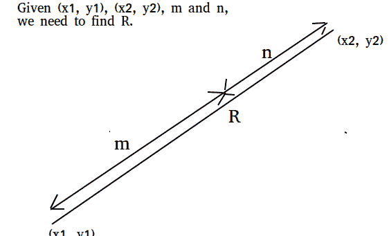
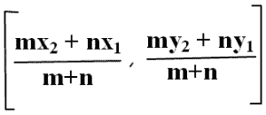
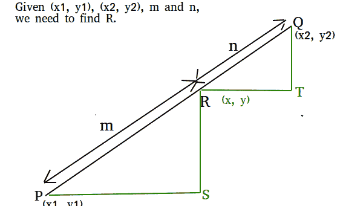

# 截面公式(以给定比例划分直线的点)

> 原文:[https://www . geesforgeks . org/section-formula-point-divides-line-给定比率/](https://www.geeksforgeeks.org/section-formula-point-divides-line-given-ratio/)

给定两个坐标(x1，y1)和(x2，y2)以及 m 和 n，求以 m : n
的比例划分连接线(x1，y1)和(x2，y2)的坐标



**例:**

```
Input : x1 = 1, y1 = 0, x2 = 2 y2 = 5,
        m = 1, n = 1
Output : (1.5, 2.5)
Explanation: co-ordinates (1.5, 2.5)
divides the line in ratio 1 : 1

Input : x1 = 2, y1 = 4, x2 = 4, y2 = 6,
        m = 2, n = 3
Output : (2.8, 4.8)
Explanation: (2.8, 4.8) divides the line
in the ratio 2:3
```

截面公式告诉我们将给定线段分成两部分的点的坐标，这两部分的长度比例为 m : n



## C++

```
// CPP program to find point that divides
// given line in given ratio.
#include <iostream>
using namespace std;

// Function to find the section of the line
void section(double x1, double x2, double y1,
              double y2, double m, double n)
{
    // Applying section formula
    double x = ((n * x1) + (m * x2)) /
                            (m + n);
    double y = ((n * y1) + (m * y2)) /
                             (m + n);

    // Printing result
    cout << "(" << x << ", ";
    cout << y << ")" << endl;
}

// Driver code
int main()
{
    double x1 = 2, x2 = 4, y1 = 4,
           y2 = 6, m = 2, n = 3;
    section(x1, x2, y1, y2, m, n);
    return 0;
}
```

## Java 语言(一种计算机语言，尤用于创建网站)

```
// Java program to find point that divides
// given line in given ratio.
import java.io.*;

class sections {
    static void section(double x1, double x2,
                        double y1, double y2,
                        double m, double n)
    {
        // Applying section formula
        double x = ((n * x1) + (m * x2)) /
                    (m + n);
        double y = ((n * y1) + (m * y2)) /
                    (m + n);

        // Printing result
        System.out.println("(" + x + ", " + y + ")");
    }

    public static void main(String[] args)
    {
        double x1 = 2, x2 = 4, y1 = 4,
               y2 = 6, m = 2, n = 3;
        section(x1, x2, y1, y2, m, n);
    }
}
```

## 计算机编程语言

```
# Python program to find point that divides
# given line in given ratio.
def section(x1, x2, y1, y2, m, n):

    # Applying section formula
    x = (float)((n * x1)+(m * x2))/(m + n)
    y = (float)((n * y1)+(m * y2))/(m + n)

    # Printing result
    print (x, y)

x1 = 2
x2 = 4
y1 = 4
y2 = 6
m = 2
n = 3
section(x1, x2, y1, y2, m, n)
```

## C#

```
// C# program to find point that divides
// given line in given ratio.
using System;

class GFG {

    static void section(double x1, double x2,
                        double y1, double y2,
                          double m, double n)
    {

        // Applying section formula
        double x = ((n * x1) + (m * x2)) /
                                    (m + n);

        double y = ((n * y1) + (m * y2)) /
                                   (m + n);

        // Printing result
        Console.WriteLine("(" + x + ", " + y + ")");
    }

    // Driver code
    public static void Main()
    {

        double x1 = 2, x2 = 4, y1 = 4,
                y2 = 6, m = 2, n = 3;

        section(x1, x2, y1, y2, m, n);
    }
}

// This code is contributed by vt_m.
```

## 服务器端编程语言（Professional Hypertext Preprocessor 的缩写）

```
<?php
// PHP program to find point that 
// divides given line in given ratio.

// Function to find the
// section of the line
function section($x1, $x2, $y1,
                 $y2, $m, $n)
{

    // Applying section formula
    $x = (($n * $x1) + ($m * $x2))
                     / ($m + $n);

    $y = (($n * $y1) + ($m * $y2)) 
                     / ($m + $n);

    // Printing result
    echo("(" . $x . ", ");
    echo($y . ")");
}

// Driver code
$x1 = 2; $x2 = 4; $y1 = 4;
$y2 = 6; $m = 2; $n = 3;
section($x1, $x2, $y1, $y2, $m, $n);

// This code is contributed by Ajit.
?>
```

## java 描述语言

```
<script>

// JavaScript program to find point that divides
// given line in given ratio

    function section(x1, x2, y1, y2, m, n)
    {
        // Applying section formula
        let x = ((n * x1) + (m * x2)) /
                    (m + n);
        let y = ((n * y1) + (m * y2)) /
                    (m + n);

        // Printing result
        document.write("(" + x + ", " + y + ")");
    }

// Driver Code

        let x1 = 2, x2 = 4, y1 = 4,
               y2 = 6, m = 2, n = 3;
        section(x1, x2, y1, y2, m, n)

       // This code is contributed by avijitmondal1998.
</script>
```

输出:

```
(2.8, 4.8)
```

**这是如何工作的？**



```
From our diagram, we can see,
PS = x – x1 and RT = x2 – x

We are given,

PR/QR = m/n

Using similarity, we can write
RS/QT = PS/RT = PR/QR

Therefore, we can write
 PS/RR = m/n
 (x - x1) / (x2 - x) = m/n

From above, we get
  x = (mx2 + nx1) / (m + n)

Similarly, we can solve for y.
```

**参考文献:**
[http://double root . in/教训/坐标-几何-基础/截面-公式/#.WjYXQvbhU8o](http://doubleroot.in/lessons/coordinate-geometry-basics/section-formula/#.WjYXQvbhU8o)