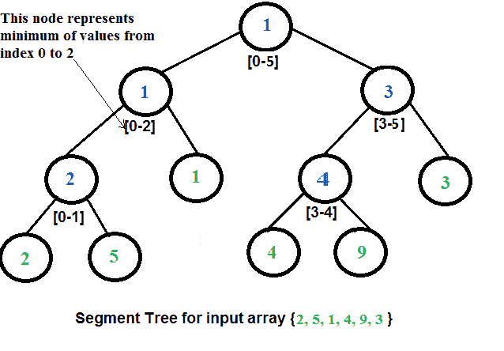

# 段树|集合 2(范围最小查询)

> 原文:[https://www . geesforgeks . org/segment-tree-set-1-range-minimum-query/](https://www.geeksforgeeks.org/segment-tree-set-1-range-minimum-query/)

我们在上一篇文章中用一个简单的例子介绍了[段树。在这篇文章中，](https://www.geeksforgeeks.org/segment-tree-set-1-sum-of-given-range/)[范围最小查询](http://en.wikipedia.org/wiki/Range_Minimum_Query)问题作为另一个可以使用段树的例子进行了讨论。以下是问题陈述:
我们有一个数组 arr[0。。。n-1]。我们应该能够高效地找到从索引 *qs* (查询开始)到 *qe* (查询结束)的最小值，其中*0<= QS<= QE<= n-1*。

一个**简单的解决方案**是运行一个从 *qs* 到 *qe* 的循环，找到给定范围内的最小元素。这种解决方案在最坏的情况下需要 O(n)个时间。
**另一个解决方案**是创建一个 2D 数组，其中一个条目[i，j]存储范围 arr[I]中的最小值..j]。现在可以用 O(1)时间计算给定范围的最小值，但是预处理需要 O(n^2 时间。此外，这种方法需要 O(n^2)额外的空间，这对于大型输入阵列来说可能会变得很大。
[**段树**](https://www.geeksforgeeks.org/segment-tree-set-1-sum-of-given-range/) 可以在适中的时间内做预处理和查询。对于段树，预处理时间为 0(n)，范围最小查询的时间复杂度为 0(Logn)。存储段树所需的额外空间为 0(n)。
段树的表示
**1。**叶节点是输入数组的元素。
**2。**每个内部节点代表其下所有叶子的最小值。
树的数组表示用于表示分段树。对于索引 I 处的每个节点，左子节点位于索引 2*i+1 处，右子节点位于索引 2*i+2 处，父节点位于**⌊(i–1)/2⌋**处。



**从给定数组**
构建线段树我们从线段 arr【0】开始。。。n-1]。并且每次我们将当前段分成两半(如果它还没有变成长度为 1 的段)，然后在两半上调用相同的过程，并且对于每个这样的段，我们将最小值存储在段树节点中。
构建的段树除最后一层外，所有层都将被完全填充。此外，该树将是一个[完整的二叉树](http://en.wikipedia.org/wiki/Binary_tree#Types_of_binary_trees)，因为我们总是在每一个级别将片段分成两半。由于构造的树总是有 n 片叶子的全二叉树，因此会有 n-1 个内部节点。因此，节点总数将为 2 * n–1。
段树高度为 **⌈log₂n⌉** 。由于树是用数组表示的，并且必须保持父索引和子索引之间的关系，因此分配给段树的内存大小将是**2 * 2<sup>⌈log</sup><sub><sup>2</sup></sub>n⌉–1**。

**查询给定范围的最小值**
树一旦构建，如何使用构建的段树进行范围最小值查询。下面是求最小值的算法。

```
// qs --> query start index, qe --> query end index
int RMQ(node, qs, qe) 
{
   if range of node is within qs and qe
        return value in node
   else if range of node is completely outside qs and qe
        return INFINITE
   else
    return min( RMQ(node's left child, qs, qe), RMQ(node's right child, qs, qe) )
}
```

**执行:**

## C++

```
// C++ program for range minimum
// query using segment tree
#include <bits/stdc++.h>
using namespace std;

// A utility function to get minimum of two numbers
int minVal(int x, int y) { return (x < y)? x: y; }

// A utility function to get the
// middle index from corner indexes.
int getMid(int s, int e) { return s + (e -s)/2; }

/* A recursive function to get the
minimum value in a given range
of array indexes. The following
are parameters for this function.

    st --> Pointer to segment tree
    index --> Index of current node in the
           segment tree. Initially 0 is
           passed as root is always at index 0
    ss & se --> Starting and ending indexes
                of the segment represented
                by current node, i.e., st[index]
    qs & qe --> Starting and ending indexes of query range */
int RMQUtil(int *st, int ss, int se, int qs, int qe, int index)
{
    // If segment of this node is a part
    // of given range, then return
    // the min of the segment
    if (qs <= ss && qe >= se)
        return st[index];

    // If segment of this node
    // is outside the given range
    if (se < qs || ss > qe)
        return INT_MAX;

    // If a part of this segment
    // overlaps with the given range
    int mid = getMid(ss, se);
    return minVal(RMQUtil(st, ss, mid, qs, qe, 2*index+1),
                RMQUtil(st, mid+1, se, qs, qe, 2*index+2));
}

// Return minimum of elements in range
// from index qs (query start) to
// qe (query end). It mainly uses RMQUtil()
int RMQ(int *st, int n, int qs, int qe)
{
    // Check for erroneous input values
    if (qs < 0 || qe > n-1 || qs > qe)
    {
        cout<<"Invalid Input";
        return -1;
    }

    return RMQUtil(st, 0, n-1, qs, qe, 0);
}

// A recursive function that constructs
// Segment Tree for array[ss..se].
// si is index of current node in segment tree st
int constructSTUtil(int arr[], int ss, int se,
                                int *st, int si)
{
    // If there is one element in array,
    // store it in current node of
    // segment tree and return
    if (ss == se)
    {
        st[si] = arr[ss];
        return arr[ss];
    }

    // If there are more than one elements,
    // then recur for left and right subtrees
    // and store the minimum of two values in this node
    int mid = getMid(ss, se);
    st[si] = minVal(constructSTUtil(arr, ss, mid, st, si*2+1),
                    constructSTUtil(arr, mid+1, se, st, si*2+2));
    return st[si];
}

/* Function to construct segment tree
from given array. This function allocates
memory for segment tree and calls constructSTUtil() to
fill the allocated memory */
int *constructST(int arr[], int n)
{
    // Allocate memory for segment tree

    //Height of segment tree
    int x = (int)(ceil(log2(n)));

    // Maximum size of segment tree
    int max_size = 2*(int)pow(2, x) - 1;

    int *st = new int[max_size];

    // Fill the allocated memory st
    constructSTUtil(arr, 0, n-1, st, 0);

    // Return the constructed segment tree
    return st;
}

// Driver program to test above functions
int main()
{
    int arr[] = {1, 3, 2, 7, 9, 11};
    int n = sizeof(arr)/sizeof(arr[0]);

    // Build segment tree from given array
    int *st = constructST(arr, n);

    int qs = 1; // Starting index of query range
    int qe = 5; // Ending index of query range

    // Print minimum value in arr[qs..qe]
    cout<<"Minimum of values in range ["<<qs<<", "<<qe<<"] "<<
    "is = "<<RMQ(st, n, qs, qe)<<endl;

    return 0;
}

// This code is contributed by rathbhupendra
```

## C

```
// C program for range minimum query using segment tree
#include <stdio.h>
#include <math.h>
#include <limits.h>

// A utility function to get minimum of two numbers
int minVal(int x, int y) { return (x < y)? x: y; }

// A utility function to get the middle index from corner indexes.
int getMid(int s, int e) {  return s + (e -s)/2;  }

/*  A recursive function to get the minimum value in a given range
     of array indexes. The following are parameters for this function.

    st    --> Pointer to segment tree
    index --> Index of current node in the segment tree. Initially
              0 is passed as root is always at index 0
    ss & se  --> Starting and ending indexes of the segment represented
                  by current node, i.e., st[index]
    qs & qe  --> Starting and ending indexes of query range */
int RMQUtil(int *st, int ss, int se, int qs, int qe, int index)
{
    // If segment of this node is a part of given range, then return
    //  the min of the segment
    if (qs <= ss && qe >= se)
        return st[index];

    // If segment of this node is outside the given range
    if (se < qs || ss > qe)
        return INT_MAX;

    // If a part of this segment overlaps with the given range
    int mid = getMid(ss, se);
    return minVal(RMQUtil(st, ss, mid, qs, qe, 2*index+1),
                  RMQUtil(st, mid+1, se, qs, qe, 2*index+2));
}

// Return minimum of elements in range from index qs (query start) to
// qe (query end).  It mainly uses RMQUtil()
int RMQ(int *st, int n, int qs, int qe)
{
    // Check for erroneous input values
    if (qs < 0 || qe > n-1 || qs > qe)
    {
        printf("Invalid Input");
        return -1;
    }

    return RMQUtil(st, 0, n-1, qs, qe, 0);
}

// A recursive function that constructs Segment Tree for array[ss..se].
// si is index of current node in segment tree st
int constructSTUtil(int arr[], int ss, int se, int *st, int si)
{
    // If there is one element in array, store it in current node of
    // segment tree and return
    if (ss == se)
    {
        st[si] = arr[ss];
        return arr[ss];
    }

    // If there are more than one elements, then recur for left and
    // right subtrees and store the minimum of two values in this node
    int mid = getMid(ss, se);
    st[si] =  minVal(constructSTUtil(arr, ss, mid, st, si*2+1),
                     constructSTUtil(arr, mid+1, se, st, si*2+2));
    return st[si];
}

/* Function to construct segment tree from given array. This function
   allocates memory for segment tree and calls constructSTUtil() to
   fill the allocated memory */
int *constructST(int arr[], int n)
{
    // Allocate memory for segment tree

    //Height of segment tree
    int x = (int)(ceil(log2(n)));

    // Maximum size of segment tree
    int max_size = 2*(int)pow(2, x) - 1;

    int *st = new int[max_size];

    // Fill the allocated memory st
    constructSTUtil(arr, 0, n-1, st, 0);

    // Return the constructed segment tree
    return st;
}

// Driver program to test above functions
int main()
{
    int arr[] = {1, 3, 2, 7, 9, 11};
    int n = sizeof(arr)/sizeof(arr[0]);

    // Build segment tree from given array
    int *st = constructST(arr, n);

    int qs = 1;  // Starting index of query range
    int qe = 5;  // Ending index of query range

    // Print minimum value in arr[qs..qe]
    printf("Minimum of values in range [%d, %d] is = %d\n",
                           qs, qe, RMQ(st, n, qs, qe));

    return 0;
}
```

## Java 语言(一种计算机语言，尤用于创建网站)

```
// Program for range minimum query using segment tree
class SegmentTreeRMQ
{
    int st[]; //array to store segment tree

    // A utility function to get minimum of two numbers
    int minVal(int x, int y) {
        return (x < y) ? x : y;
    }

    // A utility function to get the middle index from corner
    // indexes.
    int getMid(int s, int e) {
        return s + (e - s) / 2;
    }

    /*  A recursive function to get the minimum value in a given
        range of array indexes. The following are parameters for
        this function.

        st    --> Pointer to segment tree
        index --> Index of current node in the segment tree. Initially
                   0 is passed as root is always at index 0
        ss & se  --> Starting and ending indexes of the segment
                     represented by current node, i.e., st[index]
        qs & qe  --> Starting and ending indexes of query range */
    int RMQUtil(int ss, int se, int qs, int qe, int index)
    {
        // If segment of this node is a part of given range, then
        // return the min of the segment
        if (qs <= ss && qe >= se)
            return st[index];

        // If segment of this node is outside the given range
        if (se < qs || ss > qe)
            return Integer.MAX_VALUE;

        // If a part of this segment overlaps with the given range
        int mid = getMid(ss, se);
        return minVal(RMQUtil(ss, mid, qs, qe, 2 * index + 1),
                RMQUtil(mid + 1, se, qs, qe, 2 * index + 2));
    }

    // Return minimum of elements in range from index qs (query
    // start) to qe (query end).  It mainly uses RMQUtil()
    int RMQ(int n, int qs, int qe)
    {
        // Check for erroneous input values
        if (qs < 0 || qe > n - 1 || qs > qe) {
            System.out.println("Invalid Input");
            return -1;
        }

        return RMQUtil(0, n - 1, qs, qe, 0);
    }

    // A recursive function that constructs Segment Tree for
    // array[ss..se]. si is index of current node in segment tree st
    int constructSTUtil(int arr[], int ss, int se, int si)
    {
        // If there is one element in array, store it in current
        //  node of segment tree and return
        if (ss == se) {
            st[si] = arr[ss];
            return arr[ss];
        }

        // If there are more than one elements, then recur for left and
        // right subtrees and store the minimum of two values in this node
        int mid = getMid(ss, se);
        st[si] = minVal(constructSTUtil(arr, ss, mid, si * 2 + 1),
                constructSTUtil(arr, mid + 1, se, si * 2 + 2));
        return st[si];
    }

    /* Function to construct segment tree from given array. This function
       allocates memory for segment tree and calls constructSTUtil() to
       fill the allocated memory */
    void constructST(int arr[], int n)
    {
        // Allocate memory for segment tree

        //Height of segment tree
        int x = (int) (Math.ceil(Math.log(n) / Math.log(2)));

        //Maximum size of segment tree
        int max_size = 2 * (int) Math.pow(2, x) - 1;
        st = new int[max_size]; // allocate memory

        // Fill the allocated memory st
        constructSTUtil(arr, 0, n - 1, 0);
    }

    // Driver program to test above functions
    public static void main(String args[])
    {
        int arr[] = {1, 3, 2, 7, 9, 11};
        int n = arr.length;
        SegmentTreeRMQ tree = new SegmentTreeRMQ();

        // Build segment tree from given array
        tree.constructST(arr, n);

        int qs = 1;  // Starting index of query range
        int qe = 5;  // Ending index of query range

        // Print minimum value in arr[qs..qe]
        System.out.println("Minimum of values in range [" + qs + ", "
                           + qe + "] is = " + tree.RMQ(n, qs, qe));
    }
}
// This code is contributed by Ankur Narain Verma
```

## 蟒蛇 3

```
# Python3 program for range minimum
# query using segment tree
import sys;
from math import ceil,log2;

INT_MAX = sys.maxsize;

# A utility function to get
# minimum of two numbers
def minVal(x, y) :
    return x if (x < y) else y;

# A utility function to get the
# middle index from corner indexes.
def getMid(s, e) :
    return s + (e - s) // 2;

""" A recursive function to get the
minimum value in a given range
of array indexes. The following
are parameters for this function.

    st --> Pointer to segment tree
    index --> Index of current node in the
        segment tree. Initially 0 is
        passed as root is always at index 0
    ss & se --> Starting and ending indexes
                of the segment represented
                by current node, i.e., st[index]
    qs & qe --> Starting and ending indexes of query range """
def RMQUtil( st, ss, se, qs, qe, index) :

    # If segment of this node is a part
    # of given range, then return
    # the min of the segment
    if (qs <= ss and qe >= se) :
        return st[index];

    # If segment of this node
    # is outside the given range
    if (se < qs or ss > qe) :
        return INT_MAX;

    # If a part of this segment
    # overlaps with the given range
    mid = getMid(ss, se);
    return minVal(RMQUtil(st, ss, mid, qs,
                          qe, 2 * index + 1),
                  RMQUtil(st, mid + 1, se,
                          qs, qe, 2 * index + 2));

# Return minimum of elements in range
# from index qs (query start) to
# qe (query end). It mainly uses RMQUtil()
def RMQ( st, n, qs, qe) :

    # Check for erroneous input values
    if (qs < 0 or qe > n - 1 or qs > qe) :

        print("Invalid Input");
        return -1;

    return RMQUtil(st, 0, n - 1, qs, qe, 0);

# A recursive function that constructs
# Segment Tree for array[ss..se].
# si is index of current node in segment tree st
def constructSTUtil(arr, ss, se, st, si) :

    # If there is one element in array,
    # store it in current node of
    # segment tree and return
    if (ss == se) :

        st[si] = arr[ss];
        return arr[ss];

    # If there are more than one elements,
    # then recur for left and right subtrees
    # and store the minimum of two values in this node
    mid = getMid(ss, se);
    st[si] = minVal(constructSTUtil(arr, ss, mid,
                                    st, si * 2 + 1),
                    constructSTUtil(arr, mid + 1, se,
                                    st, si * 2 + 2));

    return st[si];

"""Function to construct segment tree
from given array. This function allocates
memory for segment tree and calls constructSTUtil()
to fill the allocated memory """
def constructST( arr, n) :

    # Allocate memory for segment tree

    # Height of segment tree
    x = (int)(ceil(log2(n)));

    # Maximum size of segment tree
    max_size = 2 * (int)(2**x) - 1;

    st = [0] * (max_size);

    # Fill the allocated memory st
    constructSTUtil(arr, 0, n - 1, st, 0);

    # Return the constructed segment tree
    return st;

# Driver Code
if __name__ == "__main__" :

    arr = [1, 3, 2, 7, 9, 11];
    n = len(arr);

    # Build segment tree from given array
    st = constructST(arr, n);

    qs = 1; # Starting index of query range
    qe = 5; # Ending index of query range

    # Print minimum value in arr[qs..qe]
    print("Minimum of values in range [", qs,
          ",", qe, "]", "is =", RMQ(st, n, qs, qe));

# This code is contributed by AnkitRai01
```

## C#

```
// C# Program for range minimum
// query using segment tree
using System;

public class SegmentTreeRMQ
{
    int []st; //array to store segment tree

    // A utility function to
    // get minimum of two numbers
    int minVal(int x, int y)
    {
        return (x < y) ? x : y;
    }

    // A utility function to get the
    //  middle index from corner indexes.
    int getMid(int s, int e)
    {
        return s + (e - s) / 2;
    }

    /* A recursive function to get
        the minimum value in a given
        range of array indexes.
        The following are parameters for
        this function.

        st --> Pointer to segment tree
        index --> Index of current node in the
        segment tree. Initially 0 is passed
        as root is always at index 0
        ss & se --> Starting and ending indexes of the segment
                    represented by current node, i.e., st[index]
        qs & qe --> Starting and ending indexes of query range */
    int RMQUtil(int ss, int se, int qs, int qe, int index)
    {
        // If segment of this node is a
        // part of given range, then
        // return the min of the segment
        if (qs <= ss && qe >= se)
            return st[index];

        // If segment of this node
        // is outside the given range
        if (se < qs || ss > qe)
            return int.MaxValue;

        // If a part of this segment
        // overlaps with the given range
        int mid = getMid(ss, se);
        return minVal(RMQUtil(ss, mid, qs, qe, 2 * index + 1),
                RMQUtil(mid + 1, se, qs, qe, 2 * index + 2));
    }

    // Return minimum of elements
    // in range from index qs (query
    // start) to qe (query end).
    // It mainly uses RMQUtil()
    int RMQ(int n, int qs, int qe)
    {
        // Check for erroneous input values
        if (qs < 0 || qe > n - 1 || qs > qe)
        {
            Console.WriteLine("Invalid Input");
            return -1;
        }

        return RMQUtil(0, n - 1, qs, qe, 0);
    }

    // A recursive function that
    // constructs Segment Tree for
    // array[ss..se]. si is index
    // of current node in segment tree st
    int constructSTUtil(int []arr, int ss, int se, int si)
    {
        // If there is one element in array,
        // store it in current node of
        // segment tree and return
        if (ss == se)
        {
            st[si] = arr[ss];
            return arr[ss];
        }

        // If there are more than one elements,
        // then recur for left and right subtrees
        // and store the minimum of two values in this node
        int mid = getMid(ss, se);
        st[si] = minVal(constructSTUtil(arr, ss, mid, si * 2 + 1),
                constructSTUtil(arr, mid + 1, se, si * 2 + 2));
        return st[si];
    }

    /* Function to construct segment
    tree from given array. This function
    allocates memory for segment tree
    and calls constructSTUtil() to
    fill the allocated memory */
    void constructST(int []arr, int n)
    {
        // Allocate memory for segment tree

        // Height of segment tree
        int x = (int) (Math.Ceiling(Math.Log(n) / Math.Log(2)));

        // Maximum size of segment tree
        int max_size = 2 * (int) Math.Pow(2, x) - 1;
        st = new int[max_size]; // allocate memory

        // Fill the allocated memory st
        constructSTUtil(arr, 0, n - 1, 0);
    }

    // Driver code
    public static void Main()
    {
        int []arr = {1, 3, 2, 7, 9, 11};
        int n = arr.Length;
        SegmentTreeRMQ tree = new SegmentTreeRMQ();

        // Build segment tree from given array
        tree.constructST(arr, n);

        int qs = 1; // Starting index of query range
        int qe = 5; // Ending index of query range

        // Print minimum value in arr[qs..qe]
        Console.WriteLine("Minimum of values in range [" + qs + ", "
                        + qe + "] is = " + tree.RMQ(n, qs, qe));
    }
}

/* This code contributed by PrinciRaj1992 */
```

## java 描述语言

```
<script>

      // JavaScript Program for range minimum
      // query using segment tree
      class SegmentTreeRMQ {
        constructor() {
          this.st = []; //array to store segment tree
        }

        // A utility function to
        // get minimum of two numbers
        minVal(x, y) {
          return x < y ? x : y;
        }

        // A utility function to get the
        //  middle index from corner indexes.
        getMid(s, e) {
          return parseInt(s + (e - s) / 2);
        }

        /* A recursive function to get
            the minimum value in a given
            range of array indexes.
            The following are parameters for
            this function.

            st --> Pointer to segment tree
            index --> Index of current node in the
            segment tree. Initially 0 is passed
            as root is always at index 0
            ss & se --> Starting and ending indexes of the segment
                        represented by current node, i.e., st[index]
            qs & qe --> Starting and ending indexes of query range */
        RMQUtil(ss, se, qs, qe, index) {
          // If segment of this node is a
          // part of given range, then
          // return the min of the segment
          if (qs <= ss && qe >= se) return this.st[index];

          // If segment of this node
          // is outside the given range
          if (se < qs || ss > qe) return 2147483647;

          // If a part of this segment
          // overlaps with the given range
          var mid = this.getMid(ss, se);
          return this.minVal(
            this.RMQUtil(ss, mid, qs, qe, 2 * index + 1),
            this.RMQUtil(mid + 1, se, qs, qe, 2 * index + 2)
          );
        }

        // Return minimum of elements
        // in range from index qs (query
        // start) to qe (query end).
        // It mainly uses RMQUtil()
        RMQ(n, qs, qe) {
          // Check for erroneous input values
          if (qs < 0 || qe > n - 1 || qs > qe) {
            document.write("Invalid Input");
            return -1;
          }

          return this.RMQUtil(0, n - 1, qs, qe, 0);
        }

        // A recursive function that
        // constructs Segment Tree for
        // array[ss..se]. si is index
        // of current node in segment tree st
        constructSTUtil(arr, ss, se, si) {
          // If there is one element in array,
          // store it in current node of
          // segment tree and return
          if (ss == se) {
            this.st[si] = arr[ss];
            return arr[ss];
          }

          // If there are more than one elements,
          // then recur for left and right subtrees
          // and store the minimum of two values in this node
          var mid = this.getMid(ss, se);
          this.st[si] = this.minVal(
            this.constructSTUtil(arr, ss, mid, si * 2 + 1),
            this.constructSTUtil(arr, mid + 1, se, si * 2 + 2)
          );
          return this.st[si];
        }

        /* Function to construct segment
        tree from given array. This function
        allocates memory for segment tree
        and calls constructSTUtil() to
        fill the allocated memory */
        constructST(arr, n) {
          // Allocate memory for segment tree

          // Height of segment tree
          var x = parseInt(Math.ceil(Math.log(n) / Math.log(2)));

          // Maximum size of segment tree
          var max_size = 2 * parseInt(Math.pow(2, x) - 1);
          this.st = new Array(max_size).fill(0); // allocate memory

          // Fill the allocated memory st
          this.constructSTUtil(arr, 0, n - 1, 0);
        }
      }
      // Driver code
      var arr = [1, 3, 2, 7, 9, 11];
      var n = arr.length;
      var tree = new SegmentTreeRMQ();

      // Build segment tree from given array
      tree.constructST(arr, n);

      var qs = 1; // Starting index of query range
      var qe = 5; // Ending index of query range

      // Print minimum value in arr[qs..qe]
      document.write(
        "Minimum of values in range [" +
          qs +
          ", " +
          qe +
          "] is = " +
          tree.RMQ(n, qs, qe) +
          "<br>"
      );
</script>
```

**输出:**

```
 Minimum of values in range [1, 5] is = 2
```

**时间复杂度:**
树构建的时间复杂度为 O(n)。总共有 2n-1 个节点，每个节点的值在树构造中只计算一次。
查询的时间复杂度为 0(Logn)。为了查询最小范围，我们在每个级别最多处理两个节点，级别数为 0(Logn)。

有关范围最小查询问题的更多解决方案，请参考以下链接。
[https://www . geeksforgeeks . org/Range-Minimum-Query-for-static-array/](https://www.geeksforgeeks.org/range-minimum-query-for-static-array/)
[http://community.topcoder.com/tc?module=Static&D1 =教程&D2 = lowstcommonexist # Range _ Minimum _ Query _(RMQ)](http://community.topcoder.com/tc?module=Static&d1=tutorials&d2=lowestCommonAncestor#Range_Minimum_Query_(RMQ))
[http://wcipeg.com/wiki/Range_minimum_query](http://wcipeg.com/wiki/Range_minimum_query)
如发现有不正确的地方，或想分享以上讨论话题的更多信息，请写评论。