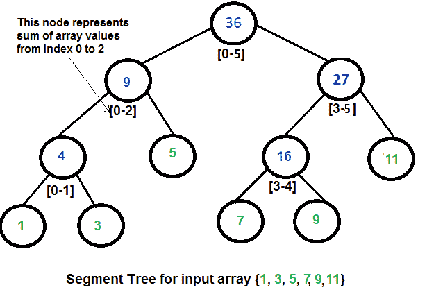

# 段树|集合 1(给定范围的和)

> 原文:[https://www . geesforgeks . org/segment-tree-set-1-给定范围的总和/](https://www.geeksforgeeks.org/segment-tree-set-1-sum-of-given-range/)

让我们考虑以下问题来理解段树。
我们有一个数组 arr[0。。。n-1]。我们应该能够
**1** 找到从索引 l 到 r 的元素之和，其中 0<= l<= r<= n-1
**2**将数组中指定元素的值更改为新值 x。我们需要进行 arr[i] = x，其中 0 < = i < = n-1。

一个**简单的解决方案**是从 l 到 r 运行一个循环，计算给定范围内的元素之和。要更新一个值，只需执行 arr[i] = x。第一个操作需要 O(n)个时间，第二个操作需要 O(1)个时间。

**另一种解决方案**是创建另一个数组，并在这个数组的第 I 个索引处存储从开始到 I 的和。现在可以在 O(1)时间内计算给定范围的总和，但是更新操作现在需要 O(n)时间。如果查询操作的数量很大，并且更新很少，这种方法很有效。
如果查询和更新的次数相等怎么办？**一旦给定数组，我们能否在 O(log n)时间内执行这两个操作？**我们可以使用一个段树在 0(Logn)时间内完成这两个操作。

**段树的表示**
**1。**叶节点是输入数组的元素。
**2。**每个内部节点代表叶节点的一些合并。对于不同的问题，合并可能会有所不同。对于这个问题，合并是一个节点下的叶子的和。
树的数组表示用于表示段树。对于索引 I 处的每个节点，左边的子节点位于索引 2*i+1 处，右边的子节点位于索引 2*i+2 处，父节点位于**⌊(i–1)/2⌋**处。



**上面的段树在内存中是什么样子的？**
像堆一样，段树也表示为一个数组。不同的是，它不是一棵完整的二叉树。这是一个完整的二叉树(每个节点有 0 或 2 个子节点)，除了最后一层，所有层都被填充。与堆不同，最后一级节点之间可能有间隙。下面是上图的段树数组中的值。

> 下面是输入数组{1，3，5，7，9，11}
> st[] = {36，9，27，4，5，16，11，1，3，DUMMY，DUMMY，7，9，DUMMY，DUMMY}的段树的内存表示

伪值从不被访问，也没有任何用处。由于简单的数组表示，这是对空间的一些浪费。我们可以使用一些巧妙的实现来优化这种浪费，但是求和和更新的代码变得更加复杂。

**从给定数组**
构建线段树我们从线段 arr【0】开始。。。n-1]。并且每次我们将当前段分成两半(如果它还没有变成长度为 1 的段)，然后在两半上调用相同的过程，并且对于每个这样的段，我们将总和存储在相应的节点中。
构建的段树除最后一层外，所有层都将被完全填充。此外，该树将是一个[完整的二叉树](https://www.geeksforgeeks.org/binary-tree-set-3-types-of-binary-tree/)，因为我们总是在每一层将线段分成两半。由于构造的树总是一棵有 n 片叶子的完全二叉树，因此会有 n-1 个内部节点。因此，节点总数将为 2 * n–1。请注意，这不包括虚拟节点。

**代表段树的数组总大小是多少？**
如果 n 是 2 的幂，那么没有伪节点。所以段树的大小是 2n-1 (n 个叶节点和 n-1 个内部节点)。如果 n 不是 2 的幂，则树的大小将是 2 * x–1，其中 x 是大于 n 的 2 的最小幂。例如，当 n = 10 时，则表示段树的数组的大小是 2*16-1 = 31。
尺寸的另一种解释是基于高度。段树高度为 **⌈log₂n⌉** 。由于树是使用数组表示的，并且必须保持父索引和子索引之间的关系，因此分配给段树的内存大小将是**2 * 2<sup>⌈log</sup><sub><sup>2</sup></sub><sup>n⌉</sup>–1**。

**查询给定范围的和**
一旦构建了树，如何利用构建的段树得到和。下面是获取元素总和的算法。

```
int getSum(node, l, r) 
{
   if the range of the node is within l and r
        return value in the node
   else if the range of the node is completely outside l and r
        return 0
   else
    return getSum(node's left child, l, r) + 
           getSum(node's right child, l, r)
}
```

**更新一个值**
像树的构建和查询操作一样，更新也可以递归进行。我们得到了一个需要更新的索引。让*不同于*成为要增加的价值。我们从段树的根开始，将 *diff* 添加到在其范围内给定索引的所有节点。如果一个节点在其范围内没有给定的索引，我们不会对该节点进行任何更改。

**实现:**
下面是段树的实现。该程序为任何给定的数组实现段树的构造。它还实现了查询和更新操作。

## C++

```
// C++ program to show segment tree operations like construction, query
// and update
#include <bits/stdc++.h>
using namespace std;

// A utility function to get the middle index from corner indexes.
int getMid(int s, int e) { return s + (e -s)/2; }

/* A recursive function to get the sum of values in the given range
    of the array. The following are parameters for this function.

    st --> Pointer to segment tree
    si --> Index of current node in the segment tree. Initially
            0 is passed as root is always at index 0
    ss & se --> Starting and ending indexes of the segment represented
                by current node, i.e., st[si]
    qs & qe --> Starting and ending indexes of query range */
int getSumUtil(int *st, int ss, int se, int qs, int qe, int si)
{
    // If segment of this node is a part of given range, then return
    // the sum of the segment
    if (qs <= ss && qe >= se)
        return st[si];

    // If segment of this node is outside the given range
    if (se < qs || ss > qe)
        return 0;

    // If a part of this segment overlaps with the given range
    int mid = getMid(ss, se);
    return getSumUtil(st, ss, mid, qs, qe, 2*si+1) +
        getSumUtil(st, mid+1, se, qs, qe, 2*si+2);
}

/* A recursive function to update the nodes which have the given
index in their range. The following are parameters
    st, si, ss and se are same as getSumUtil()
    i --> index of the element to be updated. This index is
            in the input array.
diff --> Value to be added to all nodes which have i in range */
void updateValueUtil(int *st, int ss, int se, int i, int diff, int si)
{
    // Base Case: If the input index lies outside the range of
    // this segment
    if (i < ss || i > se)
        return;

    // If the input index is in range of this node, then update
    // the value of the node and its children
    st[si] = st[si] + diff;
    if (se != ss)
    {
        int mid = getMid(ss, se);
        updateValueUtil(st, ss, mid, i, diff, 2*si + 1);
        updateValueUtil(st, mid+1, se, i, diff, 2*si + 2);
    }
}

// The function to update a value in input array and segment tree.
// It uses updateValueUtil() to update the value in segment tree
void updateValue(int arr[], int *st, int n, int i, int new_val)
{
    // Check for erroneous input index
    if (i < 0 || i > n-1)
    {
        cout<<"Invalid Input";
        return;
    }

    // Get the difference between new value and old value
    int diff = new_val - arr[i];

    // Update the value in array
    arr[i] = new_val;

    // Update the values of nodes in segment tree
    updateValueUtil(st, 0, n-1, i, diff, 0);
}

// Return sum of elements in range from index qs (query start)
// to qe (query end). It mainly uses getSumUtil()
int getSum(int *st, int n, int qs, int qe)
{
    // Check for erroneous input values
    if (qs < 0 || qe > n-1 || qs > qe)
    {
        cout<<"Invalid Input";
        return -1;
    }

    return getSumUtil(st, 0, n-1, qs, qe, 0);
}

// A recursive function that constructs Segment Tree for array[ss..se].
// si is index of current node in segment tree st
int constructSTUtil(int arr[], int ss, int se, int *st, int si)
{
    // If there is one element in array, store it in current node of
    // segment tree and return
    if (ss == se)
    {
        st[si] = arr[ss];
        return arr[ss];
    }

    // If there are more than one elements, then recur for left and
    // right subtrees and store the sum of values in this node
    int mid = getMid(ss, se);
    st[si] = constructSTUtil(arr, ss, mid, st, si*2+1) +
            constructSTUtil(arr, mid+1, se, st, si*2+2);
    return st[si];
}

/* Function to construct segment tree from given array. This function
allocates memory for segment tree and calls constructSTUtil() to
fill the allocated memory */
int *constructST(int arr[], int n)
{
    // Allocate memory for the segment tree

    //Height of segment tree
    int x = (int)(ceil(log2(n)));

    //Maximum size of segment tree
    int max_size = 2*(int)pow(2, x) - 1;

    // Allocate memory
    int *st = new int[max_size];

    // Fill the allocated memory st
    constructSTUtil(arr, 0, n-1, st, 0);

    // Return the constructed segment tree
    return st;
}

// Driver program to test above functions
int main()
{
    int arr[] = {1, 3, 5, 7, 9, 11};
    int n = sizeof(arr)/sizeof(arr[0]);

    // Build segment tree from given array
    int *st = constructST(arr, n);

    // Print sum of values in array from index 1 to 3
    cout<<"Sum of values in given range = "<<getSum(st, n, 1, 3)<<endl;

    // Update: set arr[1] = 10 and update corresponding
    // segment tree nodes
    updateValue(arr, st, n, 1, 10);

    // Find sum after the value is updated
    cout<<"Updated sum of values in given range = "
            <<getSum(st, n, 1, 3)<<endl;
    return 0;
}
//This code is contributed by rathbhupendra
```

## C

```
// C program to show segment tree operations like construction, query
// and update
#include <stdio.h>
#include <math.h>

// A utility function to get the middle index from corner indexes.
int getMid(int s, int e) {  return s + (e -s)/2;  }

/*  A recursive function to get the sum of values in given range
    of the array. The following are parameters for this function.

    st    --> Pointer to segment tree
    si    --> Index of current node in the segment tree. Initially
              0 is passed as root is always at index 0
    ss & se  --> Starting and ending indexes of the segment represented
                 by current node, i.e., st[si]
    qs & qe  --> Starting and ending indexes of query range */
int getSumUtil(int *st, int ss, int se, int qs, int qe, int si)
{
    // If segment of this node is a part of given range, then return
    // the sum of the segment
    if (qs <= ss && qe >= se)
        return st[si];

    // If segment of this node is outside the given range
    if (se < qs || ss > qe)
        return 0;

    // If a part of this segment overlaps with the given range
    int mid = getMid(ss, se);
    return getSumUtil(st, ss, mid, qs, qe, 2*si+1) +
           getSumUtil(st, mid+1, se, qs, qe, 2*si+2);
}

/* A recursive function to update the nodes which have the given
   index in their range. The following are parameters
    st, si, ss and se are same as getSumUtil()
    i    --> index of the element to be updated. This index is
             in the input array.
   diff --> Value to be added to all nodes which have i in range */
void updateValueUtil(int *st, int ss, int se, int i, int diff, int si)
{
    // Base Case: If the input index lies outside the range of
    // this segment
    if (i < ss || i > se)
        return;

    // If the input index is in range of this node, then update
    // the value of the node and its children
    st[si] = st[si] + diff;
    if (se != ss)
    {
        int mid = getMid(ss, se);
        updateValueUtil(st, ss, mid, i, diff, 2*si + 1);
        updateValueUtil(st, mid+1, se, i, diff, 2*si + 2);
    }
}

// The function to update a value in input array and segment tree.
// It uses updateValueUtil() to update the value in segment tree
void updateValue(int arr[], int *st, int n, int i, int new_val)
{
    // Check for erroneous input index
    if (i < 0 || i > n-1)
    {
        printf("Invalid Input");
        return;
    }

    // Get the difference between new value and old value
    int diff = new_val - arr[i];

    // Update the value in array
    arr[i] = new_val;

    // Update the values of nodes in segment tree
    updateValueUtil(st, 0, n-1, i, diff, 0);
}

// Return sum of elements in range from index qs (query start)
// to qe (query end).  It mainly uses getSumUtil()
int getSum(int *st, int n, int qs, int qe)
{
    // Check for erroneous input values
    if (qs < 0 || qe > n-1 || qs > qe)
    {
        printf("Invalid Input");
        return -1;
    }

    return getSumUtil(st, 0, n-1, qs, qe, 0);
}

// A recursive function that constructs Segment Tree for array[ss..se].
// si is index of current node in segment tree st
int constructSTUtil(int arr[], int ss, int se, int *st, int si)
{
    // If there is one element in array, store it in current node of
    // segment tree and return
    if (ss == se)
    {
        st[si] = arr[ss];
        return arr[ss];
    }

    // If there are more than one elements, then recur for left and
    // right subtrees and store the sum of values in this node
    int mid = getMid(ss, se);
    st[si] =  constructSTUtil(arr, ss, mid, st, si*2+1) +
              constructSTUtil(arr, mid+1, se, st, si*2+2);
    return st[si];
}

/* Function to construct segment tree from given array. This function
   allocates memory for segment tree and calls constructSTUtil() to
   fill the allocated memory */
int *constructST(int arr[], int n)
{
    // Allocate memory for the segment tree

    //Height of segment tree
    int x = (int)(ceil(log2(n)));

    //Maximum size of segment tree
    int max_size = 2*(int)pow(2, x) - 1;

    // Allocate memory
    int *st = new int[max_size];

    // Fill the allocated memory st
    constructSTUtil(arr, 0, n-1, st, 0);

    // Return the constructed segment tree
    return st;
}

// Driver program to test above functions
int main()
{
    int arr[] = {1, 3, 5, 7, 9, 11};
    int n = sizeof(arr)/sizeof(arr[0]);

    // Build segment tree from given array
    int *st = constructST(arr, n);

    // Print sum of values in array from index 1 to 3
    printf("Sum of values in given range = %dn",
            getSum(st, n, 1, 3));

    // Update: set arr[1] = 10 and update corresponding
    // segment tree nodes
    updateValue(arr, st, n, 1, 10);

    // Find sum after the value is updated
    printf("Updated sum of values in given range = %dn",
             getSum(st, n, 1, 3));
    return 0;
}
```

## Java 语言(一种计算机语言，尤用于创建网站)

```
// Java Program to show segment tree operations like construction,
// query and update
class SegmentTree
{
    int st[]; // The array that stores segment tree nodes

    /* Constructor to construct segment tree from given array. This
       constructor  allocates memory for segment tree and calls
       constructSTUtil() to  fill the allocated memory */
    SegmentTree(int arr[], int n)
    {
        // Allocate memory for segment tree
        //Height of segment tree
        int x = (int) (Math.ceil(Math.log(n) / Math.log(2)));

        //Maximum size of segment tree
        int max_size = 2 * (int) Math.pow(2, x) - 1;

        st = new int[max_size]; // Memory allocation

        constructSTUtil(arr, 0, n - 1, 0);
    }

    // A utility function to get the middle index from corner indexes.
    int getMid(int s, int e) {
        return s + (e - s) / 2;
    }

    /*  A recursive function to get the sum of values in given range
        of the array.  The following are parameters for this function.

      st    --> Pointer to segment tree
      si    --> Index of current node in the segment tree. Initially
                0 is passed as root is always at index 0
      ss & se  --> Starting and ending indexes of the segment represented
                    by current node, i.e., st[si]
      qs & qe  --> Starting and ending indexes of query range */
    int getSumUtil(int ss, int se, int qs, int qe, int si)
    {
        // If segment of this node is a part of given range, then return
        // the sum of the segment
        if (qs <= ss && qe >= se)
            return st[si];

        // If segment of this node is outside the given range
        if (se < qs || ss > qe)
            return 0;

        // If a part of this segment overlaps with the given range
        int mid = getMid(ss, se);
        return getSumUtil(ss, mid, qs, qe, 2 * si + 1) +
                getSumUtil(mid + 1, se, qs, qe, 2 * si + 2);
    }

    /* A recursive function to update the nodes which have the given
       index in their range. The following are parameters
        st, si, ss and se are same as getSumUtil()
        i    --> index of the element to be updated. This index is in
                 input array.
       diff --> Value to be added to all nodes which have i in range */
    void updateValueUtil(int ss, int se, int i, int diff, int si)
    {
        // Base Case: If the input index lies outside the range of
        // this segment
        if (i < ss || i > se)
            return;

        // If the input index is in range of this node, then update the
        // value of the node and its children
        st[si] = st[si] + diff;
        if (se != ss) {
            int mid = getMid(ss, se);
            updateValueUtil(ss, mid, i, diff, 2 * si + 1);
            updateValueUtil(mid + 1, se, i, diff, 2 * si + 2);
        }
    }

    // The function to update a value in input array and segment tree.
   // It uses updateValueUtil() to update the value in segment tree
    void updateValue(int arr[], int n, int i, int new_val)
    {
        // Check for erroneous input index
        if (i < 0 || i > n - 1) {
            System.out.println("Invalid Input");
            return;
        }

        // Get the difference between new value and old value
        int diff = new_val - arr[i];

        // Update the value in array
        arr[i] = new_val;

        // Update the values of nodes in segment tree
        updateValueUtil(0, n - 1, i, diff, 0);
    }

    // Return sum of elements in range from index qs (query start) to
   // qe (query end).  It mainly uses getSumUtil()
    int getSum(int n, int qs, int qe)
    {
        // Check for erroneous input values
        if (qs < 0 || qe > n - 1 || qs > qe) {
            System.out.println("Invalid Input");
            return -1;
        }
        return getSumUtil(0, n - 1, qs, qe, 0);
    }

    // A recursive function that constructs Segment Tree for array[ss..se].
    // si is index of current node in segment tree st
    int constructSTUtil(int arr[], int ss, int se, int si)
    {
        // If there is one element in array, store it in current node of
        // segment tree and return
        if (ss == se) {
            st[si] = arr[ss];
            return arr[ss];
        }

        // If there are more than one elements, then recur for left and
        // right subtrees and store the sum of values in this node
        int mid = getMid(ss, se);
        st[si] = constructSTUtil(arr, ss, mid, si * 2 + 1) +
                 constructSTUtil(arr, mid + 1, se, si * 2 + 2);
        return st[si];
    }

    // Driver program to test above functions
    public static void main(String args[])
    {
        int arr[] = {1, 3, 5, 7, 9, 11};
        int n = arr.length;
        SegmentTree  tree = new SegmentTree(arr, n);

        // Build segment tree from given array

        // Print sum of values in array from index 1 to 3
        System.out.println("Sum of values in given range = " +
                           tree.getSum(n, 1, 3));

        // Update: set arr[1] = 10 and update corresponding segment
        // tree nodes
        tree.updateValue(arr, n, 1, 10);

        // Find sum after the value is updated
        System.out.println("Updated sum of values in given range = " +
                tree.getSum(n, 1, 3));
    }
}
//This code is contributed by Ankur Narain Verma
```

## 蟒蛇 3

```
# Python3 program to show segment tree operations like
# construction, query and update
from math import ceil, log2;

# A utility function to get the
# middle index from corner indexes.
def getMid(s, e) :
    return s + (e -s) // 2;

""" A recursive function to get the sum of values
    in the given range of the array. The following
    are parameters for this function.

    st --> Pointer to segment tree
    si --> Index of current node in the segment tree.
           Initially 0 is passed as root is always at index 0
    ss & se --> Starting and ending indexes of the segment
                represented by current node, i.e., st[si]
    qs & qe --> Starting and ending indexes of query range """
def getSumUtil(st, ss, se, qs, qe, si) :

    # If segment of this node is a part of given range,
    # then return the sum of the segment
    if (qs <= ss and qe >= se) :
        return st[si];

    # If segment of this node is
    # outside the given range
    if (se < qs or ss > qe) :
        return 0;

    # If a part of this segment overlaps
    # with the given range
    mid = getMid(ss, se);

    return getSumUtil(st, ss, mid, qs, qe, 2 * si + 1) +
           getSumUtil(st, mid + 1, se, qs, qe, 2 * si + 2);

""" A recursive function to update the nodes
which have the given index in their range.
The following are parameters st, si, ss and se
are same as getSumUtil()
i --> index of the element to be updated.
      This index is in the input array.
diff --> Value to be added to all nodes
which have i in range """
def updateValueUtil(st, ss, se, i, diff, si) :

    # Base Case: If the input index lies
    # outside the range of this segment
    if (i < ss or i > se) :
        return;

    # If the input index is in range of this node,
    # then update the value of the node and its children
    st[si] = st[si] + diff;

    if (se != ss) :

        mid = getMid(ss, se);
        updateValueUtil(st, ss, mid, i,
                        diff, 2 * si + 1);
        updateValueUtil(st, mid + 1, se, i,
                         diff, 2 * si + 2);

# The function to update a value in input array
# and segment tree. It uses updateValueUtil()
# to update the value in segment tree
def updateValue(arr, st, n, i, new_val) :

    # Check for erroneous input index
    if (i < 0 or i > n - 1) :

        print("Invalid Input", end = "");
        return;

    # Get the difference between
    # new value and old value
    diff = new_val - arr[i];

    # Update the value in array
    arr[i] = new_val;

    # Update the values of nodes in segment tree
    updateValueUtil(st, 0, n - 1, i, diff, 0);

# Return sum of elements in range from
# index qs (query start) to qe (query end).
# It mainly uses getSumUtil()
def getSum(st, n, qs, qe) :

    # Check for erroneous input values
    if (qs < 0 or qe > n - 1 or qs > qe) :

        print("Invalid Input", end = "");
        return -1;

    return getSumUtil(st, 0, n - 1, qs, qe, 0);

# A recursive function that constructs
# Segment Tree for array[ss..se].
# si is index of current node in segment tree st
def constructSTUtil(arr, ss, se, st, si) :

    # If there is one element in array,
    # store it in current node of
    # segment tree and return
    if (ss == se) :

        st[si] = arr[ss];
        return arr[ss];

    # If there are more than one elements,
    # then recur for left and right subtrees
    # and store the sum of values in this node
    mid = getMid(ss, se);

    st[si] = constructSTUtil(arr, ss, mid, st, si * 2 + 1) +
             constructSTUtil(arr, mid + 1, se, st, si * 2 + 2);

    return st[si];

""" Function to construct segment tree
from given array. This function allocates memory
for segment tree and calls constructSTUtil() to
fill the allocated memory """
def constructST(arr, n) :

    # Allocate memory for the segment tree

    # Height of segment tree
    x = (int)(ceil(log2(n)));

    # Maximum size of segment tree
    max_size = 2 * (int)(2**x) - 1;

    # Allocate memory
    st = [0] * max_size;

    # Fill the allocated memory st
    constructSTUtil(arr, 0, n - 1, st, 0);

    # Return the constructed segment tree
    return st;

# Driver Code
if __name__ == "__main__" :

    arr = [1, 3, 5, 7, 9, 11];
    n = len(arr);

    # Build segment tree from given array
    st = constructST(arr, n);

    # Print sum of values in array from index 1 to 3
    print("Sum of values in given range = ",
                       getSum(st, n, 1, 3));

    # Update: set arr[1] = 10 and update
    # corresponding segment tree nodes
    updateValue(arr, st, n, 1, 10);

    # Find sum after the value is updated
    print("Updated sum of values in given range = ",
                     getSum(st, n, 1, 3), end = "");

# This code is contributed by AnkitRai01
```

## C#

```
// C# Program to show segment tree
// operations like construction,
// query and update
using System;

class SegmentTree
{
    int []st; // The array that stores segment tree nodes

    /* Constructor to construct segment
    tree from given array. This constructor
    allocates memory for segment tree and calls
    constructSTUtil() to fill the allocated memory */
    SegmentTree(int []arr, int n)
    {
        // Allocate memory for segment tree
        //Height of segment tree
        int x = (int) (Math.Ceiling(Math.Log(n) / Math.Log(2)));

        //Maximum size of segment tree
        int max_size = 2 * (int) Math.Pow(2, x) - 1;

        st = new int[max_size]; // Memory allocation

        constructSTUtil(arr, 0, n - 1, 0);
    }

    // A utility function to get the
    // middle index from corner indexes.
    int getMid(int s, int e)
    {
        return s + (e - s) / 2;
    }

    /* A recursive function to get
    the sum of values in given range
        of the array. The following
        are parameters for this function.

    st --> Pointer to segment tree
    si --> Index of current node in the
            segment tree. Initially
                0 is passed as root is
                always at index 0
    ss & se --> Starting and ending indexes
                    of the segment represented
                    by current node, i.e., st[si]
    qs & qe --> Starting and ending indexes of query range */
    int getSumUtil(int ss, int se, int qs, int qe, int si)
    {
        // If segment of this node is a part
        // of given range, then return
        // the sum of the segment
        if (qs <= ss && qe >= se)
            return st[si];

        // If segment of this node is
        // outside the given range
        if (se < qs || ss > qe)
            return 0;

        // If a part of this segment
        // overlaps with the given range
        int mid = getMid(ss, se);
        return getSumUtil(ss, mid, qs, qe, 2 * si + 1) +
                getSumUtil(mid + 1, se, qs, qe, 2 * si + 2);
    }

    /* A recursive function to update
    the nodes which have the given
    index in their range. The following
    are parameters st, si, ss and se
    are same as getSumUtil() i --> index
    of the element to be updated. This
    index is in input array. diff --> Value
    to be added to all nodes which have i in range */
    void updateValueUtil(int ss, int se, int i,
                                int diff, int si)
    {
        // Base Case: If the input index
        // lies outside the range of this segment
        if (i < ss || i > se)
            return;

        // If the input index is in range of
        // this node, then update the value
        // of the node and its children
        st[si] = st[si] + diff;
        if (se != ss)
        {
            int mid = getMid(ss, se);
            updateValueUtil(ss, mid, i, diff, 2 * si + 1);
            updateValueUtil(mid + 1, se, i, diff, 2 * si + 2);
        }
    }

    // The function to update a value
    // in input array and segment tree.
    // It uses updateValueUtil() to
    // update the value in segment tree
    void updateValue(int []arr, int n, int i, int new_val)
    {
        // Check for erroneous input index
        if (i < 0 || i > n - 1)
        {
            Console.WriteLine("Invalid Input");
            return;
        }

        // Get the difference between
        // new value and old value
        int diff = new_val - arr[i];

        // Update the value in array
        arr[i] = new_val;

        // Update the values of nodes in segment tree
        updateValueUtil(0, n - 1, i, diff, 0);
    }

    // Return sum of elements in range
    // from index qs (query start) to
    // qe (query end). It mainly uses getSumUtil()
    int getSum(int n, int qs, int qe)
    {
        // Check for erroneous input values
        if (qs < 0 || qe > n - 1 || qs > qe)
        {
            Console.WriteLine("Invalid Input");
            return -1;
        }
        return getSumUtil(0, n - 1, qs, qe, 0);
    }

    // A recursive function that constructs
    // Segment Tree for array[ss..se].
    // si is index of current node in segment tree st
    int constructSTUtil(int []arr, int ss, int se, int si)
    {
        // If there is one element in array,
        // store it in current node of
        // segment tree and return
        if (ss == se) {
            st[si] = arr[ss];
            return arr[ss];
        }

        // If there are more than one elements,
        // then recur for left and right subtrees
        // and store the sum of values in this node
        int mid = getMid(ss, se);
        st[si] = constructSTUtil(arr, ss, mid, si * 2 + 1) +
                constructSTUtil(arr, mid + 1, se, si * 2 + 2);
        return st[si];
    }

    // Driver code
    public static void Main()
    {
        int []arr = {1, 3, 5, 7, 9, 11};
        int n = arr.Length;
        SegmentTree tree = new SegmentTree(arr, n);

        // Build segment tree from given array

        // Print sum of values in array from index 1 to 3
        Console.WriteLine("Sum of values in given range = " +
                                        tree.getSum(n, 1, 3));

        // Update: set arr[1] = 10 and update
        // corresponding segment tree nodes
        tree.updateValue(arr, n, 1, 10);

        // Find sum after the value is updated
        Console.WriteLine("Updated sum of values in given range = " +
                tree.getSum(n, 1, 3));
    }
}

/* This code contributed by PrinciRaj1992 */
```

## java 描述语言

```
<script>

      // JavaScript Program to show segment tree
      // operations like construction,
      // query and update
      class SegmentTree {
        /* Constructor to construct segment
          tree from given array. This constructor
          allocates memory for segment tree and calls
          constructSTUtil() to fill the allocated memory */
        constructor(arr, n) {
          // Allocate memory for segment tree
          // Height of segment tree
          var x = parseInt(Math.ceil(Math.log(n) / Math.log(2)));

          //Maximum size of segment tree
          var max_size = 2 * parseInt(Math.pow(2, x) - 1);

          this.st = new Array(max_size).fill(0); // Memory allocation

          this.constructSTUtil(arr, 0, n - 1, 0);
        }

        // A utility function to get the
        // middle index from corner indexes.
        getMid(s, e) {
          return parseInt(s + (e - s) / 2);
        }

        /* A recursive function to get
          the sum of values in given range
              of the array. The following
              are parameters for this function.

          st --> Pointer to segment tree
          si --> Index of current node in the
                  segment tree. Initially
                      0 is passed as root is
                      always at index 0
          ss & se --> Starting and ending indexes
                          of the segment represented
                          by current node, i.e., st[si]
          qs & qe --> Starting and ending indexes of query range */
        getSumUtil(ss, se, qs, qe, si) {
          // If segment of this node is a part
          // of given range, then return
          // the sum of the segment
          if (qs <= ss && qe >= se) return this.st[si];

          // If segment of this node is
          // outside the given range
          if (se < qs || ss > qe) return 0;

          // If a part of this segment
          // overlaps with the given range
          var mid = this.getMid(ss, se);
          return (
            this.getSumUtil(ss, mid, qs, qe, 2 * si + 1) +
            this.getSumUtil(mid + 1, se, qs, qe, 2 * si + 2)
          );
        }

        /* A recursive function to update
          the nodes which have the given
          index in their range. The following
          are parameters st, si, ss and se
          are same as getSumUtil() i --> index
          of the element to be updated. This
          index is in input array. diff --> Value
          to be added to all nodes which have i in range */
          updateValueUtil(ss, se, i, diff, si) {
          // Base Case: If the input index
          // lies outside the range of this segment
          if (i < ss || i > se) return;

          // If the input index is in range of
          // this node, then update the value
          // of the node and its children
          this.st[si] = this.st[si] + diff;
          if (se != ss) {
            var mid = this.getMid(ss, se);
            this.updateValueUtil(ss, mid, i, diff, 2 * si + 1);
            this.updateValueUtil(mid + 1, se, i, diff, 2 * si + 2);
          }
        }

        // The function to update a value
        // in input array and segment tree.
        // It uses updateValueUtil() to
        // update the value in segment tree
        updateValue(arr, n, i, new_val) {
          // Check for erroneous input index
          if (i < 0 || i > n - 1) {
            document.write("Invalid Input");
            return;
          }

          // Get the difference between
          // new value and old value
          var diff = new_val - arr[i];

          // Update the value in array
          arr[i] = new_val;

          // Update the values of nodes in segment tree
          this.updateValueUtil(0, n - 1, i, diff, 0);
        }

        // Return sum of elements in range
        // from index qs (query start) to
        // qe (query end). It mainly uses getSumUtil()
        getSum(n, qs, qe) {
          // Check for erroneous input values
          if (qs < 0 || qe > n - 1 || qs > qe) {
            document.write("Invalid Input");
            return -1;
          }
          return this.getSumUtil(0, n - 1, qs, qe, 0);
        }

        // A recursive function that constructs
        // Segment Tree for array[ss..se].
        // si is index of current node in segment tree st
        constructSTUtil(arr, ss, se, si) {
          // If there is one element in array,
          // store it in current node of
          // segment tree and return
          if (ss == se) {
            this.st[si] = arr[ss];
            return arr[ss];
          }

          // If there are more than one elements,
          // then recur for left and right subtrees
          // and store the sum of values in this node
          var mid = this.getMid(ss, se);
          this.st[si] =
            this.constructSTUtil(arr, ss, mid, si * 2 + 1) +
            this.constructSTUtil(arr, mid + 1, se, si * 2 + 2);
          return this.st[si];
        }
      }
      // Driver code
      var arr = [1, 3, 5, 7, 9, 11];
      var n = arr.length;
      var tree = new SegmentTree(arr, n);

      // Build segment tree from given array

      // Print sum of values in array from index 1 to 3
      document.write(
        "Sum of values in given range = "
        + tree.getSum(n, 1, 3) + "<br>"
      );

      // Update: set arr[1] = 10 and update
      // corresponding segment tree nodes
      tree.updateValue(arr, n, 1, 10);

      // Find sum after the value is updated
      document.write(
        "Updated sum of values in given range = " +
          tree.getSum(n, 1, 3) +
          "<br>"
      );

</script>
```

**输出:**

```
Sum of values in given range = 15
Updated sum of values in given range = 22
```

**时间复杂度:**
树构建的时间复杂度为 O(n)。总共有 2n-1 个节点，每个节点的值在树构造中只计算一次。
查询的时间复杂度为 0(Logn)。为了查询一个和，我们在每个级别最多处理四个节点，级别数为 0(Logn)。
更新的时间复杂度也是 O(Logn)。为了更新叶值，我们在每个级别处理一个节点，级别数为 0(Logn)。
[**段树|集合 2(范围最小查询)**](https://www.geeksforgeeks.org/segment-tree-set-1-range-minimum-query/)

**参考文献:**
IIT 坎普尔论文。